**Status**: ✅ **Accepted**
**Date**: 2025-11-13 (Phase 2 Week 1)
**Deciders**: Byron Williams
**Related**: ADR-0029 (Dataset Selection), ADR-0025 (MobileNetV3 vs EfficientNet), ADR-0027 (INT8 Quantization), ADR-0020 (CPU-First Deployment)

---

## Context

### The Training Infrastructure Problem

Phase 2 requires training a multi-label CNN for Image Quality Assessment (IQA) with the following requirements:

**Computational Requirements**:
- **Training Dataset**: 50k images (~18 GB)
- **Validation Datasets**: 2,807 images (~5 GB)
- **Model Size**: MobileNetV3/EfficientNet (~5-10M parameters)
- **Training Time**: 24-48 hours on GPU (T4/V100/A100)
- **Storage**: ~26 GB total (datasets + checkpoints + logs)

**Operational Constraints**:
1. **Budget**: Minimize GPU rental costs (target: <$50 for Phase 2)
2. **Security**: No sensitive data exposure (service account keys, personal files)
3. **Reproducibility**: Version-controlled workflow, repeatable training runs
4. **Accessibility**: Available from WSL2 environment (no local CUDA)
5. **Scalability**: Support future phases (Phase 3: YOLOv8 layout detection)

### Current Environment

**Local Development**:
- **Platform**: WSL2 on Windows (Linux 6.6.87.2-microsoft-standard-WSL2)
- **GPU**: ❌ No CUDA support in WSL2 (CPU-only PyTorch)
- **Storage**: Local disk (sufficient for dataset generation)
- **Networking**: Fast internet for GCS uploads (~50-100 Mbps)

**Cloud Options**:
1. **Google Colab** (Free Tier)
   - GPU: T4 (16GB VRAM)
   - Runtime: 12-hour limit, disconnects on inactivity
   - Storage: 15 GB Google Drive quota (shared with Gmail)
   - Cost: Free

2. **Google Colab Pro** ($10/month)
   - GPU: T4/V100/A100 (priority access)
   - Runtime: 24-hour limit, background execution
   - Storage: 100 GB Google Drive quota
   - Cost: $10/month

3. **AWS/GCP GPU Instances** (On-demand)
   - GPU: T4/V100/A100
   - Runtime: Unlimited
   - Storage: EBS/Persistent Disk (pay per GB)
   - Cost: $0.35-$3.00/hour (~$8-$72 for 24 hours)

**Storage Options**:
1. **Google Drive**
   - Integration: Native Colab mount (`drive.mount('/content/drive')`)
   - Quota: 15 GB free, 100 GB Colab Pro
   - Performance: Slow (~5-10 MB/s), synchronization overhead
   - Security: Mixed personal/project files, credential exposure risk

2. **Google Cloud Storage (GCS)**
   - Integration: `gsutil`, Python `google-cloud-storage` library
   - Quota: Pay-as-you-go ($0.02/GB/month Standard, $0.01/GB/month Nearline)
   - Performance: Fast (~50-100 MB/s), parallel transfers
   - Security: Separate project, scoped service accounts, no personal data mixing

### Requirements

**Phase 2 Training Workflow**:
1. **Local Generation**: Generate 50k synthetic dataset on development machine (~8-12 hours)
2. **Upload to Cloud**: Transfer 26 GB to cloud storage
3. **Training**: Download in Colab, train model with GPU acceleration (~24-48 hours)
4. **Export**: Save trained model, upload to cloud for deployment
5. **Reproducibility**: Re-run training with same dataset and configuration

**Security Requirements**:
1. **Credential Isolation**: Service account keys must not be committed to Git
2. **Data Separation**: Training data isolated from personal files (Google Drive)
3. **Access Control**: Fine-grained permissions (read-only for training, read-write for upload)
4. **Audit Trail**: Trackable access logs for compliance

**Performance Requirements**:
1. **Upload Speed**: >10 MB/s for 26 GB upload (~45 min max)
2. **Download Speed**: >50 MB/s for Colab download (~10 min max)
3. **Training Speed**: Full 50k dataset training in <48 hours (T4 GPU)

---

## Decision

**Adopt a GCS-first storage strategy integrated with Google Colab Pro for ML training, replacing Google Drive for dataset storage and training workflows.**

### Three-Component Architecture

#### Component 1: Local Dataset Generation (Development Machine)

**Purpose**: Generate 50k synthetic dataset locally before uploading to cloud

**Implementation**:
```bash
# scripts/prepare_phase2_data.py
poetry run python scripts/prepare_phase2_data.py \
  --source-dirs data/benchmarks/tablebank/TableBank \
  --output-dir datasets/iqa_phase2 \
  --num-samples 50000 \
  --preset medium
```

**Output Structure**:
```
datasets/iqa_phase2/
├── train/                    # 35,000 samples (18 GB)
│   ├── images/
│   └── labels.json
├── val/                      # 7,500 samples
│   ├── images/
│   └── labels.json
├── test/                     # 7,500 samples
│   ├── images/
│   └── labels.json
└── metadata.json             # Generation config
```

**Advantages**:
- ✅ **No Cloud Costs**: Generation happens on local machine (no GPU rental)
- ✅ **Full Control**: Fine-tune augmentation parameters without cloud dependencies
- ✅ **Reproducibility**: Version-controlled generation scripts

#### Component 2: Google Cloud Storage (Dataset Repository)

**Purpose**: Central storage for datasets, models, and training artifacts

**GCS Bucket Structure**:
```
gs://image-detection-datasets/           # Primary bucket
├── iqa_phase2/                         # Phase 2 datasets
│   ├── train/                          # 18 GB
│   ├── val/                            # ~4 GB
│   └── test/                           # ~4 GB
├── external_iqa/                       # Validation datasets
│   ├── LIVE/                           # 1 GB
│   ├── CSIQ/                           # 2 GB
│   └── LIVE_Challenge/                 # 2 GB
├── models/                             # Trained models
│   ├── phase2_iqa_v1.pth               # PyTorch checkpoint
│   ├── phase2_iqa_v1.onnx              # ONNX export
│   └── training_logs/                  # TensorBoard logs
└── checkpoints/                        # Intermediate checkpoints
    └── phase2_iqa_epoch_10.pth
```

**Authentication**:
```bash
# scripts/auth_gcs.sh
export GOOGLE_APPLICATION_CREDENTIALS="/path/to/service-account-key.json"

# Service account permissions (read-write for upload, read-only for Colab)
gcloud projects add-iam-policy-binding image-detection-478105 \
  --member="serviceAccount:colab-training@image-detection-478105.iam.gserviceaccount.com" \
  --role="roles/storage.objectViewer"  # Read-only for Colab
```

**Upload Workflow**:
```bash
# scripts/upload_datasets_to_gcs.sh
#!/bin/bash

# Authenticate with GCS
source scripts/auth_gcs.sh

# Upload Phase 2 dataset (parallel transfers for speed)
gsutil -m cp -r datasets/iqa_phase2 gs://image-detection-datasets/

# Upload external validation datasets
gsutil -m cp -r data/benchmarks/external_iqa/LIVE gs://image-detection-datasets/external_iqa/
gsutil -m cp -r data/benchmarks/external_iqa/CSIQ gs://image-detection-datasets/external_iqa/
gsutil -m cp -r data/benchmarks/external_iqa/LIVE_Challenge gs://image-detection-datasets/external_iqa/

# Verify upload
gsutil du -sh gs://image-detection-datasets/
```

**Advantages**:
- ✅ **Security**: Service account credentials separate from personal Google account
- ✅ **Performance**: Parallel transfers (`gsutil -m`) achieve 50-100 MB/s
- ✅ **Cost**: $0.52/month for 26 GB Standard storage ($0.02/GB/month)
- ✅ **Scalability**: Pay-as-you-go, no quota limits (vs. 100 GB Google Drive limit)
- ✅ **Versioning**: Supports object versioning for dataset updates

#### Component 3: Google Colab Pro (Training Environment)

**Purpose**: GPU-accelerated training with T4/V100/A100 access

**Colab Notebook Structure**:
```python
# notebooks/phase2_training.ipynb

# [1] Authenticate with GCS
from google.colab import auth
auth.authenticate_user()

# [2] Download dataset from GCS
!gsutil -m cp -r gs://image-detection-datasets/iqa_phase2 /content/datasets/

# [3] Install dependencies
!pip install torch torchvision albumentations onnx onnxruntime

# [4] Training configuration
config = {
    "model": "mobilenetv3_large",
    "batch_size": 128,
    "epochs": 50,
    "lr": 1e-3,
    "early_stopping_patience": 5,
}

# [5] Train model
from src.training.iqa_trainer import IQATrainer

trainer = IQATrainer(config)
model = trainer.train(
    train_dir="/content/datasets/iqa_phase2/train",
    val_dir="/content/datasets/iqa_phase2/val"
)

# [6] Export to ONNX
import torch.onnx
torch.onnx.export(
    model,
    dummy_input,
    "/content/models/phase2_iqa_v1.onnx",
    opset_version=13
)

# [7] Upload trained model to GCS
!gsutil cp /content/models/phase2_iqa_v1.onnx gs://image-detection-datasets/models/
!gsutil cp /content/models/phase2_iqa_v1.pth gs://image-detection-datasets/models/
```

**Colab Pro Features**:
- ✅ **Priority GPU Access**: T4 (16GB), V100 (16GB), A100 (40GB)
- ✅ **24-Hour Runtime**: Sufficient for 50k dataset training (~24-48 hours)
- ✅ **Background Execution**: Continues training when browser closed
- ✅ **100 GB Storage**: Google Drive quota for intermediate artifacts

**Cost Analysis**:
- **Colab Pro**: $10/month
- **GCS Storage**: $0.52/month (26 GB Standard)
- **GCS Egress**: Free (Colab and GCS both in us-central1)
- **Total**: ~$10.52/month (vs. $100-$200/month for dedicated GPU instance)

### Workflow Integration

**Phase 2 Training Workflow**:


```mermaid
graph LR
    A[Local: Generate 50k dataset] --> B[scripts/prepare_phase2_data.py]
    B --> C[datasets/iqa_phase2/]
    C --> D[Upload to GCS]
    D --> E[scripts/upload_datasets_to_gcs.sh]
    E --> F[gs://image-detection-datasets/iqa_phase2/]
    F --> G[Colab: Download dataset]
    G --> H[notebooks/phase2_training.ipynb]
    H --> I[Train MobileNetV3/EfficientNet]
    I --> J[Export to ONNX]
    J --> K[Upload model to GCS]
    K --> L[gs://image-detection-datasets/models/]
    L --> M[Local: Download model]
    M --> N[models/phase2_iqa/]
```

**Code Support**:
- [scripts/auth_gcs.sh](../../scripts/auth_gcs.sh): GCS authentication with service account
- [scripts/upload_datasets_to_gcs.sh](../../scripts/upload_datasets_to_gcs.sh): Upload datasets to GCS
- [scripts/gcs_helpers.sh](../../scripts/gcs_helpers.sh): Helper functions for GCS operations
- [docs/setup/colab-storage-setup.md](../../docs/setup/colab-storage-setup.md): Colab GCS integration guide

---

## Consequences

### Positive

1. **Security Isolation**: GCS separates training data from personal files
   - **Impact**: No credential exposure risk (service accounts scoped to project)
   - **Comparison**: Google Drive mixes personal files with training data (security risk)
   - **Compliance**: Easier auditing with GCS access logs

2. **Performance**: GCS offers 5-10x faster transfers than Google Drive
   - **Metric**: 50-100 MB/s GCS parallel transfers vs. 5-10 MB/s Google Drive sync
   - **Impact**: 26 GB upload in 5-10 min (GCS) vs. 45-90 min (Google Drive)
   - **Training**: Faster dataset download in Colab (10 min vs. 30-60 min)

3. **Cost Efficiency**: $10.52/month vs. $100-$200/month for dedicated GPU
   - **Breakdown**:
     - Colab Pro: $10/month
     - GCS Storage: $0.52/month (26 GB @ $0.02/GB/month)
     - GCS Egress: Free (same region as Colab)
   - **Comparison**: AWS p3.2xlarge (V100) = $3.06/hour × 48 hours = $147
   - **Savings**: >90% cost reduction vs. dedicated GPU instance

4. **Scalability**: GCS supports unlimited storage (pay-as-you-go)
   - **Impact**: No quota limits (vs. 100 GB Google Drive limit)
   - **Future**: Phase 3 YOLOv8 layout detection (~50 GB datasets)
   - **Flexibility**: Can scale to TB-scale datasets without re-architecting

5. **Reproducibility**: Version-controlled dataset uploads
   - **Implementation**: GCS object versioning tracks dataset updates
   - **Benefit**: Can reproduce training runs with exact dataset version
   - **Debugging**: Rollback to previous dataset version if issues found

6. **Portability**: GCS accessible from any environment (Colab, AWS, local)
   - **Flexibility**: Not locked into Colab (can migrate to AWS SageMaker, GCP Vertex AI)
   - **Development**: Local testing with `gsutil` before Colab training
   - **CI/CD**: GitHub Actions can download models from GCS for deployment

### Negative

1. **Complexity**: Additional authentication and upload steps
   - **Impact**: Developers must configure GCS service accounts (5-10 min setup)
   - **Mitigation**: Provide step-by-step guide in [docs/setup/colab-storage-setup.md](../../docs/setup/colab-storage-setup.md)
   - **Trade-off**: One-time setup cost for long-term security and performance

2. **Cost**: Monthly GCS storage fees (~$0.52/month)
   - **Impact**: Small ongoing cost vs. free Google Drive
   - **Comparison**: $0.52/month negligible vs. $10/month Colab Pro (5% overhead)
   - **Mitigation**: Use GCS Nearline ($0.01/GB/month) for infrequent datasets

3. **Learning Curve**: Team must learn GCS tooling (`gsutil`, Python SDK)
   - **Impact**: Initial unfamiliarity vs. native Google Drive integration
   - **Mitigation**: Provide shell scripts ([auth_gcs.sh](../../scripts/auth_gcs.sh), [upload_datasets_to_gcs.sh](../../scripts/upload_datasets_to_gcs.sh))
   - **Long-term**: GCS skills transferable to production cloud infrastructure

4. **Credential Management**: Service account keys must be secured
   - **Risk**: Accidental commit of `.json` keys to Git (credential leak)
   - **Mitigation**: Updated [.gitignore](../../.gitignore) with `*.b64`, `*service-account*.json`
   - **Best Practice**: Use base64-encoded keys, store in environment variables

5. **Internet Dependency**: GCS upload/download requires stable internet
   - **Impact**: 26 GB upload may fail on unstable connections
   - **Mitigation**: `gsutil -m` supports resumable uploads (auto-retry on failure)
   - **Comparison**: Google Drive sync equally internet-dependent

### Neutral

1. **Colab Pro Subscription**: $10/month recurring cost (required for 24-hour runtime)
2. **GCS Region**: Use `us-central1` for free egress to Colab (same region)
3. **Dataset Format**: No change to dataset structure (JSON labels + images)

---

## Alternatives Considered

### Alternative 1: Google Drive for Storage

**Description**: Use native Google Drive mount in Colab (`drive.mount('/content/drive')`)

**Pros**:
- No additional setup (native Colab integration)
- Free storage (15 GB free, 100 GB Colab Pro)
- Familiar interface (Google Drive web UI)

**Cons**:
- **Security Risk**: Mixes personal files with training data (credential exposure)
- **Slow Performance**: 5-10 MB/s sync speed (5-10x slower than GCS)
- **Sync Overhead**: Synchronization delays, file locking issues
- **Quota Limits**: 100 GB Colab Pro quota (insufficient for Phase 3+)
- **No Versioning**: Cannot track dataset updates

**Rejected**: Security and performance issues outweigh convenience.

---

### Alternative 2: Local GPU Training (Desktop/Workstation)

**Description**: Train on local machine with NVIDIA GPU

**Pros**:
- No cloud costs (one-time GPU purchase)
- No internet dependency (local storage)
- Full control over environment

**Cons**:
- **Hardware Cost**: NVIDIA RTX 4090 (~$1,600) or A100 (~$10,000)
- **WSL2 Limitation**: No CUDA support in WSL2 (dual-boot or VM required)
- **Electricity**: ~$5-$10/month for 24/7 GPU usage
- **Maintenance**: Hardware failures, driver updates, cooling

**Rejected**: Prohibitive upfront cost, WSL2 incompatibility, limited scalability.

---

### Alternative 3: AWS/GCP GPU Instances (On-Demand)

**Description**: Rent dedicated GPU instances (AWS p3.2xlarge, GCP n1-highmem-8 with T4)

**Pros**:
- Unlimited runtime (no 24-hour limit)
- Full control over environment (root access)
- Scalable (can upgrade to V100/A100)

**Cons**:
- **Cost**: $0.35-$3.00/hour × 48 hours = $17-$144 per training run
- **Complexity**: VPC setup, security groups, SSH key management
- **Overhead**: Instance provisioning time (~5-10 min)
- **Idle Costs**: Charged for full hour even if training completes early

**Rejected**: 2-10x more expensive than Colab Pro, higher complexity for marginal benefit.

---

### Alternative 4: Colab Free Tier (No Pro)

**Description**: Use free Colab with 12-hour runtime limit

**Pros**:
- Free (no subscription cost)
- T4 GPU access (same as Colab Pro)

**Cons**:
- **12-Hour Limit**: Insufficient for 50k dataset training (~24-48 hours)
- **Disconnects**: Auto-disconnect on inactivity (cannot background)
- **GPU Access**: Lower priority (may get CPU-only sessions during high demand)
- **Storage**: 15 GB Google Drive quota (insufficient for 26 GB datasets)

**Rejected**: Runtime limit and storage quota insufficient for Phase 2 requirements.

---

### Alternative 5: Hybrid (Google Drive + GCS)

**Description**: Use Google Drive for small files, GCS for large datasets

**Pros**:
- Leverage Google Drive for notebooks and checkpoints (small files)
- Use GCS for datasets (large files)

**Cons**:
- **Complexity**: Two storage systems to manage
- **Inconsistency**: Confusing which files go where
- **Security**: Still exposes Google Drive credentials

**Rejected**: Complexity without significant benefit. GCS handles all file sizes efficiently.

---

## Implementation Details

### Phase 2 Timeline

**Week 1** (Current):
- ✅ Configure GCS bucket (`gs://image-detection-datasets`)
- ✅ Create service account with storage permissions
- ✅ Generate 50k synthetic dataset locally (~8-12 hours)
- ✅ Upload datasets to GCS (~10-15 min)

**Week 2**:
- Set up Colab Pro subscription ($10/month)
- Create training notebook ([notebooks/phase2_training.ipynb](../../notebooks/phase2_training.ipynb))
- Download datasets from GCS (~10 min)
- Train MobileNetV3/EfficientNet (~24-48 hours GPU time)

**Week 3**:
- Evaluate model on external validation datasets
- Export to ONNX with INT8 quantization
- Upload trained model to GCS

**Week 4**:
- Download model from GCS to local machine
- Integrate into ML detector pipeline
- Test deployment

### GCS Configuration

**Bucket Setup**:
```bash
# Create GCS bucket (one-time setup)
gsutil mb -p image-detection-478105 -c STANDARD -l us-central1 gs://image-detection-datasets

# Set lifecycle policy (auto-delete old checkpoints after 30 days)
cat > lifecycle.json <<EOF
{
  "lifecycle": {
    "rule": [
      {
        "action": {"type": "Delete"},
        "condition": {
          "age": 30,
          "matchesPrefix": ["checkpoints/"]
        }
      }
    ]
  }
}
EOF
gsutil lifecycle set lifecycle.json gs://image-detection-datasets
```

**Service Account Permissions**:
```bash
# Create service account for Colab training (read-only)
gcloud iam service-accounts create colab-training \
  --display-name="Colab Training (Read-Only)" \
  --project=image-detection-478105

# Grant storage.objectViewer role (read-only)
gsutil iam ch serviceAccount:colab-training@image-detection-478105.iam.gserviceaccount.com:objectViewer \
  gs://image-detection-datasets

# Create service account for local upload (read-write)
gcloud iam service-accounts create local-upload \
  --display-name="Local Upload (Read-Write)" \
  --project=image-detection-478105

# Grant storage.objectAdmin role (read-write)
gsutil iam ch serviceAccount:local-upload@image-detection-478105.iam.gserviceaccount.com:objectAdmin \
  gs://image-detection-datasets
```

**Key Management**:
```bash
# Generate service account key (local upload)
gcloud iam service-accounts keys create image-detection-478105-local-upload.json \
  --iam-account=local-upload@image-detection-478105.iam.gserviceaccount.com

# Base64 encode for safe storage (excluded from Git via .gitignore)
base64 -w 0 image-detection-478105-local-upload.json > image-detection-478105-local-upload.json.b64

# Use in scripts
export GOOGLE_APPLICATION_CREDENTIALS="$(base64 -d image-detection-478105-local-upload.json.b64)"
```

### Colab Integration

**Authentication in Colab**:
```python
# notebooks/phase2_training.ipynb

# [1] Authenticate with user account (interactive)
from google.colab import auth
auth.authenticate_user()

# [2] Download dataset from GCS
!gsutil -m cp -r gs://image-detection-datasets/iqa_phase2 /content/datasets/

# [3] Verify download
!du -sh /content/datasets/iqa_phase2
# Expected: ~18 GB
```

**Monitoring Training**:
```python
# [4] TensorBoard logging
from torch.utils.tensorboard import SummaryWriter

writer = SummaryWriter(log_dir="/content/logs")

# Upload logs to GCS periodically
!gsutil -m cp -r /content/logs gs://image-detection-datasets/models/training_logs/
```

### Cost Breakdown

**Monthly Costs** (Phase 2):
```
Colab Pro Subscription:         $10.00/month
GCS Standard Storage (26 GB):   $ 0.52/month (26 GB × $0.02/GB)
GCS Egress (us-central1):       $ 0.00/month (free same-region)
─────────────────────────────────────────
Total:                          $10.52/month
```

**Comparison**:
| Option | GPU | Runtime | Storage | Total Cost |
|--------|-----|---------|---------|------------|
| **Colab Pro + GCS** | T4/V100/A100 | 24-hour | 26 GB GCS | **$10.52/month** |
| AWS p3.2xlarge (V100) | V100 | Unlimited | 50 GB EBS | $147/48-hour run |
| GCP n1-highmem-8 + T4 | T4 | Unlimited | 50 GB Disk | $40/48-hour run |
| Local RTX 4090 | RTX 4090 | Unlimited | Free | $1,600 upfront |

**Winner**: Colab Pro + GCS (90% cost savings vs. cloud GPU, no upfront hardware cost)

---

## Migration Path

**Phase 2**: Colab Pro + GCS for IQA training
**Phase 3**: Continue GCS for YOLOv8 layout detection datasets (~50 GB)
**Phase 4**: Evaluate production deployment (AWS Lambda, GCP Cloud Run)
**Phase 5**: Consider dedicated GPU instances for continuous retraining

**Scalability Milestones**:
- **26 GB** (Phase 2): GCS Standard storage
- **100 GB** (Phase 3): Evaluate GCS Nearline for cost optimization
- **1 TB+** (Phase 5+): Consider GCS Coldline or Archive for long-term storage

---

## Validation

### Integration Tests

```python
def test_gcs_upload_download():
    """Test GCS upload and download workflow."""
    import subprocess

    # Upload test file to GCS
    test_file = "datasets/iqa_phase2/metadata.json"
    subprocess.run(["gsutil", "cp", test_file, "gs://image-detection-datasets/test/"])

    # Download from GCS
    subprocess.run(["gsutil", "cp", "gs://image-detection-datasets/test/metadata.json", "/tmp/"])

    # Verify file integrity
    import filecmp
    assert filecmp.cmp(test_file, "/tmp/metadata.json")
```

### Performance Tests

```bash
# Measure upload speed (parallel transfers)
time gsutil -m cp -r datasets/iqa_phase2/train gs://image-detection-datasets/test/
# Expected: ~5-10 min for 18 GB (30-60 MB/s)

# Measure download speed (Colab)
time gsutil -m cp -r gs://image-detection-datasets/iqa_phase2 /content/datasets/
# Expected: ~3-5 min for 26 GB (80-140 MB/s)
```

---

## References

**Documentation**:
- [Google Cloud Storage Documentation](https://cloud.google.com/storage/docs)
- [Google Colab Pro Documentation](https://colab.research.google.com/signup)
- [gsutil Tool Documentation](https://cloud.google.com/storage/docs/gsutil)

**Internal**:
- [docs/setup/colab-storage-setup.md](../setup/colab-storage-setup.md) - Colab GCS integration guide
- [scripts/auth_gcs.sh](../../scripts/auth_gcs.sh) - GCS authentication script
- [scripts/upload_datasets_to_gcs.sh](../../scripts/upload_datasets_to_gcs.sh) - Dataset upload script
- [scripts/gcs_helpers.sh](../../scripts/gcs_helpers.sh) - GCS helper functions
- ADR-0029: Phase 2 Dataset Selection Strategy - Dataset sources and coverage
- ADR-0025: MobileNetV3 vs EfficientNet - Model architecture selection
- ADR-0027: INT8 Quantization with ONNX - Model export and deployment

**Cost Analysis**:
- [GCS Pricing](https://cloud.google.com/storage/pricing)
- [Colab Pro Pricing](https://colab.research.google.com/signup)
- [AWS EC2 GPU Pricing](https://aws.amazon.com/ec2/instance-types/p3/)
- [GCP Compute Engine Pricing](https://cloud.google.com/compute/gpus-pricing)

---

**Created**: 2025-11-13
**Last Updated**: 2025-11-13
**Next Review**: Phase 2 Week 2 (before Colab training begins)
