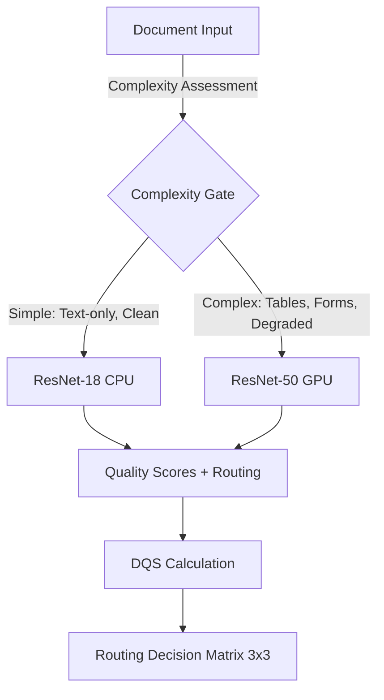
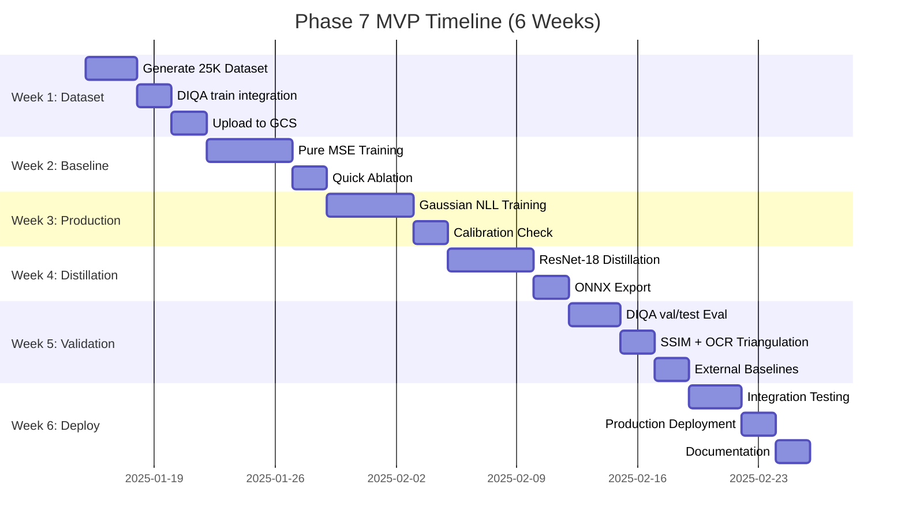

> **Created**: 2025-12-14
> **Updated**: 2025-12-15 (v2 - MVP Focus + Consensus Recommendations)
> **Status**: Active Planning
> **Replaces**: PHASE7_IDEAL_STATE_PROJECT_PLAN.md (v1)
> **Philosophy**: Ship working model fast, iterate with production feedback
> **Consensus Review**: See [PHASE7_CRITICAL_EVALUATION.md](PHASE7_CRITICAL_EVALUATION.md) Section 12.14

---

## Changelog (v1 → v2)

| Change | v1 (Ideal State) | v2 (MVP) | Rationale |
|--------|------------------|----------|-----------|
| **Dataset Size** | 200K samples | **25K samples** | Consensus: saturation at ~25K |
| **Timeline** | 12 weeks | **6 weeks** | MVP focus, no human study |
| **Human Annotation** | 500-image study | **Deferred to v3** | Not blocking for MVP |
| **DIQA-5000** | All splits in training | **Train split only** | Val/test for eval (data leakage fix) |
| **Validation** | OCR correlation only | **OCR + SSIM + MOS** | Triangulation per consensus |
| **Taxonomy** | 85-category | **≤20 high-impact** | Implementable without VLM |
| **Real Data** | 10% of dataset | **15-20% (DIQA train)** | Production robustness |

## Table of Contents

1. [Mission & Success Criteria](#1-mission--success-criteria)
2. [Model Architecture Strategy](#2-model-architecture-strategy)
3. [Dataset Design](#3-dataset-design)
4. [Label Design & Validation](#4-label-design--validation)
5. [Loss Function Design](#5-loss-function-design)
6. [Training Strategy](#6-training-strategy)
7. [Evaluation Framework](#7-evaluation-framework)
8. [Implementation Roadmap](#8-implementation-roadmap)
9. [Risk Mitigation](#9-risk-mitigation)
10. [Success Checkpoints](#10-success-checkpoints)

---

## 1. Mission & Success Criteria

### 1.1 Project Mission

**Primary Goal**: Develop a production-ready Image Quality Assessment system for document preprocessing that provides **continuous severity scores** to enable intelligent routing in a 4-project RAG pipeline.

```text
Project A (THIS)  →  Project B (OCR)  →  Project C (Fusion)  →  Project D (Vector)
IQA & Routing        Full Layout          Multi-Engine           Embeddings
```

**Deployment Models**:

- **ResNet-50 (Primary)**: Production model for all quality assessment and routing decisions
- **ResNet-18 (Secondary)**: Resource-efficient model for low-complexity documents (CPU-only environments)

### 1.2 Success Criteria

#### Primary Metrics (Production Gating)

| Metric | Target | Rationale |
|--------|--------|-----------|
| **Overall ECE** | < 0.08 | Well-calibrated confidence for routing decisions |
| **Per-Head ECE** | < 0.10 (blur, noise, contrast)<br>< 0.12 (skew)<br>< 0.15 (compression) | Individual defect type calibration |
| **Severity MAE** | < 0.15 | Accurate magnitude prediction for DQS |
| **Severity Correlation** | > 0.85 | Strong ranking ability |

#### Secondary Metrics (Quality Indicators)

| Metric | Target | Rationale |
|--------|--------|-----------|
| **Real-World Test ECE** | < 0.10 | Generalization to production data (DIQA-5000, Tobacco-800) |
| **Stratified ECE** | < 0.12 per domain | No domain-specific calibration collapse |
| **ResNet-18 Performance** | Within 5% of ResNet-50 | Validates efficiency model |

#### Performance Targets

| Model | Hardware | Latency Target | Use Case |
|-------|----------|---------------|----------|
| **ResNet-50** | A10 GPU | ≤ 30ms/page | All documents (production) |
| **ResNet-50** | 16-core CPU | ≤ 150ms/page | Fallback/edge deployment |
| **ResNet-18** | 8-core CPU | ≤ 60ms/page | Low-complexity documents |
| **ResNet-18** | A10 GPU | ≤ 15ms/page | Batch processing |

### 1.3 Out of Scope

**This project does NOT**:

- Perform full layout detection (Project B responsibility)
- Extract table structure or reading order
- Perform OCR (handled downstream)
- Guarantee perfect calibration on adversarial inputs (out-of-distribution)

---

## 2. Model Architecture Strategy

### 2.0 Phase 7 vs Phase 9 Scope Decision ⭐ CRITICAL

**Strategic Decision**: Phase 7 trains **ONLY IQA models** (5 severity heads). Phase 9 element classifiers (handwriting, table type, formula, parasitic) are **SEPARATE** and use the frozen Phase 7 backbone.

**Rationale**:

1. **Protect ECE < 0.08 Target**: Multi-task training (IQA regression + element classification) introduces gradient conflicts that risk calibration:
   - IQA severity is continuous regression [0, 1]
   - Element classification is categorical (6-class table types, etc.)
   - Gradient updates to improve table classification can distort IQA calibration manifold

2. **Dataset Availability**: Phase 7 can start immediately with existing datasets. Phase 9 requires classification annotations (table type labels) not yet prepared.

3. **Independent Deployment**: Phase 7 IQA routing is needed NOW for Project B. Phase 9 classifiers are "nice to have" enhancements.

4. **Transfer Learning Quality**: Frozen backbone approach works exceptionally well:
   - Phase 7 trains on 50K tables → backbone learns table features
   - Phase 9 table classifier achieves 90%+ accuracy with frozen backbone
   - No risk of catastrophic forgetting from Phase 7 IQA calibration

**Decision**: Phase 7 scope is **IQA ONLY** (blur, noise, skew, contrast, compression severity). Phase 9 classifiers are documented in [PHASE7_AND_PHASE9_INTEGRATION.md](PHASE7_AND_PHASE9_INTEGRATION.md) as a separate project phase.

**Deployment Strategy**: "Sequential Training → Unified Inference"

- Train Phase 7 and Phase 9 separately
- Deploy as single ONNX model with shared backbone (75MB, 13ms GPU)
- Phase 7 can deploy independently if Phase 9 is delayed

### 2.1 Two-Model Deployment Architecture (Phase 7 Only)



**Complexity Gate Heuristics** (to be validated):

- Simple: Text-only, low layout complexity, DPI > 200, no visible degradation
- Complex: Tables, forms, handwriting, mixed layouts, degradation detected

### 2.2 ResNet-50 (Production Model)

**ML IQA Scope**: 6 severity heads (subset of 19-detector taxonomy)

Phase 7 ML model focuses on **quantifiable severity dimensions** that benefit from continuous labels [0, 1]:

| ML Head | Taxonomy Category | Why ML | Why Continuous |
|---------|------------------|--------|----------------|
| **blur_severity** | Blur (P0) | Better than Laplacian on complex layouts | Mild vs severe blur for routing |
| **noise_severity** | Noise (P1) | Classical struggles with mixed noise types | Noise level affects OCR WER |
| **skew_severity** | Skew (P0) | Robust to text-heavy vs figure-heavy pages | Rotation severity for correction |
| **contrast_severity** | Low Contrast (P0) | Adaptive to local vs global contrast | Determines CLAHE strength |
| **compression_severity** | JPEG Artifacts (classical) | Learns JPEG vs other artifacts | Quality level for re-scanning |
| **perspective_severity** | Perspective Distortion (P2) | Mobile captures, book spine curvature | Correction aggressiveness |

**Remaining 13 taxonomy detectors** handled by:

- **Classical CV** (8 detectors): Illumination, Binarization, Bleed-Through, JPEG Blockiness, Resolution, Warping, Background Patterns, etc.
- **Phase 9 Classifiers** (5 detectors): Watermarks, Stamps, Signatures, Margin Annotations, Highlighted Text (binary presence/absence)

**Architecture**:

```python
class IQAResNet50(nn.Module):
    """Production IQA model with 6-head severity prediction."""

    def __init__(self):
        # Backbone
        self.backbone = timm.create_model(
            'resnet50',
            pretrained=True,
            num_classes=0,  # Feature extraction only
            global_pool=''   # Custom pooling
        )

        # Global pooling
        self.pool = nn.AdaptiveAvgPool2d(1)

        # Feature dimension
        feature_dim = 2048

        # Per-defect heads (6 heads)
        self.heads = nn.ModuleDict({
            'blur': SeverityHead(feature_dim),
            'noise': SeverityHead(feature_dim),
            'skew': SeverityHead(feature_dim),
            'contrast': SeverityHead(feature_dim),
            'compression': SeverityHead(feature_dim),
            'perspective': SeverityHead(feature_dim)  # Mobile captures
        })

class SeverityHead(nn.Module):
    """Individual severity prediction head with uncertainty."""

    def __init__(self, in_features=2048, dropout=0.3):
        super().__init__()
        self.fc1 = nn.Linear(in_features, 512)
        self.bn = nn.BatchNorm1d(512)
        self.dropout = nn.Dropout(dropout)

        # Severity prediction (mean)
        self.severity_head = nn.Linear(512, 1)

        # Uncertainty prediction (log variance)
        self.uncertainty_head = nn.Linear(512, 1)

    def forward(self, x):
        x = F.relu(self.bn(self.fc1(x)))
        x = self.dropout(x)

        # Predict severity [0, 1]
        severity = torch.sigmoid(self.severity_head(x))

        # Predict log variance (for uncertainty-aware loss)
        log_var = self.uncertainty_head(x)

        return severity, log_var
```

**Parameters**: ~25.6M
**Training**: Full supervision on all datasets
**Deployment**: GPU-accelerated (A10, T4, or equivalent)

### 2.3 ResNet-18 (Efficiency Model)

**Architecture**: Identical head design, smaller backbone (feature_dim=512)

**Parameters**: ~11.7M (45% reduction)
**Training**: Knowledge distillation from ResNet-50 **after** ResNet-50 achieves targets
**Deployment**: CPU-optimized (ONNX export with quantization)

**Distillation Strategy**:

1. **Hard targets**: Ground truth severity labels (same as ResNet-50)
2. **Soft targets**: ResNet-50 logits (before sigmoid) at temperature T=2
3. **Combined loss**: `α * KLDiv(student, teacher) + (1-α) * MSE(student, ground_truth)`

---

## 3. Dataset Design

### 3.1 Design Principles

1. **Domain Balance**: No single domain > 25% of dataset (prevent table overfitting)
2. **Defect Distribution**: Match production distribution, not source distribution
3. **Resolution Preservation**: Maintain sufficient resolution for compression artifact detection
4. **Quality Spectrum**: Balanced across clean, light, medium, heavy degradation
5. **Label Confidence**: Separate high-confidence (human MOS) from synthetic labels
6. **Document Type Diversity**: Include Born-digital, Scanned (image-only), Hybrid, and Mobile capture types

### 3.2 Target Dataset Composition (25K samples) - MVP v2.1

> **Change from v1**: Reduced from 200K to 25K based on multi-model consensus showing saturation at ~25K samples.
> **Change v2.0 → v2.1**: Expanded from 5 sources to **14 sources** to reduce domain bias and improve production alignment.

#### Source Distribution (14 Sources)

| Source | Samples | % | Role |
|--------|---------|---|------|
| **DIQA-5000 train** | 3,500 | 14.0% | ⭐ Real degradation anchor (human MOS) |
| **Tobacco-800** | 1,285 | 5.1% | Real degradation (historical scans) |
| **DIBCO + Historical** | 600 | 2.4% | Real degradation (document binarization) |
| **RVL-CDIP** | 3,500 | 14.0% | Multi-category diversity (16 doc types) |
| **NIST DB2+SD6** | 2,500 | 10.0% | Structured forms (check/tax forms) |
| **FUNSD/FUNSD+** | 1,300 | 5.2% | Form understanding |
| **SROIE** | 1,500 | 6.0% | Receipts (mobile capture proxy) |
| **TableBank** | 2,500 | 10.0% | Born-digital tables |
| **PubTabNet** | 2,000 | 8.0% | Scientific tables |
| **DocLayNet** | 2,500 | 10.0% | Mixed layouts |
| **NIST SD19 Pages** | 1,500 | 6.0% | Handwriting (forms context) |
| **im2latex** | 1,200 | 4.8% | Mathematical formulas |
| **MathVerse** | 500 | 2.0% | Math diagrams/equations |
| **Multimodal Textbook** | 1,113 | 4.5% | Educational content (sample) |
| **TOTAL** | **25,000** | **100%** | |

**v2.0 vs v2.1 Comparison**:

| Aspect | v2.0 (5 sources) | v2.1 (14 sources) |
|--------|------------------|-------------------|
| Domain bias risk | High (70% tables) | Low (18% tables) |
| Real degradation % | 20% (DIQA only) | **21.5%** (DIQA + Tobacco + DIBCO) |
| Form coverage | 10% (FUNSD only) | **15.2%** (FUNSD + NIST DB2/SD6) |
| Production alignment | Moderate | **High** (matches ~20% tables) |

#### Domain Distribution (Derived from 14 Sources)

| Domain | Target % | Sample Count | Primary Sources |
|--------|----------|--------------|-----------------|
| **Tables** | 18% | 4,500 | TableBank, PubTabNet |
| **Mixed Layouts** | 24% | 6,000 | DocLayNet, RVL-CDIP |
| **Real Degraded** | 21.5% | 5,385 | DIQA-5000, Tobacco-800, DIBCO |
| **Forms** | 15.2% | 3,800 | FUNSD+, NIST DB2+SD6 |
| **Handwriting** | 6% | 1,500 | NIST SD19 |
| **Receipts** | 6% | 1,500 | SROIE |
| **Math/Formulas** | 6.8% | 1,700 | im2latex, MathVerse |
| **Educational** | 4.5% | 1,115 | Multimodal Textbook |

**Rationale for 14-Source Distribution**:

1. **Domain Diversity**: No single source > 15% prevents overfitting
2. **Real Degradation Anchor**: DIQA + Tobacco + DIBCO provide authentic degradation patterns
3. **Production Alignment**: Tables reduced from 70% to ~18% (matches production ~20%)
4. **Form Strength**: NIST DB2+SD6 adds structured form expertise
5. **Mobile Proxy**: SROIE receipts approximate mobile capture conditions

#### Defect Distribution (Across All Domains)

| Defect Level | DQS Range | Target % | Description |
|--------------|-----------|----------|-------------|
| **Clean** | > 0.95 | 10% | Minimal/no defects, pristine scans |
| **Light** | 0.85-0.95 | 30% | Single mild defect, readable |
| **Medium** | 0.65-0.85 | 35% | Double defects or single moderate |
| **Heavy** | 0.45-0.65 | 15% | Triple defects, challenging OCR |
| **Extreme** | < 0.45 | 10% | Severe multi-defect, near-unreadable |

**Rationale**: Production documents skew toward light-medium degradation. Heavy/extreme needed for calibration at tails.

#### Document Type Distribution (Cross-Domain) - MVP

| Document Type | Target % | Sample Count | Characteristics | Primary Sources |
|---------------|----------|--------------|-----------------|-----------------|
| **Born-Digital** | 45% | 11,250 | Clean PDFs, no scanning artifacts | TableBank, PubTabNet, im2latex |
| **Scanned (Image-Only)** | 45% | 11,250 | Scanned documents with real degradations | DIQA, Tobacco, DIBCO, NIST, IAM |
| **Hybrid** | 10% | 2,500 | Mixed born-digital + scanned elements | DocLayNet, RVL-CDIP |

> **v2.1 Change**: More balanced born-digital vs scanned (45/45) vs v2.0 (55/35)

### 3.3 Source Dataset Selection - MVP v2.1

> **CRITICAL CHANGE v2.0**: DIQA-5000 split handling to prevent data leakage
> **CRITICAL CHANGE v2.1**: Expanded to 14 sources with base image consolidation workflow

#### Base Image Consolidation Workflow (NEW in v2.1) ⭐

**Purpose**: Create a tracked, reproducible staging area of clean source images before augmentation.

**Workflow**:

```text
Step 1: Selection → Step 2: Consolidation → Step 3: Augmentation → Step 4: Training
```

**Directory Structure**:

```text
data/phase7_mvp/
├── 00_base_images/           # ⭐ CONSOLIDATED CLEAN SOURCES
│   ├── manifest.json         # Exact source paths, SHA256 hashes
│   ├── diqa_5000_train/      # 3,500 images (symlinks or copies)
│   ├── tobacco_800/          # 1,285 images
│   ├── dibco/                # 600 images
│   ├── rvl_cdip/             # 3,500 images
│   ├── nist_db2_sd6/         # 2,500 images
│   ├── funsd_plus/           # 1,300 images
│   ├── sroie/                # 1,500 images
│   ├── tablebank/            # 2,500 images
│   ├── pubtabnet/            # 2,000 images
│   ├── doclaynet/            # 2,500 images
│   ├── nist_sd19/            # 1,500 images
│   ├── im2latex/             # 1,200 images
│   ├── mathverse/            # 500 images
│   └── multimodal_textbook/  # 1,113 images
├── 01_augmented/             # Generated training samples
│   ├── train/                # 70% (17,500)
│   ├── val/                  # 15% (3,750)
│   └── test/                 # 15% (3,750)
└── metadata/
    ├── base_manifest.json    # Source tracking
    ├── augmentation_log.json # What was done to each image
    └── split_assignment.json # Train/val/test assignments
```

**Benefits**:

1. **Reproducibility**: Exact same base images can regenerate dataset
2. **Audit Trail**: `manifest.json` tracks source path + SHA256 for each image
3. **Separation**: Clean originals never modified; augmentations are separate
4. **Re-generation**: Can try different augmentation strategies without re-selecting sources
5. **Debugging**: Easy to trace any training sample back to its source

**Implementation** (in `scripts/generate_iqa_dataset.py`):

```python
def consolidate_base_images(self):
    """Step 1: Copy/symlink selected images to 00_base_images/."""
    manifest = {"sources": [], "total_images": 0, "created": datetime.now().isoformat()}

    for source_name, images in self.selected_images.items():
        dest_dir = self.output_dir / "00_base_images" / source_name
        dest_dir.mkdir(parents=True, exist_ok=True)

        for img_path in images:
            # Create symlink (or copy if cross-filesystem)
            dest_path = dest_dir / img_path.name
            dest_path.symlink_to(img_path)

            manifest["sources"].append({
                "source": source_name,
                "original_path": str(img_path),
                "consolidated_path": str(dest_path),
                "sha256": compute_sha256(img_path)
            })

    manifest["total_images"] = len(manifest["sources"])
    save_json(manifest, self.output_dir / "00_base_images" / "manifest.json")
```

#### DIQA-5000 Split Strategy (Data Leakage Fix)

| Split | Samples | Usage in MVP | Rationale |
|-------|---------|--------------|-----------|
| **train** | ~3,500 | ✅ **Include in training** | Real degradations with human MOS labels |
| **val** | ~500 | ❌ **Evaluation ONLY** | Held out for validation metrics |
| **test** | ~1,000 | ❌ **Evaluation ONLY** | Held out for final test metrics |

**Why This Matters**:

- v1 used all DIQA splits in training AND proposed DIQA as evaluation benchmark = **data leakage**
- v2 uses ONLY `train` split in training dataset
- `val` and `test` splits reserved for evaluation to get unbiased metrics on real human MOS data

#### MVP Dataset Sources (14 sources, 25K total)

| Dataset | Available | MVP Target | Augment? | Role |
|---------|-----------|------------|----------|------|
| **DIQA-5000 train** | 3,500 | 3,500 | No | ⭐ Real degradation anchor |
| **Tobacco-800** | 1,285 | 1,285 | No | Real degradation (historical) |
| **DIBCO + Historical** | ~600 | 600 | No | Real degradation (binarization) |
| **RVL-CDIP** | 400K | 3,500 | Downsample | Multi-category diversity |
| **NIST DB2+SD6** | 5,000+ | 2,500 | Downsample | Structured forms |
| **FUNSD/FUNSD+** | 1,300 | 1,300 | No | Form understanding |
| **SROIE** | 1,500 | 1,500 | No | Receipts (mobile proxy) |
| **TableBank** | 260K | 2,500 | Downsample | Born-digital tables |
| **PubTabNet** | 519K | 2,000 | Downsample | Scientific tables |
| **DocLayNet** | 81K | 2,500 | Downsample | Mixed layouts |
| **NIST SD19 Pages** | 4,000+ | 1,500 | Downsample | Handwriting |
| **im2latex** | 100K+ | 1,200 | Downsample | Math formulas |
| **MathVerse** | 15K | 500 | Downsample | Math diagrams |
| **Multimodal Textbook** | 1,113 | 1,113 | No | Educational (sample) |

**Source Acquisition Status**:

| Dataset | Status | Location |
|---------|--------|----------|
| DIQA-5000 | ✅ Downloaded | `data/benchmarks/diqa-5000/` |
| Tobacco-800 | ✅ Downloaded | `data/benchmarks/tobacco-800/` |
| DIBCO | ⚠️ Needs download | DIBCO 2009-2019 competition |
| RVL-CDIP | ⚠️ Needs download | HuggingFace `rvl_cdip` |
| NIST DB2+SD6 | ⚠️ Needs download | NIST Special Databases |
| FUNSD/FUNSD+ | ✅ Downloaded | `data/benchmarks/funsd_plus/` |
| SROIE | ⚠️ Needs download | ICDAR 2019 SROIE |
| TableBank | ✅ Downloaded | `data/benchmarks/tablebank/` |
| PubTabNet | ✅ Downloaded | `data/benchmarks/pubtabnet/` |
| DocLayNet | ⚠️ Needs conversion | PDF→image conversion needed |
| NIST SD19 | ⚠️ Needs download | NIST Special Database 19 |
| im2latex | ⚠️ Needs download | im2latex-100k |
| MathVerse | ⚠️ Needs download | HuggingFace `MathVerse` |
| Multimodal Textbook | ✅ Sample available | 1,113 sample images |

#### Deferred to v3 (Not in MVP)

| Dataset | Reason for Deferral |
|---------|---------------------|
| FinTabNet | Financial tables (TableBank sufficient for MVP) |
| Full Multimodal Textbook | 600GB download (using 1,113 sample for MVP) |
| IAM Handwriting | NIST SD19 provides sufficient handwriting coverage |

### 3.4 Resolution Strategy

**Input Resolution**: **384×384** (MANDATORY)

**Rationale**:

- 224×224 destroys JPEG 8×8 blocks (compression_severity ECE=0.26)
- 384×384 preserves ~3px blocks, detectable by CNN
- RandomResizedCrop(384, scale=(0.5, 1.0)) provides:
  - Full-page view at scale=1.0 (global defects: skew, contrast)
  - Zoomed view at scale=0.5 (local defects: compression, noise)

**Training Transform**:

```python
train_transform = A.Compose([
    # Resolution: 384×384 with random crops
    A.RandomResizedCrop(384, 384, scale=(0.5, 1.0), p=1.0),

    # Geometric (IQA-safe)
    A.HorizontalFlip(p=0.5),

    # Photometric (mild only)
    A.ColorJitter(brightness=0.1, contrast=0.1, saturation=0, hue=0, p=0.3),

    # Normalization
    A.Normalize(mean=[0.485, 0.456, 0.406], std=[0.229, 0.224, 0.225]),
    ToTensorV2()
])
```

**Validation/Test Transform**:

```python
val_transform = A.Compose([
    A.Resize(384, 384),
    A.Normalize(mean=[0.485, 0.456, 0.406], std=[0.229, 0.224, 0.225]),
    ToTensorV2()
])
```

---

## 4. Label Design & Validation

### 4.1 Label Semantics (CRITICAL DECISION)

**Chosen Semantics**: **0.0 = Perfect Quality, 1.0 = Maximum Degradation**

**Rationale**:

- Aligns with intuitive "defect severity" concept
- Matches DIQA-5000 MOS normalization (low score = good quality)
- Simplifies loss function design (minimize severity)
- DQS = geometric mean of (1 - severity) per defect type

**Mapping**:

```python
# Defect severity [0, 1]
blur_severity = f(sigma)      # 0.0 = sharp, 1.0 = maximum blur
noise_severity = f(variance)  # 0.0 = clean, 1.0 = heavy noise
...

# Overall quality (DQS)
quality_score = geometric_mean([
    1 - blur_severity,
    1 - noise_severity,
    1 - skew_severity,
    1 - contrast_severity,
    1 - compression_severity
], weights=[0.30, 0.20, 0.15, 0.15, 0.10])
```

### 4.2 Parameter-Based Label Generation

**Augmentation → Severity Mapping**:

| Augmentation | Parameter | Severity Formula | Perceptual Justification |
|--------------|-----------|------------------|--------------------------|
| **Gaussian Blur** | σ ∈ [0, 20] | `severity = tanh(σ/10)` | Logarithmic perception |
| **Gaussian Noise** | var ∈ [0, 60] | `severity = sqrt(var/60)` | Signal degradation |
| **Rotation (Skew)** | θ ∈ [0, 15°] | `severity = (θ/15)^0.8` | Sublinear sensitivity |
| **Perspective** | scale ∈ [0, 0.18] | `severity = scale/0.18` | Linear distortion |
| **Brightness** | f ∈ [0.5, 1.5] | `severity = abs(f-1)/0.5` | Symmetric around 1.0 |
| **JPEG Compression** | q ∈ [20, 100] | `severity = (100-q)/80` | Linear quality loss |

**Key Changes from v3**:

- **Non-linear mappings**: `tanh`, `sqrt`, `^0.8` match perceptual studies
- **Bounded outputs**: All formulas guarantee [0, 1] range
- **No hard 0/1**: Smoothing already built into formulas

**DQS Calculation** (Weighted Geometric Mean):

```python
def compute_dqs(severities: dict, weights: dict) -> float:
    """
    DQS = exp(sum(w_i * log(1 - s_i))) where s_i is severity.

    Weights (OCR-impact based):
    - blur: 0.30 (most impactful)
    - noise: 0.20
    - skew: 0.15
    - contrast: 0.15
    - compression: 0.10
    - perspective: 0.10
    """
    # Convert severity to quality (1 - severity)
    qualities = {k: max(0.02, 1.0 - v) for k, v in severities.items()}

    # Weighted geometric mean
    log_sum = sum(weights[k] * np.log(qualities[k]) for k in qualities)
    dqs = np.exp(log_sum)

    return np.clip(dqs, 0.02, 0.98)  # Bounds
```

### 4.3 Label Validation Strategy

**Phase 1: Synthetic Validation** (Pre-Training)

1. **Parameter Correlation Check**:

   ```python
   # For 10K synthetic images
   for image, params, labels in sample_dataset:
       # Verify monotonicity
       assert blur_severity increases with sigma
       assert compression_severity increases with (100 - quality)
   ```

2. **DQS Distribution Validation**:

   ```python
   # Simulate 100K samples without generating images
   dqs_distribution = simulate_dqs_distribution(
       defect_distribution=target_distribution,
       num_samples=100000
   )

   # Verify matches target
   assert dqs_distribution['clean'] ≈ 10%
   assert dqs_distribution['medium'] ≈ 35%
   ```

**Phase 2: Ground Truth Validation** (Post-Training)

1. **DIQA-5000 MOS Correlation**:

   ```python
   # DIQA-5000 has human Mean Opinion Scores
   correlation = pearsonr(
       predicted_severity,
       diqa_mos_normalized
   )

   # Target: r > 0.80
   ```

2. **BRISQUE Compression Validation**:

   ```python
   # Validate compression labels against established metric
   correlation = pearsonr(
       compression_severity_labels,
       brisque_compression_scores
   )

   # Target: |r| > 0.70
   ```

**Phase 3: Human Annotation Study** (v2 Refinement)

- **Scope**: 500 images stratified by domain and defect level
- **Annotators**: 3-5 trained raters
- **Task**: Rate severity 0-10 for each defect type
- **Analysis**: Inter-rater agreement (Krippendorff's α > 0.70)
- **Cost**: $500-1000 via Mechanical Turk or Labelbox
- **Timeline**: Week 8-10 (parallel to initial training)
- **Impact**: Informs v2 label refinement, not blocking v1

---

## 5. Loss Function Design

### 5.1 Primary Loss: Gaussian Negative Log-Likelihood (Recommended)

**Formulation**:

```python
class GaussianNLLLoss(nn.Module):
    """Uncertainty-aware regression loss for severity prediction.

    Predicts both severity (μ) and uncertainty (σ²) per defect type.
    Enables calibrated confidence estimates.
    """

    def __init__(self, eps=1e-6):
        super().__init__()
        self.eps = eps

    def forward(self, mu, log_var, target):
        """
        Args:
            mu: Predicted severity [batch, num_heads]
            log_var: Predicted log variance [batch, num_heads]
            target: Ground truth severity [batch, num_heads]

        Returns:
            loss: Gaussian NLL = 0.5 * (log(σ²) + (y - μ)² / σ²)
        """
        var = torch.exp(log_var) + self.eps

        # NLL = 0.5 * log(var) + 0.5 * (target - mu)^2 / var
        nll = 0.5 * log_var + 0.5 * ((target - mu) ** 2) / var

        return nll.mean()
```

**Advantages**:

1. **Unified objective**: Regression with uncertainty (no BCE/MSE conflict)
2. **Calibration-aware**: Model learns when it's uncertain
3. **Theoretically grounded**: Maximum likelihood estimation
4. **Prevents overconfidence**: Penalizes low variance on uncertain samples

**Disadvantages**:

- Requires model architecture modification (add uncertainty head)
- More complex than pure MSE

### 5.2 Alternative: Pure MSE (Baseline)

**Formulation**:

```python
class SeverityMSELoss(nn.Module):
    """Simple MSE regression on severity scores."""

    def forward(self, predictions, targets):
        """
        Args:
            predictions: Predicted severity [batch, num_heads]
            targets: Ground truth severity [batch, num_heads]
        """
        mse = F.mse_loss(predictions, targets, reduction='none')

        # Per-head weights (optional)
        head_weights = torch.tensor([0.30, 0.20, 0.15, 0.15, 0.10])  # blur, noise, skew, contrast, compression
        weighted_mse = (mse * head_weights).mean()

        return weighted_mse
```

**Advantages**:

- Simple, well-understood
- No architectural changes needed
- Direct severity prediction

**Disadvantages**:

- No uncertainty quantification
- May require post-hoc calibration

### 5.3 Recommended Strategy

**Phase 1**: Pure MSE baseline (establish performance ceiling)
**Phase 2**: Gaussian NLL with uncertainty heads (production model)

**Ablation Study**:

1. Pure MSE (baseline)
2. Gaussian NLL (temperature T=1)
3. Gaussian NLL + Temperature Scaling (calibration)

---

## 6. Training Strategy

### 6.1 ResNet-50 Training Configuration

```python
@dataclass
class Phase7OptimalConfig:
    """Ideal configuration based on critique and consensus."""

    # Model
    model_architecture: str = "resnet50"
    input_resolution: int = 384  # CRITICAL: 224 destroys compression
    num_heads: int = 5
    dropout: float = 0.3

    # Loss
    loss_type: str = "gaussian_nll"  # or "mse" for baseline

    # Optimizer
    optimizer: str = "adamw"
    learning_rate: float = 1e-4
    weight_decay: float = 0.02
    betas: Tuple[float, float] = (0.9, 0.999)

    # Scheduler
    scheduler: str = "cosine_warmup"
    warmup_epochs: int = 5
    min_lr: float = 1e-6

    # Training
    epochs: int = 100
    batch_size: int = 64  # Reduced from 128 due to 384² resolution
    gradient_clip: float = 1.0

    # Early Stopping
    patience: int = 10
    monitor_metric: str = "val_ece"
    target_ece: float = 0.08

    # Hardware
    use_amp: bool = True  # Mixed precision for 384² images
    num_workers: int = 8
```

### 6.2 Training Phases

#### Phase 1: Baseline Establishment (Week 1-2)

**Objective**: Establish performance ceiling with pure MSE

**Configuration**:

- Loss: Pure MSE
- Resolution: 384×384
- Augmentation: RandomResizedCrop + HorizontalFlip + mild ColorJitter
- Dataset: Full 200K samples

**Success Criteria**:

- Train/val loss convergence
- ECE < 0.10 (acceptable baseline)
- No overfitting (val loss stable)

**Deliverables**:

- Baseline model checkpoint
- Training curves (TensorBoard)
- Per-head ECE report

#### Phase 2: Uncertainty-Aware Training (Week 3-4)

**Objective**: Improve calibration with Gaussian NLL

**Configuration**:

- Loss: Gaussian NLL
- Architecture: Add uncertainty heads
- Resume from Phase 1 backbone (optional)

**Success Criteria**:

- ECE < 0.08 (target)
- Uncertainty correlates with error (validation)

**Deliverables**:

- Production ResNet-50 checkpoint
- Calibration plots (reliability diagrams)
- Uncertainty vs. error analysis

#### Phase 3: Student Distillation (Week 5-6)

**Objective**: Train ResNet-18 from ResNet-50

**Configuration**:

```python
distillation_loss = (
    0.7 * kl_divergence(student_logits / T, teacher_logits / T) +
    0.3 * mse_loss(student_severity, ground_truth_severity)
)
```

**Success Criteria**:

- ResNet-18 ECE within +0.03 of ResNet-50
- Latency < 60ms on 8-core CPU

**Deliverables**:

- ResNet-18 checkpoint (ONNX quantized)
- Performance comparison report
- Deployment benchmarks

### 6.3 Data Augmentation (IQA-Safe)

**Allowed Augmentations** (do not confound defect labels):

```python
train_transform = A.Compose([
    # Spatial (IQA-safe)
    A.RandomResizedCrop(384, 384, scale=(0.5, 1.0)),  # Critical for compression
    A.HorizontalFlip(p=0.5),                          # Safe for documents

    # Photometric (mild only)
    A.ColorJitter(
        brightness=0.1,  # Mild, does not confound contrast_severity
        contrast=0.1,    # Mild, does not confound contrast_severity
        saturation=0.0,  # Disabled (not relevant for grayscale docs)
        hue=0.0,         # Disabled
        p=0.3
    ),

    # Normalization
    A.Normalize(mean=[0.485, 0.456, 0.406], std=[0.229, 0.224, 0.225]),
    ToTensorV2()
])
```

**Forbidden Augmentations** (confound severity labels):

- ❌ **Rotation/Affine** (confounds skew_severity)
- ❌ **GaussianBlur** (confounds blur_severity)
- ❌ **GaussianNoise** (confounds noise_severity)
- ❌ **JPEG Compression** (confounds compression_severity)
- ❌ **Heavy ColorJitter** (confounds contrast_severity)

### 6.4 Regularization Strategy

| Technique | Configuration | Rationale |
|-----------|---------------|-----------|
| **Dropout** | 0.3 | Prevent memorization of layouts |
| **Weight Decay** | 0.02 | L2 regularization on weights |
| **Gradient Clipping** | 1.0 | Stabilize training |
| **Label Smoothing** | N/A | Built into Gaussian NLL uncertainty |
| **Mixup** | ❌ Disabled | Confounds severity labels |
| **CutMix** | ❌ Disabled | Confounds severity labels |

---

## 7. Evaluation Framework

### 7.1 Validation Splits

**Split Strategy**: Stratified by domain AND defect level

```python
# 70/15/15 split stratified on (domain, defect_level)
train_split = stratified_split(
    dataset,
    strata=['domain', 'defect_level'],
    ratios=[0.70, 0.15, 0.15],
    seed=42
)
```

**Validation Set** (30K samples):

- Representative of all domains
- Balanced defect distribution
- Used for early stopping, hyperparameter tuning

**Test Set** (30K samples):

- **Hold-out**: Never seen during training or validation
- Production proxy: Emphasize real degradation (DIQA-5000, Tobacco-800)
- Final evaluation only

### 7.2 Metrics Computation

#### Primary Metrics (Reported Every Epoch)

```python
def compute_metrics(predictions, targets, uncertainties=None):
    """
    Args:
        predictions: [N, 5] severity predictions
        targets: [N, 5] ground truth severities
        uncertainties: [N, 5] predicted variances (optional)

    Returns:
        metrics: Dict with ECE, MAE, correlation per head
    """
    metrics = {}

    # Overall metrics
    metrics['overall_ece'] = compute_ece(predictions, targets, num_bins=15)
    metrics['overall_mae'] = np.abs(predictions - targets).mean()
    metrics['overall_correlation'] = pearsonr(predictions.flatten(), targets.flatten())[0]

    # Per-head metrics
    head_names = ['blur', 'noise', 'skew', 'contrast', 'compression']
    for i, name in enumerate(head_names):
        metrics[f'{name}_ece'] = compute_ece(predictions[:, i], targets[:, i])
        metrics[f'{name}_mae'] = np.abs(predictions[:, i] - targets[:, i]).mean()
        metrics[f'{name}_correlation'] = pearsonr(predictions[:, i], targets[:, i])[0]

    # Uncertainty calibration (if available)
    if uncertainties is not None:
        metrics['uncertainty_correlation'] = pearsonr(
            uncertainties.flatten(),
            np.abs(predictions - targets).flatten()
        )[0]

    return metrics
```

#### Stratified Metrics (Computed on Test Set)

```python
def compute_stratified_metrics(predictions, targets, metadata):
    """Compute ECE per domain and defect level."""

    # Per-domain ECE
    for domain in ['tables', 'forms', 'mixed', 'handwriting', 'formulas', 'real_degraded']:
        mask = metadata['domain'] == domain
        ece = compute_ece(predictions[mask], targets[mask])
        print(f"{domain}_ece: {ece:.4f}")

    # Per-defect-level ECE
    for level in ['clean', 'light', 'medium', 'heavy', 'extreme']:
        mask = metadata['defect_level'] == level
        ece = compute_ece(predictions[mask], targets[mask])
        print(f"{level}_ece: {ece:.4f}")
```

### 7.3 Calibration Visualization

**Reliability Diagrams** (per head):

```python
def plot_reliability_diagram(predictions, targets, num_bins=15):
    """
    Plot predicted severity vs. actual severity per bin.
    Perfect calibration: diagonal line y=x
    """
    bins = np.linspace(0, 1, num_bins + 1)
    bin_centers = (bins[:-1] + bins[1:]) / 2

    # Bin predictions
    bin_indices = np.digitize(predictions, bins) - 1

    # Compute mean prediction and mean target per bin
    mean_pred = [predictions[bin_indices == i].mean() for i in range(num_bins)]
    mean_target = [targets[bin_indices == i].mean() for i in range(num_bins)]

    # Plot
    plt.plot(bin_centers, mean_target, 'o-', label='Actual')
    plt.plot([0, 1], [0, 1], 'k--', label='Perfect Calibration')
    plt.xlabel('Predicted Severity')
    plt.ylabel('Actual Severity')
    plt.legend()
```

### 7.4 Validation Triangulation (Consensus Requirement)

> **New in v2**: Multi-metric validation per consensus recommendation. OCR correlation alone is insufficient.

**Triangulation Strategy**:

```python
def validate_with_triangulation(predictions, images, metadata):
    """
    Validate IQA predictions using three independent signals.
    Consensus: OCR correlation alone is circular (engines compensate internally).
    """
    results = {}

    # 1. SSIM-based validation (structural similarity)
    # Compare predicted severity to SSIM degradation from original
    ssim_correlation = compute_ssim_correlation(predictions, images)
    results['ssim_correlation'] = ssim_correlation

    # 2. OCR-based validation (downstream impact)
    # Correlation between severity and OCR WER/CER
    ocr_correlation = compute_ocr_correlation(predictions, images)
    results['ocr_correlation'] = ocr_correlation

    # 3. Human MOS validation (DIQA-5000 val/test only)
    # Correlation with human Mean Opinion Scores
    if 'mos' in metadata:
        mos_correlation = compute_mos_correlation(predictions, metadata['mos'])
        results['mos_correlation'] = mos_correlation

    # Triangulation check: all three should agree
    signals = [ssim_correlation, ocr_correlation]
    if 'mos_correlation' in results:
        signals.append(results['mos_correlation'])

    results['triangulation_agreement'] = np.std(signals) < 0.15  # Low variance = agreement

    return results
```

**Success Criteria for Triangulation**:

| Metric | Target | Weight |
|--------|--------|--------|
| SSIM Correlation | > 0.70 | 30% |
| OCR Correlation | > 0.65 | 30% |
| MOS Correlation (DIQA) | > 0.75 | 40% |
| Triangulation Agreement | std < 0.15 | Required |

### 7.5 External Baselines

**Comparison to Published Methods** (Test Set Only):

| Method | Implementation | Metrics |
|--------|---------------|---------|
| **BRISQUE** | `cv2.quality.QualityBRISQUE_create()` | Correlation with overall_quality |
| **NIMA** | Pre-trained on AVA dataset | ECE, MAE (requires adaptation) |
| **HyperIQA** | PyTorch Hub | ECE, MAE (requires adaptation) |

**Evaluation Protocol**:

1. Run baselines on test set
2. Compute ECE, MAE, correlation
3. Report in final evaluation table

**Success**: Outperform or match baselines on ECE and correlation

---

## 8. Implementation Roadmap - MVP (6 Weeks)

> **Change from v1**: Compressed from 12 weeks to 6 weeks. Human annotation study deferred to v3.

### 8.1 Timeline Overview



### 8.1.1 MVP vs v1 Timeline Comparison

| Phase | v1 (12 weeks) | MVP (6 weeks) | What's Cut |
|-------|---------------|---------------|------------|
| Dataset | 2 weeks | 1 week | 200K→25K, fewer sources |
| Training | 4 weeks | 2 weeks | Faster iteration, smaller dataset |
| Distillation | 2 weeks | 1 week | Same approach, less tuning |
| Validation | 2 weeks | 1 week | **No human annotation study** |
| Deployment | 2 weeks | 1 week | Essential docs only |

### 8.2 Sprint Breakdown - MVP

#### Sprint 1: Dataset + Baseline (Week 1-2)

**Objectives**:

- [ ] Generate 25K dataset with DIQA-5000 train split integration
- [ ] Validate label semantics and DQS calculations
- [ ] Upload to GCS in Modal-compatible format
- [ ] Train ResNet-50 with Pure MSE loss at 384×384

**Deliverables**:

- `phase7_mvp_25k/` dataset (train/val/test tar archives)
- Baseline model checkpoint (`resnet50_mse_baseline.pth`)
- Dataset statistics report

**Success Criteria**:

- DIQA train split properly separated from val/test
- ECE < 0.10 (acceptable baseline)
- Val loss convergence (no overfitting)

#### Sprint 2: Production Model (Week 3)

**Objectives**:

- [ ] Implement Gaussian NLL loss and uncertainty heads
- [ ] Train ResNet-50 production model
- [ ] Validate calibration (reliability diagrams)

**Deliverables**:

- Production model checkpoint (`resnet50_gaussian_nll_prod.pth`)
- Calibration report (per-head reliability diagrams)

**Success Criteria**:

- **ECE < 0.08** (PRIMARY TARGET)
- Per-head ECE meets targets
- Uncertainty correlates with error (r > 0.50)

#### Sprint 3: Student Distillation (Week 4)

**Objectives**:

- [ ] Train ResNet-18 via knowledge distillation
- [ ] Export to ONNX and quantize (INT8)
- [ ] Benchmark latency on CPU

**Deliverables**:

- Student model checkpoint (`resnet18_distilled.pth`)
- ONNX model (`resnet18_distilled_int8.onnx`)

**Success Criteria**:

- ResNet-18 ECE within +0.03 of ResNet-50
- CPU latency < 60ms/page (8-core)
- Model size < 50MB (quantized)

#### Sprint 4: Validation (Week 5)

**Objectives**:

- [ ] Evaluate on **DIQA-5000 val/test splits** (data leakage-free)
- [ ] Implement validation triangulation (OCR + SSIM + MOS)
- [ ] External baseline comparison (BRISQUE)

**Deliverables**:

- DIQA val/test evaluation report (ECE, MAE, correlation)
- Triangulation analysis (OCR WER vs severity, SSIM correlation)
- Baseline comparison table

**Success Criteria**:

- Test ECE < 0.10 on DIQA val/test (generalization)
- Triangulation shows consistent signal across metrics
- Outperform BRISQUE on ECE and correlation

> **Deferred to v3**: Human annotation study (500 images) - Not blocking for MVP

#### Sprint 5: Deployment (Week 6)

**Objectives**:

- [ ] Integration with DQS routing pipeline
- [ ] Production deployment (Modal + local ONNX)
- [ ] Essential documentation

**Deliverables**:

- Deployment guide (Modal GPU + ONNX CPU)
- Integration test suite
- Model cards (minimal)

**Success Criteria**:

- Modal deployment < 30ms latency
- ONNX CPU deployment < 60ms latency
- Integration tests pass (end-to-end pipeline)

---

## 9. Risk Mitigation

### 9.1 Technical Risks

| Risk | Probability | Impact | Mitigation |
|------|-------------|--------|------------|
| **ECE target not met** | Medium | High | Ablation studies, temperature scaling, Platt scaling |
| **Compression head still poor** | Low | Medium | 384² resolution, blockiness metric validation |
| **ResNet-18 performance gap** | Low | Medium | Multi-stage distillation, architecture search |
| **Overfitting to synthetic labels** | Medium | High | Real degradation datasets (DIQA, Tobacco), validation |
| **Label semantics confusion** | Low | Critical | Comprehensive unit tests, visualization |

### 9.2 Data Risks

| Risk | Probability | Impact | Mitigation |
|------|-------------|--------|------------|
| **Domain imbalance persists** | Low | Medium | Strict 25% cap per source, monitoring |
| **Insufficient real degradation** | Medium | Medium | Prioritize DIQA-5000, Tobacco-800, DIBCO |
| **Label noise in synthetic data** | Medium | High | Human annotation validation, BRISQUE correlation |
| **Dataset shift at production** | Medium | High | Regular monitoring, model retraining pipeline |

### 9.3 Operational Risks

| Risk | Probability | Impact | Mitigation |
|------|-------------|--------|------------|
| **Modal cost overruns** | Low | Medium | Use sample datasets for testing, budget alerts |
| **Training instability** | Low | High | Gradient clipping, learning rate warmup |
| **Checkpoint corruption** | Low | Critical | Multi-region GCS backups, checksums |
| **Integration delays** | Medium | Medium | Early API design, mock endpoints |

---

## 10. Success Checkpoints

### 10.1 Go/No-Go Decision Points

**Checkpoint 1: Dataset Validation (End of Week 2)**

**Criteria**:

- [ ] Domain distribution within ±2% of targets
- [ ] Defect distribution within ±3% of targets
- [ ] BRISQUE compression correlation > 0.70

**Decision**:

- **GO**: Proceed to baseline training
- **NO-GO**: Adjust dataset generation, re-validate

---

**Checkpoint 2: Baseline Performance (End of Week 4)**

**Criteria**:

- [ ] ECE < 0.10 (acceptable baseline)
- [ ] Compression ECE < 0.18 (improvement from v3)
- [ ] No severe overfitting (val loss stable)

**Decision**:

- **GO**: Proceed to Gaussian NLL production training
- **NO-GO**: Debug loss function, augmentation, or labels

---

**Checkpoint 3: Production Model (End of Week 6)**

**Criteria**:

- [ ] **ECE < 0.08** (PRIMARY TARGET)
- [ ] All per-head ECE targets met
- [ ] Uncertainty calibration validated

**Decision**:

- **GO**: Proceed to student distillation
- **NO-GO**: Iterate on loss function, collect more data, or adjust targets

---

**Checkpoint 4: Student Model (End of Week 8)**

**Criteria**:

- [ ] ResNet-18 ECE within +0.03 of ResNet-50
- [ ] CPU latency < 60ms/page

**Decision**:

- **GO**: Proceed to final validation
- **NO-GO**: Architecture search, extended training

---

**Checkpoint 5: Production Readiness (End of Week 10)**

**Criteria**:

- [ ] Test set ECE < 0.10 (generalization)
- [ ] Human annotation correlation > 0.75
- [ ] Outperforms BRISQUE baseline

**Decision**:

- **GO**: Deploy to production
- **NO-GO**: Label refinement, collect v2 dataset

---

## 11. Appendices

### Appendix A: Configuration Files

**Dataset Generation Config**:

```yaml
# config/phase7_v5_dataset.yaml
dataset:
  name: "phase7_v5_ideal_200k"
  total_samples: 200000

  domain_distribution:
    mixed_layouts: 0.30
    tables: 0.25
    forms: 0.20
    real_degraded: 0.10
    handwriting: 0.10
    formulas: 0.05

  defect_distribution:
    clean: 0.10      # DQS > 0.95
    light: 0.30      # DQS 0.85-0.95
    medium: 0.35     # DQS 0.65-0.85
    heavy: 0.15      # DQS 0.45-0.65
    extreme: 0.10    # DQS < 0.45

  resolution:
    target_size: 384
    min_source_size: 500

  label_semantics:
    perfect_value: 0.0
    max_degradation: 1.0
```

**Training Config**:

```yaml
# config/phase7_v5_training.yaml
model:
  architecture: "resnet50"
  input_size: 384
  num_heads: 5
  dropout: 0.3

loss:
  type: "gaussian_nll"  # or "mse" for baseline

optimizer:
  name: "adamw"
  lr: 1e-4
  weight_decay: 0.02
  betas: [0.9, 0.999]

scheduler:
  name: "cosine_warmup"
  warmup_epochs: 5
  min_lr: 1e-6

training:
  epochs: 100
  batch_size: 64
  gradient_clip: 1.0

early_stopping:
  patience: 10
  monitor: "val_ece"
  target: 0.08
```

### Appendix B: Evaluation Checklist

**Pre-Deployment Validation**:

- [ ] Overall ECE < 0.08
- [ ] blur_severity ECE < 0.10
- [ ] noise_severity ECE < 0.10
- [ ] skew_severity ECE < 0.12
- [ ] contrast_severity ECE < 0.10
- [ ] compression_severity ECE < 0.15
- [ ] Severity MAE < 0.15
- [ ] Correlation > 0.85
- [ ] Real-world test ECE < 0.10
- [ ] Stratified ECE < 0.12 (all domains)
- [ ] ResNet-18 within +0.03 ECE of ResNet-50
- [ ] Human annotation correlation > 0.75
- [ ] BRISQUE baseline outperformed
- [ ] Latency targets met (GPU < 30ms, CPU < 60ms)
- [ ] Model size < 100MB (ResNet-50), < 50MB (ResNet-18)

### Appendix C: File Organization

```text
image_detection/
├── config/
│   ├── phase7_v5_dataset.yaml
│   └── phase7_v5_training.yaml
├── data/
│   ├── continuous_labels.py
│   └── dataset.py
├── scripts/
│   ├── generate_phase7_v5_dataset.py
│   ├── validate_labels.py
│   └── stratified_split.py
├── modal/
│   ├── train_phase7_v5_baseline.py
│   ├── train_phase7_v5_gaussian_nll.py
│   └── train_phase7_v5_distillation.py
├── src/image_preprocessing_detector/
│   ├── models/
│   │   ├── resnet_iqa.py
│   │   └── loss_functions.py
│   ├── training/
│   │   ├── continuous_trainer.py
│   │   └── distillation_trainer.py
│   └── metrics/
│       ├── calibration.py
│       └── evaluation.py
└── docs/
    └── planning/
        ├── PHASE7_IDEAL_STATE_PROJECT_PLAN.md (this file)
        ├── PHASE7_TRAINING_DEEP_DIVE.md
        └── PHASE7_TRAINING_CRITIQUE.md
```

---

## 12. Summary & Next Steps - MVP

### 12.1 Key Decisions (v2 Changes Highlighted)

1. **Label Semantics**: 0.0 = perfect, 1.0 = degraded (aligns with defect severity)
2. **Resolution**: 384×384 (mandatory for compression detection)
3. **Loss Function**: Gaussian NLL (uncertainty-aware) with MSE baseline
4. **Dataset Size**: ~~200K~~ → **25K** (consensus saturation point)
5. **DIQA-5000**: **Train split in training, val/test for evaluation ONLY** (data leakage fix)
6. **Domain Balance**: 40% tables, 25% mixed, **20% real degraded** (DIQA train)
7. **Timeline**: ~~12 weeks~~ → **6 weeks** (MVP focus)
8. **Validation**: **OCR + SSIM + MOS triangulation** (not OCR alone)
9. **Human Study**: **Deferred to v3** (not blocking MVP)

### 12.2 Immediate Action Items (MVP Week 1)

**Day 1-2** (Dataset Generation):

1. Update `scripts/generate_iqa_dataset.py` to use DIQA-5000 **train split only**
2. Generate 25K sample dataset with proper split handling
3. Verify DIQA val/test are NOT in training data

**Day 3-4** (Upload & Validation):

1. Upload to GCS in Modal-compatible format
2. Validate domain/defect distributions match targets
3. Quick visual inspection of samples

**Day 5-7** (Baseline Training):

1. Configure Modal training with 384×384 resolution
2. Launch baseline MSE training run
3. Monitor for convergence

### 12.3 Success Definition - MVP

**Minimum Viable Product (6 weeks)**:

- ResNet-50 ECE < 0.08 on validation set
- ResNet-18 within +0.03 ECE of ResNet-50
- Latency targets met (GPU < 30ms, CPU < 60ms)
- **DIQA val/test ECE < 0.10** (unbiased generalization)
- **Triangulation agreement** (SSIM, OCR, MOS all correlated)

**Deferred to v3**:

- Human annotation study (500 images)
- Extended dataset (100K+ samples)
- Mobile capture domain
- Formula/math domain
- Comprehensive ablation studies

### 12.4 Consensus Recommendations Status

| Recommendation | Status |
|----------------|--------|
| Dataset reduced to 25K | ✅ Implemented in v2 |
| DIQA-5000 train/eval split | ✅ Implemented in v2 |
| Validation triangulation | ✅ Added to v2 |
| Simplified taxonomy (≤20) | ⚠️ In progress (13-dim tracking retained) |
| Human study | ⏸️ Deferred to v3 |
| Real data fine-tune phase | 📋 Planned if synthetic-only insufficient |

---

*This MVP plan prioritizes shipping a working model quickly based on multi-model consensus recommendations. Human validation and extended datasets are deferred to v3 iteration.*

**Document Version**: 2.0 (MVP)
**Last Updated**: 2025-12-15
**Document Owner**: Byron Williams
**Based On**: [PHASE7_CRITICAL_EVALUATION.md](PHASE7_CRITICAL_EVALUATION.md) Section 12.14 (Multi-Model Consensus)
**Next Review**: End of Week 2 (Baseline checkpoint)
