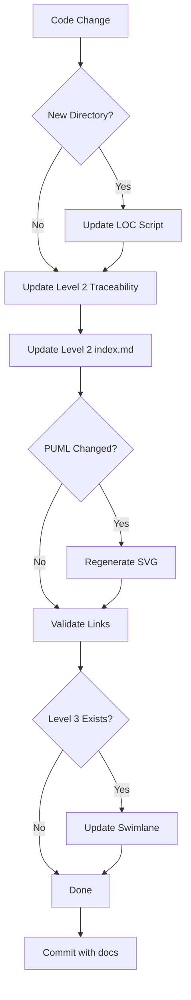

**Purpose**: Complete guide for maintaining the 4-level architecture documentation hierarchy (Level 0-3) with automated validation and traceability.

**Audience**: Developers, architects, technical writers, new team members

**Last Updated**: 2025-01-16

---

## 📚 Table of Contents

1. [Overview](#overview)
2. [Documentation Hierarchy](#documentation-hierarchy)
3. [When to Update Documentation](#when-to-update-documentation)
4. [How to Update Each Level](#how-to-update-each-level)
5. [Automated Tools](#automated-tools)
6. [Quality Standards](#quality-standards)
7. [Common Scenarios](#common-scenarios)
8. [Troubleshooting](#troubleshooting)
9. [Reference Documents](#reference-documents)

---

## Overview

### The 4-Level Architecture System

```
Level 0: Multi-Project Pipeline (6 projects)
    ↓
Level 1: Project A Architecture (8 workstreams)
    ↓
Level 2: Workstream Details (component architecture + workflows)
    ↓
Level 3: Module Implementation (state machines + detailed swimlanes)
```

### Documentation Philosophy

- **Level 0**: What projects exist and how they integrate
- **Level 1**: What workstreams exist and how they interact
- **Level 2**: What components exist and how they work ("Level 2.5" with code examples)
- **Level 3**: How complex algorithms/workflows are implemented (with LOC traceability)

---

## Documentation Hierarchy

### Level 0: RAG Pipeline Context

**Location**: `docs/architecture/diagrams/level-0/`

**Required Files**:

- `index.md` - Project descriptions, contracts, performance targets
- `rag-pipeline-overview.puml` - Multi-project architecture diagram
- `rag-pipeline-overview.svg` - Generated SVG (auto-generated)

**Scope**: 6 projects (Ingest, Prepare-Doc, Prepare-Audio, Unify, Chunk, Embed)

**Update Frequency**: Only when inter-project contracts or architecture changes

**Maintainer**: Lead architect or project owner

---

### Level 1: Project A (Prepare-Doc) Architecture

**Location**: `docs/architecture/diagrams/level-1/`

**Required Files**:

- `index.md` - 8 workstreams overview, data flows, downstream context
- `PROJECT_A_ARCHITECTURE_OVERVIEW.puml` - Production-centric 8-workstream architecture
- `PROJECT_A_WORKFLOW_HIERARCHY.puml` - Swimlane data flow (4 workstreams)
- `*.svg` files - Generated from PUMLs (auto-generated)

**Scope**: 8 workstreams interactions, high-level flows

**Update Frequency**: When workstream responsibilities change or new workstreams added

**Maintainer**: Project architect

---

### Level 2: Workstream Details (8 Workstreams)

**Location**: `docs/architecture/diagrams/level-2/{workstream}/`

**Required Files (per workstream)**:

- `index.md` - **MUST follow "Level 2.5" standard** (see template)
- `*.puml` files - Workflow diagrams (2-4 per workstream)
- `*.svg` files - Generated diagrams (auto-generated)

**8 Workstreams**:

1. production-runtime/
2. model-training/
3. data-preparation/
4. pseudo-labeling/
5. labeling-benchmarking/
6. model-arena/
7. monitoring-drift/
8. synthetic-generation/

**Scope**: Component architecture, workflows with code examples, dependencies, performance

**Update Frequency**: After sprint completion or significant feature additions

**Maintainer**: Workstream owner or lead developer

**Quality Standard**: "Level 2.5" - see [LEVEL_2_DOCUMENTATION_TEMPLATE.md](LEVEL_2_DOCUMENTATION_TEMPLATE.md)

---

### Level 3: Module Implementation Details

**Location**: `docs/architecture/diagrams/level-3/{workstream}/`

**Required Files (only for complex workstreams)**:

**Data Preparation** (`level-3/data-preparation/`):

- `metadata-schema-versioning.md` - Three-layer architecture, ER diagrams
- `label-parsing-generation.md` - 9 parsers, COCO cache, 45-dim vector
- `data-preparation-swimlane.puml` - Detailed swimlane with LOC annotations

**Production Runtime** (`level-3/production-runtime/`):

- `pipeline-state-machine.md` - 13 states, error recovery, edge cases
- `device-orchestrator.md` - Device selection, budget enforcement, circuit breaker
- `production-runtime-swimlane.puml` - Detailed swimlane with LOC annotations (44 files)

**Monitoring & Drift** (`level-3/monitoring-drift/`):

- `end-to-end-lifecycle.md` - Lifecycle sequence, state machines, compliance
- `monitoring-drift-swimlane.puml` - 6-component swimlane with LOC annotations

**Model Training** (`level-3/model-training/`):

- `model-training-swimlane.puml` - Phase-based swimlane with LOC annotations
- `layout-fusion-downsampler.md` - Layout Fusion architecture for DIQA-5000 training

**Scope**: Algorithms, state machines, detailed workflows, complete LOC traceability

**Update Frequency**: When algorithms change or complexity increases

**Maintainer**: Module owner or senior developer

---

## When to Update Documentation

### Trigger Events

| Event | Level to Update | Required Actions |
|-------|----------------|------------------|
| **New project added to pipeline** | Level 0 | Update rag-pipeline-overview.puml, add project description |
| **New workstream created** | Level 1 | Update PROJECT_A_ARCHITECTURE_OVERVIEW.puml, add to index.md |
| **Workstream interaction changes** | Level 1, Level 2 | Update data flow diagrams, dependency sections |
| **New component added** | Level 2 | Update workstream index.md, component tables, traceability |
| **Source file moved/renamed** | Level 2, Level 3 | Update all diagrams referencing file, update LOC extraction script |
| **Algorithm changed** | Level 3 | Update state machines, sequence diagrams, code references |
| **Sprint/Phase completed** | Level 2 | Update status, LOC counts, add new features to workflows |
| **LOC increased >20%** | Level 1, Level 2 | Re-run LOC extraction, update counts |

---

## How to Update Each Level

### Updating Level 0

**Rare** - Only for pipeline-wide changes

**Steps**:

1. Read current `level-0/index.md`
2. Update project descriptions if contracts changed
3. Update performance targets if SLOs changed
4. Modify `rag-pipeline-overview.puml` if project added/removed
5. Regenerate SVG: `python3 tools/generate_diagram_svgs.py --file docs/architecture/diagrams/level-0/rag-pipeline-overview.puml`
6. Commit: `docs(architecture): update Level 0 for [reason]`

---

### Updating Level 1

**Occasional** - When workstream boundaries change

**Steps**:

1. **If LOC counts changed >20%**:

   ```bash
   ./scripts/extract_workstream_loc.sh
   cat docs/architecture/workstream_loc_counts.json
   # Update table in level-1/index.md lines 237-246
   ```

2. **If workstream interactions changed**:
   - Update `PROJECT_A_ARCHITECTURE_OVERVIEW.puml`
   - Regenerate SVG
   - Update data flow description in index.md

3. **If new workstream added**:
   - Add to color conventions in diagram-maintenance-agent.md
   - Add to Level 1 table
   - Create Level 2 directory
   - Update LOC extraction script mapping

4. **Validate**:

   ```bash
   ./scripts/validate_architecture_links.sh
   # Check for broken links
   ```

5. Commit: `docs(architecture): update Level 1 workstream interactions`

---

### Updating Level 2 (Most Common)

**Frequent** - After sprint completion or feature additions

#### Step 1: Identify Affected Workstream

Determine which workstream your changes affect (usually obvious from code location).

#### Step 2: Update Workstream index.md

**Required Sections to Update** (follow [LEVEL_2_DOCUMENTATION_TEMPLATE.md](LEVEL_2_DOCUMENTATION_TEMPLATE.md)):

1. **Overview**: Update status, LOC count if changed >10%
2. **Key Components**: Add new components to table
3. **Detailed Workflows**: Add code examples for new features
4. **Workstream Dependencies**: Update if new dependencies added
5. **Performance Characteristics**: Update metrics if improved/degraded
6. **Source File Traceability**: Add new files to table (see below)

#### Step 3: Update Traceability Table

**Format** (at end of index.md before "Related Documentation"):

```markdown
## Source File Traceability

| Workflow Step | Source Files | LOC | Total |
|---------------|--------------|-----|-------|
| [Existing Step] | existing.py, new_file.py | 100, 50 | 150 |
| [New Step] | new_feature.py | 200 | 200 |
...

**Workstream Total**: X,XXX lines ✅
```

**How to get LOC for new files**:

```bash
wc -l src/path/to/new_file.py
# Add to appropriate workflow step in table
```

#### Step 4: Update PUML Diagrams (if workflow changed)

1. Modify relevant `.puml` file
2. Add traceability notes for new components:

   ```plantuml
   note right
     **Source:**
     - src/.../new_file.py

     **Documentation:**
     [[docs/api/new_feature.md]]
   end note
   ```

3. Regenerate SVG:

   ```bash
   python3 tools/generate_diagram_svgs.py --file docs/architecture/diagrams/level-2/{workstream}/diagram.puml
   ```

#### Step 5: Update LOC Extraction Script (if new directories)

If you created a new source directory:

1. Edit `scripts/extract_workstream_loc.sh` lines 45-54
2. Add directory to appropriate workstream mapping:

   ```bash
   ["workstream_name"]="existing/path new/path/added"
   ```

3. Run extraction to verify:

   ```bash
   ./scripts/extract_workstream_loc.sh
   ```

#### Step 6: Validate

```bash
# Check links
./scripts/validate_architecture_links.sh

# Verify LOC counts
./scripts/extract_workstream_loc.sh
# Compare output to traceability table totals
```

#### Step 7: Commit

```bash
git add docs/architecture/diagrams/level-2/{workstream}/
git commit -m "docs(architecture): update {workstream} for [feature/change]"
```

---

### Updating Level 3

**Infrequent** - Only for algorithm changes or new complex workflows

**When Level 3 Exists**:

1. **Update state machine docs** if state changes:
   - Modify PlantUML state diagrams
   - Update state transition tables
   - Add new error recovery flows

2. **Update swimlane diagrams** if new files added:
   - Add file annotation with LOC: `new_file.py (150 lines)`
   - Update "Total Step LOC" subtotals
   - Update legend total
   - Regenerate SVG

3. **Validate LOC totals**:

   ```bash
   ./scripts/extract_workstream_loc.sh --validate-swimlane {workstream}
   # Verify swimlane total matches LOC extraction
   ```

**When Level 3 Doesn't Exist Yet**:

- See [LEVEL_3_AGENT_ASSIGNMENTS.md](LEVEL_3_AGENT_ASSIGNMENTS.md) for creation instructions
- Invoke documentation-writer agent with task definition
- Only create if workstream >5,000 LOC or has complex state machines

---

## Automated Tools

### 1. LOC Extraction Script

**Purpose**: Count lines of code per workstream, validate documentation accuracy

**Location**: `scripts/extract_workstream_loc.sh`

**Usage**:

```bash
# Basic extraction (outputs JSON)
./scripts/extract_workstream_loc.sh

# View JSON output
cat docs/architecture/workstream_loc_counts.json | python3 -m json.tool

# Validate against traceability tables (future)
./scripts/extract_workstream_loc.sh --validate-tables production_runtime

# Validate against swimlane diagrams (future)
./scripts/extract_workstream_loc.sh --validate-swimlane production_runtime
```

**Output**: `docs/architecture/workstream_loc_counts.json`

**Frequency**: Quarterly or after major code changes

**See**: [LOC_EXTRACTION_METHODOLOGY.md](LOC_EXTRACTION_METHODOLOGY.md) for detailed explanation

---

### 2. Link Validation Script

**Purpose**: Check for broken cross-level references in architecture docs

**Location**: `scripts/validate_architecture_links.sh`

**Usage**:

```bash
# Validate all architecture docs
./scripts/validate_architecture_links.sh

# Summary output shows:
# - Total links checked
# - Valid links
# - Broken links with details
```

**Exit Codes**:

- `0` = All links valid
- `1` = Broken links found (CI failure)

**Frequency**: Run before every commit touching architecture docs

**CI Integration**: Can be added to `.github/workflows/` for automatic checking

---

### 3. SVG Generation Script

**Purpose**: Generate SVG diagrams from PlantUML source files

**Location**: `tools/generate_diagram_svgs.py`

**Usage**:

```bash
# Regenerate all changed diagrams
python3 tools/generate_diagram_svgs.py

# Regenerate specific diagram
python3 tools/generate_diagram_svgs.py --file docs/architecture/diagrams/level-2/production-runtime/workflow.puml

# Force regenerate all
python3 tools/generate_diagram_svgs.py --all

# Check which need regeneration
python3 tools/generate_diagram_svgs.py --check
```

**When to Run**: After modifying any `.puml` file

**Auto-commit SVGs**: Yes, commit both `.puml` and `.svg` files together

---

### 4. File Inventory

**Purpose**: Complete mapping of all git-tracked files to workstreams

**Location**: `docs/architecture/FILE_INVENTORY_WITH_WORKSTREAM_MAPPINGS.md`

**Regeneration**:

```bash
# Regenerate inventory (when many files added/moved)
python3 /tmp/generate_file_inventory.py > docs/architecture/FILE_INVENTORY_WITH_WORKSTREAM_MAPPINGS.md

# Or manually update specific sections
```

**Frequency**: Quarterly or after major refactoring

**Use Cases**:

- Verify all source files are documented
- Check LOC extraction completeness
- Validate swimlane annotations

---

## Quality Standards

### Level 2 Documentation ("Level 2.5" Standard)

**Minimum Requirements**:

- ✅ ≥300 lines for complex workstreams (>1,000 LOC)
- ✅ 2-5 code examples (Python, YAML, JSON)
- ✅ **Workstream Dependencies section** (MANDATORY)
- ✅ Performance characteristics (quantitative metrics)
- ✅ Explicit Level 3 decision with rationale
- ✅ **Source File Traceability table** (NEW - MANDATORY)

**Template**: [LEVEL_2_DOCUMENTATION_TEMPLATE.md](LEVEL_2_DOCUMENTATION_TEMPLATE.md)

**Checklist Before Committing**:

- [ ] All required sections present
- [ ] Code examples are valid and tested
- [ ] Dependencies documented (upstream/downstream/external)
- [ ] LOC counts accurate (within ±10%)
- [ ] Traceability table sums to workstream total
- [ ] Markdown linting passing (`markdownlint --fix`)
- [ ] Cross-references valid (`./scripts/validate_architecture_links.sh`)

---

### Level 3 Documentation (Swimlane Standard)

**Requirements for Swimlane Diagrams**:

- ✅ LOC count for **every** source file annotation
- ✅ "Total Step LOC" subtotal for each workflow step
- ✅ Legend showing total matches LOC extraction
- ✅ Each file annotation matches FILE_INVENTORY_WITH_WORKSTREAM_MAPPINGS.md
- ✅ Color-coded by processing stage
- ✅ 4-6 swimlanes per complex workstream

**Example Annotation**:

```plantuml
:Process document;
note right
  **Source Files:**
  - src/.../file1.py (250 lines)
  - src/.../file2.py (180 lines)

  **Total Step LOC**: 430 lines

  **Performance:**
  - Latency: <50ms
end note
```

**See**: [SWIMLANE_TRACEABILITY_PROPOSAL.md](SWIMLANE_TRACEABILITY_PROPOSAL.md) for examples

---

## Common Scenarios

### Scenario 1: Adding a New Source File

**Example**: Created `src/image_preprocessing_detector/detection/new_detector.py` (200 lines)

**Steps**:

1. **Assign to workstream**: Production Runtime (since it's in `detection/`)

2. **Update LOC extraction script** (if new directory, skip if file in existing directory)

3. **Update Level 2 traceability table**:

   ```markdown
   | Detection - Quality Analysis | ..., new_detector.py | ..., 200 | [NEW TOTAL] |
   ```

4. **Update Level 2 index.md** (if significant feature):
   - Add to "Key Components" table
   - Add code example showing usage
   - Update performance metrics if applicable

5. **Update Level 3 swimlane** (if exists):
   - Add annotation: `new_detector.py (200 lines)`
   - Update "Total Step LOC"
   - Update legend total

6. **Validate**:

   ```bash
   ./scripts/extract_workstream_loc.sh
   # Verify Production Runtime LOC increased by 200
   ./scripts/validate_architecture_links.sh
   ```

---

### Scenario 2: Moving a Source File to Different Directory

**Example**: Moved `layout_lite/` from `detection/` to `layout/` (new package)

**Steps**:

1. **Update LOC extraction script**:

   ```bash
   # Edit scripts/extract_workstream_loc.sh line 46
   # Before:
   ["production_runtime"]="... src/.../detection ..."

   # After (if creating new workstream):
   ["production_runtime"]="... src/.../detection ..."
   ["layout_detection"]="src/.../layout"

   # OR (if keeping in Production Runtime):
   ["production_runtime"]="... src/.../detection src/.../layout ..."
   ```

2. **Update FILE_INVENTORY** (if significant):
   - Move files from WS1 Detection section to new location
   - Recalculate subtotals

3. **Update Level 2 traceability tables**:
   - Remove from old location
   - Add to new location (or new workstream)

4. **Update Level 3 swimlanes**:
   - Update file path annotations
   - Verify totals still match

5. **Update PUML diagrams**:

   ```plantuml
   # Old:
   - src/.../detection/layout_lite/analyzer.py

   # New:
   - src/.../layout/analyzer.py
   ```

6. **Validate**:

   ```bash
   ./scripts/extract_workstream_loc.sh
   ./scripts/validate_architecture_links.sh
   ```

---

### Scenario 3: Sprint/Phase Completion

**Example**: Completed Phase 5 (API deployment)

**Steps**:

1. **Update Level 1 index.md**:
   - Update workstream status if changed
   - Update phase completion notes

2. **Update affected Level 2 docs**:
   - Mark features as "✅ Complete"
   - Update status badges
   - Add new components to tables
   - Update performance metrics with actual measurements

3. **Run LOC extraction**:

   ```bash
   ./scripts/extract_workstream_loc.sh
   ```

4. **Update traceability tables** with any new files

5. **Commit**:

   ```bash
   git add docs/architecture/
   git commit -m "docs(architecture): update for Phase 5 completion"
   ```

---

### Scenario 4: Documenting Training Architecture Changes

**Example**: Added Layout Fusion Downsampler for DIQA-5000 training

**When**: When implementing complex training algorithms that avoid naive downsampling or preserve semantic structure

**Steps**:

1. **Create Level 3 documentation**:
   - Create `docs/architecture/diagrams/level-3/model-training/[component-name].md`
   - Document architecture rationale (why not naive downsampling?)
   - Include detailed architecture specification (encoder/decoder/fusion layers)
   - Add performance characteristics (latency, memory, comparison to alternatives)
   - Include code examples and training integration

2. **Update Level 3 swimlane diagram**:

   ```plantuml
   # Add note referencing the new documentation
   :Initialize ResNet-50 Teacher;
   note right
     **Note**: For DocIQ-Replica (DIQA-5000),
     this includes Layout Fusion Downsampler
     to preserve document structure during
     1600×1600 → 400×400 downsampling.
     See: layout-fusion-downsampler.md
   end note
   ```

3. **Update ARCHITECTURE_MAINTENANCE_GUIDE.md**:
   - Add the new file to Level 3 file listing (lines 142-144)
   - Update scope description if needed

4. **Update Level 2 documentation** (if applicable):
   - Add references to the new Level 3 documentation
   - Update workflow diagrams to show the component

5. **Validate**:

   ```bash
   ./scripts/validate_architecture_links.sh
   markdownlint --fix docs/architecture/diagrams/level-3/model-training/*.md
   ```

6. **Commit**:

   ```bash
   git add docs/architecture/diagrams/level-3/model-training/
   git commit -m "docs(architecture): add Layout Fusion Downsampler Level 3 documentation"
   ```

**Example Files Created**:

- `layout-fusion-downsampler.md` (comprehensive specification)
- Updated `model-training-swimlane.puml` (added reference)

---

### Scenario 5: Quarterly Documentation Audit

**Frequency**: Every 3 months (Jan 1, Apr 1, Jul 1, Oct 1)

**Checklist**:

1. **Run LOC extraction**:

   ```bash
   ./scripts/extract_workstream_loc.sh
   ```

2. **Compare to documented counts**:
   - Check Level 1 table (lines 237-246)
   - Update if variance >±20%

3. **Validate links**:

   ```bash
   ./scripts/validate_architecture_links.sh
   ```

   - Fix any broken links

4. **Review FILE_INVENTORY unassigned files**:
   - Assign 30 unassigned files to workstreams or mark as NA
   - Update LOC extraction script

5. **Validate traceability tables** (when validation mode available):

   ```bash
   ./scripts/extract_workstream_loc.sh --validate-tables all
   ```

6. **Update timestamps**:
   - Update `last_updated` in Level 2 frontmatter
   - Update "Last Updated" footer in Level 3 docs

7. **Commit**:

   ```bash
   git commit -m "chore(docs): quarterly architecture documentation audit Q[N] 2025"
   ```

---

## Automated Tools Reference

### Quick Command Reference

```bash
# Extract LOC counts for all workstreams
./scripts/extract_workstream_loc.sh

# Validate all architecture links
./scripts/validate_architecture_links.sh

# Regenerate changed diagram SVGs
python3 tools/generate_diagram_svgs.py

# Regenerate all diagram SVGs
python3 tools/generate_diagram_svgs.py --all

# Check markdown linting
markdownlint docs/architecture/**/*.md

# Fix markdown linting
markdownlint --fix docs/architecture/**/*.md

# Future: Validate traceability tables
./scripts/extract_workstream_loc.sh --validate-tables {workstream}

# Future: Validate swimlane LOC annotations
./scripts/extract_workstream_loc.sh --validate-swimlane {workstream}
```

---

## Quality Checks Before Commit

### Pre-Commit Checklist

- [ ] **Markdown linting**: `markdownlint --fix docs/architecture/diagrams/level-{N}/**/*.md`
- [ ] **Link validation**: `./scripts/validate_architecture_links.sh` (exit code 0)
- [ ] **LOC extraction**: Run if source files changed, verify totals
- [ ] **SVG generation**: If `.puml` changed, regenerate SVG
- [ ] **Traceability**: If source files added, update tables
- [ ] **Frontmatter**: Update `last_updated` date
- [ ] **Cross-references**: Verify all `[link](path)` references are valid

### CI/CD Integration (Future)

**GitHub Actions Workflow** (planned):

```yaml
# .github/workflows/architecture-docs-validation.yml
name: Validate Architecture Documentation

on:
  pull_request:
    paths:
      - 'docs/architecture/**'
      - 'src/**/*.py'
      - 'scripts/**/*.py'
      - 'modal/**/*.py'

jobs:
  validate:
    runs-on: ubuntu-latest
    steps:
      - uses: actions/checkout@v4

      - name: Validate links
        run: ./scripts/validate_architecture_links.sh

      - name: Check markdown linting
        run: markdownlint docs/architecture/**/*.md

      - name: Verify LOC totals
        run: |
          ./scripts/extract_workstream_loc.sh
          # Compare to committed totals (fail if >20% variance)
```

---

## Troubleshooting

### Problem: LOC extraction shows 0 for a workstream

**Causes**:

1. Directory doesn't exist
2. Directory only has test files
3. Path typo in extraction script

**Solution**:

```bash
# Verify directory exists
ls -la src/image_preprocessing_detector/{directory}

# Check for Python files
find src/image_preprocessing_detector/{directory} -name "*.py" -not -path "*/tests/*"

# Review mapping in extract_workstream_loc.sh lines 45-54
```

---

### Problem: Link validation failing

**Causes**:

1. File was moved/renamed
2. Typo in markdown link
3. Relative path incorrect

**Solution**:

```bash
# Run validator to see broken links
./scripts/validate_architecture_links.sh

# Example output:
# ✗ BROKEN: [Missing Doc](../missing.md)
#   Resolved to: /path/to/missing.md

# Fix the link in the source markdown file
```

---

### Problem: Traceability table total doesn't match LOC extraction

**Causes**:

1. Missing files in table
2. Incorrect LOC counts
3. Files counted twice

**Solution**:

```bash
# Run LOC extraction
./scripts/extract_workstream_loc.sh

# Compare to traceability table in Level 2 index.md
# Add missing files or correct LOC counts

# Future: Use validation mode
./scripts/extract_workstream_loc.sh --validate-tables {workstream}
```

---

### Problem: Swimlane diagram won't generate SVG

**Causes**:

1. PlantUML syntax error
2. Unicode character issue
3. Missing `@enduml` tag

**Solution**:

```bash
# Try manual PlantUML render to see error
cat diagram.puml | plantuml -tsvg -pipe > output.svg

# Common fixes:
# - Replace en-dashes (–) with regular dashes (-)
# - Remove unicode quotes (" ") with straight quotes (")
# - Add missing @enduml
```

---

## Reference Documents

### For New Contributors

**Start Here**:

1. [Level 0: RAG Pipeline Overview](diagrams/level-0/index.md) - Understand the multi-project context
2. [Level 1: Project A Architecture](diagrams/level-1/index.md) - Understand the 8 workstreams
3. [LEVEL_2_DOCUMENTATION_TEMPLATE.md](LEVEL_2_DOCUMENTATION_TEMPLATE.md) - How to write Level 2 docs

### For Documentation Writers

**Templates & Standards**:

- [LEVEL_2_DOCUMENTATION_TEMPLATE.md](LEVEL_2_DOCUMENTATION_TEMPLATE.md) - "Level 2.5" standard
- [SWIMLANE_TRACEABILITY_PROPOSAL.md](SWIMLANE_TRACEABILITY_PROPOSAL.md) - Swimlane format
- [LEVEL_3_IMPLEMENTATION_ROADMAP.md](LEVEL_3_IMPLEMENTATION_ROADMAP.md) - Level 3 doc outlines

**Traceability**:

- [FILE_INVENTORY_WITH_WORKSTREAM_MAPPINGS.md](FILE_INVENTORY_WITH_WORKSTREAM_MAPPINGS.md) - Complete file-to-workstream mapping
- [LOC_EXTRACTION_METHODOLOGY.md](LOC_EXTRACTION_METHODOLOGY.md) - How LOC counting works

### For Architects

**Planning**:

- [ARCHITECTURE_DOCUMENTATION_IMPROVEMENT_PLAN.md](ARCHITECTURE_DOCUMENTATION_IMPROVEMENT_PLAN.md) - 19 issues tracker
- [LEVEL_3_AGENT_ASSIGNMENTS.md](LEVEL_3_AGENT_ASSIGNMENTS.md) - Sub-agent task definitions

**Historical**:

- [DOCUMENTATION_IMPROVEMENT_SESSION_SUMMARY.md](DOCUMENTATION_IMPROVEMENT_SESSION_SUMMARY.md) - Mid-session record
- [FINAL_SESSION_SUMMARY.md](FINAL_SESSION_SUMMARY.md) - Complete session summary

### For Diagram Maintenance

**Agent Configuration**:

- [.claude/agents/diagram-maintenance-agent.md](../.claude/agents/diagram-maintenance-agent.md) - Diagram standards and update procedures

**Index**:

- [diagrams/INDEX.md](diagrams/INDEX.md) - Diagram-to-source traceability matrix

---

## Best Practices

### DO ✅

1. **Update documentation when code changes** - Don't let docs drift
2. **Use automated tools** - Run LOC extraction and link validation regularly
3. **Follow templates** - Use LEVEL_2_DOCUMENTATION_TEMPLATE.md for consistency
4. **Include code examples** - Show actual implementation, not just descriptions
5. **Validate traceability** - Ensure table totals match LOC extraction
6. **Commit .puml and .svg together** - Keep diagrams in sync
7. **Update timestamps** - Change `last_updated` when modifying docs
8. **Cross-reference liberally** - Link to related Level 0/1/2/3 docs

### DON'T ❌

1. **Don't skip traceability tables** - They're mandatory for Level 2 docs
2. **Don't estimate LOC** - Use actual counts from `wc -l` or LOC script
3. **Don't mix levels** - Keep Level 1 high-level, Level 2 detailed, Level 3 implementation
4. **Don't create Level 3 docs unnecessarily** - Check if Level 2.5 is sufficient
5. **Don't forget validation** - Run `validate_architecture_links.sh` before commit
6. **Don't duplicate content** - Link to existing docs instead of copying
7. **Don't use absolute paths** - Use relative paths from document location
8. **Don't update diagrams without regenerating SVGs** - Always run `generate_diagram_svgs.py`

---

## Maintenance Schedule

### Daily (When Coding)

- [ ] Update Level 2 index.md if adding new features
- [ ] Add new files to traceability table
- [ ] Update code examples if API changed

### Weekly (Sprint)

- [ ] Run link validation before PR
- [ ] Update status badges in Level 2 docs
- [ ] Regenerate diagrams if workflows changed

### Monthly (Sprint Retrospective)

- [ ] Review "Unassigned" files in FILE_INVENTORY
- [ ] Update performance metrics with actual measurements
- [ ] Check for stale content

### Quarterly (Documentation Audit)

- [ ] Run full LOC extraction
- [ ] Update Level 1 LOC counts if >±20% variance
- [ ] Validate all traceability tables (when validation available)
- [ ] Review and update all `last_updated` timestamps
- [ ] Generate file inventory
- [ ] Fix any broken links
- [ ] Update README.md if architecture changed

---

## Getting Help

### Questions About Documentation Structure

**Read**:

- This guide (ARCHITECTURE_MAINTENANCE_GUIDE.md)
- [LEVEL_2_DOCUMENTATION_TEMPLATE.md](LEVEL_2_DOCUMENTATION_TEMPLATE.md)

### Questions About LOC Counting

**Read**:

- [LOC_EXTRACTION_METHODOLOGY.md](LOC_EXTRACTION_METHODOLOGY.md)
- [FILE_INVENTORY_WITH_WORKSTREAM_MAPPINGS.md](FILE_INVENTORY_WITH_WORKSTREAM_MAPPINGS.md)

### Questions About Swimlane Diagrams

**Read**:

- [SWIMLANE_TRACEABILITY_PROPOSAL.md](SWIMLANE_TRACEABILITY_PROPOSAL.md)
- [.claude/agents/diagram-maintenance-agent.md](../.claude/agents/diagram-maintenance-agent.md)

### Questions About Level 3 Implementation

**Read**:

- [LEVEL_3_IMPLEMENTATION_ROADMAP.md](LEVEL_3_IMPLEMENTATION_ROADMAP.md)
- [LEVEL_3_AGENT_ASSIGNMENTS.md](LEVEL_3_AGENT_ASSIGNMENTS.md)

### Need to Invoke Sub-Agent for Level 3 Work

**See**: [LEVEL_3_AGENT_ASSIGNMENTS.md](LEVEL_3_AGENT_ASSIGNMENTS.md) for complete task definitions

**Invoke**:

```bash
# Use Task tool with documentation-writer agent
# Provide task description from LEVEL_3_AGENT_ASSIGNMENTS.md
# Agent will have full context from reference documents
```

---

## Quick Start Guide

### I'm a new developer - Where do I start?

1. Read [Level 1: Project A Architecture](diagrams/level-1/index.md) - Understand the 8 workstreams
2. Read relevant [Level 2 doc](diagrams/level-2/) for your workstream
3. Check Level 2 "Source File Traceability" table to find files you need
4. If complex algorithm, check if Level 3 doc exists

### I'm adding a new feature - What do I update?

1. Add feature code to appropriate workstream directory
2. Update Level 2 index.md:
   - Add component to "Key Components" table
   - Add code example if significant
   - Add file to "Source File Traceability" table
3. Run `./scripts/validate_architecture_links.sh`
4. Commit with docs updates

### I'm refactoring code - How do I keep docs in sync?

1. **Before refactoring**: Note which files you're moving/changing
2. **During refactoring**: Keep list of file moves
3. **After refactoring**:
   - Update LOC extraction script if directories changed
   - Update all PUML diagram notes with file references
   - Update Level 2 traceability tables
   - Update Level 3 swimlanes if they exist
   - Run `./scripts/validate_architecture_links.sh`
4. Validate totals still match

### I'm an architect - How do I maintain the system?

1. **Quarterly**: Run full audit (see "Quarterly Documentation Audit" above)
2. **After major changes**: Update hierarchy diagrams (Level 0, Level 1)
3. **Monitor**: Review FILE_INVENTORY unassigned files
4. **Guide**: Help developers follow standards
5. **Improve**: Update templates based on feedback

---

## Contact & Support

### Documentation Issues

- **Broken links**: Run `./scripts/validate_architecture_links.sh`
- **Incorrect LOC**: Run `./scripts/extract_workstream_loc.sh`
- **Missing files**: Check FILE_INVENTORY_WITH_WORKSTREAM_MAPPINGS.md

### Template Questions

- See LEVEL_2_DOCUMENTATION_TEMPLATE.md
- Examples: production-runtime, model-training, monitoring-drift Level 2 docs

### Level 3 Creation

- See LEVEL_3_AGENT_ASSIGNMENTS.md
- Invoke documentation-writer sub-agent with task definition

---

## Summary: Maintenance Workflow



**Key Principle**: **Documentation follows code** - Update docs immediately when code changes, don't defer.

---

*Complete maintenance guide for 4-level architecture documentation system*
*All tools, standards, and procedures documented*
*Ready for long-term sustainable maintenance*