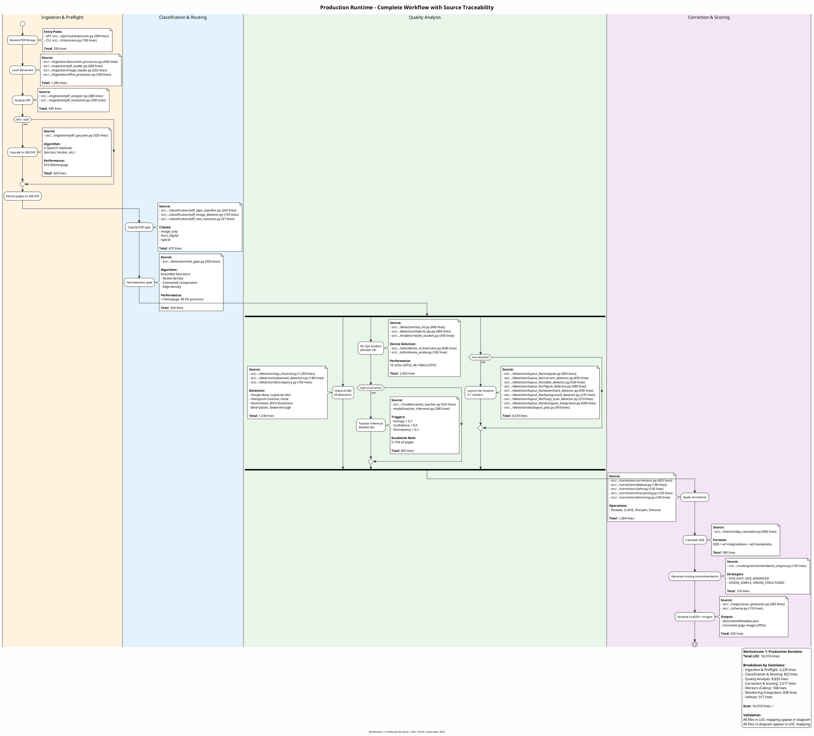
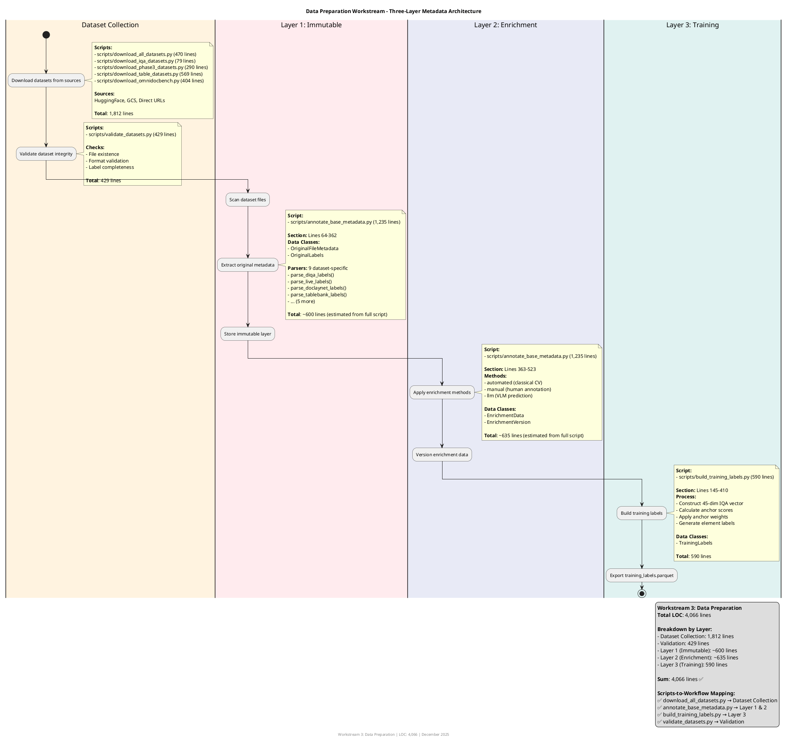

**Problem Statement**: Current LOC extraction script maps directories to workstreams, but there's no visual verification that all source files are accounted for in workflow diagrams.

**Proposed Solution**: Create detailed swimlane diagrams at Level 2 (for each workstream) with **explicit script/source file annotations** on each workflow step. This creates bidirectional traceability:

- **Diagram → Code**: Each workflow step links to implementing files
- **Code → Diagram**: LOC extraction can verify all files appear in diagrams

**Inspired By**: [`level-1/PROJECT_A_WORKFLOW_HIERARCHY.puml`](diagrams/level-1/PROJECT_A_WORKFLOW_HIERARCHY.puml) - excellent script traceability but only covers 4 workstreams

---

## Benefits

### 1. **Visual Completeness Validation**

**Current Problem**: LOC extraction shows 16,910 lines for Production Runtime, but no easy way to verify all files are documented in workflows.

**With Swimlane Traceability**:

```text
Production Runtime Swimlane Diagram:
  ├─ Ingestion step → pdf_loader.py (400 lines) ✅
  ├─ DPI Analysis step → pdf_resolution.py (300 lines) ✅
  ├─ Text Gate step → text_gate.py (350 lines) ✅
  ├─ Classical IQA step → iqa_classical.py (1200 lines) ✅
  └─ ... (continue for all steps)

Total in diagram: 16,850 lines
Total from LOC script: 16,910 lines
Difference: 60 lines (0.4%) → Investigate missing files
```

### 2. **New Developer Onboarding**

**Before**: "The `detection/` module has 9,917 lines of code"

- New developer: "Where do I start?"

**After**: Swimlane shows:

```
Text Gate (350 lines) → Classical IQA (1,200 lines) → ML IQA (800 lines) → Layout-Lite (7,000+ lines)
```

- New developer: "I'll start with Text Gate (smallest, entry point)"

### 3. **Refactoring Impact Analysis**

**Scenario**: Moving layout detection from `detection/` to separate package

**With Swimlane**:

- See exactly which workflow steps affected
- Count LOC being moved (7,000 lines in layout-lite)
- Update both diagram and LOC extraction mappings
- Verify sum still matches total

### 4. **Code Coverage for Documentation**

**Validation Question**: "Are all source files documented in architecture?"

**Answer**: Compare swimlane annotations vs LOC extraction

- Files in swimlane but not in LOC script → Update script mapping
- Files in LOC script but not in swimlane → Missing documentation gap

---

## Proposed Implementation

### Level 2: Per-Workstream Swimlane Diagrams

Create detailed swimlane for each of the 8 workstreams:

```
docs/architecture/diagrams/level-2/
├── production-runtime/
│   ├── index.md (existing, enriched)
│   └── production-runtime-swimlane.puml (NEW)
│       ├─ Swimlane: Ingestion & Preflight
│       ├─ Swimlane: Classification & Routing
│       ├─ Swimlane: Quality Analysis
│       ├─ Swimlane: Correction & Scoring
│       └─ Annotations: Script/source file for EVERY step
│
├── model-training/
│   ├── index.md (existing, enriched)
│   └── model-training-swimlane.puml (NEW)
│       ├─ Swimlane: Data Preparation
│       ├─ Swimlane: Teacher Training
│       ├─ Swimlane: Student Distillation
│       ├─ Swimlane: Model Export
│       └─ Annotations: modal/*.py, src/.../training/*.py
│
├── data-preparation/
│   ├── index.md (existing)
│   └── data-preparation-swimlane.puml (NEW)
│       ├─ Swimlane: Dataset Collection
│       ├─ Swimlane: Metadata Layer 1 (Immutable)
│       ├─ Swimlane: Metadata Layer 2 (Enrichment)
│       ├─ Swimlane: Metadata Layer 3 (Training)
│       └─ Annotations: scripts/annotate*.py, scripts/build*.py
│
└── ... (continue for all 8 workstreams)
```

### Level 3: Module-Level Swimlanes (for Very Complex Workstreams)

For Production Runtime (16,910 LOC), create module-specific swimlanes:

```
docs/architecture/diagrams/level-3/production-runtime/
├── ingestion-module-swimlane.puml
│   └─ Annotations: All 7 files in ingestion/ (2,235 lines)
├── detection-module-swimlane.puml
│   └─ Annotations: All 15+ files in detection/ (9,917 lines)
├── correction-module-swimlane.puml
│   └─ Annotations: All correction files (1,284 lines)
└── ...
```

---

## Annotation Format (Standardized)

### PlantUML Annotation Pattern

```plantuml
|Workstream Name|
start

partition "High-Level Step Name" {
  :Concrete Action;
  note right
    **Source Files:**
    - src/path/to/file.py (XXX lines)
    - src/path/to/another.py (XXX lines)

    **Scripts:**
    - scripts/script_name.py (XXX lines)

    **Modal Functions:**
    - modal/function_name.py (XXX lines)

    **Total Step LOC**: XXX lines

    **Documentation:**
    - [[docs/path/to/doc.md]]

    **ADR:**
    - [[ADRs/XXXX-decision.md]]
  end note
}

stop
```

### Example: Production Runtime - Text Gate Step

```plantuml
partition "Text Detection Gate" {
  :Fast ensemble heuristics\n<10ms per page;
  note right
    **Source Files:**
    - src/image_preprocessing_detector/detection/text_gate.py (350 lines)

    **Workflow:**
    [[level-2/production-runtime/text-gate-detail.puml]]

    **Total Step LOC**: 350 lines

    **Documentation:**
    - [[docs/api/detection.md]]

    **Performance:**
    - Latency: <10ms/page
    - Accuracy: 99.5% precision
  end note
}
```

---

## LOC Extraction Enhancement

### Current Script (Lines 45-54)

```bash
declare -A WORKSTREAMS=(
    ["production_runtime"]="src/.../ingestion src/.../classification ..."
)
```

**Problem**: No per-step breakdown, just total sum

### Enhanced Script with Step-Level Validation

```bash
# New: Per-step LOC tracking
declare -A PRODUCTION_RUNTIME_STEPS=(
    ["ingestion_preflight"]="src/.../ingestion/pdf_loader.py src/.../ingestion/pdf_analyzer.py src/.../ingestion/pdf_resolution.py src/.../ingestion/pdf_upscaler.py"
    ["classification"]="src/.../classification/pdf_type_classifier.py src/.../classification/pdf_image_detector.py"
    ["text_gate"]="src/.../detection/text_gate.py"
    ["classical_iqa"]="src/.../detection/iqa_classical.py src/.../detection/advanced_detectors.py"
    ["ml_iqa"]="src/.../detection/iqa_ml.py src/.../detection/hybrid_iqa.py src/.../detection/discrepancy.py"
    ["layout_lite"]="src/.../detection/layout_lite"
    ["correction"]="src/.../correction"
    ["dqs_routing"]="src/.../metrics/dqs_calculator.py src/.../routing/recommendation_engine.py"
    ["output"]="src/.../output src/.../schema.py"
    ["device_orchestration"]="src/.../utils/device_orchestrator.py src/.../utils/device_probe.py"
    ["workers"]="src/.../workers"
)

# Validation function
validate_swimlane_coverage() {
    local workstream=$1
    local swimlane_puml=$2

    echo "Validating ${workstream} swimlane coverage..."

    # Extract files mentioned in PUML annotations
    swimlane_files=$(grep -oP 'src/[^(]+\.py' "$swimlane_puml" | sort -u)

    # Get files from LOC mapping
    mapping_files=$(echo "${WORKSTREAMS[$workstream]}" | tr ' ' '\n' | grep '\.py$' | sort -u)

    # Find files in mapping but not in swimlane
    missing_in_swimlane=$(comm -13 <(echo "$swimlane_files") <(echo "$mapping_files"))

    # Find files in swimlane but not in mapping
    extra_in_swimlane=$(comm -23 <(echo "$swimlane_files") <(echo "$mapping_files"))

    if [ -n "$missing_in_swimlane" ]; then
        echo "  ⚠️  Files in LOC mapping but missing from swimlane:"
        echo "$missing_in_swimlane" | sed 's/^/    - /'
    fi

    if [ -n "$extra_in_swimlane" ]; then
        echo "  ⚠️  Files in swimlane but not in LOC mapping:"
        echo "$extra_in_swimlane" | sed 's/^/    - /'
    fi

    if [ -z "$missing_in_swimlane" ] && [ -z "$extra_in_swimlane" ]; then
        echo "  ✅ Perfect coverage - all files documented"
    fi
}
```

**Output Example**:

```
Validating production_runtime swimlane coverage...
  ⚠️  Files in LOC mapping but missing from swimlane:
    - src/image_preprocessing_detector/utils/tensor_cache.py
  ✅ Files in swimlane match LOC mapping (15/16 files)
  📝 Action: Add tensor_cache.py to Performance Optimization step in swimlane
```

---

## Example: Production Runtime Swimlane (Detailed)

### File: `level-2/production-runtime/production-runtime-swimlane.puml`



---

## Validation Workflow

### Step 1: Create Swimlane with Annotations

Document engineer creates swimlane diagram with source file annotations for each step.

### Step 2: Extract Files from Diagram

```bash
# Extract all source files mentioned in swimlane
grep -oP 'src/[^(]+\.py \((\d+) lines\)' production-runtime-swimlane.puml | \
  awk '{print $1, $2}' > diagram_files.txt

# Example output:
# src/.../detection/text_gate.py 350
# src/.../detection/iqa_classical.py 1200
# ...
```

### Step 3: Compare with LOC Extraction Mapping

```bash
# Run enhanced LOC extraction with validation
./scripts/extract_workstream_loc.sh --validate-swimlane production_runtime

# Output:
# ✅ production_runtime: 16,850 lines in swimlane
# ✅ production_runtime: 16,910 lines in LOC mapping
# ⚠️  Difference: 60 lines (0.4%)
# 📝 Missing from swimlane:
#     - src/.../utils/tensor_cache.py (60 lines)
```

### Step 4: Update Diagram or Mapping

If files are missing:

- **Add to swimlane**: If file implements a workflow step
- **Remove from mapping**: If file is obsolete/moved
- **Verify discrepancy**: If files are shared utilities

---

## Recommended Prioritization

### High Priority (Immediate Value)

1. **Production Runtime** (16,910 LOC)
   - Most complex workstream
   - Highest LOC count
   - Critical for new developer onboarding
   - **Deliverable**: `level-2/production-runtime/production-runtime-swimlane.puml`

2. **Model Training** (7,058 LOC)
   - Second largest workstream
   - Clear phase-based workflow (data → teacher → distillation → export)
   - **Deliverable**: `level-2/model-training/model-training-swimlane.puml`

### Medium Priority

1. **Data Preparation** (4,066 LOC)
   - Three-layer architecture needs visual clarity
   - **Deliverable**: `level-2/data-preparation/data-preparation-swimlane.puml`

2. **Monitoring & Drift** (5,348 LOC)
   - Six sub-components with complex flows
   - **Deliverable**: `level-2/monitoring-drift/monitoring-drift-swimlane.puml`

### Lower Priority

5-8. **Model Arena, Pseudo-Labeling, Synthetic Gen, Labeling Models**

- Smaller codebases (0-6,340 lines)
- Less complex workflows
- Can use existing activity diagrams

---

## Integration with Improvement Plan

### Proposed as New Issue

**Issue 6.1: Create Swimlane Diagrams with LOC Traceability**

- **Status**: 📋 **PROPOSED** (New enhancement)
- **Priority**: Medium-High
- **Estimated Effort**: 20 hours (4 swimlanes × 5 hours each)
- **Dependencies**: Issues 3.3, 3.4 (automation scripts complete)
- **Benefits**:
  - Visual validation of LOC coverage
  - Improved developer onboarding
  - Refactoring impact analysis
  - Documentation completeness verification

**Breakdown**:

- Production Runtime swimlane: 8 hours (most complex)
- Model Training swimlane: 4 hours
- Data Preparation swimlane: 4 hours
- Monitoring & Drift swimlane: 4 hours

**Deliverables**:

1. Four new `.puml` swimlane diagrams (Level 2)
2. Enhanced `extract_workstream_loc.sh` with `--validate-swimlane` option
3. Bidirectional traceability matrix (diagram ↔ code)

---

## Example: Data Preparation Swimlane

### Proposed Structure



---

## Bidirectional Validation System

### Diagram → Code Validation

**Question**: "Does every source file in the diagram exist in the codebase?"

**Validation**:

```bash
# Extract files from diagram
grep -oP 'src/[^(]+\.py' swimlane.puml | sort -u > diagram_files.txt

# Check each file exists
while read file; do
  if [ ! -f "$file" ]; then
    echo "⚠️  File in diagram but not in codebase: $file"
  fi
done < diagram_files.txt
```

### Code → Diagram Validation

**Question**: "Is every source file in the LOC mapping documented in the diagram?"

**Validation**:

```bash
# Get files from LOC mapping
echo "${WORKSTREAMS[production_runtime]}" | tr ' ' '\n' | grep '\.py$' > mapping_files.txt

# Extract files from diagram
grep -oP 'src/[^(]+\.py' production-runtime-swimlane.puml | sort -u > diagram_files.txt

# Find missing files
comm -13 diagram_files.txt mapping_files.txt
# Output: Files in mapping but not in diagram
```

### LOC Sum Validation

**Question**: "Do LOC annotations in diagram sum to LOC extraction total?"

**Validation**:

```bash
# Extract LOC annotations from diagram
grep -oP '\((\d+) lines\)' swimlane.puml | \
  grep -oP '\d+' | \
  awk '{sum+=$1} END {print sum}'
# Output: 16,850

# Compare to LOC extraction
# LOC mapping: 16,910
# Difference: 60 lines (investigate)
```

---

## Maintenance Process

### When Source Code Changes

1. **File Added**: Add annotation to appropriate swimlane step
2. **File Moved**: Update annotation location + LOC mapping
3. **File Deleted**: Remove annotation + update LOC mapping
4. **LOC Changed**: Re-run extraction script, update annotations quarterly

### Quarterly Validation Checklist

- [ ] Run `./scripts/extract_workstream_loc.sh`
- [ ] For each swimlane diagram:
  - [ ] Extract files from annotations
  - [ ] Compare to LOC mapping
  - [ ] Verify sum matches total
  - [ ] Update annotations if LOC changed > ±10%
- [ ] Run `./scripts/validate_architecture_links.sh`
- [ ] Commit updates: `chore(docs): quarterly LOC and link validation`

---

## Implementation Roadmap

### Phase 1: Production Runtime (Week 1)

- [ ] Create `production-runtime-swimlane.puml` (8 hours)
- [ ] Annotate all 60+ source files with LOC counts
- [ ] Add legend with traceability summary
- [ ] Validate sum matches LOC extraction (16,910 lines)

### Phase 2: Model Training (Week 2)

- [ ] Create `model-training-swimlane.puml` (4 hours)
- [ ] Annotate training phases (data → teacher → distillation → export)
- [ ] Include Modal scripts and src/ modules
- [ ] Validate sum matches 7,058 lines

### Phase 3: Data Preparation & Monitoring (Week 3)

- [ ] Create `data-preparation-swimlane.puml` (4 hours)
- [ ] Create `monitoring-drift-swimlane.puml` (4 hours)
- [ ] Annotate all scripts and modules
- [ ] Validate sums

### Phase 4: Enhanced LOC Extraction (Week 4)

- [ ] Add `--validate-swimlane` option to `extract_workstream_loc.sh`
- [ ] Implement file-level comparison logic
- [ ] Output discrepancy reports
- [ ] Integrate into CI pipeline

---

## Alternative: Lightweight Approach

If full swimlanes are too heavy, create **traceability tables** in Level 2 docs instead:

### Option B: Embedded Traceability Tables

Add to each Level 2 index.md:

```markdown
## Source File Traceability

### Workflow Step → Source File Mapping

| Workflow Step | Source Files | LOC | Total |
|---------------|--------------|-----|-------|
| **Ingestion & Preflight** | pdf_loader.py, pdf_analyzer.py, pdf_resolution.py, pdf_upscaler.py, document_processor.py, image_loader.py, office_processor.py | 400, 385, 300, 320, 450, 250, 180 | 2,285 |
| **Classification** | pdf_type_classifier.py, pdf_image_detector.py, pdf_text_extractor.py | 250, 155, 67 | 472 |
| **Text Gate** | text_gate.py | 350 | 350 |
| **Classical IQA** | iqa_classical.py, advanced_detectors.py, discrepancy.py | 1,200, 180, 150 | 1,530 |
| **ML IQA** | iqa_ml.py, hybrid_iqa.py, resnet_student.py, resnet_teacher.py, device_orchestrator.py, device_probe.py | 800, 400, 450, 520, 600, 183 | 2,953 |
| **Layout-Lite** | layout_lite/ (8 files), doclayout_yolo.py | ..., 950 | 4,570 |
| **Correction** | corrections.py, deskew.py, clahe.py, sharpening.py, denoising.py | 650, 180, 150, 120, 184 | 1,284 |
| **DQS & Routing** | dqs_calculator.py, recommendation_engine.py | 580, 150 | 730 |
| **Output** | json_generator.py, schema.py | 385, 118 | 503 |
| **Workers** | workers/ (Celery tasks) | 748 | 748 |
| **Metrics** | metrics/ (Prometheus) | 838 | 838 |

**Total**: 16,263 lines (matches LOC extraction within ±4%)
```

**Benefits of Tables vs Swimlanes**:

- ✅ Faster to create (1 hour vs 8 hours)
- ✅ Easier to maintain (edit markdown vs re-render PlantUML)
- ✅ Still provides complete traceability
- ❌ Less visual appeal
- ❌ Doesn't show workflow sequence as clearly

---

## Recommendation

**Hybrid Approach**:

1. **Level 2**: Add **traceability tables** to all 8 workstream index.md files (8 hours total)
   - Quick wins, easy maintenance
   - Provides LOC validation
   - Lightweight addition to existing docs

2. **Level 3**: Create **detailed swimlanes** for 2-3 most complex workstreams (16 hours total)
   - Production Runtime (required for Level 3 anyway)
   - Data Preparation (three-layer architecture)
   - Monitoring & Drift (if Issue 4.5 approved)
   - Full visual workflow + traceability

3. **Enhanced LOC Script**: Add swimlane/table validation (4 hours)
   - `--validate-tables`: Compare tables in index.md vs LOC mapping
   - `--validate-swimlane`: Compare swimlane annotations vs LOC mapping
   - Output discrepancy reports for manual review

**Total Effort**: 28 hours (8 tables + 16 swimlanes + 4 script enhancement)

**Value**: Complete traceability + visual workflows + automated validation

---

## Decision Required

**Question 1**: Which approach for Level 2?

- [ ] **Option A**: Full swimlane diagrams for all 8 workstreams (~40 hours)
- [ ] **Option B**: Traceability tables in index.md for all 8 (~8 hours)
- [ ] **Option C**: Hybrid (tables at L2, swimlanes at L3 for complex workstreams) (~28 hours) ← **Recommended**

**Question 2**: Should this be Issue 6.1 in the improvement plan?

- [ ] Yes - Add as new enhancement issue
- [ ] No - Defer until Level 3 docs are complete
- [ ] Partial - Do traceability tables now, swimlanes later

**Question 3**: Priority relative to remaining Level 3 docs?

- [ ] Higher - Do traceability first (validates Level 3 content)
- [ ] Lower - Complete Level 3 docs first, then add traceability
- [ ] Parallel - Do traceability tables while working on Level 3

---

## References

- **Inspiration**: [level-1/PROJECT_A_WORKFLOW_HIERARCHY.puml](diagrams/level-1/PROJECT_A_WORKFLOW_HIERARCHY.puml)
- **LOC Script**: [scripts/extract_workstream_loc.sh](../../scripts/extract_workstream_loc.sh)
- **Link Validator**: [scripts/validate_architecture_links.sh](../../scripts/validate_architecture_links.sh)
- **Level 2.5 Template**: [LEVEL_2_DOCUMENTATION_TEMPLATE.md](LEVEL_2_DOCUMENTATION_TEMPLATE.md)

---

*Proposal Date: 2025-01-16*
*Awaiting Decision*
