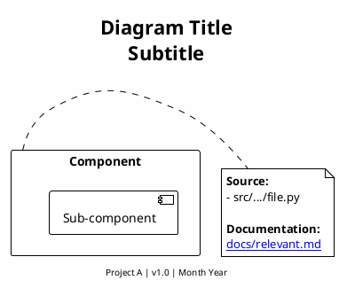

> **Purpose**: Centralized location for all production PlantUML diagrams with consistent standards, traceability, and maintenance guidelines.

## Quick Start

### Viewing Diagrams

```bash
# Generate PNG from all PUML files (requires PlantUML)
find docs/architecture/diagrams -name "*.puml" -exec plantuml {} \;

# Or use VS Code extension: "PlantUML" by jebbs
# Or online: https://www.plantuml.com/plantuml/uml/
```

### Making Changes

1. **Read this guide** before editing any diagram
2. **Follow the standards** documented in [STYLE_GUIDE.md](STYLE_GUIDE.md)
3. **Update traceability** in both the diagram and [INDEX.md](INDEX.md)
4. **Use the agent**: Invoke `diagram-maintenance-agent` for complex changes

---

## Folder Structure

All diagrams are organized by level in the diagram hierarchy:

```text
docs/architecture/diagrams/
├── README.md                    # This guide
├── INDEX.md                     # Complete diagram-to-source traceability
├── STYLE_GUIDE.md               # Styling and notation standards
│
├── level-0/                     # Pipeline Context
│   └── rag-pipeline-overview.puml
│
├── level-1/                     # Project A Architecture
│   ├── PROJECT_A_ARCHITECTURE_OVERVIEW.puml
│   └── PROJECT_A_WORKFLOW_HIERARCHY.puml
│
└── level-2/                     # Workstream Details
    ├── production-runtime/
    │   ├── project-a-primary-workflow-high-level.puml
    │   ├── project-a-primary-workflow-detailed.puml
    │   └── project-a-device-selection-flow.puml
    │
    ├── model-training/
    │   ├── project-a-distillation.puml
    │   └── project-a-training-workflow-high-level.puml
    │
    ├── data-preparation/
    │   ├── project-a-training-data-ingestion.puml
    │   └── automated-data-labeling-pipeline.puml
    │
    ├── pseudo-labeling/
    │   ├── diqa-pseudo-labeling-workflow.puml
    │   ├── diqa-training-phases.puml
    │   ├── diqa-checkpoint-selection.puml
    │   └── diqa-inference-pipeline.puml
    │
    ├── benchmarking/
    │   └── project-a-benchmark-workflow.puml
    │
    └── downstream-context/
        ├── project-b-ocr-layout-workflow.puml
        ├── project-c-fusion-chunking-workflow.puml
        └── project-d-vectorstore-workflow.puml
```

---

## Diagram Hierarchy

| Level | Scope | Location |
|-------|-------|----------|
| **Level 0** | Multi-project pipeline context | `level-0/` |
| **Level 1** | Project A system architecture | `level-1/` |
| **Level 2** | Workstream implementation details | `level-2/{workstream}/` |

### Level 0: Pipeline Context

The RAG document pipeline spans multiple repositories:

| Diagram | Purpose |
|---------|---------|
| [rag-pipeline-overview.puml](level-0/rag-pipeline-overview.puml) | Multi-track architecture (Document + Audio) |

### Level 1: Project A Architecture

High-level views of this repository's architecture:

| Diagram | Purpose |
|---------|---------|
| [PROJECT_A_ARCHITECTURE_OVERVIEW.puml](level-1/PROJECT_A_ARCHITECTURE_OVERVIEW.puml) | System components and workstreams |
| [PROJECT_A_WORKFLOW_HIERARCHY.puml](level-1/PROJECT_A_WORKFLOW_HIERARCHY.puml) | Swimlane data flow between workstreams |

### Level 2: Workstream Details

Detailed implementation diagrams organized by workstream:

| Workstream | Diagrams |
|------------|----------|
| **Production Runtime** | Primary workflow, device selection, runtime decisions |
| **Model Training** | Knowledge distillation, training lifecycle |
| **Data Preparation** | Dataset ingestion, labeling pipeline |
| **Pseudo-Labeling** | DIQA ensemble, training phases, checkpoint selection |
| **Benchmarking** | IQA model evaluation workflow |
| **Downstream Context** | Projects B, C, D context diagrams |

---

## Quick Reference: Diagram Standards

### Color Conventions

| Color | Meaning | Use For |
|-------|---------|---------|
| `#E8F5E9` | Production Runtime | Live system components |
| `#E3F2FD` | Model Training | Training workstream |
| `#FFF3E0` | Data Preparation | Dataset processing |
| `#F3E5F5` | Pseudo-Labeling | Label generation |
| `#FFEBEE` | External Systems | External repos/services |
| `#E0E0E0` | Not Yet Started | Planned components |

### Required Note Structure

Every component MUST include a traceability note:

```plantuml
:Component Name;
note right
  **Source:**
  - src/.../module/file.py

  **Scripts:**
  - scripts/related_script.py

  **Documentation:**
  [[docs/relevant_doc.md]]

  **ADR:**
  [[docs/ADRs/0000-decision.md]]
end note
```

### Linking Between Diagrams

Use PlantUML's link syntax with relative paths:

```plantuml
note right
  **Detailed:**
  [[level-2/production-runtime/project-a-primary-workflow-detailed.puml]]
end note
```

---

## Maintenance Workflow

### When to Update Diagrams

| Trigger | Action |
|---------|--------|
| Source file renamed/moved | Update all `**Source:**` notes |
| New component added | Add to appropriate diagram with full traceability |
| Scope change | Update component notes, add `**Scope Change:**` annotation |
| Sprint completion | Review and update all affected diagrams |
| New ADR created | Link from relevant components |

### Update Checklist

- [ ] Diagram syntax validates (no PlantUML errors)
- [ ] All components have traceability notes
- [ ] INDEX.md updated with new mappings
- [ ] Cross-references to other diagrams work
- [ ] Color scheme follows conventions
- [ ] Hierarchy note reflects current structure

### Using the Diagram Maintenance Agent

For complex changes, invoke the specialized agent:

```bash
# In Claude Code
@diagram-maintenance-agent "Add new component X to the architecture overview"
@diagram-maintenance-agent "Update traceability after refactoring detection module"
@diagram-maintenance-agent "Create detailed workflow for layout training"
```

---

## Creating New Diagrams

### Naming Convention

```text
{scope}-{topic}-{detail-level}.puml

Examples:
- project-a-primary-workflow-high-level.puml
- project-a-layout-training.puml
- diqa-inference-pipeline.puml
```

### Placement Rules

| Diagram Type | Location |
|--------------|----------|
| Multi-repo pipeline | `level-0/` |
| Project A architecture | `level-1/` |
| Workstream implementation | `level-2/{workstream}/` |

### Template



---

## Gap Tracking

Current identified gaps (from audit):

| Gap | Priority | Status |
|-----|----------|--------|
| Layout Model Training workflow | Critical | Not started |
| Celery Worker architecture | High | Not started |
| Monitoring & Drift Detection | Medium | Not started |
| Budget Enforcement details | Low | Partial |

See [AUDIT.md](../AUDIT.md) for full gap analysis and recommendations.

---

## Related Resources

| Resource | Purpose |
|----------|---------|
| [INDEX.md](INDEX.md) | Complete traceability matrix |
| [STYLE_GUIDE.md](STYLE_GUIDE.md) | Detailed styling standards |
| [AUDIT.md](../AUDIT.md) | Gap analysis and recommendations |
| [diagram-maintenance-agent](../../../.claude/agents/diagram-maintenance-agent.md) | Automated maintenance |
| [PlantUML Documentation](https://plantuml.com/) | Official reference |
