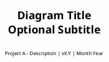
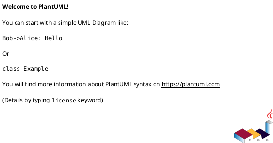

# PlantUML Style Guide

> **Purpose**: Comprehensive styling and notation standards for all Project A diagrams.

## File Structure

### Header Template



### Section Comments

Use consistent section markers:

```plantuml
' ============================================================================
' SECTION NAME
' ============================================================================
```

---

## Color Palette

### Workstream Colors

| Workstream | Hex Code | RGB | Usage |
|------------|----------|-----|-------|
| Production Runtime | `#E8F5E9` | 232, 245, 233 | Live system components |
| Model Training | `#E3F2FD` | 227, 242, 253 | Training pipeline |
| Data Preparation | `#FFF3E0` | 255, 243, 224 | Dataset processing |
| Pseudo-Labeling | `#F3E5F5` | 243, 229, 245 | Label generation |
| External Systems | `#FFEBEE` | 255, 235, 238 | External repos |
| Not Yet Started | `#E0E0E0` | 224, 224, 224 | Planned features |

### Status Colors

| Status | Hex Code | Usage |
|--------|----------|-------|
| Active/Complete | `#DCEDC8` | Completed components |
| In Progress | `#FFF9C4` | Currently developing |
| Blocked | `#FFCDD2` | Blocked items |

### Application

```plantuml
package "Package Name" as Pkg #E8F5E9 {
  [Component]
}

rectangle "Rectangle" as Rect #E3F2FD {
  [Sub-component]
}
```

---

## Component Notation

### Packages vs Rectangles

| Element | Use For | Example |
|---------|---------|---------|
| `package` | Major subsystems, workstreams | Production Runtime, Model Training |
| `rectangle` | Logical groupings within packages | Ingestion, Detection, Correction |
| `component` | Functional units | Document Processing Pipeline |
| `[Component]` | Individual elements | [Text Gate], [DQS Calculator] |

### Databases and Artifacts

```plantuml
database "Database Name" as DB {
  [Table1]
  [Table2]
}

artifact "Artifact Name" as Art {
  file "filename.ext"
}
```

### Ports

```plantuml
component "Pipeline" as Pipeline {
  portin "Input" as In
  portout "Output" as Out
}
```

---

## Note Standards

### Traceability Note Template

```plantuml
note right
  **Source:**
  - src/.../primary_file.py
  - src/.../secondary_file.py

  **Scripts:**
  - scripts/script_name.py
  - modal/modal_script.py

  **Documentation:**
  [[docs/api/relevant.md]]
  [[docs/guides/guide.md]]

  **ADR:**
  [[docs/ADRs/0000-decision.md]]

  **Workflow:**
  [[related-workflow.puml]]
end note
```

### Note Placement

| Diagram Type | Note Position |
|--------------|---------------|
| Activity diagrams | `note right` or `note left` |
| Component diagrams | `note right of Component` or `note bottom of Component` |
| Sequence diagrams | `note over Participant` |

### Conditional Notes

```plantuml
note right
  **Purpose:**
  Brief description

  **Scope Change:**
  What changed and why

  **GAP IDENTIFIED:**
  Missing documentation or workflow
end note
```

---

## Connection Standards

### Arrow Types

| Arrow | Meaning | Usage |
|-------|---------|-------|
| `-->` | Data flow | Primary data movement |
| `..>` | Dependency | Soft dependency |
| `==>` | Strong relationship | Critical path |
| `->` | Simple connection | Generic relationship |

### Labels

```plantuml
ComponentA --> ComponentB : Label describing\ndata or action
```

### Multi-line Labels

```plantuml
ComponentA --> ComponentB : First line\nSecond line\nThird line
```

---

## Activity Diagram Standards

### Swimlanes

```plantuml
|#E8F5E9|Lane Name|

|Lane Name|
:Action;
```

### Partitions

```plantuml
partition "Partition Name" {
  :Action 1;
  :Action 2;
}
```

### Branching

```plantuml
if (Condition?) then (yes)
  :Yes action;
else (no)
  :No action;
endif
```

### Parallel Execution

```plantuml
fork
  :Action A;
fork again
  :Action B;
fork again
  :Action C;
end fork
```

---

## Table Standards

### In-Note Tables

```plantuml
note as TableNote
  |= Column 1 |= Column 2 |= Column 3 |
  | Value 1 | Value 2 | Value 3 |
  | Value 4 | Value 5 | Value 6 |
end note
```

### Section Headers in Tables

```plantuml
|= Component |= Source |= Docs |
| **Section Name** |||
| Item 1 | src/file.py | docs/doc.md |
| Item 2 | src/file2.py | - |
```

---

## Path Abbreviation Rules

### Standard Abbreviations

| Full Path | Abbreviated |
|-----------|-------------|
| `src/image_preprocessing_detector/` | `src/.../` |
| `docs/ADRs/` | `docs/ADRs/` (keep full) |
| `docs/architecture/diagrams/` | `docs/.../diagrams/` |

### Glob Patterns

```plantuml
**Scripts:**
- scripts/download_*.py
- src/.../detection/*.py
- modal/*.py
```

### When to Use Full Paths

- ADR references (for clarity)
- External repository links
- Unique/important files

---

## Legend Standards

### Level 1 Diagrams

All Level 1 diagrams MUST include a color legend:

```plantuml
legend right
  |= Color |= Meaning |
  | <#E8F5E9> | Production Runtime |
  | <#E3F2FD> | Model Training |
  | <#FFF3E0> | Data Preparation |
  | <#F3E5F5> | Pseudo-Labeling |
  | <#FFEBEE> | External Systems |
  | <#E0E0E0> | Not Yet Started |
endlegend
```

### Hierarchy Notes

Level 1 diagrams MUST include a hierarchy note:

```plantuml
note as DiagramHierarchy
  **Diagram Hierarchy:**

  **Level 0: Context**
  └── rag-pipeline-overview.puml

  **Level 1: This Diagram**
  └── CURRENT_DIAGRAM.puml

  **Level 2: Details**
  ├── detail-workflow-1.puml
  └── detail-workflow-2.puml
end note
```

---

## Naming Conventions

### File Names

```text
{scope}-{topic}-{detail}.puml

scope: project-a, diqa, etc.
topic: primary-workflow, distillation, etc.
detail: high-level, detailed, test-coverage (optional)
```

### Internal Names



### Aliases

```plantuml
package "Long Package Name" as ShortAlias #E8F5E9 {
  component "Long Component Name" as CompAlias
}
```

---

## Validation Checklist

Before committing any diagram:

- [ ] **Syntax**: PlantUML renders without errors
- [ ] **Colors**: Follow workstream color conventions
- [ ] **Notes**: All components have traceability notes
- [ ] **Paths**: Use abbreviated path notation correctly
- [ ] **Links**: All `[[file.puml]]` references are valid
- [ ] **Legend**: Level 1 diagrams have color legend
- [ ] **Hierarchy**: Level 1 diagrams have hierarchy note
- [ ] **Footer**: Includes version and date
- [ ] **INDEX**: Updated with any new mappings

---

## Common Patterns

### External Repository Reference

```plantuml
rectangle "External Repo\n(repo-name)" as ExtRepo #FFEBEE {
  [Component]
}

note right of ExtRepo
  **Repository:**
  github.com/org/repo-name

  **Status:** In Development
end note
```

### Gap Annotation

```plantuml
note right
  **GAP IDENTIFIED:**
  No dedicated workflow diagram
  for this component

  **Recommendation:**
  Create detailed-workflow.puml
end note
```

### Scope Change Annotation

```plantuml
note right
  **Scope Change:**
  Component moved from Project B
  to Project A for efficiency

  **Impact:**
  - Added to architecture overview
  - Updated AB contract
end note
```

### Not Yet Started Component

```plantuml
rectangle "Future Component" as Future #E0E0E0 {
  [NOT YET STARTED]
}
```
