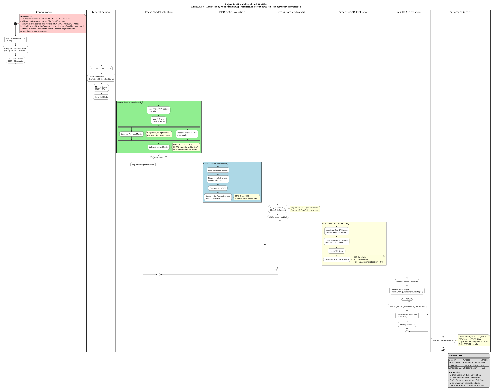

> ⚠️ **This document is deprecated as of 2025-01-16.**

**See [Model Arena & Multi-Label Benchmarking](../../level-2/model-arena/index.md) for current documentation.**

**Reason for Deprecation**: Model Arena expanded to include comprehensive multi-phase benchmarking infrastructure (Phase 1: Base Evaluation, Phase 2: Fine-Tuned Validation, Phase 3: Continuous Improvement) with full reproducibility, multiple inference backends, and automated leaderboard generation. This legacy doc contained only basic benchmark workflow diagrams.

---

## Legacy Content Below

This level provides detailed diagrams for the Benchmarking workstream - evaluating IQA model performance.

---

## Benchmark Workflow

Complete workflow for running IQA model benchmarks on DIQA-5000.

---

## Key Components

| Component | Source Files | Purpose |
|-----------|--------------|---------|
| Arena Benchmark | `modal/arena_benchmark.py` | Multi-model evaluation |
| Benchmark Runner | `scripts/run_model_benchmark.py` | Local benchmark execution |
| Results Analysis | `docs/benchmarks/` | Performance reports |

---

## Benchmark Metrics

| Metric | Description |
|--------|-------------|
| SRCC | Spearman Rank Correlation Coefficient |
| PLCC | Pearson Linear Correlation Coefficient |
| ECE | Expected Calibration Error |
| Latency | Inference time per image |

---

## Related Diagrams

| Level | Diagram | Description |
|-------|---------|-------------|
| **Level 1** | [Project A Architecture](../../level-1/index.md) | System architecture |
| **Level 2** | [Model Training](../model-training/index.md) | Training pipeline |
| **Level 2** | [Pseudo-Labeling](../pseudo-labeling/index.md) | Label generation |
