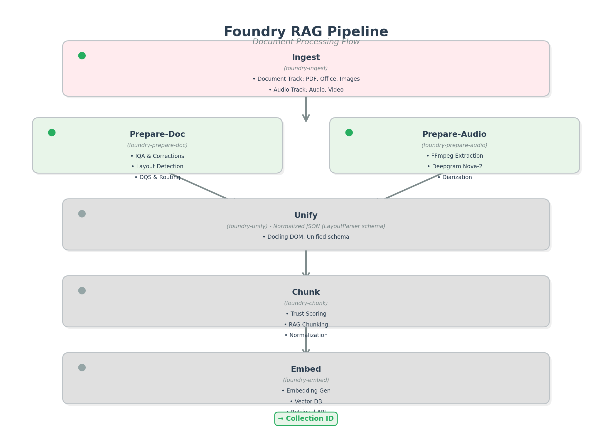
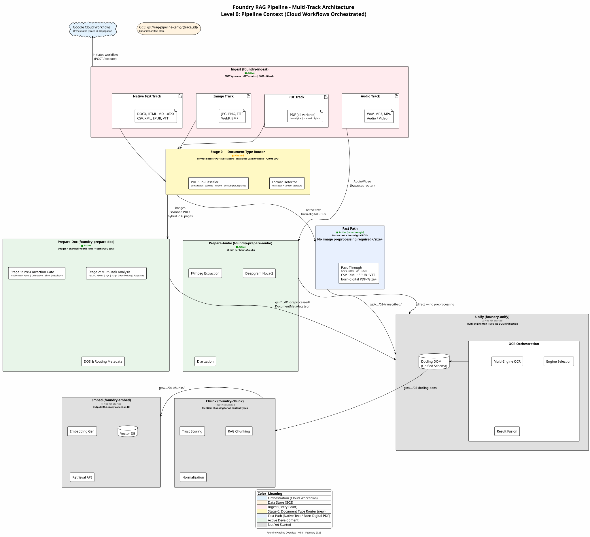

This level provides the highest-level view of the RAG document pipeline, showing how multiple projects work together.

---

## Pipeline Visual



*AI-generated architecture illustration showing the multi-track RAG pipeline.*

---

## Technical Diagram



*PlantUML source: [`rag-pipeline-overview.puml`](rag-pipeline-overview.puml)*

---

## RAG Pipeline Overview

The RAG document pipeline is a multi-track architecture supporting both document and audio content processing.

### Key Components

| Short Name | Repository | Status | Purpose |
|------------|------------|--------|---------|
| **Ingest** | `foundry-ingest` | Active | Web UI frontend, file upload, workflow trigger |
| **Prepare-Doc** | `foundry-prepare-doc` | Active | IQA, corrections, layout, routing |
| **Prepare-Audio** | `foundry-prepare-audio` | Active | Transcription, diarization |
| **Unify** | `foundry-unify` | Not Started | Multi-engine OCR, Docling DOM unification |
| **Chunk** | `foundry-chunk` | Not Started | Trust scoring, RAG chunking |
| **Embed** | `foundry-embed` | Not Started | Embeddings, vector store |

### Data Flow

```text
Document Track: Ingest -> Prepare-Doc -> Unify (OCR) -> Chunk -> Embed
Audio Track:    Ingest -> Prepare-Audio -> Unify (DOM only) -> Chunk -> Embed
```

1. **Ingestion**: Ingest receives file, generates `trace_id`, uploads to GCS
2. **Routing**: Cloud Workflows routes to appropriate preprocessing track
3. **Document Track**:
   - **Prepare-Doc**: IQA analysis, corrections, layout detection
   - **Unify**: Multi-engine OCR -> Docling DOM
4. **Audio Track**:
   - **Prepare-Audio**: Transcription, diarization
   - **Unify**: Transcript -> Docling DOM (no OCR, DOM unification only)
5. **Chunking**: Chunk receives Docling DOM from either track, applies trust scoring, RAG chunking
6. **Embedding**: Embed generates embeddings, stores in vector database
7. **Completion**: `trace_id` and `collection_id` returned to Ingest

> **Note**: Both tracks converge at Unify for Docling DOM unification. This ensures consistent chunking format and metadata schema regardless of input type (document vs. audio).

---

## Level 1: Project Descriptions

Each Level 0 box represents a distinct project with its own repository, architecture, and team. Detailed descriptions below define the boundaries and responsibilities.

### Ingest (foundry-ingest)

The Ingest service is the user-facing entry point for the entire RAG pipeline. It provides a web UI for file upload supporting documents (PDF, Office, Images) and audio/video content. When a file is uploaded, Ingest uploads the source file to GCS, then **initiates** the appropriate Cloud Workflow execution passing the GCS URI and file type. Cloud Workflows generates a unique `trace_id` (workflow execution ID) that follows the document through every downstream service.

Key responsibilities include input validation, file type detection, user authentication, and job status tracking. The service exposes REST endpoints (`POST /process`, `GET /status/{trace_id}`) and maintains a job queue that can handle 1000+ files per hour. Ingest is the only service with direct user interaction - all other services are internal processing components.

### Prepare-Doc (foundry-prepare-doc)

Prepare-Doc is the document preprocessing and quality assurance gateway. It receives raw document images from Ingest and performs comprehensive multi-task ML analysis using a two-model pipeline: MobileNetV4-Conv-S (~3ms, 3 heads for orientation, skew, resolution quality) for pre-correction decisions, followed by SigLIP 2 NAFlex (~50ms, 16 heads across 5 groups: IQA, Script, Orientation+Skew, Handwriting, Page Attributes) for full analysis. Classical CV detectors for skew, blur, contrast, noise, and other degradations provide confidence-based fallback. Based on quality scores, it applies automatic corrections including deskewing, CLAHE enhancement, sharpening, and denoising.

Beyond quality, Prepare-Doc performs layout-lite detection to identify coarse page attributes (tables, figures, dense math, handwriting) and classifies PDF type (born-digital, image-only, hybrid). These signals feed into the Document Quality Score (DQS) calculator, which produces routing recommendations (`OCR_FAST`, `OCR_ADVANCED`, `VISION_SIMPLE`, `VISION_STRUCTURED`) that tell Unify which OCR strategy to use. Output includes corrected 300 DPI page images and `DocumentMetadata.json` containing all quality metrics and routing decisions.

### Prepare-Audio (foundry-prepare-audio)

Prepare-Audio handles all audio and video content, extracting speech and converting it to structured text. The service uses FFmpeg for audio extraction from video containers, then sends audio to Deepgram Nova-2 for high-accuracy transcription. Speaker diarization identifies and labels different speakers throughout the recording, producing timestamped segments with speaker attribution.

The output is `TranscriptMetadata.json` containing the full transcript with word-level timestamps, speaker labels, confidence scores, and audio quality metrics. This structured transcript then flows to Unify - not for OCR (there's no text to recognize in images) but for DOM unification. This ensures that audio-derived content gets the same Docling DOM schema treatment as document-derived content, enabling consistent downstream processing.

### Unify (foundry-unify)

Unify is the convergence point for both document and audio tracks, and its primary purpose is creating a unified Docling DOM representation regardless of input source. For the document track, Unify performs multi-engine OCR orchestration - selecting engines based on Prepare-Doc's routing recommendations and fusing results from multiple OCR passes. For the audio track, Unify transforms the transcript into the same DOM schema without performing OCR.

The Docling DOM is the critical data structure that enables consistent downstream processing. It provides a unified schema for text content, tables, figures, and metadata with reading order annotations and source attribution (page numbers, bounding boxes, timestamps). By routing both tracks through Unify, the pipeline guarantees that Chunk receives identically-structured input whether the source was a scanned PDF or a podcast recording. This architectural decision eliminates the need for Chunk to handle multiple input formats.

### Chunk (foundry-chunk)

Chunk transforms the unified Docling DOM into RAG-optimized text segments ready for embedding. It applies trust scoring to evaluate content reliability based on OCR confidence, source quality metrics from Prepare-Doc, and structural coherence signals from Unify. Low-trust content can be flagged for human review or processed with reduced retrieval weight.

The chunking algorithm produces semantically coherent text segments that respect document structure — avoiding splits mid-sentence or mid-paragraph — while maintaining consistent token counts. Each chunk carries full source traceability: document → page → element → chunk, enabling precise citation in RAG responses. Output is `RAGChunkSet.json` containing all chunks with trust scores, `ocr_engine_provenance`, source attribution, and semantic boundaries. See [chunk-embed-contract.md](../../../../development/RAG%20Pipeline/chunk-embed-contract.md) for the mandatory contract all downstream embedding implementations must satisfy.

**Source codebase**: `williaby/data_ingestor` — working implementations of TokenChunker, ByTitleChunker, DocumentRouter, and DocLayNet evaluation harness. Transition to `foundry-chunk` is planned after Prepare-Doc SigLIP 2 training stabilizes (Tier 3 dependency). Trust scoring and GCS artifact I/O are new work not yet built.

### Application Embedding (per-application)

Embedding is **not a shared foundry service** — each AI application that uses this pipeline implements its own embedding component, tailored to its retrieval needs. However, all embedding implementations MUST conform to the mandatory contract defined in [chunk-embed-contract.md](../../../../development/RAG%20Pipeline/chunk-embed-contract.md).

The contract requires that every embedding implementation:

- Accepts `RAGChunkSet.json` from Chunk (at `gs://rag-pipeline-{env}/{trace_id}/04-chunks/`)
- Preserves `chunk_id` as a searchable/filterable field in its vector store
- Preserves `trust_score` as metadata for retrieval quality filtering
- Preserves `ocr_engine_provenance` for audit and debugging
- Preserves `document_id` and `trace_id` for cross-service traceability

Within those constraints, each application is free to choose its own embedding model (OpenAI, Cohere, custom), vector dimensions, vector database (Qdrant, Pinecone, Weaviate, pgvector), similarity metric, and chunk selection strategy.

The Level 2 diagram [Chunk → Application Embedding Contract Workflow](../level-2/downstream-context/index.md) is the authoritative interface specification. The collection identifier returned by each application's embedding process is what Ingest surfaces to users for subsequent RAG queries against that document set.

---

## Diagram Hierarchy

This Level 0 diagram establishes the pipeline context. Each box on this diagram corresponds to a Level 1 index file in the respective project repository:

| Level 0 Box | Level 1 Location | Repository |
|-------------|------------------|------------|
| **Ingest** | `foundry-ingest/docs/architecture/diagrams/level-1/index.md` | [ByronWilliamsCPA/rag-processor](https://github.com/ByronWilliamsCPA/rag-processor) |
| **Prepare-Doc** | [level-1/index.md](../level-1/index.md) | This repo (`image_detection`) |
| **Prepare-Audio** | `foundry-prepare-audio/docs/architecture/diagrams/level-1/index.md` | [ByronWilliamsCPA/audio-processor](https://github.com/ByronWilliamsCPA/audio-processor) |
| **Unify** | `foundry-unify/docs/architecture/diagrams/level-1/index.md` | TBD |
| **Chunk** | `foundry-chunk/docs/architecture/diagrams/level-1/index.md` | [williaby/data_ingestor](https://github.com/williaby/data_ingestor) (planned refactor → `foundry-chunk`) |
| **Embed** | *(per-application — no shared foundry service)* | N/A — each AI app implements per `chunk-embed-contract.md` |

Each Level 1 diagram then drills down into component boxes that map to Level 2 index files within that project.

---

## Architectural Principles

Core design decisions that govern all projects in the pipeline:

### Communication & Orchestration

| Principle | Decision | Rationale |
|-----------|----------|-----------|
| **Orchestration** | Google Cloud Workflows | Centralized pipeline logic, visual execution tracking, built-in retry/error handling |
| **Service Runtime** | Cloud Run | Serverless, autoscaling, pay-per-use |
| **Data Transfer** | GCS URIs (by reference) | Never pass large blobs inline; all artifacts stored in GCS |
| **Traceability** | `trace_id` propagation | Workflow execution ID serves as correlation ID across all services |

### Data Management

| Principle | Decision | Rationale |
|-----------|----------|-----------|
| **Canonical Store** | Google Cloud Storage (GCS) | Durable, scalable, native GCP integration |
| **Artifact Structure** | `gs://bucket/{trace_id}/{stage}/` | Clear separation by processing stage |
| **Vector Storage** | Per-deployment Vector DB | Each Embed instance owns its vector database |

### Service Design

| Principle | Decision | Rationale |
|-----------|----------|-----------|
| **Stateless Services** | Required | Enables horizontal scaling, simplifies recovery |
| **Observability** | Structured logging + trace_id | End-to-end request tracing across 6 projects |
| **Error Handling** | Cloud Workflows retry policies | Exponential backoff, dead-letter patterns |

---

## Security & Compliance Principles

Security and compliance controls applied across all pipeline services:

| Aspect | Decision | Rationale |
|--------|----------|-----------|
| **Service Authentication** | Workload Identity (GCP) | Service-to-service auth without key management, automatic credential rotation |
| **Data Encryption** | At-rest: Google-managed keys<br>In-transit: TLS 1.3+ | Automatic encryption, minimal performance overhead |
| **Secrets Management** | Secret Manager | API keys (Deepgram), database credentials, OAuth tokens |
| **Audit Logging** | Cloud Audit Logs | `trace_id` in all log entries for end-to-end correlation |
| **Data Classification** | Internal use only (initial scope) | No PII/PHI in initial release; GDPR/HIPAA compliance deferred to Phase 11 |
| **Access Controls** | Least-privilege IAM | Service accounts per project, no shared credentials |
| **Ingress Controls** | Private endpoints (Cloud Run) | Only Ingest has public endpoint; all internal services use VPC |

---

## Schema Versioning Strategy

JSON artifact schemas follow semantic versioning with explicit version fields:

| Principle | Implementation | Example |
|-----------|----------------|---------|
| **Semantic Versioning** | MAJOR.MINOR.PATCH | `DocumentMetadata` v2.0.0 |
| **Version Field** | Required in all JSON artifacts | `"schema_version": "2.0.0"` |
| **Breaking Changes** | MAJOR bump, all consumers must update | Adding required field, changing field type |
| **Non-Breaking** | MINOR bump, optional fields with defaults | Adding `vlm_validation` object |
| **Bug Fixes** | PATCH bump, no schema changes | Correcting documentation, fixing validation |
| **Deprecation Policy** | 90-day notice, compatibility window | Announce in contract doc, maintain old version |
| **Package Versioning** | Automatic via semantic-release | Python package version != schema version |

**Schema vs Package Versioning:**

- **Python Package** (e.g., `foundry-prepare-doc==0.3.5`): Versioned automatically by [semantic-release workflow](../../../.github/workflows/release.yml) using Conventional Commits
  - `feat:` commits -> MINOR bump (0.X.0)
  - `fix:` commits -> PATCH bump (0.0.X)
  - `feat!:` or `fix!:` -> MAJOR bump (X.0.0)
- **JSON Schemas** (e.g., `DocumentMetadata` v2.0.0): Versioned explicitly in contract documents when interface changes
  - Schema versions may increment independently of package versions
  - Example: Package `0.4.0` may still output `DocumentMetadata` v2.0.0 if schema hasn't changed

---

## Operational Principles

High-level operational patterns applied across all services:

| Aspect | Decision | Rationale |
|--------|----------|-----------|
| **Monitoring** | Centralized via Cloud Monitoring | `trace_id` correlation across services, unified dashboards |
| **Alerting** | Per-service SLO violations | Project owners notified via PagerDuty integration |
| **Deployment** | Blue/green via Cloud Run revisions | Zero-downtime updates, instant rollback on failure |
| **Error Handling** | Dead Letter Queue (DLQ) for retries | Failed jobs move to DLQ after 3 retries (exponential backoff) |
| **Observability** | Structured logs (JSON), `trace_id` required | End-to-end request tracing, automated log aggregation |
| **Idempotency** | Required for all processing endpoints | Services can safely retry; same input -> same output |
| **Performance SLOs** | See [Performance Targets](#performance-targets) | Per-stage latency targets defined below |

**Detailed operational specs** (monitoring dashboards, alerting thresholds, runbooks) live in project-level docs.

---

## Project Name Mapping

Standardized naming across documentation, repositories, and code:

| Legacy ID | Service Name | Repository | Primary Function | Level 1 Diagram |
|-----------|--------------|------------|------------------|-----------------|
| ~~Project A~~ | **Prepare-Doc** | `foundry-prepare-doc` | Visual quality, corrections, routing metadata (THIS REPO) | [Level 1](../level-1/index.md) |
| ~~Project B~~ | **Unify** | `foundry-unify` | Multi-engine OCR, Docling DOM unification | TBD |
| ~~Project C~~ | **Chunk** | `foundry-chunk` | Semantic chunking, trust scoring (source: `data_ingestor`) | TBD |
| ~~Project D~~ | **Embed** | *(application-specific)* | Per-app embedding — not a shared foundry service | TBD |
| ~~Project E~~ | **Prepare-Audio** | `foundry-prepare-audio` | Audio transcription, speaker diarization | TBD |
| ~~Project F~~ | **Ingest** | `foundry-ingest` | Web UI, file upload, Cloud Workflows triggering | TBD |

**Naming Conventions:**

- **Use in Documentation**: Service names (`Prepare-Doc`, `Unify`) - NOT legacy IDs
- **Use in Code**: Repository names (`foundry-prepare-doc`) or snake_case modules
- **Legacy IDs**: Retained in historical planning docs only (~~strikethrough~~ to indicate deprecated)
- **GCS Paths**: Use stage numbers (`01-preprocessed`) not service names for clarity

---

## Completion Signal Strategy

The pipeline uses **polling** for completion notification due to long-running processing times (2-5 minutes for typical documents):

**Primary Method: Status Polling**

| Aspect | Implementation |
|--------|----------------|
| **Status Endpoint** | `GET /status/{trace_id}` exposed by Ingest |
| **Polling Frequency** | 5s initially, exponential backoff to 30s maximum |
| **Status Values** | `pending`, `processing`, `completed`, `failed` |
| **Completion Data** | `{status: "completed", collection_id: "...", artifacts: [...]}` |

**Why Polling (Not Push):**

1. **Long-Running Processes**: 2-5 minute pipeline duration exceeds reasonable HTTP connection timeout
2. **Client Resilience**: Users can refresh browser or check status from different device without losing progress
3. **Simplified Architecture**: No webhook retry logic, DLQ for failed callbacks, or endpoint availability monitoring
4. **Workflow State Persistence**: Cloud Workflows execution state stored in GCS via `trace_id` artifacts

**Optional Enhancement (Future):**

- Embed can POST completion webhook to `Ingest /webhook/completion` for immediate notification
- Fire-and-forget pattern: If webhook fails, Ingest still discovers completion via polling
- Reduces user-perceived latency for fast-path documents (<1 minute processing)

---

## Performance Targets

| Stage | Target | Notes |
|-------|--------|-------|
| Prepare-Doc (10-page PDF) | < 30s p95 | Born-digital baseline |
| Prepare-Doc (100-page PDF) | < 2min p95 | Scanned document baseline |
| Prepare-Audio | < 1 min/hr audio | Transcription + diarization |
| End-to-end (born-digital) | 1000 files/hr | 10-page average |
| End-to-end (scanned) | 200 files/hr | OCR-heavy processing |

### Performance Degradation Scenarios

Understanding how the pipeline degrades under stress or partial failures:

| Scenario | Pipeline Impact | Detection | Mitigation |
|----------|-----------------|-----------|------------|
| **Prepare-Doc compute budget exhausted** | CPU-only mode: 2-5x latency increase, lower IQA accuracy | Budget alerts, metrics | Auto-scaling, budget increase, queue prioritization |
| **Prepare-Doc Modal GPU unavailable** | Circuit breaker triggers CPU fallback | Health checks, error rates | Automatic fallback, alert on sustained outage |
| **Unify layout detection failure** | Spatial fallback chunking (lower quality) | Low `layout_confidence` scores | Trust scores reflect degradation, flag for review |
| **Unify OCR engine timeout** | Fallback to secondary engine | Engine-specific latency metrics | Engine rotation, deadline extension |
| **Chunk OCR fusion high divergence** | Low-confidence chunks flagged | `fusion_divergence_score` > 0.5 | Embed weights retrieval accordingly |
| **Embed vector DB overload** | Query latency increase, ingestion backpressure | P95 latency, queue depth | Read replicas, auto-scaling, rate limiting |
| **GCS regional outage** | Pipeline halts for affected trace_ids | GCP status, error rates | Multi-region bucket replication (future) |

**Degradation Principles:**

1. **Graceful Fallback**: Each service has fallback modes that maintain functionality at reduced quality
2. **Trust Propagation**: Quality degradation signals flow downstream via trust scores and confidence metrics
3. **Observability**: All degradation scenarios are detectable via metrics and structured logs
4. **No Silent Failures**: Degraded processing is always flagged in output metadata

---

## Data Management

### GCS Bucket Structure

All processing artifacts are stored in GCS with a consistent directory structure:

```text
gs://rag-pipeline-{env}/
+-- {trace_id}/
|   +-- 00-source/                    # Original uploaded file
|   |   +-- document.pdf
|   +-- 01-preprocessed/              # Prepare-Doc output
|   |   +-- DocumentMetadata.json
|   |   +-- page_001.png
|   |   +-- page_002.png
|   |   +-- ...
|   +-- 02-transcribed/               # Prepare-Audio output (audio track only)
|   |   +-- TranscriptMetadata.json
|   +-- 03-docling-dom/               # Unify output
|   |   +-- DoclingDOM.json
|   +-- 04-chunks/                    # Chunk output
|   |   +-- ChunkSet.json
|   +-- 05-embeddings/                # Embed metadata (vectors in DB)
|       +-- EmbeddingManifest.json
```

### Artifact Lifecycle

| Stage | Producer | Consumer | Retention |
|-------|----------|----------|-----------|
| `00-source` | Ingest | Prepare-Doc / Prepare-Audio | 30 days |
| `01-preprocessed` | Prepare-Doc | Unify | 7 days |
| `02-transcribed` | Prepare-Audio | Unify | 7 days |
| `03-docling-dom` | Unify | Chunk | 7 days |
| `04-chunks` | Chunk | Embed | 7 days |
| `05-embeddings` | Embed | - | 90 days |

---

## Contract Documents

Each project boundary has formal contract documentation defining inputs, outputs, and interface specifications.

### Functional/Non-Functional Requirements

| Service | Document | Description |
|---------|----------|-------------|
| **Prepare-Doc** | [prepare-doc-f-nf.md](../../../development/RAG%20Pipeline/prepare-doc-f-nf.md) | Preprocessing, IQA, layout requirements |
| **Unify** | [unify-f-nf.md](../../../development/RAG%20Pipeline/unify-f-nf.md) | OCR orchestration, DOM unification requirements |
| **Chunk** | [chunk-f-nf.md](../../../development/RAG%20Pipeline/chunk-f-nf.md) | Trust scoring and chunking requirements |
| **Embed** | TBD | Embedding and vector store requirements |

### Inter-Project Contracts

| Contract | Document | Status | Description |
|----------|----------|--------|-------------|
| **Ingest -> Prepare-Doc** | [ingest-prepare-doc-contract.md](../../../development/RAG%20Pipeline/ingest-prepare-doc-contract.md) | Defined | ProcessingRequest, callbacks, job lifecycle, security |
| **Prepare-Doc -> Unify** | [prepare-doc-unify-contract.md](../../../development/RAG%20Pipeline/prepare-doc-unify-contract.md) | Defined | DocumentMetadata.json, corrected image URIs, routing |
| **Prepare-Audio -> Unify** | TBD | To Be Defined | TranscriptMetadata.json schema, speaker segments |
| **Unify -> Chunk** | TBD | To Be Defined | Docling DOM schema, page-level metadata |
| **Chunk -> Embed** | TBD | To Be Defined | ChunkSet schema, source attribution metadata |

### Contract Summary

**Prepare-Doc outputs to Unify:**

- `DocumentMetadata.json` - Quality scores, layout summary, routing recommendation
- Corrected page images (PNG/JPEG) - Deskewed, enhanced, 300 DPI normalized
- `pdf_type` enum - `image_only`, `born_digital`, `hybrid`
- `ocr_routing_recommendation` - `OCR_FAST`, `OCR_ADVANCED`, `VISION_SIMPLE`, `VISION_STRUCTURED`

**Prepare-Audio outputs to Unify:**

- `TranscriptMetadata.json` - Full transcript with timestamps, speaker diarization
- Audio segments (if chunked) - Speaker-separated audio files

**Unify outputs to Chunk:**

- `DoclingDOM.json` - Unified document schema (text, tables, figures, metadata)
- Reading order annotations
- Source attribution (page numbers, bounding boxes, timestamps)

**Chunk outputs to Embed:**

- `ChunkSet.json` - RAG-optimized text chunks with overlap
- Trust scores per chunk
- Source traceability (document -> page -> element -> chunk)

---

## Related Diagrams

| Level | Diagram | Description |
|-------|---------|-------------|
| **Level 1** | [PREPARE_DOC_ARCHITECTURE_OVERVIEW](../level-1/index.md) | Prepare-Doc internal architecture |
| **Level 2** | [Production Runtime](../level-2/production-runtime/index.md) | Runtime workflow details |
| **Level 2** | [Model Training](../level-2/model-training/index.md) | Training pipeline |

---

## Source Files

- **Visual**: [`rag-pipeline-visual.png`](rag-pipeline-visual.png) - AI-generated architecture illustration
- **PlantUML**: [`rag-pipeline-overview.puml`](rag-pipeline-overview.puml) - Technical diagram source
- **Documentation**: [RAG Pipeline Project Overview](../../../development/RAG%20Pipeline/RAG-pipeline-project-overview.md)
