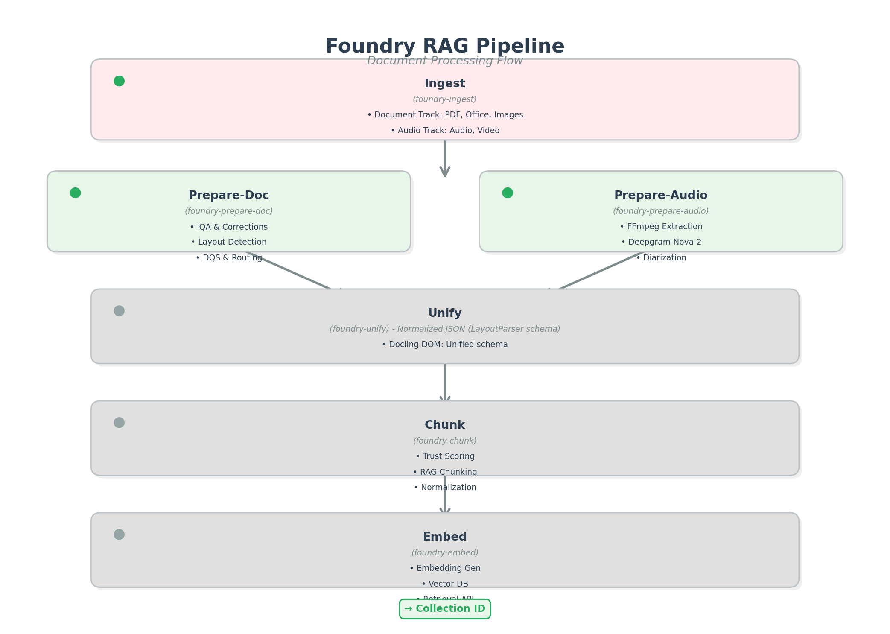
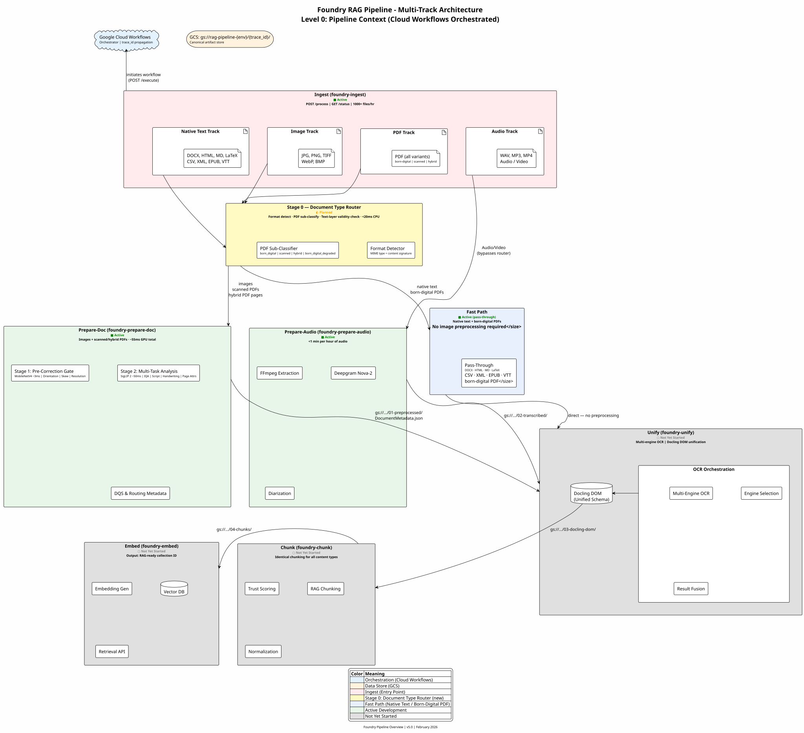

This level provides the highest-level view of the RAG document pipeline, showing how multiple projects work together.

> **Canonical page**: [pipeline-level-0.md](../../pipeline-level-0.md) is the short Level 0 explanation kept identical in
> all five pipeline repositories. This page adds depth. Where they differ, the canonical page wins. The pipeline ends at
> chunks; embedding, vector storage and search belong to each consuming application.

---

## Pipeline Visual



*AI-generated architecture illustration showing the multi-track RAG pipeline.*

---

## Technical Diagram



*PlantUML source: [`rag-pipeline-overview.puml`](rag-pipeline-overview.puml)*

---

## RAG Pipeline Overview

The RAG document pipeline is a multi-track architecture supporting both document and audio content processing.

### Key Components

| Short Name | Repository | Status | Purpose |
|------------|------------|--------|---------|
| **Ingest** | [`rag-processor`](https://github.com/ByronWilliamsCPA/rag-processor) | Active | Web UI frontend, file upload; routes audio/video directly to Prepare-Audio and all other types to Prepare-Doc |
| **Prepare-Doc** | [`image-preprocessing-detector`](https://github.com/williaby/image-preprocessing-detector) | Active | Stage 0 document type routing, track assignment, IQA, corrections, layout, routing metadata (THIS REPO) |
| **Prepare-Audio** | [`audio-processor`](https://github.com/ByronWilliamsCPA/audio-processor) | Active | Transcription, diarization |
| **Unify** | [`Unify`](https://github.com/ByronWilliamsCPA/Unify) | Scaffolding (CI/CD ready, domain logic pending) | OCR through docling-serve (specialist engines later), Docling DOM unification |
| **Chunk** | [`data_ingestor`](https://github.com/williaby/data_ingestor) | Active (refactor pending) | Trust scoring, RAG chunking |
| **Embed** | *(outside the pipeline)* | N/A | Each downstream application embeds, stores and searches chunks per [chunk-embed-contract.md](../../../development/RAG%20Pipeline/chunk-embed-contract.md) |

### Data Flow

```text
Audio/Video: Ingest -[audio]-> Prepare-Audio -> Unify (DOM only) -> Chunk -> [applications embed]
All others:  Ingest -[others]-> Prepare-Doc (Stage 0 → track assignment → ML) -> Unify (OCR) -> Chunk -> [applications embed]
```

1. **Ingestion**: Ingest receives any file, generates `trace_id`, stores to GCS raw, detects audio vs. non-audio:
   - **Audio / Video** (WAV, MP3, MP4) → Prepare-Audio directly — bypasses Stage 0 entirely
   - **Everything else** (native text, images, PDFs) → Prepare-Doc (enters at Stage 0)
2. **Prepare-Doc** (document track) — first step is Stage 0:
   - **Stage 0 — Document Type Router**: MIME detect, PDF sub-classify, text-layer validity (<20ms CPU); assigns to `native_text`, `image_only`, `born_digital`, `scanned`, or `hybrid` track
   - **ML analysis**: MobileNetV4 pre-correction gate, SigLIP 2 multi-task analysis
   - **Corrections & scoring**: deskew, CLAHE, DQS calculation, routing recommendations
3. **Prepare-Audio** (audio track):
   - **Transcription + diarization** (FFmpeg + Deepgram Nova-2)
4. **Unify**: Both tracks converge — OCR → Docling DOM (document) or Transcript → Docling DOM (audio)
5. **Chunking**: Chunk receives Docling DOM, applies trust scoring, RAG chunking
6. **Applications** (outside the pipeline): each consuming application reads `RAGChunkSet.json`, embeds it, and stores vectors in its own database
7. **Completion**: `trace_id` and the artifact list are returned to Ingest when Chunk has written `04-chunks/`; an application may report its own collection identifier

> **Note**: Both tracks converge at Unify for Docling DOM unification. This ensures consistent chunking format and metadata schema regardless of input type (document vs. audio).

---

## Level 1: Stage Descriptions

Each Level 0 box represents a distinct stage with its own repository, architecture, and team. Detailed descriptions below define the boundaries and responsibilities.

### Ingest (rag-processor)

The Ingest service is the user-facing entry point for the entire RAG pipeline. It provides a web UI for file upload supporting any file type — documents (PDF, Office, Images), audio, and video. When a file is uploaded, Ingest uploads the source file to GCS raw storage and performs a simple file type check to route to the correct processing service:

| File Type | Examples | Routed To |
|-----------|----------|-----------|
| **Audio / Video** | WAV, MP3, MP4 | → Prepare-Audio **directly** (bypasses Stage 0) |
| **Everything else** | DOCX, HTML, JPG, PNG, PDF (all), etc. | → Prepare-Doc (enters at Stage 0) |

The service exposes REST endpoints (`POST /process`, `GET /status/{trace_id}`) and maintains a job queue that can handle 1000+ files per hour. Cloud Workflows generates a unique `trace_id` that follows the file through every downstream service. Ingest is the only service with direct user interaction — all other services are internal processing components.

### Prepare-Doc (image_detection)

Prepare-Doc is the document preprocessing and quality assurance gateway. It receives all non-audio files from Ingest. Its first internal step is **Stage 0 — the Document Type Router** — which detects the file format and classifies the file into one of five processing tracks:

| Track | Input Type | Processing Path |
|-------|-----------|-----------------|
| `native_text` | DOCX, HTML, MD, LaTeX, CSV, XML, EPUB, VTT | Minimal processing (no image analysis) |
| `image_only` | JPG, PNG, TIFF, WebP, BMP | Full IQA + correction pipeline |
| `born_digital` | Born-digital PDF | Text-layer extraction + optional IQA |
| `scanned` | Scanned PDF | Full IQA + OCR routing for all pages |
| `hybrid` | Hybrid PDF | Mixed per-page routing |

After track assignment, Prepare-Doc performs comprehensive multi-task ML analysis using a two-model pipeline: MobileNetV4-Conv-S (~3ms, 3 heads for orientation, skew, resolution quality) for pre-correction decisions, followed by SigLIP 2 NAFlex (~50ms, 16 heads across 5 groups: IQA, Script, Orientation+Skew, Handwriting, Page Attributes) for full analysis. Classical CV detectors for skew, blur, contrast, noise, and other degradations provide confidence-based fallback. Based on quality scores, it applies automatic corrections including deskewing, CLAHE enhancement, sharpening, and denoising.

Beyond quality, Prepare-Doc performs layout-lite detection to identify coarse page attributes (tables, figures, dense math, handwriting) and classifies PDF type (born-digital, image-only, hybrid). These signals feed into the Document Quality Score (DQS) calculator, which produces routing recommendations (`OCR_FAST`, `OCR_ADVANCED`, `VISION_SIMPLE`, `VISION_STRUCTURED`) that tell Unify which OCR strategy to use. Output includes corrected 300 DPI page images and `DocumentMetadata.json` containing all quality metrics and routing decisions.

### Prepare-Audio (audio-processor)

Prepare-Audio handles all audio and video content, extracting speech and converting it to structured text. The service uses FFmpeg for audio extraction from video containers, then sends audio to Deepgram Nova-2 for high-accuracy transcription. Speaker diarization identifies and labels different speakers throughout the recording, producing timestamped segments with speaker attribution.

The output is `TranscriptMetadata.json` containing the full transcript with word-level timestamps, speaker labels, confidence scores, and audio quality metrics. This structured transcript then flows to Unify - not for OCR (there's no text to recognize in images) but for DOM unification. This ensures that audio-derived content gets the same Docling DOM schema treatment as document-derived content, enabling consistent downstream processing.

### Unify (Unify)

Unify is the convergence point for both document and audio tracks, and its primary purpose is creating a unified Docling DOM representation regardless of input source. For the document track, Unify runs OCR through docling-serve, using Prepare-Doc's routing recommendations to set parameters. Specialist engines are a later phase (Unify design spec, phases B3 and B4); fusing multi-engine output remains Chunk's job per [ADR-0029](../../../ADRs/0029-prepare-doc-scope-boundaries.md). For the audio track, Unify transforms the transcript into the same DOM schema without performing OCR.

The Docling DOM is the critical data structure that enables consistent downstream processing. It provides a unified schema for text content, tables, figures, and metadata with reading order annotations and source attribution (page numbers, bounding boxes, timestamps). By routing both tracks through Unify, the pipeline guarantees that Chunk receives identically-structured input whether the source was a scanned PDF or a podcast recording. This architectural decision eliminates the need for Chunk to handle multiple input formats.

### Chunk (data_ingestor)

Chunk transforms the unified Docling DOM into RAG-optimized text segments ready for embedding. It applies trust scoring to evaluate content reliability based on OCR confidence, source quality metrics from Prepare-Doc, and structural coherence signals from Unify. Low-trust content can be flagged for human review or processed with reduced retrieval weight.

The chunking algorithm produces semantically coherent text segments that respect document structure, avoiding splits mid-sentence or mid-paragraph, while maintaining consistent token counts. Each chunk carries full source traceability: document → page → element → chunk, enabling precise citation in RAG responses. Output is `RAGChunkSet.json` containing all chunks with trust scores, `ocr_engine_provenance`, source attribution, and semantic boundaries. See [chunk-embed-contract.md](../../../development/RAG%20Pipeline/chunk-embed-contract.md) for the mandatory contract all downstream embedding implementations must satisfy.

**Repository**: [`williaby/data_ingestor`](https://github.com/williaby/data_ingestor) — working implementations of TokenChunker, ByTitleChunker, DocumentRouter, and DocLayNet evaluation harness. Internal refactor to align with the foundry pipeline contract is planned after Prepare-Doc SigLIP 2 training stabilizes (Tier 3 dependency). Trust scoring and GCS artifact I/O are new work not yet built.

### Application Embedding (outside the pipeline)

Embedding is **not a shared foundry service**: each AI application that uses this pipeline implements its own embedding component, tailored to its retrieval needs. However, all embedding implementations MUST conform to the mandatory contract defined in [chunk-embed-contract.md](../../../development/RAG%20Pipeline/chunk-embed-contract.md).

The contract requires that every embedding implementation:

- Accepts `RAGChunkSet.json` from Chunk (at `gs://rag-pipeline-{env}/{trace_id}/04-chunks/`)
- Preserves `chunk_id` as a searchable/filterable field in its vector store
- Preserves `trust_score` as metadata for retrieval quality filtering
- Preserves `ocr_engine_provenance` for audit and debugging
- Preserves `document_id` and `trace_id` for cross-service traceability

Within those constraints, each application is free to choose its own embedding model (OpenAI, Cohere, custom), vector dimensions, vector database (Qdrant, Pinecone, Weaviate, pgvector), similarity metric, and chunk selection strategy.

The Level 2 diagram [Chunk → Application Embedding Contract Workflow](../level-2/downstream-context/index.md) is the authoritative interface specification. If an application chooses to report a collection identifier back, Ingest can surface it; the pipeline itself does not require one.

---

## Diagram Hierarchy

This Level 0 diagram establishes the pipeline context. Each box on this diagram corresponds to a Level 1 index file in the respective project repository:

| Level 0 Box | Level 1 Location | Repository |
|-------------|------------------|------------|
| **Ingest** | [rag-processor Level 1](https://github.com/ByronWilliamsCPA/rag-processor/blob/main/docs/architecture/diagrams/level-1/index.md) | [ByronWilliamsCPA/rag-processor](https://github.com/ByronWilliamsCPA/rag-processor) |
| **Prepare-Doc** | [level-1/index.md](../level-1/index.md) | [williaby/image-preprocessing-detector](https://github.com/williaby/image-preprocessing-detector) (THIS REPO) |
| **Prepare-Audio** | [audio-processor Level 1](https://github.com/ByronWilliamsCPA/audio-processor/blob/main/docs/architecture/diagrams/level-1/index.md) | [ByronWilliamsCPA/audio-processor](https://github.com/ByronWilliamsCPA/audio-processor) |
| **Unify** | [Unify Level 1](https://github.com/ByronWilliamsCPA/Unify/blob/main/docs/architecture/diagrams/level-1/index.md) | [ByronWilliamsCPA/Unify](https://github.com/ByronWilliamsCPA/Unify) (scaffolding) |
| **Chunk** | [data_ingestor Level 1](https://github.com/williaby/data_ingestor/blob/main/docs/architecture/diagrams/level-1/index.md) | [williaby/data_ingestor](https://github.com/williaby/data_ingestor) |
| **Embed** | *(per-application — no shared service)* | N/A — each AI app implements per `chunk-embed-contract.md` |

> **Note**: The Level 1 pages for Ingest, Prepare-Audio, Unify and Chunk are links to `main` in those repositories. They
> exist on each repository's `docs/pipeline-level-0` branch and resolve once the matching pull requests merge.

Each Level 1 diagram then drills down into component boxes that map to Level 2 index files within that project.

---

## Architectural Principles

Core design decisions that govern all projects in the pipeline:

### Communication & Orchestration

| Principle | Decision | Rationale |
|-----------|----------|-----------|
| **Orchestration** | Google Cloud Workflows | Centralized pipeline logic, visual execution tracking, built-in retry/error handling |
| **Service Runtime** | Cloud Run | Serverless, autoscaling, pay-per-use |
| **Data Transfer** | GCS URIs (by reference) | Never pass large blobs inline; all artifacts stored in GCS |
| **Traceability** | `trace_id` propagation | Workflow execution ID serves as correlation ID across all services |

### Data Management

| Principle | Decision | Rationale |
|-----------|----------|-----------|
| **Canonical Store** | Google Cloud Storage (GCS) | Durable, scalable, native GCP integration (the `{trace_id}/NN-stage/` layout is store-agnostic) |
| **Artifact Structure** | `gs://bucket/{trace_id}/{stage}/` | Clear separation by processing stage |
| **Vector Storage** | Application-owned Vector DB | Each downstream application owns its vector database; the pipeline has none |

### Service Design

| Principle | Decision | Rationale |
|-----------|----------|-----------|
| **Stateless Services** | Required | Enables horizontal scaling, simplifies recovery |
| **Observability** | Structured logging + trace_id | End-to-end request tracing across the 5 pipeline repositories |
| **Error Handling** | Cloud Workflows retry policies | Exponential backoff, dead-letter patterns |

---

## Security & Compliance Principles

Security and compliance controls applied across all pipeline services:

| Aspect | Decision | Rationale |
|--------|----------|-----------|
| **Service Authentication** | Workload Identity (GCP) | Service-to-service auth without key management, automatic credential rotation |
| **Data Encryption** | At-rest: Google-managed keys<br>In-transit: TLS 1.3+ | Automatic encryption, minimal performance overhead |
| **Secrets Management** | Secret Manager | API keys (Deepgram), database credentials, OAuth tokens |
| **Audit Logging** | Cloud Audit Logs | `trace_id` in all log entries for end-to-end correlation |
| **Data Classification** | Internal use only (initial scope) | No PII/PHI in initial release; GDPR/HIPAA compliance deferred to Phase 11 |
| **Access Controls** | Least-privilege IAM | Service accounts per project, no shared credentials |
| **Ingress Controls** | Private endpoints (Cloud Run) | Only Ingest has public endpoint; all internal services use VPC |

---

## Schema Versioning Strategy

JSON artifact schemas follow semantic versioning with explicit version fields:

| Principle | Implementation | Example |
|-----------|----------------|---------|
| **Semantic Versioning** | MAJOR.MINOR.PATCH | `DocumentMetadata` v2.0.0 |
| **Version Field** | Required in all JSON artifacts | `"schema_version": "2.0.0"` |
| **Breaking Changes** | MAJOR bump, all consumers must update | Adding required field, changing field type |
| **Non-Breaking** | MINOR bump, optional fields with defaults | Adding `vlm_validation` object |
| **Bug Fixes** | PATCH bump, no schema changes | Correcting documentation, fixing validation |
| **Deprecation Policy** | 90-day notice, compatibility window | Announce in contract doc, maintain old version |
| **Package Versioning** | Automatic via semantic-release | Python package version != schema version |

**Schema vs Package Versioning:**

- **Python Package** (e.g., `image-preprocessing-detector==0.3.5`): Versioned automatically by [semantic-release workflow](../../../.github/workflows/release.yml) using Conventional Commits
  - `feat:` commits -> MINOR bump (0.X.0)
  - `fix:` commits -> PATCH bump (0.0.X)
  - `feat!:` or `fix!:` -> MAJOR bump (X.0.0)
- **JSON Schemas** (e.g., `DocumentMetadata` v2.0.0): Versioned explicitly in contract documents when interface changes
  - Schema versions may increment independently of package versions
  - Example: Package `0.4.0` may still output `DocumentMetadata` v2.0.0 if schema hasn't changed

---

## Operational Principles

High-level operational patterns applied across all services:

| Aspect | Decision | Rationale |
|--------|----------|-----------|
| **Monitoring** | Centralized via Cloud Monitoring | `trace_id` correlation across services, unified dashboards |
| **Alerting** | Per-service SLO violations | Project owners notified via PagerDuty integration |
| **Deployment** | Blue/green via Cloud Run revisions | Zero-downtime updates, instant rollback on failure |
| **Error Handling** | Dead Letter Queue (DLQ) for retries | Failed jobs move to DLQ after 3 retries (exponential backoff) |
| **Observability** | Structured logs (JSON), `trace_id` required | End-to-end request tracing, automated log aggregation |
| **Idempotency** | Required for all processing endpoints | Services can safely retry; same input -> same output |
| **Performance SLOs** | See [Performance Targets](#performance-targets) | Per-stage latency targets defined below |

**Detailed operational specs** (monitoring dashboards, alerting thresholds, runbooks) live in project-level docs.

---

## Project Name Mapping

Standardized naming across documentation, repositories, and code:

| Legacy ID | Service Name | Repository | Primary Function | Level 1 Diagram |
|-----------|--------------|------------|------------------|-----------------|
| ~~Project A~~ | **Prepare-Doc** | `image-preprocessing-detector` | Visual quality, corrections, routing metadata (THIS REPO) | [Level 1](../level-1/index.md) |
| ~~Project B~~ | **Unify** | `Unify` | OCR through docling-serve, Docling DOM unification | TBD |
| ~~Project C~~ | **Chunk** | `data_ingestor` | Semantic chunking, trust scoring | TBD |
| ~~Project D~~ | **Embed** | *(outside the pipeline)* | Per-app embedding (not a shared service) | TBD |
| ~~Project E~~ | **Prepare-Audio** | `audio-processor` | Audio transcription, speaker diarization | TBD |
| ~~Project F~~ | **Ingest** | `rag-processor` | Web UI, file upload, Cloud Workflows triggering | TBD |

**Naming Conventions:**

- **Use in Documentation**: Service names (`Prepare-Doc`, `Unify`) - NOT legacy IDs
- **Use in Code**: Repository names (`image-preprocessing-detector`, `rag-processor`) or snake_case modules
- **Legacy IDs**: Retained in historical planning docs only (~~strikethrough~~ to indicate deprecated)
- **GCS Paths**: Use stage numbers (`01-preprocessed`) not service names for clarity

---

## Completion Signal Strategy

The pipeline uses **polling** for completion notification due to long-running processing times (2-5 minutes for typical documents):

**Primary Method: Status Polling**

| Aspect | Implementation |
|--------|----------------|
| **Status Endpoint** | `GET /status/{trace_id}` exposed by Ingest |
| **Polling Frequency** | 5s initially, exponential backoff to 30s maximum |
| **Status Values** | `pending`, `processing`, `completed`, `failed` |
| **Completion Data** | `{status: "completed", artifacts: [...]}` (an application may report its own collection identifier separately; the pipeline does not require one) |

**Why Polling (Not Push):**

1. **Long-Running Processes**: 2-5 minute pipeline duration exceeds reasonable HTTP connection timeout
2. **Client Resilience**: Users can refresh browser or check status from different device without losing progress
3. **Simplified Architecture**: No webhook retry logic, DLQ for failed callbacks, or endpoint availability monitoring
4. **Workflow State Persistence**: Cloud Workflows execution state stored in GCS via `trace_id` artifacts

**Optional Enhancement (Future):**

- Chunk can POST a completion webhook to `Ingest /webhook/completion` for immediate notification
- Fire-and-forget pattern: If webhook fails, Ingest still discovers completion via polling
- Reduces user-perceived latency for fast-path documents (<1 minute processing)

---

## Performance Targets

| Stage | Target | Notes |
|-------|--------|-------|
| Prepare-Doc (10-page PDF) | < 30s p95 | Born-digital baseline |
| Prepare-Doc (100-page PDF) | < 2min p95 | Scanned document baseline |
| Prepare-Audio | < 1 min/hr audio | Transcription + diarization |
| End-to-end (born-digital) | 1000 files/hr | 10-page average |
| End-to-end (scanned) | 200 files/hr | OCR-heavy processing |

### Performance Degradation Scenarios

Understanding how the pipeline degrades under stress or partial failures:

| Scenario | Pipeline Impact | Detection | Mitigation |
|----------|-----------------|-----------|------------|
| **Prepare-Doc compute budget exhausted** | CPU-only mode: 2-5x latency increase, lower IQA accuracy | Budget alerts, metrics | Auto-scaling, budget increase, queue prioritization |
| **Prepare-Doc Modal GPU unavailable** | Circuit breaker triggers CPU fallback | Health checks, error rates | Automatic fallback, alert on sustained outage |
| **Unify layout detection failure** | Spatial fallback chunking (lower quality) | Low `layout_confidence` scores | Trust scores reflect degradation, flag for review |
| **Unify OCR (docling-serve) timeout** | Job retried, then marked failed; specialist-engine fallback is a later phase | Engine-specific latency metrics | Retry with backoff, deadline extension |
| **Chunk OCR fusion high divergence** | Low-confidence chunks flagged | `fusion_divergence_score` > 0.5 | Consuming applications weight retrieval by `trust_score` |
| **Application vector DB overload** | Query latency increase, ingestion backpressure (application-owned, outside the pipeline) | P95 latency, queue depth | Read replicas, auto-scaling, rate limiting |
| **GCS regional outage** | Pipeline halts for affected trace_ids | GCP status, error rates | Multi-region bucket replication (future) |

**Degradation Principles:**

1. **Graceful Fallback**: Each service has fallback modes that maintain functionality at reduced quality
2. **Trust Propagation**: Quality degradation signals flow downstream via trust scores and confidence metrics
3. **Observability**: All degradation scenarios are detectable via metrics and structured logs
4. **No Silent Failures**: Degraded processing is always flagged in output metadata

---

## Data Management

### GCS Bucket Structure

All processing artifacts are stored in object storage (shown as GCS below; the layout is identical on any S3-compatible store) with a consistent directory structure. There is no `05-embeddings/` stage: an application keeps its own vectors and manifest.

```text
gs://rag-pipeline-{env}/
+-- {trace_id}/
|   +-- 00-source/                    # Original uploaded file
|   |   +-- document.pdf
|   +-- 01-preprocessed/              # Prepare-Doc output
|   |   +-- DocumentMetadata.json
|   |   +-- page_001.png
|   |   +-- page_002.png
|   |   +-- ...
|   +-- 02-transcribed/               # Prepare-Audio output (audio track only)
|   |   +-- TranscriptMetadata.json
|   +-- 03-docling-dom/               # Unify output
|   |   +-- DoclingDOM.json
|   +-- 04-chunks/                    # Chunk output (last pipeline stage)
|       +-- RAGChunkSet.json
```

### Artifact Lifecycle

| Stage | Producer | Consumer | Retention |
|-------|----------|----------|-----------|
| `00-source` | Ingest | Prepare-Doc / Prepare-Audio | 30 days |
| `01-preprocessed` | Prepare-Doc | Unify | 7 days |
| `02-transcribed` | Prepare-Audio | Unify | 7 days |
| `03-docling-dom` | Unify | Chunk | 7 days |
| `04-chunks` | Chunk | Downstream applications | 7 days |

---

## Contract Documents

Each project boundary has formal contract documentation defining inputs, outputs, and interface specifications.

### Functional/Non-Functional Requirements

| Service | Document | Description |
|---------|----------|-------------|
| **Prepare-Doc** | [prepare-doc-f-nf.md](../../../development/RAG%20Pipeline/prepare-doc-f-nf.md) | Preprocessing, IQA, layout requirements |
| **Unify** | [unify-f-nf.md](../../../_archived/cross-project/unify-f-nf.md) (archived) | OCR orchestration, DOM unification requirements |
| **Chunk** | [chunk-f-nf.md](../../../_archived/cross-project/chunk-f-nf.md) (archived) | Trust scoring and chunking requirements |
| **Applications** | [chunk-embed-contract.md](../../../development/RAG%20Pipeline/chunk-embed-contract.md) | Embedding and vector store are application-owned; the contract defines the fields applications must preserve |

### Inter-Project Contracts

| Contract | Document | Status | Description |
|----------|----------|--------|-------------|
| **Ingest -> Prepare-Doc** | [ingest-prepare-doc-contract.md](../../../development/RAG%20Pipeline/ingest-prepare-doc-contract.md) | Defined | ProcessingRequest, callbacks, job lifecycle, security |
| **Prepare-Doc -> Unify** | [prepare-doc-unify-contract.md](../../../development/RAG%20Pipeline/prepare-doc-unify-contract.md) | Defined | DocumentMetadata.json, corrected image URIs, routing |
| **Prepare-Audio -> Unify** | [prepare-audio-unify-contract.md](../../../development/RAG%20Pipeline/prepare-audio-unify-contract.md) | Defined | TranscriptMetadata.json schema, speaker segments |
| **Unify -> Chunk** | Unify design spec (`docs/superpowers/specs/2026-05-05-foundry-unify-design.md`) | Specified | Docling DOM schema, page-level metadata |
| **Chunk -> applications** | [chunk-embed-contract.md](../../../development/RAG%20Pipeline/chunk-embed-contract.md) | Defined | RAGChunkSet schema, fields applications must preserve |

### Contract Summary

**Prepare-Doc outputs to Unify:**

- `DocumentMetadata.json` - Quality scores, layout summary, routing recommendation
- Corrected page images (PNG/JPEG) - Deskewed, enhanced, 300 DPI normalized
- `pdf_type` enum - `image_only`, `born_digital`, `hybrid`
- `ocr_routing_recommendation` - `OCR_FAST`, `OCR_ADVANCED`, `VISION_SIMPLE`, `VISION_STRUCTURED`

**Prepare-Audio outputs to Unify:**

- `TranscriptMetadata.json` - Full transcript with timestamps, speaker diarization
- Audio segments (if chunked) - Speaker-separated audio files

**Unify outputs to Chunk:**

- `DoclingDOM.json` - Unified document schema (text, tables, figures, metadata)
- Reading order annotations
- Source attribution (page numbers, bounding boxes, timestamps)

**Chunk outputs to applications:**

- `RAGChunkSet.json` - RAG-optimized text chunks with overlap
- Trust scores per chunk
- Source traceability (document -> page -> element -> chunk)

---

## Related Diagrams

| Level | Diagram | Description |
|-------|---------|-------------|
| **Level 1** | [PREPARE_DOC_ARCHITECTURE_OVERVIEW](../level-1/index.md) | Prepare-Doc internal architecture |
| **Level 2** | [Production Runtime](../level-2/production-runtime/index.md) | Runtime workflow details |
| **Level 2** | [Model Training](../level-2/model-training/index.md) | Training pipeline |

---

## Source Files

- **Visual**: [`rag-pipeline-visual.png`](rag-pipeline-visual.png) - AI-generated architecture illustration
- **PlantUML**: [`rag-pipeline-overview.puml`](rag-pipeline-overview.puml) - Technical diagram source
- **Documentation**: [RAG Pipeline Project Overview](../../../development/RAG%20Pipeline/RAG-pipeline-project-overview.md)
