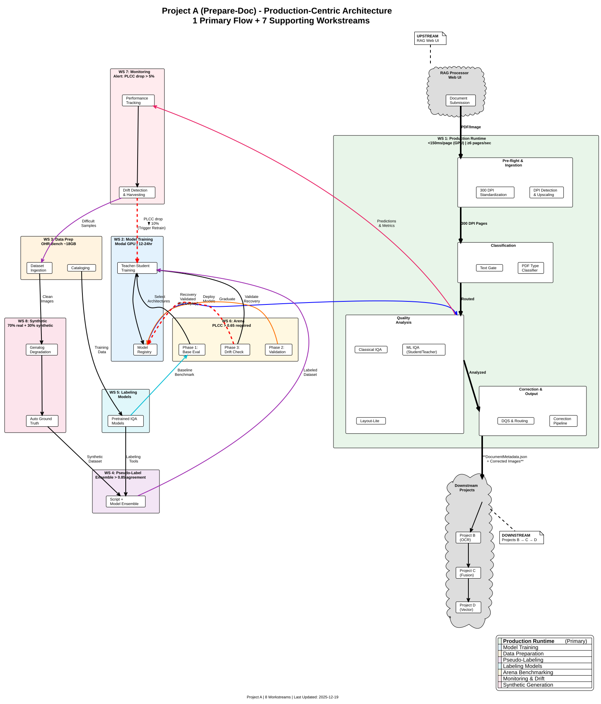

This level provides the complete system architecture for Project A (image-detection repository), showing how the eight workstreams interact to deliver the preprocessing, IQA, and routing gateway functionality.

---

## Technical Diagram



*PlantUML source: [`PROJECT_A_ARCHITECTURE_OVERVIEW.puml`](PROJECT_A_ARCHITECTURE_OVERVIEW.puml)*

---

## Project A Overview

Project A serves as the "front door" for the RAG document pipeline, responsible for:

- **Document ingestion** and page extraction
- **Image Quality Assessment** (IQA) using classical CV and ML models
- **Layout detection** with DocLayout-YOLO (11 DocLayNet classes)
- **Corrections** (deskew, CLAHE, denoising)
- **Document Quality Score** calculation and routing recommendations

---

## Eight Workstreams

Project A is organized into eight interconnected workstreams:

### 1. Production Runtime (Green)

The live processing pipeline that handles incoming documents. This is the only workstream that performs DPI normalization (to 300 DPI).

| Component | Purpose |
|-----------|---------|
| Ingestion & Pre-flight | DPI detection, PDF upscaling to 300 DPI, page extraction |
| Classification & Routing | PDF type classification, text gate |
| Quality Analysis | Classical IQA (7 detectors), ML IQA (student/teacher) |
| Layout Analysis | DocLayout-YOLO (11 classes), reading order, table structure |
| Correction & Scoring | Deskew, CLAHE, denoising, DQS calculation, routing |

### 2. Production Model Training (Blue)

Training and optimization of models used in Production Runtime (Workstream 1). Includes preparation of training datasets from labeled data.

| Model | Architecture | Purpose |
|-------|--------------|---------|
| IQA Teacher | ResNet-50 | High-capacity model for difficult cases |
| IQA Student | ResNet-18 | Production inference (distilled from teacher) |
| DocLayout-YOLO | YOLOv10-nano | Layout detection (11 DocLayNet classes) |

**Training Dataset Preparation**: Model-specific transforms (augmentation, train/val/test splits, format conversion) happen here, not in Data Preparation.

### 3. Data Preparation (Orange)

Dataset ingestion and cataloging. Datasets are kept in their **original form** without normalization to maintain standardization and reusability.

| Activity | Purpose |
|----------|---------|
| Source Collection | Ingest OHR-Bench, DIQA-5000, DocLayNet, LIVE/CSIQ |
| Cataloging | Register datasets with metadata, provenance tracking |
| Storage | Store in GCS in original resolution and format |

**Important**: NO DPI normalization here. Datasets remain in original form for maximum reusability across different training configurations.

### 4. Pseudo-Labeling (Purple)

Generates missing labels for datasets using a combination of script-based and model-based tools. Model-based labeling tools are trained in Workstream 5.

| Method | Tools | Focus |
|--------|-------|-------|
| Script-based | Heuristics, rule engines | Deterministic labels (file metadata, format detection) |
| Model-based | MUSIQ, QualiCLIP, DocIQ-Replica | IQA metrics |
| Model-based | Qwen3-VL-8B, InternVL3-8B | VLM-based quality assessment |

**Dependency**: Labeling models must be trained in Workstream 5 before they can be used here.

### 5. Labeling & Benchmarking Models (Cyan)

Training and benchmarking of labeling models used for pseudo-labeling and baseline evaluation. These models compete in Model Arena benchmarks and provide ground truth for training data.

| Model | Type | Purpose | Arena PLCC |
|-------|------|---------|------------|
| MUSIQ | IQA | Multi-scale image quality prediction | 0.2098 |
| QualiCLIP | IQA | CLIP-based quality assessment | 0.2216 (best) |
| DocIQ-Replica | IQA | Document-specific quality metrics | TBD |
| Qwen3-VL-8B | VLM | Vision-language quality reasoning | TBD |
| InternVL3-8B | VLM | Vision-language quality reasoning | TBD |

**Output**:

- Trained labeling models for pseudo-labeling (Workstream 4)
- Baseline benchmarks for production model comparison (Workstream 6)

---

### 6. Model Arena & Multi-Label Benchmarking (Gold)

Standardized, reproducible benchmarking across all label types throughout the model lifecycle. Serves as the quality gate for model deployment.

| Phase | Purpose | Output |
|-------|---------|--------|
| **Phase 1: Base Evaluation** | Benchmark pretrained models (pre-training) | Baseline leaderboard → inform architecture choice |
| **Phase 2: Fine-Tuned Validation** | Validate fine-tuning effectiveness (post-training) | PLCC improvement → production graduation |
| **Phase 3: Continuous Improvement** | Re-benchmark on production failures (feedback loop) | Drift quantification → retraining triggers |

**Current Benchmarks**:

- ✅ DIQA-5000 (IQA) - 1,000 test samples, bootstrapped 95% CIs
- 📋 DocLayNet (layout), PubTables (tables), ReadingBank (reading order) - Planned

**Key Metrics**: PLCC, SRCC, MAE, RMSE with statistical rigor (1000 bootstrap iterations)

---

### 7. Monitoring & Drift Detection (Red)

Continuous performance monitoring, drift detection, and automated retraining infrastructure. Ensures production model quality through active learning and alerting.

| Component | Purpose |
|-----------|---------|
| **Performance Tracking** | Monitor PLCC, SRCC, MAE, latency, throughput |
| **Drift Detection** | Statistical tests, threshold alerts (PLCC drop > 5%) |
| **Active Learning** | Harvest difficult/ambiguous samples for retraining |
| **Privacy Review** | GDPR/CCPA-compliant sample collection |
| **Retraining Automation** | Trigger model updates when drift exceeds thresholds |

**Status**: Phase 6 - 95% Complete (~7,400 lines of production code)

**Alert Thresholds**:

- WARNING: PLCC drop > 5% → Notify team
- CRITICAL: PLCC drop > 10% → Auto-trigger retraining
- EMERGENCY: PLCC drop > 20% → Halt production, rollback

---

### 8. Synthetic Data Generation (Magenta)

Controlled document degradation and augmentation using Microsoft Genalog. Expands training datasets through parametric degradations with automatic ground truth generation.

| Component | Purpose |
|-----------|---------|
| **Degradation Profiles** | Blur, noise, rotation, illumination, JPEG artifacts |
| **Genalog Integration** | Microsoft Genalog engine for analog document simulation |
| **Ground Truth Derivation** | Automatic quality labels from degradation parameters |
| **Dataset Expansion** | 1 clean image → 10+ degraded variants |

**Status**: Infrastructure complete (~450 lines), Genalog integration in progress

**Typical Workflow**:

- 500 clean images × 5 degradation profiles = 2,500 synthetic samples
- Merge with real data (70% real, 30% synthetic) for training

---

## Workstream Data Flow

### Complete Pipeline with Feedback Loops

```text
Workstream 3: Data Preparation
    ↓ (raw datasets)
Workstream 8: Synthetic Data Generation
    ↓ (clean images + degradation profiles)
    ├─→ Synthetic Dataset (augmented 2-3x)
    └─→ Ground Truth Labels (from parameters)
    ↓
Workstream 5: Labeling & Benchmarking Models
    ↓ (pretrained models)
Workstream 6: Model Arena - Phase 1 (Base Evaluation)
    ↓ (baseline leaderboard: QualiCLIP PLCC=0.22, MUSIQ PLCC=0.21)
    ├─→ Select Top Models for Fine-Tuning
    └─→ Select Best Models for Pseudo-Labeling
    ↓
Workstream 4: Pseudo-Labeling
    ↓ (ensemble labeling: scripts + QualiCLIP + MUSIQ)
    ↓ (labeled training dataset)
Workstream 2: Production Model Training
    ↓ (ResNet-50 teacher, ResNet-18 student)
Workstream 6: Model Arena - Phase 2 (Fine-Tuned Validation)
    ↓ (PLCC > 0.65? → Graduate)
Workstream 1: Production Runtime
    ↓ (predictions, performance metrics)
Workstream 7: Monitoring & Drift Detection
    ↓ (PLCC drop > 5%? → Alert)
    ├─→ Active Learning (harvest difficult samples)
    └─→ If PLCC drop > 10%:
        ↓
    Workstream 8: Synthetic Augmentation (expand harvested samples)
        ↓
    Workstream 2: Retraining (augmented dataset)
        ↓
    Workstream 6: Model Arena - Phase 3 (Validate Recovery)
        ↓ (PLCC recovered? → Re-Deploy)
    Workstream 1: Production Runtime (updated model)
```

### Key Data Flows

| From | To | Data | Purpose |
|------|----|----|---------|
| Data Prep | Synthetic Gen | Clean images | Degradation templates |
| Synthetic Gen | Labeling Models | Augmented dataset | Expand training data 2-3x |
| Labeling Models | Arena Phase 1 | Pretrained models | Baseline benchmarking |
| Arena Phase 1 | Pseudo-Labeling | Top models | Ensemble labeling |
| Pseudo-Labeling | Production Training | Labeled dataset | Train teacher/student |
| Production Training | Arena Phase 2 | Fine-tuned models | Validation before deployment |
| Arena Phase 2 | Production Runtime | Graduated models | Production deployment |
| Production Runtime | Monitoring | Predictions + metrics | Drift detection |
| Monitoring | Active Learning | Difficult samples | Sample harvesting |
| Active Learning | Synthetic Gen | Harvested samples | Augmentation for retraining |
| Synthetic Gen | Production Training | Augmented dataset | Retraining with failures |
| Production Training | Arena Phase 3 | Retrained models | Validate recovery |
| Arena Phase 3 | Production Runtime | Validated models | Re-deployment |

---

## Level 2: Workstream Details

Each workstream on this diagram corresponds to a Level 2 index file with detailed component diagrams:

| Workstream | Level 2 Location | Status | Lines of Code |
|------------|------------------|--------|---------------|
| **1. Production Runtime** | [level-2/production-runtime/index.md](../level-2/production-runtime/index.md) | Active | 15,000+ |
| **2. Production Model Training** | [level-2/model-training/index.md](../level-2/model-training/index.md) | Active | 3,000+ |
| **3. Data Preparation** | [level-2/data-preparation/index.md](../level-2/data-preparation/index.md) | Active | 2,500+ |
| **4. Pseudo-Labeling** | [level-2/pseudo-labeling/index.md](../level-2/pseudo-labeling/index.md) | Active | 1,500+ |
| **5. Labeling & Benchmarking Models** | [level-2/labeling-benchmarking/index.md](../level-2/labeling-benchmarking/index.md) | **NEW** ✨ | 800+ |
| **6. Model Arena & Benchmarking** | [level-2/model-arena/index.md](../level-2/model-arena/index.md) | **NEW** ✨ | ~3,000 |
| **7. Monitoring & Drift Detection** | [level-2/monitoring-drift/index.md](../level-2/monitoring-drift/index.md) | **NEW** ✨ | ~7,400 |
| **8. Synthetic Data Generation** | [level-2/synthetic-generation/index.md](../level-2/synthetic-generation/index.md) | **NEW** ✨ | 450+ |

Each Level 2 diagram drills down into component boxes that map to Level 3 module-level documentation.

**Total Architecture**: 33,450+ lines of production code across 8 workstreams

---

## Downstream Projects Context

Project A (Prepare-Doc) outputs are consumed by three downstream projects in the RAG pipeline:

| Project | Consumes from Project A | Purpose | Contract Document |
|---------|------------------------|---------|-------------------|
| **Project B (Unify)** | `DocumentMetadata.json`, corrected page images (300 DPI PNG) | Multi-engine OCR orchestration, Docling DOM creation | [prepare-doc-unify-contract.md](../../development/RAG%20Pipeline/prepare-doc-unify-contract.md) |
| **Project C (Chunk)** | Docling DOM (via Project B) | Trust scoring, semantic RAG chunking | TBD |
| **Project D (Embed)** | Text chunks (via Project C) | Vector embeddings, retrieval API | TBD |

**Key Handoff Artifacts**:

- **DocumentMetadata.json**: Quality scores, layout summary, routing recommendations (`OCR_FAST`, `OCR_ADVANCED`, `VISION_SIMPLE`, `VISION_STRUCTURED`)
- **Corrected Images**: Deskewed, CLAHE-enhanced, 300 DPI normalized PNG files
- **PDF Type**: Classification enum (`image_only`, `born_digital`, `hybrid`)
- **Document Quality Score (DQS)**: 0-1 composite score (degradation + structural complexity)
- **Pre-OCR Risk**: 0-1 risk score for OCR failure likelihood

See [Downstream Context](../level-2/downstream-context/index.md) for detailed workflow diagrams showing how Projects B, C, and D consume Project A outputs.

---

## Related Diagrams

| Level | Diagram | Description |
|-------|---------|-------------|
| **Level 0** | [RAG Pipeline Overview](../level-0/index.md) | Multi-project pipeline context |
| **Level 1** | [Workflow Hierarchy](workflow-hierarchy.md) | Swimlane data flow |
| **Level 2** | [Production Runtime](../level-2/production-runtime/index.md) | Runtime workflow details |
| **Level 2** | [Model Training](../level-2/model-training/index.md) | Training pipeline |
| **Level 2** | [Data Preparation](../level-2/data-preparation/index.md) | Dataset ingestion |
| **Level 2** | [Pseudo-Labeling](../level-2/pseudo-labeling/index.md) | Ensemble workflow |
| **Level 2** | [Model Arena](../level-2/model-arena/index.md) | **NEW** ✨ Multi-phase benchmarking |
| **Level 2** | [Monitoring & Drift](../level-2/monitoring-drift/index.md) | **NEW** ✨ Continuous improvement |
| **Level 2** | [Synthetic Generation](../level-2/synthetic-generation/index.md) | **NEW** ✨ Data augmentation |

---

## Source Files

- **PlantUML**: [`PROJECT_A_ARCHITECTURE_OVERVIEW.puml`](PROJECT_A_ARCHITECTURE_OVERVIEW.puml)
- **Traceability**: [INDEX.md](../INDEX.md)
