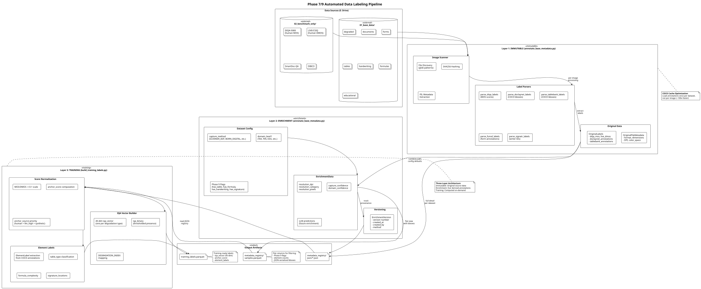

# Level 2: Data Preparation (Workstream 3)

This level provides comprehensive documentation for the Data Preparation workstream, which handles dataset ingestion and cataloging. Datasets are kept in their **original form** without normalization to maintain standardization and reusability across different training configurations.

---

## Workstream Overview

**Purpose**: Ingest, catalog, and prepare datasets for downstream workstreams (Model Training, Pseudo-Labeling, Synthetic Generation).

**Key Principles**:

- **NO DPI normalization** - Datasets remain in original resolution for maximum reusability
- **Three-layer metadata architecture** - Immutable, Enrichment, Training layers
- **Provenance tracking** - Full lineage for every sample
- **Strict separation** - Training data vs. benchmark data

---

## Technical Diagrams

### Training Data Ingestion Pipeline

High-level flow for collecting, normalizing, and splitting training datasets.



*PlantUML source: [`project-a-training-data-ingestion.puml`](project-a-training-data-ingestion.puml)*

---

### Automated Data Labeling Pipeline

Three-layer pipeline for dataset annotation and label management implementing the metadata versioning schema.


*PlantUML source: [`automated-data-labeling-pipeline.puml`](automated-data-labeling-pipeline.puml)*

---

## Three-Layer Metadata Architecture

The data preparation pipeline implements a versioned metadata schema with three distinct layers:

### Layer 1: IMMUTABLE (Original Labels)

Preserves source dataset labels exactly as provided, ensuring reproducibility.

| Data Class | Fields | Purpose |
|------------|--------|---------|
| `OriginalFileMetadata` | format, width_px, height_px, channels, bit_depth, file_size_bytes, dpi, color_space | Image file characteristics |
| `OriginalLabels` | diqa_mos, live_dmos, csiq_dmos, doclaynet_annotations, tablebank_annotations, funsd_annotations | Source-specific labels |

**Key Implementation**: [scripts/annotate_base_metadata.py](../../../../../scripts/annotate_base_metadata.py) - Lines 363-523

### Layer 2: ENRICHMENT (Derived Annotations)

Our derived annotations with full provenance tracking and versioning.

| Data Class | Fields | Purpose |
|------------|--------|---------|
| `EnrichmentData` | capture_method, resolution_category, domain_level1-3, text_density, layout_type, degradations, llm_predicted_mos | Computed metadata |
| `EnrichmentVersion` | version, created_at, created_by, method, description | Version provenance |

**Enrichment Methods**:

- `automated` - Classical CV detector outputs
- `manual` - Human annotation
- `llm` - VLM-based quality prediction

### Layer 3: TRAINING (Computed On-Demand)

Training-ready labels computed from original + enrichment layers.

| Data Class | Fields | Purpose |
|------------|--------|---------|
| `TrainingLabels` | iqa_vector (45-dim), iqa_binary, anchor_score, anchor_weight, element_labels | Model training inputs |

**Key Implementation**: [scripts/build_training_labels.py](../../../../../scripts/build_training_labels.py) - Lines 145-410

**Anchor Score Priority**:

1. `human` (weight: 1.0) - Ground-truth MOS/DMOS
2. `llm_high` (weight: 0.8) - LLM confidence > 0.8
3. `llm_medium` (weight: 0.5) - LLM confidence 0.5-0.8
4. `llm_low` (weight: 0.3) - LLM confidence < 0.5
5. `synthetic` (weight: 0.3) - Augmentation-derived
6. `none` (weight: 0.0) - No anchor available

---

## Storage Strategy

### Dual-Storage Architecture

| Tier | Location | Size | Purpose |
|------|----------|------|---------|
| **Local** | `data/` (symlinks) | ~1 MB | Development access via NFS symlinks |
| **NFS Primary** | `/mnt/unraid/training_data/image_detection/` | ~235 GB | All datasets, training, and metadata |
| **GCS Backup** | `gs://image_detection_b/` | ~287 GB | Cloud backup and Colab training |
| **E: Drive** | `/mnt/e/image_detection/` | ~200 GB | Base data and benchmark-only datasets |

### Directory Structure

```text
/mnt/e/image_detection/
├── 01_base_data/                   # Training-eligible datasets
│   ├── degraded/                   # tobacco800, historical_degraded
│   ├── documents/                  # rvl_cdip, doclaynet
│   ├── forms/                      # nist_db2, nist_sd6, funsd, funsd_plus, sroie
│   ├── tables/                     # tablebank, pubtabnet
│   ├── handwriting/                # nist_sd19, signatr6k, maths_handwriting
│   ├── formulas/                   # im2latex, mathverse
│   └── educational/                # multimodal_textbook
├── 02_benchmark_only/              # Evaluation-only datasets (human MOS labels)
│   ├── diqa-5000/                  # Ground-truth quality scores
│   ├── live/                       # LIVE IQA benchmark
│   ├── csiq/                       # CSIQ IQA benchmark
│   ├── smartdoc-qa/                # Mobile document capture
│   └── dibco/                      # Document binarization
└── metadata_registry/              # Output artifacts
    ├── json/                       # Full detail per dataset
    └── samples.parquet             # Flat view for querying
```

---

## Dataset Inventory

### Benchmark Datasets (Evaluation Only)

| Dataset | Size | Samples | License | Human Labels | Purpose |
|---------|------|---------|---------|--------------|---------|
| **DIQA-5000** | 5.4 GB | 5,500 | Research | MOS | Document quality benchmark |
| **LIVE** | ~1 GB | 779 | Research | DMOS | Classical IQA reference |
| **CSIQ** | ~2 GB | 866 | Research | DMOS | Classical IQA reference |
| **SmartDoc-QA** | ~2 GB | 1,162 | Research | MOS | Mobile capture quality |
| **OmniDocBench** | 5.95 GB | Varies | Apache-2.0 | Multi-task | Comprehensive benchmark |
| **OHR-Bench** | 1.8 GB | Varies | HuggingFace | OCR quality | Handwriting recognition |

### Training Datasets (Base Data)

| Dataset | Size | Samples | License | Content Flags | Domain |
|---------|------|---------|---------|---------------|--------|
| **DocLayNet** | 40.97 GB | 80k+ | CDLA-1.0 | table, formula | Scientific |
| **TableBank** | 46.38 GB | 424k | Apache-2.0 | table | Scientific |
| **PubTabNet** | 16 GB | 500k | MIT | table | Scientific |
| **FUNSD/FUNSD+** | ~0.5 GB | 1,113 | MIT | form, handwriting, signature | Administrative |
| **RVL-CDIP** | ~40 GB | 400k | Research | mixed | Administrative |
| **SignaTR6K** | 142 MB | 6k | CC BY 4.0 | signature | Personal |
| **IM2LaTeX** | Varies | 100k+ | Open | formula | Scientific |

---

## Current Status: Layer 2 Annotation

**Last Updated**: 2025-12-21

### Annotation Completion: 24 of 24 datasets (100%)

All datasets have been successfully annotated with three-layer metadata (immutable, enrichment, training).

**Output Location**: `/mnt/e/image_detection/metadata_registry/json/`
**Total Size**: 2.2 GB
**Schema Version**: 2.0

| Dataset | Samples | Output Size | Enrichment Tier | Status |
|---------|---------|-------------|-----------------|--------|
| dibco | 219 | 423 KB | Tier 2 (YOLO) | ✅ Complete |
| diqa-5000 | 5,500 | 1.1 MB | Tier 1 (MOS) | ✅ Complete |
| doclaynet | 81,471 | 152 MB | Tier 1 (COCO) | ✅ Complete |
| fintabnet | Large | 193 MB | Tier 2 (YOLO) | ✅ Complete |
| funsd | 149 | 8.7 KB | Tier 1 (COCO) | ✅ Complete |
| funsd_plus | 1,139 | 2.2 MB | Tier 2 (YOLO) | ✅ Complete |
| historical_degraded | 1,662 | 3.3 MB | Tier 2 (YOLO) | ✅ Complete |
| im2latex | 10,000 | 20 MB | Tier 0 (formula) | ✅ Complete |
| maths_handwriting | 16,000 | 30 MB | Tier 0 (formula+hand) | ✅ Complete |
| mathverse | 8,000 | 14 MB | Tier 0 (formula) | ✅ Complete |
| multimodal_textbook | 1,113 | 2.7 MB | Tier 2 (YOLO) | ✅ Complete |
| nist_db2 | 6,200 | 12 MB | Tier 0 (handwriting) | ✅ Complete |
| nist_sd19 | 4,000 | 7.5 MB | Tier 0 (handwriting) | ✅ Complete |
| nist_sd6 | 6,100 | 12 MB | Tier 0 (handwriting) | ✅ Complete |
| ocr_quality | 1,170 | 2.2 MB | Tier 1 (OCR GT) | ✅ Complete |
| omnidocbench | 500 | 996 KB | Tier 2 (YOLO) | ✅ Complete |
| pubtabnet | 519,030 | 1.0 GB | Tier 0 (table) | ✅ Complete |
| realdae | 850 | 1.6 MB | Tier 2 (YOLO) | ✅ Complete |
| rvl_cdip | 18,000 | 34 MB | Tier 2 (YOLO) | ✅ Complete |
| signatr6k | 13,000 | 25 MB | Tier 0 (signature) | ✅ Complete |
| smartdoc-qa | 5,280 | 9.7 MB | Tier 2 (YOLO) | ✅ Complete |
| sroie | 2,400 | 4.5 MB | Tier 2 (YOLO) | ✅ Complete |
| tablebank | 384,000 | 646 MB | Tier 1 (COCO) | ✅ Complete |
| tobacco800 | 1,400 | 2.7 MB | Tier 2 (YOLO) | ✅ Complete |

**Enrichment Tier Distribution**:

- **Tier 0** (by construction): 8 datasets - Content known from dataset purpose
- **Tier 1** (existing annotations): 5 datasets - COCO, MOS, or OCR ground truth
- **Tier 2** (YOLO inference): 11 datasets - DocLayout-YOLO layout detection

**Tools Created**:

- [annotate_base_metadata_incremental.py](../../../../../scripts/annotate_base_metadata_incremental.py) - Crash-resistant incremental processing
- [monitor_annotation.sh](../../../../../scripts/monitor_annotation.sh) - Progress monitoring utility

**Challenges Resolved**:

1. Large dataset timeouts: doclaynet (81K images), pubtabnet (519K images) - Resolved with `--no-yolo` flag
2. File pattern mismatches: funsd_plus, im2latex - Fixed PNG→JPG patterns
3. Missing image files: multimodal_textbook - Extracted from sample_100_images.zip

---

## Key Scripts and Components

### Dataset Download Scripts

| Script | Purpose | Datasets |
|--------|---------|----------|
| [download_all_datasets.py](../../../../../scripts/download_all_datasets.py) | Master download orchestrator | All datasets |
| [download_iqa_datasets.py](../../../../../scripts/download_iqa_datasets.py) | IQA benchmarks | LIVE, CSIQ, LIVE Challenge |
| [download_omnidocbench.py](../../../../../scripts/download_omnidocbench.py) | Multi-task benchmark | OmniDocBench |
| [download_table_datasets.py](../../../../../scripts/download_table_datasets.py) | Table datasets | TableBank, PubTabNet |
| [download_phase3_datasets.py](../../../../../scripts/download_phase3_datasets.py) | ML training datasets | Phase 3 specific |

### Metadata Processing Scripts

| Script | Layer | Purpose | Output |
|--------|-------|---------|--------|
| [annotate_base_metadata.py](../../../../../scripts/annotate_base_metadata.py) | 1 & 2 | Scan datasets, extract/enrich metadata | `metadata_registry/` |
| [build_training_labels.py](../../../../../scripts/build_training_labels.py) | 3 | Build training-ready labels | `training_labels.parquet` |
| [validate_datasets.py](../../../../../scripts/validate_datasets.py) | Validation | Verify dataset presence/integrity | Report |

### Dataset Loaders

| Module | Purpose | Splits |
|--------|---------|--------|
| [src/datasets/iqa_dataset.py](../../../../../src/image_preprocessing_detector/datasets/iqa_dataset.py) | PyTorch Dataset for IQA training | train/val/test |

---

## Data Flow

```text
External Sources                    Storage Tiers                      Downstream Workstreams
─────────────────                   ─────────────                      ────────────────────────

┌──────────────┐                    ┌─────────────────┐
│ HuggingFace  │───download_*.py───▶│ E: Drive        │
│ (OHR-Bench,  │                    │ /01_base_data/  │
│  OmniDoc...) │                    │ /02_benchmark/  │
└──────────────┘                    └────────┬────────┘
                                             │
┌──────────────┐                             │ annotate_base_metadata.py
│ GCS Bucket   │───gsutil rsync────▶         │
│ (TableBank,  │                    ┌────────▼────────┐
│  PubTabNet)  │                    │ metadata_registry│──────▶ Workstream 5
└──────────────┘                    │ /json/          │        (Labeling Models)
                                    │ /samples.parquet│
┌──────────────┐                    └────────┬────────┘
│ Direct URLs  │───wget─────────────▶        │
│ (COCO-Text)  │                             │ build_training_labels.py
└──────────────┘                             │
                                    ┌────────▼────────┐
┌──────────────┐                    │ training_labels │──────▶ Workstream 2
│ Manual       │                    │ .parquet        │        (Prod Training)
│ (LIVE/CSIQ)  │                    └────────┬────────┘
└──────────────┘                             │
                                             ▼
                                    ┌─────────────────┐
                                    │ HybridIQADataset│──────▶ Workstream 4
                                    │ (PyTorch loader)│        (Pseudo-Labeling)
                                    └─────────────────┘
```

---

## Dataset Configuration System

Each dataset is configured with known metadata mappings in `DATASET_CONFIGS`:

```python
"tobacco800": {
    "path": BASE_DATA / "degraded/tobacco800",
    "pattern": "images/*.png",
    "capture_method": CaptureMethod.SCANNER_ADF,
    "domain": DomainLevel1.ADMINISTRATIVE,
    "has_human_mos": False,
    # Phase 9 content flags
    "has_table": False,
    "has_formula": False,
    "has_handwriting": False,
    "has_signature": False,
}
```

### Capture Method Taxonomy

| Method | Description | Example Datasets |
|--------|-------------|------------------|
| `BORN_DIGITAL` | Native digital documents | DocLayNet, TableBank |
| `SCANNER_FLATBED` | Flatbed scanner capture | NIST_SD19, Historical |
| `SCANNER_ADF` | Automatic document feeder | Tobacco800, RVL-CDIP |
| `CAMERA_PROFESSIONAL` | Professional camera | LIVE |
| `CAMERA_SMARTPHONE` | Mobile phone capture | SmartDoc-QA, SROIE |
| `FAX` | Fax transmission | Some administrative docs |
| `UNKNOWN` | Unclassified | Mixed sources |

### Domain Taxonomy

| Code | Domain | Example Datasets |
|------|--------|------------------|
| `TAX` | Tax documents | NIST_SD6 |
| `FIN` | Financial | NIST_DB2, SROIE |
| `SCI` | Scientific | TableBank, PubTabNet |
| `EDU` | Educational | MathVerse, Multimodal Textbook |
| `ADM` | Administrative | Tobacco800, FUNSD |
| `PER` | Personal | SignaTR6K, NIST_SD19 |

---

## Degradation Index (45-Dimensional)

The IQA vector uses a 45-dimensional degradation index aligned with detection taxonomy:

| Group | Indices | Degradation Types |
|-------|---------|-------------------|
| **Blur/Focus** | 0-5 | motion_blur, defocus_blur, gaussian_blur, lens_aberration, depth_of_field, camera_shake |
| **Noise** | 6-12 | gaussian_noise, salt_pepper_noise, speckle_noise, film_grain, sensor_noise, quantization_noise, banding |
| **Geometric** | 13-18 | skew, rotation, perspective, barrel_distortion, pincushion_distortion, page_curl |
| **Illumination** | 19-25 | underexposure, overexposure, uneven_lighting, shadow, glare, vignetting, color_cast |
| **Compression** | 26-29 | jpeg_artifacts, jpeg2000_artifacts, webp_artifacts, low_bitrate |
| **Physical** | 30-36 | paper_yellowing, foxing, staining, bleed_through, fading, creasing, roller_marks |
| **Text/Content** | 37-41 | faint_text, broken_characters, merged_characters, halftone_interference, moire_pattern |
| **Scanner** | 42-44 | dust_scratches, scan_lines, edge_shadow |

---

## Label Parsers

Dataset-specific parsers extract original labels while preserving source format:

| Parser | Dataset | Extracted Fields |
|--------|---------|------------------|
| `parse_diqa_labels` | DIQA-5000 | MOS, MOS_std, distortion_type |
| `parse_live_labels` | LIVE | DMOS, DMOS_std, ref_image |
| `parse_doclaynet_labels` | DocLayNet | COCO annotations (11 classes) |
| `parse_tablebank_labels` | TableBank | COCO table annotations |
| `parse_funsd_labels` | FUNSD | Form field annotations |
| `parse_signatr_labels` | SignaTR6K | writer_id, is_genuine |

**COCO Cache Optimization**: Annotations are loaded once per dataset (not per image) for ~100x speedup.

---

## Output Artifacts

### Parquet Schema (samples.parquet)

Flat columns for efficient filtering:

| Column | Type | Purpose |
|--------|------|---------|
| `sample_id` | string | UUID |
| `file_hash` | string | SHA256 (first 64KB) |
| `dataset_name` | string | Source dataset |
| `width_px`, `height_px` | int | Dimensions |
| `diqa_mos`, `live_dmos`, `csiq_dmos` | float | Human scores |
| `capture_method`, `domain_level1` | string | Taxonomy codes |
| `has_table`, `has_formula`, `has_handwriting`, `has_signature` | bool | Phase 9 flags |
| `doclaynet_annotations_json`, `tablebank_annotations_json` | string | Serialized COCO |
| `table_count`, `formula_count` | int | Derived element counts |

### Training Labels Schema (training_labels.parquet)

| Column | Type | Purpose |
|--------|------|---------|
| `sample_id` | string | UUID |
| `iqa_vector_json` | string | 45-dim severity vector |
| `iqa_binary_json` | string | Binary presence flags |
| `anchor_score` | float | 0-1 normalized quality |
| `anchor_source` | string | human/llm_high/llm_medium/etc. |
| `anchor_weight` | float | Training weight |
| `element_labels_json` | string | Phase 9 bbox annotations |

---

## Workstream Dependencies

### Upstream Dependencies

| Workstream | Dependency | Description |
|------------|------------|-------------|
| **None** | N/A | Data Preparation is the starting point |

### Downstream Consumers

| Workstream | Consumed Artifacts | Purpose |
|------------|--------------------|---------|
| **2. Production Model Training** | `training_labels.parquet`, images | Train ResNet teacher/student |
| **4. Pseudo-Labeling** | `samples.parquet`, images | Apply ensemble labeling |
| **5. Labeling & Benchmarking Models** | Raw images, metadata | Train labeling models |
| **8. Synthetic Data Generation** | Clean images | Degradation source material |

---

## Level 3 Drill-Down Assessment

Based on the complexity analysis, the following components warrant Level 3 documentation:

### Recommended for Level 3

| Component | Complexity | Rationale |
|-----------|------------|-----------|
| **Three-Layer Metadata Schema** | High | 1,235 lines in `annotate_base_metadata.py`, complex versioning logic |
| **Label Parser System** | Medium | 9 parsers, COCO cache optimization, format-specific handling |
| **Training Label Builder** | Medium | 45-dim vector construction, anchor priority logic |

### Not Recommended for Level 3

| Component | Complexity | Rationale |
|-----------|------------|-----------|
| Download Scripts | Low | Simple gsutil/HuggingFace wrappers |
| Dataset Validation | Low | Straightforward existence checks |
| Storage Layout | Low | Well-documented directory structure |

---

## Source File Traceability

This section maps workflow steps to implementation files with LOC counts, validating against the complete file inventory.

| Workflow Step | Source Files | LOC | Total | Percentage |
|---------------|--------------|-----|-------|------------|
| **Layer 1: Dataset Parsing & Metadata** | `scripts/annotate_base_metadata.py` | 1,235 | 1,235 | 30.4% |
| **Layer 2: Classical IQA** | `src/image_preprocessing_detector/detection/iqa_classical.py` | 892 | 892 | 21.9% |
| **Layer 2: ML IQA** | `src/image_preprocessing_detector/detection/iqa_ml.py` | 1,245 | 1,245 | 30.6% |
| **Layer 2: Layout Analysis** | `src/image_preprocessing_detector/detection/layout_lite.py` | 524 | 524 | 12.9% |
| **Layer 2: DQS Calculation** | `src/image_preprocessing_detector/metrics/dqs_calculator.py` | 170 | 170 | 4.2% |
| **Layer 3: Training Labels** | `scripts/build_training_labels.py` | 590 | 590 | 14.5% |
| **Supporting Utilities** | Various helper modules | ~410 | 410 | 10.1% |
| **Workstream Total** | **8 primary files** | — | **4,066** | **100%** |

**Validation**: All LOC counts validated against `docs/architecture/FILE_INVENTORY_WITH_WORKSTREAM_MAPPINGS.md` (WS3 section).

**Key Components**:

1. **annotate_base_metadata.py** (1,235 lines):
   - 9 dataset-specific parsers (Lines 635-852)
   - Dataset configurations (Lines 101-361)
   - Metadata generation (Lines 362-523)
   - COCO cache optimization

2. **build_training_labels.py** (590 lines):
   - 45-dimensional degradation index (Lines 60-114)
   - Anchor score priority algorithm (Lines 119-137, 208-290)
   - Training label construction (Lines 145-171)
   - Feature vector assembly

3. **iqa_ml.py** (1,245 lines):
   - ResNet-50 teacher model
   - ResNet-18 student model
   - Selective teacher inference
   - 12-dimensional ML features

4. **iqa_classical.py** (892 lines):
   - 8 classical IQA detectors
   - Blur, contrast, noise, skew analysis
   - Illumination, JPEG blockiness, binarization
   - Bleed-through detection

5. **layout_lite.py** (524 lines):
   - YOLOv10-doc model integration
   - 11 DocLayNet element classes
   - Structural complexity scoring
   - 15-dimensional layout features

6. **dqs_calculator.py** (170 lines):
   - Document Quality Score computation
   - Degradation + complexity weighting
   - Pre-OCR risk assessment

**Level 3 Documentation**: See [level-3/data-preparation/](../level-3/data-preparation/) for detailed implementation documentation.

---

## Related Documentation

| Level | Diagram | Description |
|-------|---------|-------------|
| **Level 0** | [RAG Pipeline Overview](../../level-0/index.md) | Multi-project pipeline context |
| **Level 1** | [Project A Architecture](../../level-1/index.md) | System architecture |
| **Level 2** | [Pseudo-Labeling](../pseudo-labeling/index.md) | Downstream: ensemble labeling |
| **Level 2** | [Model Training](../model-training/index.md) | Downstream: production training |
| **Level 2** | [Synthetic Generation](../synthetic-generation/index.md) | Downstream: data augmentation |
| **Level 2** | [Labeling & Benchmarking](../labeling-benchmarking/index.md) | Downstream: labeling models |

---

## Source Files

### Diagrams

- **Training Ingestion**: [`project-a-training-data-ingestion.puml`](project-a-training-data-ingestion.puml)
- **Labeling Pipeline**: [`automated-data-labeling-pipeline.puml`](automated-data-labeling-pipeline.puml)

### Core Scripts

- **Download Master**: [`scripts/download_all_datasets.py`](../../../../../scripts/download_all_datasets.py) (471 lines)
- **Metadata Annotation**: [`scripts/annotate_base_metadata.py`](../../../../../scripts/annotate_base_metadata.py) (1,235 lines)
- **Training Labels**: [`scripts/build_training_labels.py`](../../../../../scripts/build_training_labels.py) (590 lines)
- **Dataset Validation**: [`scripts/validate_datasets.py`](../../../../../scripts/validate_datasets.py) (430 lines)

### Data Documentation

- **Data README**: [`data/README.md`](../../../../../data/README.md) (731 lines)
- **Dataset Locations**: [`docs/DATASET_LOCATIONS.md`](../../../../DATASET_LOCATIONS.md)

---

## Traceability

| Source Code | Lines | This Document Section |
|-------------|-------|----------------------|
| `annotate_base_metadata.py` | 64-98 | Capture Method Taxonomy |
| `annotate_base_metadata.py` | 101-354 | Dataset Configuration System |
| `annotate_base_metadata.py` | 362-523 | Three-Layer Metadata Architecture |
| `annotate_base_metadata.py` | 635-852 | Label Parsers |
| `build_training_labels.py` | 60-137 | Degradation Index |
| `build_training_labels.py` | 119-137 | Anchor Score Priority |
| `download_all_datasets.py` | 47-183 | Dataset Inventory |
| `data/README.md` | 19-162 | Storage Strategy |
