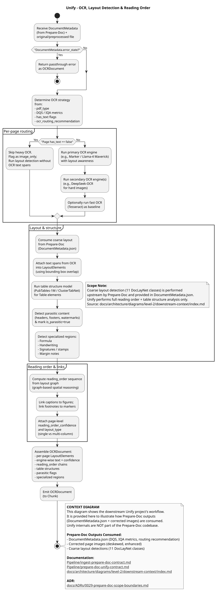
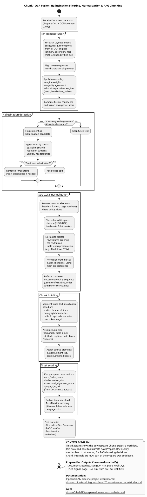

This level provides context diagrams for the downstream projects in the RAG pipeline that consume Prepare-Doc output.

---

## Unify: OCR & Layout Workflow

OCR orchestration and full layout detection (receives Prepare-Doc output).



---

## Chunk: Fusion & Chunking Workflow

Multi-engine fusion, trust scoring, and RAG chunking.


---

## Embed: Vector Store Workflow

Embedding generation and vector database storage.



---

## Pipeline Flow

```text
Prepare-Doc (THIS REPO)  →  Unify  →  Chunk  →  Embed
Preprocessing & IQA       OCR Layout     Fusion        Vector Store
───────────────────       ──────────     ──────        ────────────
• IQA & Corrections       • Full Layout  • Trust       • Embeddings
• Text Gate               • Reading Order• Scoring     • Vector DB
• DQS & Routing           • Table Struct • RAG Chunks  • Retrieval
```

---

## A→B Contract

Prepare-Doc outputs that Unify consumes:

| Output | Format | Description |
|--------|--------|-------------|
| DocumentMetadata.json | JSON | Quality scores, routing, layout summary |
| Corrected Images | PNG/JPEG | Deskewed, enhanced page images |
| pdf_type | Enum | image_only, born_digital, hybrid |
| ocr_routing_recommendation | Enum | OCR_FAST, OCR_ADVANCED, VISION_* |

---

## Related Diagrams

| Level | Diagram | Description |
|-------|---------|-------------|
| **Level 0** | [RAG Pipeline Overview](../../level-0/index.md) | Multi-project context |
| **Level 1** | [Prepare-Doc Architecture](../../level-1/index.md) | Prepare-Doc system |
| **Level 2** | [Production Runtime](../production-runtime/index.md) | Prepare-Doc workflow |
