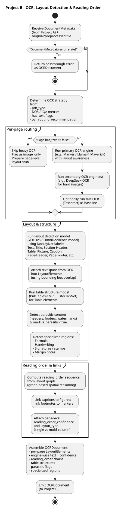

# Level 2: Downstream Context

This level provides context diagrams for the downstream projects in the RAG pipeline that consume Project A output.

---

## Project B: OCR & Layout Workflow

OCR orchestration and full layout detection (receives Project A output).


---

## Project C: Fusion & Chunking Workflow

Multi-engine fusion, trust scoring, and RAG chunking.



---

## Project D: Vector Store Workflow

Embedding generation and vector database storage.


---

## Pipeline Flow

```
Project A (THIS REPO)  →  Project B  →  Project C  →  Project D
Preprocessing & IQA       OCR Layout     Fusion        Vector Store
───────────────────       ──────────     ──────        ────────────
• IQA & Corrections       • Full Layout  • Trust       • Embeddings
• Text Gate               • Reading Order• Scoring     • Vector DB
• DQS & Routing           • Table Struct • RAG Chunks  • Retrieval
```

---

## A→B Contract

Project A outputs that Project B consumes:

| Output | Format | Description |
|--------|--------|-------------|
| DocumentMetadata.json | JSON | Quality scores, routing, layout summary |
| Corrected Images | PNG/JPEG | Deskewed, enhanced page images |
| pdf_type | Enum | image_only, born_digital, hybrid |
| ocr_routing_recommendation | Enum | OCR_FAST, OCR_ADVANCED, VISION_* |

---

## Related Diagrams

| Level | Diagram | Description |
|-------|---------|-------------|
| **Level 0** | [RAG Pipeline Overview](../../level-0/index.md) | Multi-project context |
| **Level 1** | [Project A Architecture](../../level-1/index.md) | Project A system |
| **Level 2** | [Production Runtime](../production-runtime/index.md) | Project A workflow |
