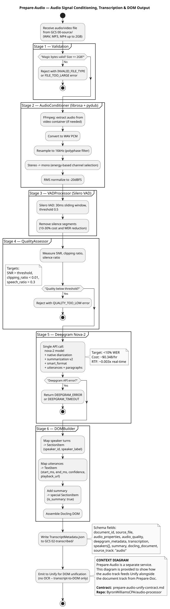

This level provides context diagrams for all RAG pipeline services in the two processing tracks:

**Document track**: Prepare-Doc (THIS REPO) → Unify → Chunk → App Embedding

**Audio track**: Prepare-Audio → Unify → Chunk → App Embedding

Both tracks converge at Unify for Docling DOM unification before the shared Chunk and
Application Embedding stages.

---

## Prepare-Audio: Transcription & DOM Output

Audio signal conditioning (AudioConditioner + Silero VAD), Deepgram Nova-2 transcription,
speaker diarization, and Docling DOM assembly. Prepare-Audio emits `TranscriptMetadata.json`
to Unify; Unify skips OCR and performs DOM unification only for audio-derived content.



---

## Unify: OCR & Layout Workflow

OCR orchestration and full layout detection. Receives `DocumentMetadata.json` + corrected
images from Prepare-Doc (document track) or `TranscriptMetadata.json` from Prepare-Audio
(audio track). Produces a unified Docling DOM for both tracks.


---

## Chunk: Fusion & Chunking Workflow

Multi-engine fusion, trust scoring, and RAG chunking. Receives the unified Docling DOM
from Unify and produces `RAGChunkSet.json` with trust metrics. Chunk is the source of
the contract that Application Embedding must honor.


---

## Chunk → Application Embedding Contract

Embedding is **per-application** — not a shared foundry service. Each AI application
implements its own embedding, but ALL implementations MUST conform to the contract shown
below: accepting `RAGChunkSet` from Chunk and preserving `trust_score`,
`ocr_engine_provenance`, and `chunk_id` in their vector store entries.

See also: [chunk-embed-contract.md](../../../../development/RAG%20Pipeline/chunk-embed-contract.md)


---

## Pipeline Flow

```text
Document track:
Prepare-Doc (THIS REPO) → Unify → Chunk → App Embedding (per-app)
Preprocessing & IQA       OCR Layout     Trust Scoring   RAGChunkSet consumed
                                          RAG Chunking    by each AI application

Audio track:
Prepare-Audio           → Unify → Chunk → App Embedding (per-app)
FFmpeg + Deepgram         DOM              (same Chunk)   (same contract)
Diarization               Unification

Both tracks converge at Unify for Docling DOM unification.
```

---

## Cross-Service Contracts

### Prepare-Doc → Unify Contract

Prepare-Doc outputs that Unify consumes (document track):

| Output | Format | Description |
|--------|--------|-------------|
| DocumentMetadata.json | JSON | Quality scores, routing, layout summary |
| Corrected Images | PNG/JPEG | Deskewed, enhanced page images |
| pdf_type | Enum | image_only, born_digital, hybrid |
| ocr_routing_recommendation | Enum | OCR_FAST, OCR_ADVANCED, VISION_* |

Full spec: [prepare-doc-unify-contract.md](../../../../development/RAG%20Pipeline/prepare-doc-unify-contract.md)

### Prepare-Audio → Unify Contract

Prepare-Audio outputs that Unify consumes (audio track):

| Output | Format | Description |
|--------|--------|-------------|
| TranscriptMetadata.json | JSON | Full transcript, speakers, quality, Docling DOM |
| source_track | String | `"audio"` — signals Unify to skip OCR |
| docling_document | Object | Pre-assembled Docling DOM from DOMBuilder |
| audio_quality | Object | SNR, clipping ratio, speech ratio |

Full spec: [prepare-audio-unify-contract.md](../../../../development/RAG%20Pipeline/prepare-audio-unify-contract.md)

### Chunk → Application Embedding Contract

What Chunk MUST produce and all per-app embedding implementations MUST accept:

| Field | Type | Description |
|-------|------|-------------|
| chunk_id | UUID | Must be searchable/filterable in vector store |
| trust_score | float 0-1 | Derived from Prepare-Doc IQA; must be stored as metadata |
| ocr_engine_provenance | String | Engine used (docling/tesseract/etc.); must be stored |
| document_id + trace_id | UUID | Must be stored for cross-service traceability |

Full spec: [chunk-embed-contract.md](../../../../development/RAG%20Pipeline/chunk-embed-contract.md)

---

## Related Diagrams

| Level | Diagram | Description |
|-------|---------|-------------|
| **Level 0** | [RAG Pipeline Overview](../../level-0/index.md) | Six-service pipeline context |
| **Level 1** | [Prepare-Doc Architecture](../../level-1/index.md) | Prepare-Doc system |
| **Level 2** | [Production Runtime](../production-runtime/index.md) | Prepare-Doc workflow |
