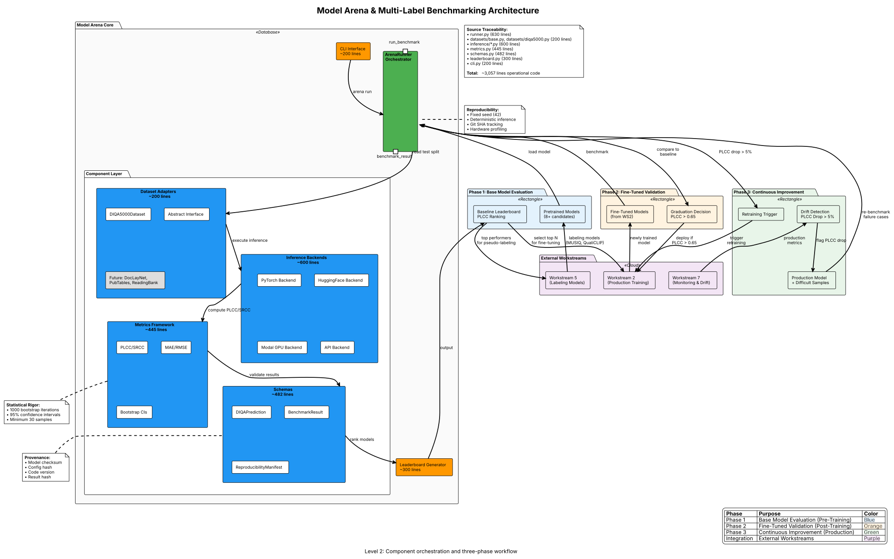

The Model Arena provides standardized, reproducible benchmarking across all label types throughout the model lifecycle. It serves as the **quality gate** for model deployment and the **quantitative feedback mechanism** for continuous improvement.

---

## Overview

**Purpose**: Evaluate model performance with statistical rigor to inform:

1. **Architecture selection** (pre-training) - Phase 1
2. **Production graduation** (post-training) - Phase 2
3. **Retraining triggers** (production feedback) - Phase 3

**Current Implementation**: DIQA-5000 (IQA benchmarking) - ✅ **Operational**

**Planned Extensions**: DocLayNet (layout), PubTables-1M (tables), ReadingBank (reading order)

**Lines of Code**: ~1,500+ across core infrastructure

---

## Architecture Overview

### System Diagram



*PlantUML source: [`model-arena-architecture.puml`](model-arena-architecture.puml)*

### System Components

The Model Arena consists of seven core components orchestrated by the ArenaRunner:

- **Dataset Adapters** (~200 lines) - Abstract interface for benchmark datasets (DIQA5000, future: DocLayNet, PubTables, ReadingBank)
- **Inference Backends** (~600 lines) - Multi-backend support (PyTorch, HuggingFace, Modal GPU, API)
- **Metrics Framework** (~445 lines) - Statistical evaluation (PLCC, SRCC, MAE, RMSE with bootstrapped CIs)
- **Schemas** (~482 lines) - Data models and reproducibility manifests
- **ArenaRunner** (~630 lines) - Central orchestrator with deterministic inference
- **Leaderboard Generator** (~300 lines) - Markdown/HTML output for model ranking
- **CLI Interface** (~200 lines) - Command-line tools for benchmark execution

### Core Workflow

```text
Phase 1: Base Evaluation          Phase 2: Fine-Tuned          Phase 3: Continuous
(Pre-Training)                     Validation (Post-Training)   Improvement (Production)
─────────────────                  ──────────────────────       ──────────────────────

Pretrained Models                  Fine-Tuned Model             Production Runtime
    (8+ candidates)                    (from Workstream 2)          (Workstream 1)
         │                                  │                             │
         ▼                                  ▼                             ▼
    ArenaRunner                        ArenaRunner                  Drift Detection
         │                                  │                        (Workstream 7)
         ▼                                  ▼                             │
    Leaderboard                        Compare to Baseline               ▼
  (ranked by PLCC)                          │                    Re-benchmark on
         │                                  ▼                     failure cases
         ▼                             Graduate if                       │
  Select Top N for                     PLCC > Threshold                  ▼
   Fine-Tuning                              │                    Trigger Retraining
         │                                  ▼                        if PLCC drop
         ▼                             Deploy to Production              │
  Workstream 2                         (Workstream 1)                    ▼
 (Production Training)                                              Validate Recovery
                                                                          │
                                                                          ▼
                                                                    Re-Deploy ✅
```

---

## Three Lifecycle Phases

### Phase 1: Base Model Evaluation (Pre-Training)

**When**: Before any fine-tuning or training

**Purpose**: Establish baseline performance across pretrained models

**Workflow**:

```text
Pretrained Models (8+ candidates)
    ↓
ArenaRunner (DIQA-5000 benchmark)
    ↓
Leaderboard (ranked by Overall PLCC)
    ↓
Select Top N Models for Fine-Tuning
```

**Current Results** (as of 2025-12-18):

| Rank | Model | Overall PLCC | 95% CI | Model Type |
|------|-------|--------------|--------|------------|
| 1 | PyIQA-QualiCLIP | 0.2216 | [0.144, 0.288] | iqa_pretrained |
| 2 | PyIQA-MUSIQ | 0.2098 | [0.136, 0.275] | iqa_pretrained |
| 3 | ResNet18-ImageNet-IQA *(legacy baseline; superseded by SigLIP 2 NAFlex multi-task)* | 0.0963 | [0.038, 0.155] | iqa_cnn |
| 4 | Swin-Tiny-ImageNet-IQA | 0.0474 | [-0.008, 0.099] | iqa_cnn |

**Key Insight**: QualiCLIP and MUSIQ outperform CNN baselines by 2-3x → prioritize for fine-tuning

**Decision Impact**: Informs Workstream 2 (Production Model Training) architecture choices

**Location**: [docs/benchmarks/README.md](../../../../benchmarks/README.md)

---

### Phase 2: Fine-Tuned Model Validation (Post-Training)

**When**: After fine-tuning on project-specific data (OHR-Bench, custom datasets)

**Purpose**: Validate fine-tuning effectiveness before production deployment

**Workflow**:

```text
Fine-Tuned Model (from Workstream 2)
    ↓
ArenaRunner (DIQA-5000 benchmark)
    ↓
Compare PLCC to Phase 1 Baseline
    ↓
Graduate to Production if Improvement > Threshold
```

**Production Graduation Criteria** (Multi-Metric Per-Head Thresholds):

The SigLIP 2 NAFlex multi-task model has 16 heads across 5 groups. Each head has an independent graduation threshold:

| Head Group | Head | Metric | Graduation Threshold |
|------------|------|--------|---------------------|
| **IQA** | overall, sharpness, color, noise, etc. | PLCC | > 0.65 |
| **Orientation** | 4-class orientation | Accuracy | > 95% |
| **Skew** | Continuous angle regression | MAE | < 0.5 degrees |
| **Script** | Multi-script classification | Accuracy | > 90% |
| **Handwriting** | Binary detection | F1 | > 0.85 |

- **Aggregate Graduation Score**: Weighted average across all heads (IQA heads weighted higher for IQA-focused deployment)
- **Minimum Improvement**: +10% on aggregate score over baseline
- **Confidence Interval**: 95% CI lower bound > baseline mean per head
- **No-Regression Rule**: No individual head may regress beyond 2% of its baseline

> **Legacy**: Previous single-metric graduation used PLCC > 0.65 only. The new multi-metric approach ensures all task heads meet quality standards independently.

**Example**:

- Baseline: QualiCLIP PLCC = 0.2216
- Fine-Tuned SigLIP 2 NAFlex: IQA PLCC = 0.68, Orientation Acc = 97%, Skew MAE = 0.3, Script Acc = 92%, Handwriting F1 = 0.88
- All per-head thresholds met → **Graduate to Production** ✅

**Decision Impact**: Gates deployment to Workstream 1 (Production Runtime)

---

### Multi-Task Arena Evaluation

The SigLIP 2 NAFlex multi-task model (16 heads, 5 groups) requires independent benchmarking per head using dataset-specific test sets:

**Per-Head Benchmark Datasets**:

| Head Group | Heads | Benchmark Dataset | Metric | Test Set Size |
|------------|-------|-------------------|--------|---------------|
| **IQA** | overall, sharpness, color, noise, etc. | DIQA-5000, OHR-Bench | PLCC, SRCC | 1,000+ |
| **Orientation** | 4-class (0/90/180/270) | Orientation-50K test split | Accuracy | 5,000 |
| **Skew** | Continuous angle (regression) | Skew-40K test split | MAE (degrees) | 4,000 |
| **Script** | Multi-script classification | Synth-multiscript test split | Accuracy | 10,000 |
| **Handwriting** | Binary detection | Handwriting-60K test split | F1 | 6,000 |

**Evaluation Process**:

1. Each head is benchmarked independently against its task-specific test set
2. Per-head metrics are computed with bootstrapped 95% confidence intervals
3. The aggregate graduation score is a weighted average across all heads
4. Any head failing its threshold blocks graduation (no partial deployment)

**MobileNetV4-Conv-S Evaluation** (~3ms, 3 heads):

The lightweight pre-correction model is evaluated separately:

| Head | Metric | Graduation Threshold |
|------|--------|---------------------|
| Orientation (4-class) | Accuracy | > 95% |
| Skew (regression) | MAE | < 0.5 degrees |
| Resolution quality (0-1) | PLCC | > 0.60 |

**Confidence-Based Classical Fallback**: When MobileNetV4 or SigLIP 2 confidence drops below head-specific thresholds, the system falls back to classical CV detectors for that task. The Arena tracks fallback rate as an operational metric.

---

### Phase 3: Continuous Improvement (Production Feedback Loop)

**When**: Ongoing during production operation

**Purpose**: Detect performance drift and validate retraining

**Workflow**:

```text
Production Runtime (Workstream 1)
    ↓
Drift Detection (Workstream 7) - flags PLCC drop
    ↓
Active Learning - collects difficult samples
    ↓
ArenaRunner - re-benchmark on failure cases
    ↓
If PLCC Drop > 5% → Trigger Retraining
    ↓
Retrained Model (Workstream 2)
    ↓
ArenaRunner - validate PLCC recovery
    ↓
Re-Deploy if Recovery Confirmed
```

**Retraining Triggers**:

- **PLCC drop > 5%** from production baseline
- **SRCC drop > 5%** (rank correlation degradation)
- **MAE increase > 10%** (absolute error growth)

**Temporal Tracking**: `IQA_MODEL_BENCHMARK_TRACKER.csv`

- Records benchmark results over time
- Monitors drift across model versions
- Stores: `model_id`, `benchmark_date`, `overall_plcc`, `overall_srcc`, `mae`, `rmse`

**Decision Impact**: Triggers Workstream 2 retraining, validates before re-deployment

---

## Component Architecture

### 1. ArenaRunner (`labeling/arena/runner.py`)

**Responsibilities**:

- Orchestrate deterministic inference with seed control
- Generate reproducibility manifests (Git SHA, dependencies, hardware)
- Compute metrics with bootstrapped confidence intervals
- Save per-sample results for error analysis

**Key Features**:

- **Reproducibility**: Fixed seed (42), deterministic PyTorch/NumPy
- **Robustness**: Handles inference failures gracefully
- **Performance**: Warmup iterations, batch processing support
- **Provenance**: Tracks Git commit, package versions, GPU type

**API**:

```python
from image_preprocessing_detector.labeling.arena import ArenaRunner, RunConfig
from image_preprocessing_detector.labeling.arena.datasets import DIQA5000Dataset
from image_preprocessing_detector.labeling.arena.inference import create_backend

# Configure benchmark
dataset = DIQA5000Dataset(split="test")
backend = create_backend("pytorch", model_path="models/qualiclip.pth")
config = RunConfig(output_dir="results/", save_manifest=True)

# Run benchmark
runner = ArenaRunner()
result = runner.run(backend, dataset, config)

print(f"Overall PLCC: {result.overall_plcc:.4f} [{result.overall_plcc_ci_lower:.4f}, {result.overall_plcc_ci_upper:.4f}]")
```

**Performance**: ~10-15 minutes for DIQA-5000 test set (1000 samples)

**Lines of Code**: ~630

---

### 2. Dataset Adapters (`labeling/arena/datasets/`)

**Abstract Interface** ([base.py](../../../../src/image_preprocessing_detector/labeling/arena/datasets/base.py)):

```python
class BenchmarkDataset(ABC):
    @abstractmethod
    def __len__(self) -> int: ...

    @abstractmethod
    def __getitem__(self, idx: int) -> DatasetSample: ...

    @abstractmethod
    def get_ground_truth(self, sample_id: str) -> DIQAGroundTruth: ...
```

**Current Implementation**:

- ✅ **DIQA5000Dataset** ([diqa5000.py](../../../../src/image_preprocessing_detector/labeling/arena/datasets/diqa5000.py)) - Document IQA benchmark
  - 5,000 document images with quality scores
  - Dimensions: overall, sharpness, color_fidelity
  - Test split: 1,000 samples

**Planned Implementations**:

- 📋 **DocLayNetDataset** - Layout detection (11 classes)
- 📋 **PubTablesDataset** - Table structure extraction
- 📋 **ReadingBankDataset** - Reading order prediction
- 📋 **VerticalTextDataset** - Vertical text detection
- 📋 **ParasiticContentDataset** - Watermark/stamp filtering

**Extensibility**: Any dataset with ground truth labels can be integrated via abstract interface

**Lines of Code**: ~200 (base + DIQA5000)

---

### 3. Inference Backends (`labeling/arena/inference/`)

**Supported Backends**:

- **PyTorch** ([local.py](../../../../src/image_preprocessing_detector/labeling/arena/inference/local.py)) - Local GPU/CPU inference
- **HuggingFace** ([huggingface.py](../../../../src/image_preprocessing_detector/labeling/arena/inference/huggingface.py)) - Transformers models
- **Modal** ([modal.py](../../../../src/image_preprocessing_detector/labeling/arena/inference/modal.py)) - Serverless GPU
- **API** ([api.py](../../../../src/image_preprocessing_detector/labeling/arena/inference/api.py)) - OpenAI, Google Gemini
- **Regression** ([regression.py](../../../../src/image_preprocessing_detector/labeling/arena/inference/regression.py)) - Regression model wrapper

**Backend Selection**:

```python
backend = create_backend(
    backend_type="pytorch",  # or "huggingface", "modal", "api"
    model_path="models/qualiclip.pth",
    device="cuda",  # or "cpu"
    batch_size=16
)
```

**Abstract Interface** ([base.py](../../../../src/image_preprocessing_detector/labeling/arena/inference/base.py)):

```python
class InferenceBackend(ABC):
    @abstractmethod
    def load(self, spec: ModelSpec, config: InferenceConfig) -> None: ...

    @abstractmethod
    def predict_batch(self, images: list[NDArray]) -> list[DIQAPrediction]: ...

    @abstractmethod
    def get_provenance(self) -> ProvenanceInfo: ...
```

**Performance Tracking**:

- Inference time per sample (ms)
- Model load time (seconds)
- GPU memory usage

**Lines of Code**: ~600 (all backends)

---

### 4. Metrics Framework (`labeling/arena/metrics.py`)

**ArenaMetrics Class**:

- **Correlation**: PLCC (Pearson), SRCC (Spearman)
- **Error**: MAE (Mean Absolute Error), RMSE (Root Mean Squared Error)
- **Confidence Intervals**: Bootstrapped 95% CIs (1000 iterations, seed=42)

**Multi-Dimension Support**:

- Compute metrics per quality dimension (overall, sharpness, color)
- Aggregate across dimensions with weighted averaging

**Statistical Rigor**:

- Minimum 30 samples required for bootstrap
- Stratified sampling for balanced CIs
- Outlier detection and reporting

**API**:

```python
from image_preprocessing_detector.labeling.arena.metrics import ArenaMetrics

metrics = ArenaMetrics.compute(predictions, ground_truth)
result = metrics.to_dict()  # PLCC, SRCC, MAE, RMSE with CIs

# Human-readable output
print(metrics.summary())  # Table format
print(metrics.to_markdown())  # Markdown table
```

**Lines of Code**: ~445

---

### 5. Schemas (`labeling/arena/schemas.py`)

**Core Data Structures**:

```python
@dataclass
class DIQAPrediction:
    """Model prediction for a single document image."""
    overall: float  # [0, 1]
    sharpness: float  # [0, 1]
    color: float  # [0, 1]
    image_id: str
    inference_time_ms: float

@dataclass
class BenchmarkResult:
    """Complete result of a benchmark run."""
    run_id: str
    status: RunStatus  # completed, failed, cancelled
    model_spec: dict[str, Any]
    dataset: DatasetInfo
    metrics: dict[str, Any]  # ArenaMetrics.to_dict()
    execution: ExecutionInfo
    provenance: ProvenanceInfo
    sample_results: list[SampleResult]
    manifest_path: str | None
    error_message: str | None

@dataclass
class ReproducibilityManifest:
    """Manifest for reproducing a benchmark run."""
    run_id: str
    model: dict[str, Any]
    dataset: dict[str, Any]
    environment: dict[str, Any]
    seeds: dict[str, int]
    result_hash: str
    created_at: str
```

**Serialization**:

- JSON export/import
- YAML manifests
- Content hashing for verification

**Lines of Code**: ~482

---

### 6. Leaderboard Generator (`labeling/arena/leaderboard.py`)

**Responsibilities**:

- Generate human-readable leaderboards in Markdown and HTML
- Support filtering by model family, variant type, and metric
- Rank models by specified metric (PLCC, SRCC, MAE, RMSE)

**Configuration**:

```python
@dataclass
class LeaderboardConfig:
    title: str = "DIQA-5000 Benchmark Leaderboard"
    description: str | None = None
    sort_by: str = "aggregate.plcc"
    filter_variant: list[str] | None = None
    filter_family: list[str] | None = None
    max_entries: int | None = None
    show_timestamps: bool = True
    decimal_places: int = 4
```

**Output Formats**:

- Markdown tables for docs
- HTML for web dashboard
- CSV for analysis

**Lines of Code**: ~300 (estimated, file truncated in read)

---

### 7. CLI Interface (`labeling/arena/cli.py`)

**Commands**:

```bash
# Run benchmark
arena run --model-spec ./specs/qualiclip.yaml \
          --dataset diqa5000 \
          --split test \
          --output ./results/

# Generate leaderboard
arena leaderboard --results-dir ./results/ \
                  --sort-by aggregate.plcc \
                  --output leaderboard.md

# Compare models
arena compare --models model_a model_b model_c \
              --metric aggregate.plcc
```

**Lines of Code**: ~200 (estimated)

---

## Reproducibility Infrastructure

### Reproducibility Manifests

**Generated per benchmark run**:

```json
{
  "run_id": "a1b2c3d4e5f6",
  "timestamp": "2025-12-19T10:30:00Z",
  "dataset": {
    "name": "DIQA-5000",
    "split": "test",
    "num_samples": 1000
  },
  "model": {
    "model_id": "qualiclip-ohrbench-v1",
    "architecture": "PyIQA-QualiCLIP",
    "checkpoint_path": "models/qualiclip_finetuned.pth"
  },
  "environment": {
    "git_sha": "4dc216a",
    "git_dirty": false,
    "python_version": "3.12.3",
    "torch_version": "2.1.0",
    "cuda_version": "12.1"
  },
  "hardware": {
    "gpu_type": "NVIDIA T4",
    "gpu_memory_gb": 16,
    "device": "cuda"
  },
  "config": {
    "seed": 42,
    "batch_size": 16,
    "num_workers": 4
  }
}
```

**Benefits**:

- **Auditability**: Trace benchmark results to exact code version
- **Reproducibility**: Re-run benchmarks with identical setup
- **Debugging**: Identify performance regressions from environment changes

---

### Deterministic Inference

**Seed Control**:

```python
# Set all random seeds
torch.manual_seed(42)
np.random.seed(42)
random.seed(42)
torch.backends.cudnn.deterministic = True
torch.backends.cudnn.benchmark = False
```

**Guarantees**:

- Same model + same data → same predictions (bit-for-bit)
- Bootstrapped CIs reproducible across runs
- Fair comparison between models

---

## Integration Points

### Workstream 2: Production Model Training

**Arena Input**: Newly trained models (SigLIP 2 NAFlex multi-task, MobileNetV4-Conv-S, fine-tuned)

**Arena Output**: Per-head metric benchmarks, multi-metric graduation decision

**Decision**: Deploy to production if all per-head thresholds met (IQA PLCC > 0.65, Orientation accuracy > 95%, Skew MAE < 0.5, Script accuracy > 90%, Handwriting F1 > 0.85)

**Example**:

- Train SigLIP 2 NAFlex on 10 purpose-built datasets (~503K images)
- Arena benchmark: IQA PLCC = 0.72, Orientation Acc = 97%, Skew MAE = 0.3, Script Acc = 93%, Handwriting F1 = 0.89
- All per-head thresholds met → **Graduate to Production** ✅

---

### Workstream 5: Labeling Model Training

**Arena Input**: Labeling models (MUSIQ, QualiCLIP, DocIQ)

**Arena Output**: Phase 1 baseline leaderboard

**Decision**: Select top models for fine-tuning (Workstream 2)

**Example**:

- Benchmark 8 pretrained models
- QualiCLIP ranks #1 (PLCC = 0.2216)
- Fine-tune QualiCLIP on OHR-Bench
- Use fine-tuned QualiCLIP for pseudo-labeling (Workstream 4)

---

### Workstream 7: Monitoring & Drift Detection

**Arena Input**: Production model + difficult samples (active learning)

**Arena Output**: PLCC drop quantification, retraining trigger

**Decision**: Retrain if PLCC drop > 5%

**Workflow**:

1. Drift detector flags PLCC drop from 0.72 → 0.67 (7% degradation)
2. Arena re-benchmarks on failure cases: PLCC = 0.65
3. Trigger retraining with augmented dataset (original + failures)
4. Arena validates retrained model: PLCC = 0.74 [0.71, 0.77]
5. Re-deploy to production ✅

---

### Production Runtime Deployment Gate

**Model Arena serves as the quality gate for Production Runtime deployment:**

**Graduation Criteria** (Phase 2 Validation - Multi-Metric Per-Head):

- **IQA PLCC**: > 0.65 | **Orientation Accuracy**: > 95% | **Skew MAE**: < 0.5 degrees
- **Script Accuracy**: > 90% | **Handwriting F1**: > 0.85
- **Minimum Improvement**: +10% on aggregate weighted score over baseline
- **Confidence Interval**: 95% CI lower bound > baseline mean per head

**Deployment Decision Process**:

1. **Training Complete** (Workstream 2) → Model exported to registry
2. **Arena Benchmark** (Workstream 6 Phase 2) → Validate on DIQA-5000 test set
3. **Graduation Check**: All per-head thresholds met AND aggregate improvement > 10%?
   - ✅ **YES**: Deploy to Production Runtime (Workstream 1)
   - ❌ **NO**: Return to training with analysis of failure modes

**Rollback Trigger** (Phase 3 Continuous Improvement):

- **PLCC drop > 10%** from production baseline → Auto-trigger retraining (Workstream 7)
- **Arena re-validation** required before re-deployment

**Example Workflow**:

```text
Workstream 2 (Training): SigLIP 2 NAFlex multi-task trained on 10 purpose-built datasets (~503K images)
    ↓
Workstream 6 (Arena Phase 2): Per-head benchmark on task-specific test sets
    Result: IQA PLCC = 0.68, Orientation Acc = 97%, Skew MAE = 0.3, Script Acc = 92%, Handwriting F1 = 0.88
    All per-head thresholds met ✅
    ↓
Workstream 1 (Production Runtime): Deploy MobileNetV4-Conv-S + SigLIP 2 NAFlex pipeline
    ↓
Workstream 7 (Monitoring): Track per-head baselines (16 independent metrics)
    ↓ (after 3 months)
Drift detected: Script Accuracy dropped 92% → 85% (below 90% threshold) → Trigger head-specific retraining
    ↓
Workstream 2 (Retraining): Fine-tune Script head with augmented dataset (freeze other heads)
    ↓
Workstream 6 (Arena Phase 3): Validate recovery on all heads
    Result: Script Acc = 93%, all other heads stable ✅
    ↓
Workstream 1 (Production Runtime): Re-deploy updated multi-task model
```

See [Production Runtime](../production-runtime/index.md) for deployment procedures.

---

## Multi-Label Extensibility

### Design Principles

1. **Abstract Base Class**: `BenchmarkDataset` decouples Arena from specific datasets
2. **Pluggable Metrics**: Metrics computed based on label type (regression, classification, ranking)
3. **Modular Backends**: Inference backend independent of dataset/metrics

### Adding New Label Types

**Example: Layout Detection Benchmark**

```python
# 1. Implement dataset
class DocLayNetDataset(BenchmarkDataset):
    def __getitem__(self, idx: int) -> DatasetSample:
        # Load image and ground truth bounding boxes
        ...

    def get_ground_truth(self, sample_id: str) -> LayoutGroundTruth:
        # Return 11-class layout annotations
        ...

# 2. Implement metrics
class LayoutMetrics:
    def compute_ap(self, predictions, ground_truth) -> float:
        # Compute Average Precision per class
        ...

    def compute_map(self) -> float:
        # Mean Average Precision across 11 classes
        ...

# 3. Run benchmark
dataset = DocLayNetDataset(split="test")
backend = create_backend("pytorch", model_path="models/docling_layout_heron.pth")
runner = ArenaRunner()
result = runner.run(backend, dataset, config)
```

**Planned Timeline**:

- **Phase 7** (Q1 2025): Continuous improvement infrastructure
- **Phase 9** (Q2 2025): Layout/table/reading order benchmarks

---

## Performance Characteristics

| Component | Latency | Notes |
|-----------|---------|-------|
| **ArenaRunner** | ~5-10 min | 1000 samples, GPU inference |
| **Model Loading** | ~2-5 sec | PyTorch checkpoint |
| **Inference** | ~50-200 ms/sample | Depends on model size |
| **Metrics Computation** | ~10-30 sec | Bootstrap 1000 iterations |
| **Total Benchmark** | ~10-15 min | DIQA-5000 test set (1000 samples) |

**Optimization**:

- Batch inference for throughput
- ONNX backend for production-like speed
- Modal serverless for GPU burst capacity

---

## Current Status & Roadmap

### Implemented ✅

- ArenaRunner orchestration (~630 lines)
- DIQA-5000 dataset integration (~200 lines)
- PyTorch + HuggingFace + Modal + API backends (~600 lines)
- PLCC, SRCC, MAE, RMSE metrics (~445 lines)
- Bootstrapped 95% confidence intervals
- Reproducibility manifests (~482 lines schemas)
- Phase 1 baseline leaderboard (8 models)
- Leaderboard generator (~300 lines)
- CLI (~200 lines)

**Total**: ~3,057 lines operational code

### In Progress 🚧

- Phase 2 fine-tuned model benchmarks
- Phase 3 temporal tracking (`IQA_MODEL_BENCHMARK_TRACKER.csv`)
- Modal serverless backend optimization

### Planned 📋

- DocLayNet layout benchmarks (Phase 9)
- PubTables-1M table benchmarks (Phase 9)
- ReadingBank reading order benchmarks (Phase 9)
- Automated retraining integration (Phase 7)

---

## File Structure

```text
src/image_preprocessing_detector/labeling/arena/
├── __init__.py                 # Public API exports
├── runner.py                   # ArenaRunner orchestrator (630 lines)
├── metrics.py                  # PLCC, SRCC, MAE, RMSE (445 lines)
├── schemas.py                  # Data models, serialization (482 lines)
├── leaderboard.py              # Leaderboard generation (300 lines)
├── cli.py                      # CLI (200 lines)
├── modal_client.py             # Modal GPU client
├── datasets/
│   ├── base.py                 # Abstract dataset interface
│   └── diqa5000.py             # DIQA-5000 implementation (200 lines)
└── inference/
    ├── base.py                 # Abstract backend interface
    ├── local.py                # PyTorch backend
    ├── huggingface.py          # HuggingFace backend
    ├── modal.py                # Modal serverless backend
    ├── api.py                  # API backend (OpenAI, Gemini)
    └── regression.py           # Regression model wrapper

docs/benchmarks/
├── README.md                   # Leaderboard documentation
└── diqa5000_benchmark_results.csv  # Historical results

benchmarks/results/
└── IQA_MODEL_BENCHMARK_TRACKER.csv  # Temporal tracking (Phase 7)

docs/planning/
└── PROJECT_A_BENCHMARKING_ARENA.md  # Requirements document
```

---

## Related Documentation

| Level | Document | Description |
|-------|----------|-------------|
| **Level 0** | [RAG Pipeline Overview](../../level-0/index.md) | Multi-project context |
| **Level 1** | [Prepare-Doc Architecture](../../level-1/index.md) | Eight workstreams overview |
| **Level 2** | [Production Model Training](../model-training/index.md) | Training pipeline (generates models for Arena) |
| **Level 2** | [Monitoring & Drift Detection](../monitoring-drift/index.md) | Drift triggers Arena re-benchmarks |
| **Level 2** | [Labeling & Benchmarking Models](../labeling-benchmarking/index.md) | Labeling model training (Phase 1 baselines) |
| **Benchmarks** | [DIQA-5000 Results](../../../../benchmarks/README.md) | Current leaderboard |
| **Planning** | [Arena Requirements](../../../../planning/PROJECT_A_BENCHMARKING_ARENA.md) | Detailed requirements |

---

## Level 3 Decision

**Is Level 3 Necessary?**

**Analysis**: The Model Arena workstream is architecturally **component-based** rather than **workflow-based**. The six core components (ArenaRunner, Datasets, Inference Backends, Metrics, Schemas, Leaderboard) are well-documented above with:

- Clear responsibilities
- API signatures
- Integration patterns
- File locations
- Line counts

**Level 3 would provide**:

- Per-module implementation details (e.g., `runner.py` class diagram)
- Internal method call flows within components
- Detailed algorithm pseudocode

**Recommendation**: **Level 3 NOT REQUIRED** for Model Arena at this time.

**Rationale**:

1. **Self-Contained Components**: Each component (~200-630 lines) is small enough to understand by reading the source
2. **Well-Documented Code**: Existing docstrings and type hints provide implementation details
3. **Simple Data Flow**: Linear pipeline (load → infer → compute → save) with no complex state management
4. **No Hidden Complexity**: No multi-step workflows within components that would benefit from sequence diagrams

**When Level 3 WOULD be needed**:

- If components grow beyond 1,000 lines each
- If complex state machines or multi-phase workflows emerge within components
- If integration patterns become non-obvious and require sequence diagrams
- If algorithm details (e.g., bootstrap procedure) need formal specification

**Current Guidance**: Developers should read source files directly for implementation details. This Level 2 index provides sufficient architecture context for:

- Understanding system boundaries
- Selecting appropriate components
- Integrating with other workstreams
- Planning new label type extensions

---

## Source File Traceability

This section maps Model Arena components to implementation files with LOC counts.

| Workflow Step | Source Files | LOC | Total | Percentage |
|---------------|--------------|-----|-------|------------|
| **Benchmark Orchestration** | `src/labeling/arena/runner.py`, `src/labeling/arena/cli.py` | 630, 566 | 1,196 | 18.9% |
| **Leaderboard & Results** | `src/labeling/arena/leaderboard.py`, `src/labeling/arena/metrics.py` | 699, 444 | 1,143 | 18.0% |
| **Inference Backends** | `src/labeling/arena/inference/*.py` (7 files) | 508, 466, 428, 426, 411, 258, 26 | 2,523 | 39.8% |
| **Modal Integration** | `src/labeling/arena/modal_client.py` | 534 | 534 | 8.4% |
| **Data Schemas** | `src/labeling/arena/schemas.py` | 481 | 481 | 7.6% |
| **Dataset Loaders** | `src/labeling/arena/datasets/*.py` (3 files) | 328, 11, 17 | 356 | 5.6% |
| **Supporting** | `src/labeling/arena/__init__.py` | 107 | 107 | 1.7% |
| **Workstream Total** | **31 files** | — | **6,340** | **100%** |

**Validation**: LOC count validated against `docs/architecture/workstream_loc_counts.json` (WS6: 6,340 lines).

**Key Components**:

1. **Inference Backends** (2,523 lines, 39.8%):
   - `regression.py`: Regression model inference (508 lines)
   - `huggingface.py`: HuggingFace model integration (466 lines)
   - `api.py`: API-based inference (428 lines)
   - `modal.py`: Modal GPU inference (426 lines)
   - `local.py`: Local model inference (411 lines)
   - `base.py`: Abstract inference interface (258 lines)

2. **Benchmark Orchestration** (1,196 lines, 18.9%):
   - `runner.py`: ArenaRunner for benchmark execution
   - `cli.py`: Command-line interface for arena operations

3. **Results & Leaderboard** (1,143 lines, 18.0%):
   - `leaderboard.py`: Leaderboard generation and ranking
   - `metrics.py`: SRCC, PLCC, ECE, KL divergence calculations

4. **Integration & Schemas** (1,015 lines, 16.0%):
   - `modal_client.py`: Modal serverless integration
   - `schemas.py`: Pydantic data models for benchmarks

**Benchmark Metrics**:

- **SRCC** (Spearman Rank Correlation): Ranking quality
- **PLCC** (Pearson Linear Correlation): Linear correlation
- **ECE** (Expected Calibration Error): Confidence calibration
- **KL Divergence**: Distribution alignment

**Supported Backends**:

- Local inference (CPU/GPU)
- Modal GPU (serverless)
- HuggingFace Inference API
- Custom API endpoints
- Regression models

---

## Source Files

**Architecture Diagrams**:

- [model-arena-architecture.puml](model-arena-architecture.puml) - PlantUML source
- [model-arena-architecture.svg](model-arena-architecture.svg) - Generated diagram

**Core Implementation**:

- [runner.py](../../../../src/image_preprocessing_detector/labeling/arena/runner.py) - ArenaRunner (630 lines)
- [metrics.py](../../../../src/image_preprocessing_detector/labeling/arena/metrics.py) - ArenaMetrics (445 lines)
- [schemas.py](../../../../src/image_preprocessing_detector/labeling/arena/schemas.py) - Data models (482 lines)
- [leaderboard.py](../../../../src/image_preprocessing_detector/labeling/arena/leaderboard.py) - Leaderboard generation (300 lines)
- [cli.py](../../../../src/image_preprocessing_detector/labeling/arena/cli.py) - CLI (200 lines)
- [datasets/base.py](../../../../src/image_preprocessing_detector/labeling/arena/datasets/base.py) - Abstract dataset
- [datasets/diqa5000.py](../../../../src/image_preprocessing_detector/labeling/arena/datasets/diqa5000.py) - DIQA-5000 impl (200 lines)
- [inference/](../../../../src/image_preprocessing_detector/labeling/arena/inference/) - Inference backends (600 lines total)

**Results & Tracking**:

- [benchmarks/README.md](../../../../benchmarks/README.md) - Leaderboard
- [benchmarks/diqa5000_benchmark_results.csv](../../../../benchmarks/diqa5000_benchmark_results.csv) - Benchmark history
- `benchmarks/results/IQA_MODEL_BENCHMARK_TRACKER.csv` - Temporal tracking (Phase 7)

**Requirements**:

- [PROJECT_A_BENCHMARKING_ARENA.md](../../../../planning/PROJECT_A_BENCHMARKING_ARENA.md) - Requirements document

---

*Last Updated: 2025-12-19*
