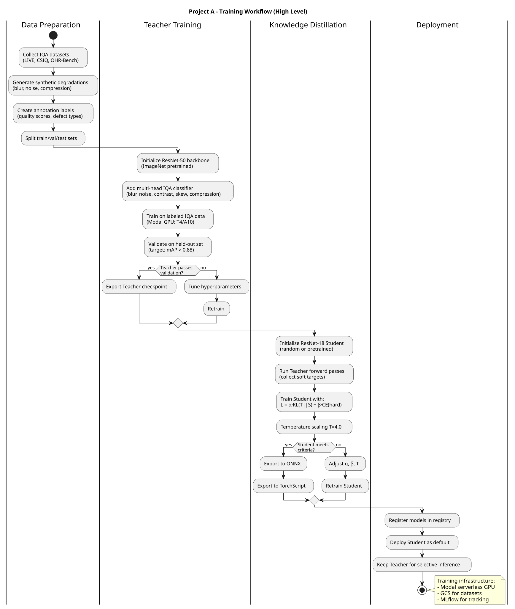

# Level 2: Model Training

This level provides detailed diagrams for the Model Training workstream - training and optimization of production ML models.

---

## Training Workflow - High Level

Overview of the complete model training pipeline from data preparation to model registry.

---

## Knowledge Distillation

Detailed flow of the teacher-student knowledge distillation process for IQA models.

---

## Key Components

| Component | Source Files | Purpose |
|-----------|--------------|---------|
| Teacher Model | `modal/train_phase2_iqa.py` | ResNet-50 teacher training |
| Student Model | `modal/train_phase2_iqa.py` | ResNet-18 distillation |
| ONNX Export | `modal/export_onnx.py` | Production model export |
| Model Registry | GCS bucket | Versioned model storage |

---

## Model Architecture

| Model | Architecture | Parameters | Purpose |
|-------|--------------|------------|---------|
| IQA Teacher | ResNet-50 | ~25M | High-capacity reference model |
| IQA Student | ResNet-18 | ~11M | Production inference (distilled) |
| DocLayout-YOLO | YOLOv10-nano | ~3M | Layout detection (11 classes) |

---

## Related Diagrams

| Level | Diagram | Description |
|-------|---------|-------------|
| **Level 1** | [Project A Architecture](../../level-1/index.md) | System architecture |
| **Level 2** | [Data Preparation](../data-preparation/index.md) | Dataset ingestion |
| **Level 2** | [Pseudo-Labeling](../pseudo-labeling/index.md) | Label generation |
