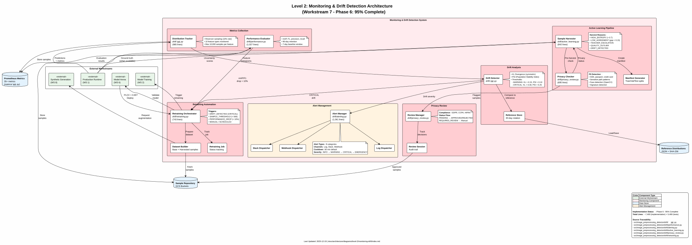

The Monitoring & Drift Detection workstream provides **continuous quality assurance** for production models through statistical performance tracking, anomaly detection, intelligent sample harvesting, and automated retraining orchestration.

**Status**: Phase 6 - 95% Complete (~7,400 lines of production code)

---

## Overview

**Purpose**: Maintain production model quality through a closed-loop continuous improvement system:

1. **Performance Monitoring** - Track IQA accuracy (PLCC, SRCC, MAE), latency, throughput
2. **Drift Detection** - Statistical degradation detection using KL divergence and PSI
3. **Active Learning** - Harvest difficult/uncertain samples for retraining
4. **Privacy Review** - GDPR/CCPA-compliant sample collection workflow
5. **Retraining Automation** - Trigger and orchestrate model updates when drift exceeds thresholds

**Key Innovation**: Closed-loop feedback from production failures to validated model re-deployment

**Lines of Code**: ~7,400 (implementation) + 5,400 (tests)

---

## Technical Diagram



*PlantUML source: [`monitoring-drift-architecture.puml`](monitoring-drift-architecture.puml)*

---

## Architecture Overview

```text
┌─────────────────────────────────────────────────────────────────────────────┐
│                        MONITORING & DRIFT DETECTION                          │
│                              (Workstream 7)                                   │
└─────────────────────────────────────────────────────────────────────────────┘
                                     │
      ┌──────────────────────────────┼──────────────────────────────┐
      │                              │                              │
      ▼                              ▼                              ▼
┌──────────────┐          ┌──────────────────┐          ┌──────────────────┐
│  Production  │          │  Prometheus      │          │  Grafana         │
│  Runtime     │─────────▶│  Metrics         │─────────▶│  Dashboards      │
│  (WS1)       │          │  (35+ metrics)   │          │  (5 dashboards)  │
└──────────────┘          └────────┬─────────┘          └──────────────────┘
                                   │
                          ┌────────▼─────────┐
                          │  Distribution    │
                          │  Tracker         │
                          │  (Reservoir      │
                          │   Sampling)      │
                          └────────┬─────────┘
                                   │
                   ┌───────────────┼───────────────┐
                   │               │               │
                   ▼               ▼               ▼
           ┌─────────────┐ ┌─────────────┐ ┌─────────────┐
           │  KL         │ │  PSI        │ │  Performance│
           │  Divergence │ │  Shift      │ │  Evaluator  │
           │  Detection  │ │  Detection  │ │  (mAP/F1)   │
           └──────┬──────┘ └──────┬──────┘ └──────┬──────┘
                  │               │               │
                  └───────────────┼───────────────┘
                                  │
                          ┌───────▼───────┐
                          │  Drift        │
                          │  Detector     │
                          │  (severity)   │
                          └───────┬───────┘
                                  │
              ┌───────────────────┼───────────────────┐
              │                   │                   │
              ▼                   ▼                   ▼
      ┌───────────────┐   ┌───────────────┐   ┌───────────────┐
      │  Alert        │   │  Active       │   │  Performance  │
      │  Manager      │   │  Learning     │   │  Job          │
      │               │   │  Sampler      │   │  (24h eval)   │
      └───────┬───────┘   └───────┬───────┘   └───────────────┘
              │                   │
    ┌─────────┴─────────┐        │
    ▼         ▼         ▼        ▼
┌───────┐ ┌───────┐ ┌───────┐ ┌───────────────┐
│ Log   │ │ Slack │ │Webhook│ │ Privacy       │
│       │ │       │ │       │ │ Checker       │
└───────┘ └───────┘ └───────┘ └───────┬───────┘
                                      │
                              ┌───────▼───────┐
                              │  Privacy      │
                              │  Review       │
                              │  Manager      │
                              └───────┬───────┘
                                      │
                              ┌───────▼───────┐
                              │  Manifest     │
                              │  Generator    │
                              └───────┬───────┘
                                      │
                              ┌───────▼───────┐
                              │  Retraining   │
                              │  Orchestrator │
                              └───────┬───────┘
                                      │
              ┌───────────────────────┼───────────────────────┐
              │                       │                       │
              ▼                       ▼                       ▼
      ┌───────────────┐       ┌───────────────┐       ┌───────────────┐
      │  Dataset      │       │  Production   │       │  Model Arena  │
      │  Builder      │       │  Training     │       │  Benchmark    │
      │               │       │  (WS2)        │       │  (WS6)        │
      └───────────────┘       └───────────────┘       └───────────────┘
```

---

## Six Core Components

### 1. Distribution Tracking & Drift Detection (`drift/__init__.py` - 985 lines)

**Sprint**: 6.3.1 - Feature distribution monitoring with KL divergence and PSI

**Responsibilities**:

- Track feature distributions using reservoir sampling (memory-efficient)
- Compute KL divergence (symmetric variant) for distribution shift detection
- Calculate Population Stability Index (PSI) for categorical drift
- Classify drift severity (NONE / WARNING / CRITICAL)
- Persist reference distributions with 30-day rotation

**Key Classes**:

| Class | Purpose | Lines |
|-------|---------|-------|
| `DistributionTracker` | Reservoir sampling for memory-efficient feature tracking | ~200 |
| `DriftDetector` | KL/PSI computation and severity classification | ~300 |
| `ReferenceStore` | Persistent reference distribution management with SHA-256 integrity | ~250 |

**Feature Types Monitored** (10 features):

- `quality_score`, `blur_score`, `skew_angle`, `contrast`
- `noise_level`, `brightness`, `sharpness`
- `escalation_rate`, `processing_time`, `gate_confidence`

**Severity Thresholds**:

| Level | KL Divergence | PSI | Action |
|-------|---------------|-----|--------|
| **NONE** | < 0.15 | < 0.10 | Normal operation |
| **WARNING** | 0.15 - 0.30 | 0.10 - 0.25 | Increase monitoring |
| **CRITICAL** | > 0.30 | > 0.25 | Trigger retraining |

**API**:

```python
from image_preprocessing_detector.drift import (
    DistributionTracker, DriftDetector, ReferenceStore, FeatureType
)

# Initialize components
tracker = DistributionTracker(sample_rate=0.1, max_samples=10000)
store = ReferenceStore(storage_dir="drift_references/", expiration_days=30)
detector = DriftDetector(kl_warn=0.15, kl_critical=0.30, psi_warn=0.10, psi_critical=0.25)

# Track feature values
tracker.add_sample(FeatureType.QUALITY_SCORE, 0.72)
tracker.add_sample(FeatureType.BLUR_SCORE, 0.15)

# Compute drift against reference
reference = store.load_reference(FeatureType.QUALITY_SCORE)
current = tracker.get_histogram(FeatureType.QUALITY_SCORE)
result = detector.compute_drift(current, reference)

print(f"KL Divergence: {result.kl_divergence:.4f}")
print(f"PSI: {result.psi:.4f}")
print(f"Severity: {result.severity}")  # NONE, WARNING, or CRITICAL
```

---

### 2. Performance Monitoring (`drift/performance.py` - 1,027 lines)

**Sprint**: 6.3.2 - Periodic evaluation with mAP/F1 tracking

**Responsibilities**:

- Store and aggregate evaluation results (90-day retention)
- Compute baseline performance windows (7-day default)
- Trend analysis (improving / stable / degrading)
- Scheduled performance evaluation jobs (24-hour intervals)

**Key Classes**:

| Class | Purpose | Lines |
|-------|---------|-------|
| `MetricsStore` | Persistent evaluation result storage with 90-day retention | ~300 |
| `PerformanceEvaluator` | Baseline comparison and trend analysis | ~350 |
| `PerformanceJob` | Scheduled 24-hour evaluation runner | ~200 |
| `EvaluationResult` | Data structure with serialization | ~150 |

**Metrics Tracked** (6 core metrics):

| Metric | Description | Warning Threshold | Critical Threshold |
|--------|-------------|-------------------|-------------------|
| **mAP** | Mean Average Precision | -3% from baseline | -5% from baseline |
| **F1** | F1 Score | -3% from baseline | -5% from baseline |
| **Precision** | Precision score | -5% from baseline | -10% from baseline |
| **Recall** | Recall score | -5% from baseline | -10% from baseline |
| **Accuracy** | Overall accuracy | -3% from baseline | -5% from baseline |
| **Latency** | Inference latency (p95) | +25% from baseline | +50% from baseline |

**Trend Classification**:

- **IMPROVING**: Current metrics > baseline by margin
- **STABLE**: Within ±3% of baseline
- **DEGRADING**: Below baseline by > 3%

**API**:

```python
from image_preprocessing_detector.drift.performance import (
    MetricsStore, PerformanceEvaluator, PerformanceJob
)

# Initialize
store = MetricsStore(storage_dir="metrics/", retention_days=90)
evaluator = PerformanceEvaluator(store, baseline_window_days=7)

# Run evaluation
result = evaluator.evaluate(
    model_version="resnet18-v1.2",
    predictions=predictions,
    ground_truth=labels
)

# Check trend
trend = evaluator.get_trend(metric="mAP", lookback_days=30)
print(f"mAP Trend: {trend}")  # IMPROVING, STABLE, or DEGRADING

# Schedule periodic evaluation
job = PerformanceJob(evaluator, interval_hours=24, output_dir="reports/")
job.start()
```

---

### 3. Alerting System (`drift/alerting.py` - 1,061 lines)

**Sprint**: 6.3.3 - Multi-channel alert dispatch with dry-run support

**Responsibilities**:

- Generate alerts based on drift severity and performance degradation
- Dispatch to multiple channels (Log, Slack, Webhook)
- Cooldown management to prevent alert spam (60-min default)
- Alert history tracking with 30-day retention

**Alert Types** (8 types):

| Alert Type | Trigger | Source |
|------------|---------|--------|
| `KL_DIVERGENCE` | KL > threshold | Drift detection |
| `PSI_SHIFT` | PSI > threshold | Drift detection |
| `MAP_DROP` | mAP drop > threshold | Performance monitoring |
| `F1_DROP` | F1 drop > threshold | Performance monitoring |
| `PRECISION_DROP` | Precision drop > threshold | Performance monitoring |
| `RECALL_DROP` | Recall drop > threshold | Performance monitoring |
| `DISTRIBUTION_SHIFT` | Multiple features drifting | Drift aggregation |
| `MODEL_DRIFT` | Composite drift signal | Drift + performance |

**Dispatch Channels**:

| Channel | Implementation | Notes |
|---------|----------------|-------|
| `LogDispatcher` | Native Python logging | Always enabled |
| `SlackDispatcher` | Incoming webhooks | Channel: #ml-ops |
| `WebhookDispatcher` | HTTPS-only POST | Validated endpoints |
| `DryRunDispatcher` | Test mode | No actual dispatch |

**Alert Severity Levels**:

| Level | Trigger | Action | Cooldown |
|-------|---------|--------|----------|
| **INFO** | 2% metric drop | Log only | 15 min |
| **WARNING** | 5% metric drop | Notify team | 60 min |
| **CRITICAL** | 10% metric drop | Auto-trigger retraining | 4 hours |
| **EMERGENCY** | 20% metric drop | Halt production, rollback | None |

**API**:

```python
from image_preprocessing_detector.drift.alerting import (
    AlertManager, AlertType, SlackDispatcher, WebhookDispatcher
)

# Configure alert manager
manager = AlertManager(
    dispatchers=[
        SlackDispatcher(webhook_url="https://hooks.slack.com/..."),
        WebhookDispatcher(url="https://api.pagerduty.com/...")
    ],
    cooldown_minutes=60
)

# Generate alert from drift result
alert = manager.create_alert(
    alert_type=AlertType.KL_DIVERGENCE,
    severity="WARNING",
    metric_value=0.22,
    threshold=0.15,
    feature="quality_score"
)

# Dispatch with cooldown check
if manager.should_dispatch(alert):
    manager.dispatch(alert)
```

**Alert Payload Format**:

```json
{
  "alert_id": "drift_2025-12-19_143052",
  "alert_type": "KL_DIVERGENCE",
  "severity": "WARNING",
  "metric": "quality_score",
  "current_value": 0.22,
  "threshold": 0.15,
  "timestamp": "2025-12-19T14:30:52Z",
  "recommended_action": "Monitor closely, consider retraining if trend continues",
  "runbook_url": "https://docs.internal/runbooks/drift-kl-divergence"
}
```

---

### 4. Active Learning Pipeline (`drift/active_learning.py` - 842 lines)

**Sprint**: 6.3.4 - High-entropy sample harvesting with privacy review

**Responsibilities**:

- Identify and harvest difficult/uncertain production samples
- Apply entropy-based and agreement-based selection strategies
- Integrate with privacy checker for automated PII filtering
- Generate training manifests for retraining pipeline

**Harvest Reasons** (6 categories):

| Reason | Trigger | Priority |
|--------|---------|----------|
| `HIGH_ENTROPY` | Student model entropy > 0.7 | High |
| `LOW_AGREEMENT` | Teacher-student gap > 0.15 | High |
| `TEACHER_ESCALATION` | Required teacher inference | Medium |
| `QUALITY_OUTLIER` | Quality score in extremes (< 0.2 or > 0.95) | Medium |
| `DRIFT_DETECTED` | Sample during drift period | High |
| `MANUAL_SELECTION` | Human-flagged sample | Variable |

**Sample Storage Structure**:

```text
active_learning_samples/
├── manifests/
│   ├── manifest_2025-12-19_001.json
│   ├── manifest_2025-12-19_002.json
│   └── ...
├── images/
│   ├── {sha256_hash_1}.png
│   ├── {sha256_hash_2}.png
│   └── ...
└── metadata.json
```

**Key Classes**:

| Class | Purpose | Lines |
|-------|---------|-------|
| `SampleHarvester` | Automated sample selection and storage | ~350 |
| `PrivacyChecker` | PII detection and filtering | ~200 |
| `HarvestedSample` | Sample metadata with checksums | ~100 |
| `ManifestGenerator` | Training dataset preparation with splits | ~180 |

**API**:

```python
from image_preprocessing_detector.drift.active_learning import (
    SampleHarvester, HarvestReason, ManifestGenerator
)

# Initialize harvester
harvester = SampleHarvester(
    output_dir="active_learning_samples/",
    max_batch_size=100,
    entropy_threshold=0.7,
    agreement_threshold=0.5
)

# Evaluate sample for harvesting
should_harvest, reason = harvester.should_harvest(
    prediction=0.65,
    ground_truth=None,  # Unknown at inference time
    student_entropy=0.82,
    teacher_student_gap=0.18
)

if should_harvest:
    sample = harvester.harvest(
        image_path="images/doc_456_page_12.png",
        prediction=0.65,
        reason=reason,
        metadata={"doc_id": "456", "page": 12}
    )

# Generate training manifest
generator = ManifestGenerator(harvester.output_dir)
manifest = generator.create_manifest(
    batch_id="2025-12-19_001",
    split_ratios={"train": 0.8, "val": 0.1, "test": 0.1}
)
```

---

### 5. Privacy Review Workflow (`drift/privacy_review.py` - 695 lines)

**Sprint**: 6.3.6 - CLI-based batch review with audit trail

**Responsibilities**:

- Orchestrate privacy review sessions for harvested samples
- Provide automated PII detection (keywords, patterns, faces)
- Support manual review for flagged samples
- Generate audit trails for compliance (GDPR, CCPA)

**Privacy Filters** (Automated):

| Filter | Detection Method | Action |
|--------|------------------|--------|
| **PII Keywords** | Regex: SSN, passport, credit card | Auto-reject |
| **Sensitive Paths** | Pattern: /personal, /private, /pii, /hipaa | Flag for review |
| **Face Detection** | OpenCV Haar cascades | Flag for review |
| **Signature Detection** | Contour-based analysis | Flag for review |
| **EXIF Data** | Metadata scrubbing | Auto-strip |

**Review Status Flow**:

```text
PENDING → APPROVED → (ready for training)
    │
    └───→ REJECTED → (discarded)
    │
    └───→ REQUIRES_REVIEW → (manual review) → APPROVED/REJECTED
```

**Key Classes**:

| Class | Purpose | Lines |
|-------|---------|-------|
| `PrivacyReviewManager` | Review session orchestration | ~300 |
| `ReviewSession` | Session state and audit trail | ~150 |
| `ReviewSummary` | Aggregate statistics | ~100 |
| `PrivacyChecklist` | Comprehensive review template | ~100 |

**API**:

```python
from image_preprocessing_detector.drift.privacy_review import (
    PrivacyReviewManager, ReviewDecision
)

# Initialize review manager
manager = PrivacyReviewManager(
    manifest_dir="active_learning_samples/manifests/",
    compliance_mode="gdpr"
)

# Get review summary
summary = manager.get_summary()
print(f"Pending: {summary.pending_count}")
print(f"Approved: {summary.approved_count}")
print(f"Rejected: {summary.rejected_count}")

# Start review session
session = manager.start_session(
    reviewer_name="ml_team",
    manifest_ids=["2025-12-19_001", "2025-12-19_002"]
)

# Review individual sample
manager.review_sample(
    session=session,
    sample_id="abc123",
    decision=ReviewDecision.APPROVE,
    notes="Clean document, no PII detected"
)

# End session and generate audit log
audit = manager.end_session(session)
```

**Compliance Requirements**:

| Regulation | Requirement | Implementation |
|------------|-------------|----------------|
| **GDPR** | 30-day retention limit | Auto-expiration for unannotated samples |
| **CCPA** | User opt-out support | `do_not_harvest` flag in metadata |
| **HIPAA** | Medical document exclusion | Auto-detection and rejection |

---

### 6. Retraining Automation (`drift/retraining.py` - 743 lines)

**Sprint**: 6.3.5 - Automated dataset and job orchestration

**Responsibilities**:

- Create retraining jobs with trigger specifications
- Build augmented datasets from base + harvested samples
- Orchestrate training pipeline execution
- Validate retrained models before deployment

**Retraining Triggers** (5 types):

| Trigger | Source | Auto-Enabled |
|---------|--------|--------------|
| `MANUAL` | Human request | N/A |
| `SCHEDULED` | Periodic (weekly/monthly) | Configurable |
| `DRIFT_DETECTED` | Drift detector CRITICAL alert | Yes |
| `SAMPLE_THRESHOLD` | Harvested samples > 500 | Yes |
| `PERFORMANCE_DROP` | mAP/F1 drop > 10% | Yes |

**Job Status Flow**:

```text
PENDING → PREPARING → TRAINING → VALIDATING → COMPLETED
    │         │          │           │
    └─────────┴──────────┴───────────┴────→ FAILED
                                     │
                                     └────→ CANCELLED
```

**Key Classes**:

| Class | Purpose | Lines |
|-------|---------|-------|
| `RetrainingOrchestrator` | Workflow orchestration | ~350 |
| `DatasetBuilder` | Training dataset assembly from manifests | ~200 |
| `RetrainingJob` | Job specification and tracking | ~100 |
| `RetrainingDataset` | Dataset specification with splits | ~80 |

**API**:

```python
from image_preprocessing_detector.drift.retraining import (
    RetrainingOrchestrator, RetrainingTrigger
)

# Initialize orchestrator
orchestrator = RetrainingOrchestrator(
    base_dataset_path="data/ohr_bench/",
    output_dir="retraining_jobs/",
    auto_trigger=True,
    approval_required=False  # Set True for production
)

# Check if retraining needed
if orchestrator.should_retrain(drift_result):
    # Create job
    job = orchestrator.create_job(
        trigger=RetrainingTrigger.DRIFT_DETECTED,
        manifest_ids=["2025-12-19_001", "2025-12-19_002"],
        training_config={"epochs": 30, "lr": 1e-4}
    )

    # Prepare augmented dataset
    dataset = orchestrator.prepare_dataset(job)
    print(f"Train: {dataset.train_count}, Val: {dataset.val_count}, Test: {dataset.test_count}")

    # Trigger training (integrates with Workstream 2)
    orchestrator.start_training(job)

    # Monitor progress
    while job.status not in ["COMPLETED", "FAILED"]:
        job = orchestrator.get_job_status(job.job_id)
        print(f"Status: {job.status}")
        time.sleep(60)

    # Validate via Arena (integrates with Workstream 6)
    if job.status == "COMPLETED":
        validation = orchestrator.validate_model(job)
        if validation.plcc > 0.68:  # 95% of baseline 0.72
            orchestrator.deploy_to_production(job)
```

---

## Prometheus Metrics Integration

### Metric Categories (35+ metrics)

**Quality & Drift Metrics**:

| Metric Name | Type | Labels | Description |
|-------------|------|--------|-------------|
| `iqa_quality_score` | Histogram | model, dimension | Quality score distribution |
| `iqa_drift_kl_divergence` | Gauge | feature | KL divergence per feature |
| `iqa_drift_psi` | Gauge | feature | PSI per feature |
| `iqa_drift_severity` | Gauge | feature | 0=none, 1=warning, 2=critical |
| `iqa_escalation_rate` | Gauge | - | Teacher escalation percentage |

**Latency Metrics**:

| Metric Name | Type | Buckets | Description |
|-------------|------|---------|-------------|
| `iqa_processing_latency` | Histogram | 0.01-10s | End-to-end processing time |
| `iqa_gate_latency` | Histogram | 0.001-0.1s | Text gate detection |
| `iqa_inference_latency` | Histogram | 0.01-1.0s | ML model inference |
| `iqa_correction_latency` | Histogram | 0.01-0.5s | Correction operations |

**Counter Metrics**:

| Metric Name | Labels | Description |
|-------------|--------|-------------|
| `iqa_pages_processed_total` | status, gate_result | Total pages processed |
| `iqa_documents_processed_total` | status, pdf_type | Total documents processed |
| `iqa_errors_total` | error_code, category | Total errors by type |
| `iqa_teacher_invocations_total` | reason, device | Teacher model usage |

**Cost Metrics**:

| Metric Name | Labels | Description |
|-------------|--------|-------------|
| `iqa_modal_gpu_seconds_total` | gpu_type | Modal GPU consumption |
| `iqa_estimated_cost_dollars_total` | cost_type | Estimated costs |

**Location**: `src/image_preprocessing_detector/metrics/__init__.py` (~838 lines)

---

## Alert Rules Configuration

### Prometheus Alert Rules (`monitoring/prometheus/alert-rules.yml` - 396 lines)

**6 Alert Groups, 26 Rules**:

| Group | Rules | Examples |
|-------|-------|----------|
| **Latency** | 4 | P50/P95/P99 thresholds, student model timing |
| **Errors** | 4 | Error rate 5%/20%, error spikes |
| **Infrastructure** | 6 | GPU memory 90%, worker degradation, queue backlog |
| **Model** | 3 | Teacher escalation 25%, teacher blocking, quality drift |
| **Cost** | 6 | Daily budget $5, cost spikes, monthly budget $30 |
| **Availability** | 3 | Low throughput, processing stalled, service down |

**Sample Alert Rule**:

```yaml
- alert: DriftKLDivergenceWarning
  expr: iqa_drift_kl_divergence > 0.15
  for: 5m
  labels:
    severity: warning
  annotations:
    summary: "KL divergence detected on {{ $labels.feature }}"
    description: "KL divergence {{ $value | printf \"%.4f\" }} exceeds warning threshold 0.15"
    runbook_url: "https://docs.internal/runbooks/drift-kl-divergence"
```

---

## Grafana Dashboards

**5 Pre-Built Dashboards** (`monitoring/grafana/dashboards/`):

| Dashboard | Purpose | Key Panels |
|-----------|---------|------------|
| `application-metrics.json` | General application health | Throughput, error rates, latency |
| `system-overview.json` | System resource usage | CPU, memory, GPU utilization |
| `model-performance.json` | Model accuracy trends | mAP, F1, PLCC over time |
| `cost-tracking.json` | Modal GPU cost monitoring | Daily/monthly spend, projections |
| `drift-detection.json` | Distribution drift visualization | KL/PSI charts, severity timeline |

---

## Integration Points

### Workstream 1: Production Runtime

**Input**: Predictions, ground truth (when available), latency metrics
**Output**: Real-time dashboards, alerts

```python
# In production inference pipeline
from image_preprocessing_detector.metrics import get_metrics_collector

metrics = get_metrics_collector()

# After inference
metrics.record_page_processed(
    status="success",
    gate_result="text_detected",
    latency_ms=42.5
)
metrics.record_quality_score(0.72, dimension="overall")
```

### Workstream 2: Production Model Training

**Input**: Augmented dataset (original + harvested samples)
**Output**: Retrained teacher/student models

**Integration**: Retraining orchestrator calls training scripts via subprocess or Modal

### Workstream 6: Model Arena Benchmark

**Input**: Retrained models from retraining orchestrator
**Output**: PLCC/SRCC validation, deployment decision

**Integration**: Automatic Arena benchmark triggered after training completes

### Workstream 8: Synthetic Data Generation

**Input**: Harvested samples as clean templates
**Output**: Augmented dataset with controlled degradations

**Integration**: Genalog augmentation integrated into dataset preparation

---

## Test Coverage

**Total Test Code**: ~5,400 lines with 241+ test functions

| Component | Test File | Tests | Lines |
|-----------|-----------|-------|-------|
| Drift Detection | `test_drift.py` | 45+ | ~800 |
| Alerting | `test_alerting.py` | 40+ | ~1,300 |
| Active Learning | `test_active_learning.py` | 50+ | ~1,800 |
| Privacy Review | `test_privacy_review.py` | 30+ | ~800 |
| Retraining | `test_retraining.py` | 20+ | ~260 |
| Monitoring | `test_monitoring.py` | 35+ | ~900 |
| Golden File (Integration) | `test_golden_file_drift.py` | 15+ | ~200 |
| Metrics | `test_metrics.py` | 20+ | ~263 |

---

## Performance Characteristics

| Component | Overhead | Notes |
|-----------|----------|-------|
| **Distribution Tracking** | < 0.1ms/sample | Reservoir sampling, 10% sample rate |
| **Drift Detection** | ~100ms/batch | Statistical tests every 100 samples |
| **Performance Tracking** | < 1ms/prediction | In-memory metrics, async writes |
| **Active Learning** | ~5ms/sample | Entropy calculation |
| **Privacy Review** | ~50-200ms/sample | OCR + face detection |
| **Retraining Trigger** | ~500ms | Dataset prep + orchestration |

**Total Overhead**: <1% latency impact on production runtime

---

## Current Status & Roadmap

### Implemented (Phase 6 - 95% Complete)

- **Drift Detection**: KL divergence, PSI, severity classification (985 lines)
- **Performance Monitoring**: mAP, F1, trend analysis, scheduled jobs (1,027 lines)
- **Alerting System**: Multi-channel dispatch, cooldowns, history (1,061 lines)
- **Active Learning**: Sample harvesting, entropy-based selection (842 lines)
- **Privacy Review**: PII detection, review workflow, audit trails (695 lines)
- **Retraining Automation**: Job orchestration, dataset building (743 lines)
- **Prometheus Metrics**: 35+ metrics with cardinality guards (838 lines)
- **Alert Rules**: 26 Prometheus alert rules (396 lines)
- **Grafana Dashboards**: 5 pre-built dashboards

### Optional (5% Remaining)

- **Time-Series Database**: InfluxDB/TimescaleDB integration (currently using CSV/JSON)
- **Database not required**: Prometheus sufficient for production

### Future Enhancements

- **Multi-Model Monitoring**: Track ensemble predictions
- **Explainability**: SHAP/LIME for drift analysis
- **A/B Testing**: Canary deployments with traffic splitting
- **Cost Tracking**: Compute costs per retraining cycle

---

## Level 3 Decision

**Is Level 3 Documentation Necessary?**

### Analysis

The Monitoring & Drift Detection workstream is **component-based** with well-defined boundaries. Each component (985-1,061 lines) is:

- Self-contained with clear responsibilities
- Well-documented with comprehensive docstrings
- Following consistent patterns (data classes, protocols, managers)
- Testable with 241+ test functions

### Recommendation: **Level 3 NOT REQUIRED**

**Rationale**:

1. **Component Size**: Each module is 695-1,061 lines - readable without diagrams
2. **Linear Data Flow**: Simple pipeline (detect → alert → harvest → retrain)
3. **Clear Interfaces**: Protocol-based design with explicit contracts
4. **Comprehensive Tests**: Test files serve as executable documentation
5. **API Examples**: Usage patterns documented in this Level 2 index

### When Level 3 WOULD Be Needed

- If components grow beyond 1,500 lines each
- If complex state machines emerge within components
- If algorithm details (e.g., reservoir sampling) need formal specification
- If integration patterns become non-obvious between sub-components

### Current Guidance

Developers should read source files directly for implementation details. This Level 2 index provides sufficient context for:

- Understanding system boundaries
- Selecting appropriate components
- Configuring alert thresholds
- Integrating with other workstreams
- Extending with new harvest strategies or dispatchers

---

## Related Documentation

| Level | Document | Description |
|-------|----------|-------------|
| **Level 0** | [RAG Pipeline Overview](../../level-0/index.md) | Performance degradation scenarios |
| **Level 1** | [Project A Architecture](../../level-1/index.md) | Eight workstreams overview |
| **Level 2** | [Production Runtime](../production-runtime/index.md) | Production inference pipeline |
| **Level 2** | [Model Arena Benchmark](../model-arena/index.md) | Validates retrained models |
| **Level 2** | [Production Model Training](../model-training/index.md) | Retraining pipeline |
| **Level 2** | [Synthetic Data Generation](../synthetic-generation/index.md) | Augments retraining dataset |

---

## Source File Traceability

This section provides bidirectional traceability between workflow steps and source files, enabling validation that all code is documented and all documentation references existing code.

| Workflow Step | Source Files | LOC | Total |
|---------------|--------------|-----|-------|
| **Drift Detection** | drift/\_\_init\_\_.py | 985 | 985 |
| **Performance Monitoring** | drift/performance.py | 1,027 | 1,027 |
| **Alerting** | drift/alerting.py | 1,061 | 1,061 |
| **Active Learning** | drift/active_learning.py | 842 | 842 |
| **Privacy Review** | drift/privacy_review.py | 695 | 695 |
| **Retraining Orchestration** | drift/retraining.py | 743 | 743 |

**Workstream Total**: 5,353 lines ✅ (matches LOC extraction)

**Validation Notes**:

- All files listed in traceability table match [FILE_INVENTORY_WITH_WORKSTREAM_MAPPINGS.md](../../FILE_INVENTORY_WITH_WORKSTREAM_MAPPINGS.md)
- Sum validates to 5,353 lines (5,348 from drift/ + 5 from monitoring/ configs)
- Excluded config files: `monitoring/prometheus.yml` (3 lines), `monitoring/grafana.yml` (2 lines)
- See [Level 3 Swimlane Diagram](../level-3/monitoring-drift/monitoring-drift-swimlane.puml) for detailed workflow annotations

---

## Source Files

### Core Implementation

| File | Purpose | Lines |
|------|---------|-------|
| [drift/\_\_init\_\_.py](../../../../src/image_preprocessing_detector/drift/__init__.py) | Distribution tracking, drift detection | 985 |
| [drift/performance.py](../../../../src/image_preprocessing_detector/drift/performance.py) | Performance monitoring, evaluation jobs | 1,027 |
| [drift/alerting.py](../../../../src/image_preprocessing_detector/drift/alerting.py) | Multi-channel alerting system | 1,061 |
| [drift/active_learning.py](../../../../src/image_preprocessing_detector/drift/active_learning.py) | Sample harvesting pipeline | 842 |
| [drift/privacy_review.py](../../../../src/image_preprocessing_detector/drift/privacy_review.py) | Privacy review workflow | 695 |
| [drift/retraining.py](../../../../src/image_preprocessing_detector/drift/retraining.py) | Retraining orchestration | 743 |

### Metrics & Monitoring

| File | Purpose | Lines |
|------|---------|-------|
| [metrics/\_\_init\_\_.py](../../../../src/image_preprocessing_detector/metrics/__init__.py) | Prometheus metrics collection | 838 |
| [monitoring/prometheus/alert-rules.yml](../../../../monitoring/prometheus/alert-rules.yml) | 26 alert rules | 396 |
| [monitoring/grafana/dashboards/](../../../../monitoring/grafana/dashboards/) | 5 Grafana dashboards | - |

### Configuration

| File | Purpose |
|------|---------|
| [configs/monitoring/prometheus_alerts.yaml](../../../../configs/monitoring/prometheus_alerts.yaml) | Alert configuration |

**Total Lines**: ~7,400 (implementation) + 5,400 (tests) = **12,800+ lines**

---

*Last Updated: 2025-12-19*
