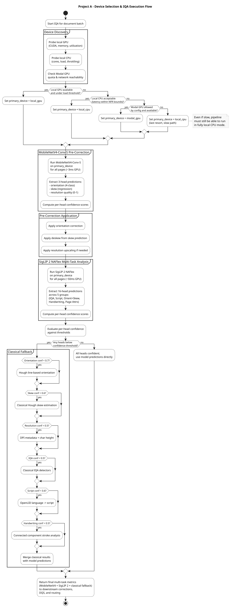
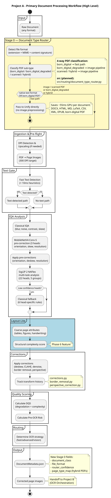
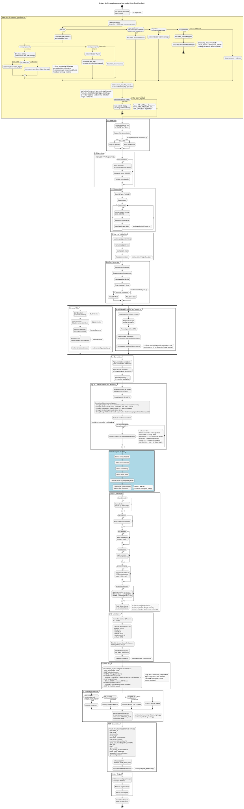

# Level 2: Production Runtime

This level provides detailed diagrams for the Production Runtime workstream - the live document processing pipeline.

---

## Device Selection Flow

How the system selects the optimal inference device (Local GPU, Modal GPU, or CPU) based on availability, budget, and document characteristics.

---

## Primary Workflow - High Level

High-level view of the document processing pipeline from ingestion to output.

---

## Primary Workflow - Detailed

Detailed activity diagram showing every step in the document processing pipeline.

---

## Key Components

| Component | Source Files | Purpose |
|-----------|--------------|---------|
| Device Orchestrator | `src/utils/device_orchestrator.py` | Device selection and fallback |
| Ingestion | `src/ingestion/` | PDF/image loading and DPI handling |
| Text Gate | `src/detection/text_gate.py` | Fast text presence detection |
| Classical IQA | `src/detection/iqa_classical.py` | 7 classical CV detectors |
| ML IQA | `src/detection/iqa_ml.py` | Teacher-student ResNet models |
| Layout Detection | `src/detection/layout_lite.py` | DocLayout-YOLO (11 classes) |
| Corrections | `src/correction/` | Deskew, CLAHE, denoising |
| DQS Calculator | `src/metrics/dqs_calculator.py` | Document Quality Score |
| Routing | `src/routing/` | OCR strategy recommendation |

---

## Related Diagrams

| Level | Diagram | Description |
|-------|---------|-------------|
| **Level 0** | [RAG Pipeline Overview](../../level-0/index.md) | Multi-project pipeline context |
| **Level 1** | [Project A Architecture](../../level-1/index.md) | System architecture |
| **Level 2** | [Model Training](../model-training/index.md) | Training pipeline |
