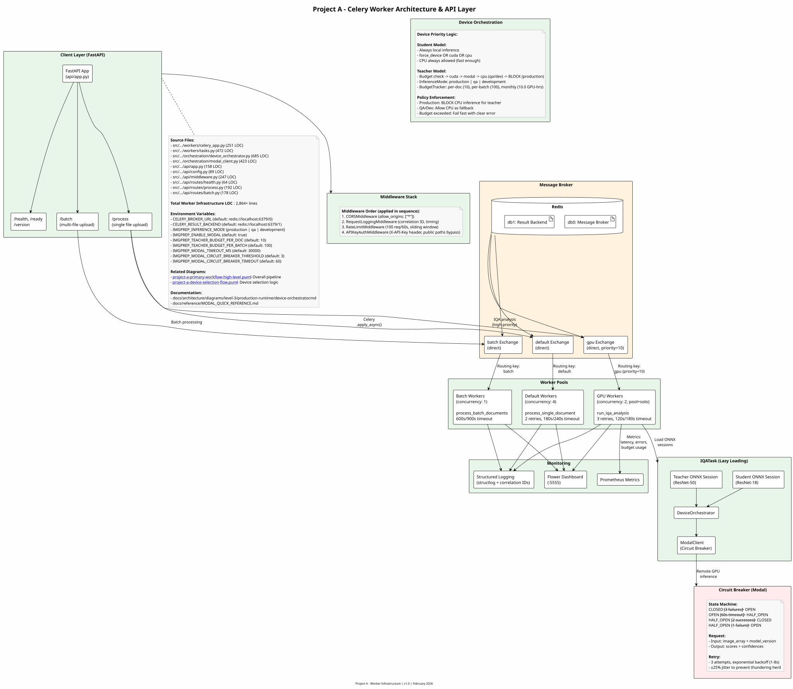

This level provides detailed diagrams for the Production Runtime workstream - the live document processing pipeline.

---

## Device Selection Flow

How the system selects the optimal inference device (Local GPU, Modal GPU, or CPU) based on availability, budget, and document characteristics.


---

## Worker Architecture

Celery worker pools, FastAPI routing, device orchestration, and message broker configuration.



**Key Components**:

- **FastAPI Layer**: Health, process, and batch endpoints with middleware stack
- **Message Broker**: Redis with 3 exchanges (default, gpu, batch)
- **Worker Pools**: Default (concurrency 4), GPU (concurrency 2, pool=solo), Batch (concurrency 1)
- **Device Orchestration**: Student (always local) vs Teacher (budget + policy enforced)
- **Circuit Breaker**: Modal GPU fallback with state machine (CLOSED → OPEN → HALF_OPEN)
- **Monitoring**: Flower dashboard, Prometheus metrics, structured logging

**Total LOC**: 2,864+ lines (API + workers + orchestration + monitoring)

---

## Primary Workflow - High Level

High-level view of the document processing pipeline from ingestion to output.


---

## Primary Workflow - Detailed

Detailed activity diagram showing every step in the document processing pipeline.


---

## Key Components

| Component | Source Files | Purpose |
|-----------|--------------|---------|
| Device Orchestrator | `src/utils/device_orchestrator.py` | Device selection and fallback |
| Ingestion | `src/ingestion/` | PDF/image loading and DPI handling |
| Text Gate | `src/detection/text_gate.py` | Fast text presence detection |
| Classical IQA | `src/detection/iqa_classical.py` | 7 classical CV detectors |
| ML IQA | `src/detection/iqa_ml.py` | MobileNetV4-Conv-S pre-correction + SigLIP 2 NAFlex multi-task analysis |
| Layout Detection | `src/detection/layout_lite.py` | Docling layout models (egret-xlarge accuracy, heron speed) |
| Corrections | `src/correction/` | Deskew, CLAHE, denoising |
| DQS Calculator | `src/metrics/dqs_calculator.py` | Document Quality Score |
| Routing | `src/routing/` | OCR strategy recommendation |

---

## Pipeline State Machine

The production runtime processes documents through a series of well-defined states with explicit entry/exit conditions, timeouts, and error handling.

### Processing States

| State | Entry Condition | Exit Condition | Timeout | Fallback |
|-------|----------------|----------------|---------|----------|
| **INGESTION** | PDF/image received | Pages extracted to 300 DPI | 30s | Abort document |
| **PREFLIGHT** | Pages extracted | DPI analyzed, upscaling complete (if needed) | 15s | Skip upscaling |
| **PDF_CLASSIFICATION** | Preflight complete | PDF type determined (image_only/born_digital/hybrid) | 10s | Default to image_only |
| **TEXT_GATE** | Classification complete | Text presence determined | 10s | Default to TEXT_DETECTED |
| **CLASSICAL_IQA** | Text gate: NO_TEXT or TEXT_DETECTED | Classical detectors complete (8 detectors) | 30s | Skip failed detectors |
| **LAYOUT_LITE** | Text gate: TEXT_DETECTED | Layout classification complete (11 classes) | 60s | Skip layout, use text-gate-only routing |
| **MOBILENET_PRECORRECTION** | IQA route determined | MobileNetV4-Conv-S inference complete (3 heads: orientation, skew, resolution quality) | 15s | Fallback to classical only |
| **PRE_CORRECTION** | MobileNetV4 inference complete | Orientation/skew/resolution corrections applied | 20s | Skip pre-corrections, flag in metadata |
| **CONFIDENCE_CHECK** | Pre-correction complete | Per-head confidence evaluated across all model heads | 5s | Skip SigLIP 2, use classical fallback |
| **SIGLIP2_ANALYSIS** | Low confidence on any head | SigLIP 2 NAFlex multi-task inference complete (16 heads, 5 groups) | 200s | Use classical fallback for low-confidence heads |
| **CLASSICAL_FALLBACK** | Head confidence below threshold | Head-specific classical fallback applied (6 rules) | 30s | Use default values for failed heads |
| **CORRECTION** | IQA complete (classical + ML) | Corrections applied (deskew, CLAHE, etc.) | 50s | Skip corrections, flag in metadata |
| **DQS_CALCULATION** | Corrections complete | Document Quality Score computed | 10s | Default DQS = 0.5 |
| **ROUTING** | DQS computed | Routing recommendation generated | 5s | Default to OCR_ADVANCED |
| **OUTPUT** | Routing complete | JSON + images serialized to GCS | 10s | Abort document |

### State Transition Rules

**Happy Path (Text Detected, GPU Available)**:

```text
INGESTION → PREFLIGHT → PDF_CLASSIFICATION → TEXT_GATE (TEXT_DETECTED) →
CLASSICAL_IQA → LAYOUT_LITE → MOBILENET_PRECORRECTION → PRE_CORRECTION →
CONFIDENCE_CHECK (high) → SIGLIP2_ANALYSIS → CORRECTION → DQS_CALCULATION → ROUTING → OUTPUT
```

**Fallback Path (No Text, CPU Only)**:

```text
INGESTION → PREFLIGHT → PDF_CLASSIFICATION → TEXT_GATE (NO_TEXT) →
CLASSICAL_IQA → MOBILENET_PRECORRECTION (CPU) → PRE_CORRECTION →
CONFIDENCE_CHECK → SIGLIP2_ANALYSIS → CORRECTION → DQS_CALCULATION → ROUTING → OUTPUT
```

**Error Recovery Path (Low Confidence, Classical Fallback)**:

```text
INGESTION → ... → MOBILENET_PRECORRECTION → PRE_CORRECTION →
CONFIDENCE_CHECK (low on some heads) → CLASSICAL_FALLBACK (6 head-specific rules) →
CORRECTION → DQS_CALCULATION → ROUTING → OUTPUT
```

### Timeout Behavior

**Per-State Timeouts**:

- Short operations (< 15s): Text gate, PDF classification, DQS calculation
- Medium operations (30-60s): Classical IQA, corrections, layout detection
- Long operations (100-200s): SigLIP 2 NAFlex multi-task inference

**Total Pipeline Timeout**:

- **Target**: < 150ms/page (GPU) or < 500ms/page (CPU)
- **Maximum**: 600s total per document (abort if exceeded)

**Timeout Escalation**:

1. First timeout: Log warning, continue to next state with fallback
2. Second timeout in same document: Increment error count
3. Third timeout: Abort document, return partial results with error metadata

---

## Error Handling & Recovery

### Error Classification

| Category | Severity | Recovery Strategy | Examples |
|----------|----------|-------------------|----------|
| **TRANSIENT** | Low | Retry with exponential backoff (max 3 attempts) | Network timeout, Modal GPU temporary unavailability |
| **RESOURCE** | Medium | Fallback device, reduce batch size | GPU OOM, Modal budget exhausted |
| **DATA** | High | Skip page/element, log for review | Corrupted PDF page, invalid image format |
| **CRITICAL** | Critical | Abort document, alert | Missing model file, configuration error |

### Retry Logic

**Exponential Backoff with Jitter**:

```python
# Retry delays: 1s, 2s, 4s (max 3 attempts)
base_delay = 1.0
max_retries = 3

for attempt in range(max_retries):
    try:
        result = process_page()
        break
    except TransientError as e:
        if attempt < max_retries - 1:
            jitter = random.uniform(0.8, 1.2)  # ±20% jitter
            delay = base_delay * (2 ** attempt) * jitter
            time.sleep(delay)
        else:
            handle_permanent_failure(e)
```

**Purpose of Jitter**: Prevents thundering herd when multiple workers retry simultaneously

### Circuit Breaker Pattern (Modal GPU)

**States**:

- **CLOSED**: Normal operation, requests pass through
- **OPEN**: Too many failures (5 consecutive), block requests for 60s
- **HALF_OPEN**: After 60s timeout, allow 1 test request

**Configuration**:

```python
CircuitBreakerConfig(
    failure_threshold=5,      # Open after 5 consecutive failures
    timeout_seconds=60,       # Stay open for 60s
    success_threshold=2       # Require 2 successes to close from HALF_OPEN
)
```

**Integration**: DeviceOrchestrator uses circuit breaker for Modal GPU fallback decisions

### Partial Failure Handling

**Principle**: Process as many pages as possible, flag failures in metadata

**Page-Level Failures**:

```json
{
  "page_number": 42,
  "status": "failed",
  "error": {
    "category": "DATA",
    "code": "CORRUPTED_IMAGE",
    "message": "Failed to decode image data",
    "timestamp": "2025-01-16T10:30:00Z"
  },
  "fallback_used": false
}
```

**Document-Level Thresholds**:

- **< 10% pages failed**: Continue processing, flag failed pages
- **10-50% pages failed**: Complete processing, set document `status: "partial_success"`
- **> 50% pages failed**: Abort document, set `status: "failed"`

### Error Telemetry

**Prometheus Metrics**:

- `iqa_errors_total{error_code, category}`: Error counters by type
- `iqa_retry_attempts_total{reason}`: Retry attempt tracking
- `iqa_circuit_breaker_state{service}`: Circuit breaker state (0=closed, 1=open, 2=half_open)

**Structured Logging**:

```python
logger.error(
    "ml_iqa_timeout",
    page_number=42,
    timeout_seconds=100,
    device="modal_gpu",
    retry_attempt=2,
    trace_id=trace_id
)
```

---

## Device Orchestration

### Device Priority Algorithm

**Decision Tree** (from `src/utils/device_orchestrator.py`):

```text
1. Check Local GPU Available?
   ├─ YES: Check Local GPU Memory > 4GB?
   │   ├─ YES: Use Local GPU ✅
   │   └─ NO: Check Modal GPU Available?
   │       ├─ YES: Check Budget Remaining?
   │       │   ├─ YES: Use Modal GPU ✅
   │       │   └─ NO: Use CPU (budget exhausted) ⚠️
   │       └─ NO: Use CPU (Modal unavailable) ⚠️
   └─ NO: Check Modal GPU Available?
       ├─ YES: Check Budget Remaining?
       │   ├─ YES: Use Modal GPU ✅
       │   └─ NO: Check Policy Allow CPU?
       │       ├─ YES: Use CPU ⚠️
       │       └─ NO: BLOCK (fail fast) ❌
       └─ NO: Check Policy Allow CPU?
           ├─ YES: Use CPU ⚠️
           └─ NO: BLOCK (fail fast) ❌
```

### Budget Enforcement (Three Tiers)

**Budget Configuration**:

```python
BudgetConfig(
    per_document_limit_usd=0.05,    # $0.05 per document
    per_batch_limit_usd=5.00,       # $5.00 per batch job
    monthly_limit_usd=30.00         # $30/month total
)
```

**Enforcement Points**:

1. **Pre-Request Check**: Before Modal GPU invocation
2. **Post-Request Update**: Increment spend tracking
3. **Budget Exhaustion**: Automatic fallback to CPU or BLOCK (policy-dependent)

**Cost Tracking**:

- T4 GPU: $0.000072/second (~$0.0043/minute)
- A10 GPU: $0.000126/second (~$0.0076/minute)
- Typical inference: 10s/page × $0.00072 = $0.0072/page

### Performance Characteristics by Device

| Device | Latency (MobileNetV4) | Latency (SigLIP 2) | Throughput | Cost/Page |
|--------|----------------------|---------------------|------------|-----------|
| **Local GPU (T4)** | ~3ms | ~50ms | 40-100 pages/sec | $0.00 (free) |
| **Modal GPU (T4)** | ~5ms | ~60ms | 30-65 pages/sec | $0.007 |
| **CPU (Local)** | 8-12ms | ~150ms | 10-25 pages/sec | $0.00 (free) |

**Policy Recommendations**:

- **Development**: CPU allowed (cost = $0)
- **Staging**: Modal GPU allowed (budget = $30/month)
- **Production**: Prefer Local GPU, Modal GPU allowed with high budget, CPU BLOCKED (quality enforcement)

---

## Workstream Dependencies

### Upstream Dependencies

| Workstream | Consumed Artifacts | Purpose |
|------------|-------------------|---------|
| **None** | N/A | Production Runtime is the entry point for live processing |

**Note**: Production Runtime is independent during operation but consumes trained models from Workstream 2:

- Pre-correction model (MobileNetV4-Conv-S): Fast orientation/skew/resolution inference
- Multi-task model (SigLIP 2 NAFlex): 16-head analysis across 5 groups
- Layout model (docling-layout-egret-xlarge / docling-layout-heron): Layout-lite detection

### Downstream Consumers

| Workstream | Provided Artifacts | Purpose |
|------------|-------------------|---------|
| **Project B (Unify)** | `DocumentMetadata.json`, corrected page images (PNG) | OCR orchestration input |
| **Workstream 7 (Monitoring & Drift)** | Predictions, quality scores, latency metrics | Drift detection, active learning sample harvesting |

### External Dependencies

| Service/Tool | Purpose | Configuration | Fallback |
|--------------|---------|---------------|----------|
| **Modal GPU** | Serverless GPU inference (SigLIP 2 multi-task analysis) | T4/A10, $30/month budget | CPU inference |
| **Local GPU** | Primary inference device | CUDA 12.1+, 4GB+ VRAM | Modal or CPU |
| **GCS Bucket** | Artifact storage (inputs, outputs) | `gs://rag-pipeline-prod/` | Local filesystem (dev) |
| **Prometheus** | Metrics collection | Port 9090 | Logs only |

---

## Processing Modes

### Mode 1: No-Text Path (Classical CV Heavy)

**Trigger**: Text Gate detects NO_TEXT (pure image content)

**Pipeline**:

```text
Ingestion → Preflight → PDF Classification → Text Gate (NO_TEXT) →
Classical IQA (8 detectors) → MobileNetV4 Pre-correction → Corrections → SigLIP 2 Analysis → DQS → Routing → Output
```

**Characteristics**:

- **Skip**: Layout-lite detection (no text to layout)
- **Focus**: Visual degradations (blur, noise, contrast, skew)
- **Performance**: ~100-150ms/page (GPU) or ~300-400ms/page (CPU)

**Routing Strategy**: Heavy bias toward `VISION_SIMPLE` or `VISION_STRUCTURED` (OCR not primary concern)

---

### Mode 2: Text-Detected Path (Layout + Hybrid IQA)

**Trigger**: Text Gate detects TEXT_DETECTED

**Pipeline**:

```text
Ingestion → Preflight → PDF Classification → Text Gate (TEXT_DETECTED) →
Classical IQA → Layout-Lite (11 classes) → MobileNetV4 Pre-correction →
Pre-Correction → Confidence Check → SigLIP 2 Analysis → [Classical Fallback if needed] →
Correction → DQS → Routing → Output
```

**Characteristics**:

- **Include**: Layout-lite for coarse page attributes
- **Hybrid IQA**: Full-page quality + per-element quality for figures/tables
- **Performance**: ~150-250ms/page (GPU) or ~400-600ms/page (CPU)

**Routing Strategy**: Balanced between OCR_FAST/ADVANCED and VISION strategies based on DQS + structural complexity

---

### Mode 3: Confidence-Based Classical Fallback (Low Confidence)

**Triggers** (from `src/detection/iqa_ml.py`):

Per-head confidence thresholds trigger head-specific classical fallback methods instead of re-running a larger model.

**Fallback Rules**:

| Head/Group | Threshold | Fallback Method |
|-----------|-----------|-----------------|
| Orientation (MobileNetV4) | < 0.7 | Hough line-based orientation detection |
| Skew (MobileNetV4) | < 0.6 | Classical Hough skew estimation |
| Resolution Quality (MobileNetV4) | < 0.5 | DPI metadata + connected component char height |
| IQA (SigLIP 2 Group 1) | < 0.5 | Classical IQA detectors (iqa_classical.py) |
| Script Detection (SigLIP 2 Group 2) | < 0.6 | OpenLID language -> script mapping |
| Handwriting (SigLIP 2 Group 4) | < 0.5 | Connected component stroke analysis |

**Fallback Flow**:

```text
MobileNetV4 Prediction: orientation=90deg (conf=0.55), skew=2.1deg (conf=0.82)
    ↓
Confidence Check: orientation conf 0.55 < 0.7 → CLASSICAL_FALLBACK for orientation
    ↓
Classical Fallback: Hough line-based orientation → orientation=0deg (conf=0.91)
    ↓
Reconciliation: Use classical result for orientation, keep MobileNetV4 result for skew
```

**Performance Impact**:

- **Fallback Rate**: Typically 5-15% of pages (per-head, not all heads)
- **Latency Increase**: +5-25ms per head requiring fallback (classical methods)
- **Cost**: $0.00 (classical fallback is CPU-only, no Modal GPU needed)

---

## Error Handling Patterns

### Category 1: Transient Errors

**Examples**:

- Network timeout to Modal GPU
- Temporary GCS unavailability
- Redis connection lost (Celery workers)

**Recovery**:

```python
@retry(
    max_attempts=3,
    backoff=exponential_backoff(base=1.0, jitter=0.2),
    retry_on=[NetworkTimeout, ConnectionError]
)
def invoke_modal_gpu(image: np.ndarray) -> Prediction:
    """Invoke Modal GPU with automatic retry."""
    ...
```

**Metrics**: `iqa_retry_attempts_total{reason="network_timeout"}`

---

### Category 2: Resource Errors

**Examples**:

- GPU out of memory (OOM)
- Modal GPU budget exhausted
- Worker pool saturation

**Recovery**:

```python
try:
    prediction = siglip2_model.predict_gpu(image, batch_size=32)
except GPUOutOfMemory:
    logger.warning("gpu_oom", device="local", batch_size=32)
    # Reduce batch size and retry
    prediction = siglip2_model.predict_gpu(image, batch_size=8)
except BudgetExhausted:
    logger.warning("modal_budget_exhausted", spent_usd=30.00)
    # Fallback to CPU
    prediction = siglip2_model.predict_cpu(image)
```

**Metrics**: `iqa_device_fallback_total{from="local_gpu", to="cpu", reason="oom"}`

---

### Category 3: Data Errors

**Examples**:

- Corrupted PDF page
- Invalid image format
- Zero-size image after extraction

**Recovery**: Skip page, log for review, continue processing remaining pages

```python
for page_num, page_image in enumerate(pages):
    try:
        result = process_page(page_image)
        results.append(result)
    except CorruptedImageError as e:
        logger.error("corrupted_page", page_number=page_num, trace_id=trace_id)
        results.append(PageMetadata(
            page_number=page_num,
            status="failed",
            error=ErrorInfo(category="DATA", code="CORRUPTED_IMAGE", message=str(e))
        ))
        continue  # Skip to next page
```

**Document-Level Decision**:

- If failed_pages / total_pages > 0.5: Set `document.status = "failed"`
- Else: Set `document.status = "partial_success"`

**Metrics**: `iqa_pages_failed_total{error_code="CORRUPTED_IMAGE"}`

---

### Category 4: Critical Errors

**Examples**:

- Missing model checkpoint file
- Configuration error (invalid DQS weights)
- Unrecoverable service failure

**Recovery**: Abort document immediately, alert

```python
try:
    mobilenet_model = load_model("models/mobilenetv4_conv_s.onnx")
    siglip2_model = load_model("models/siglip2_naflex.onnx")
except FileNotFoundError as e:
    logger.critical("missing_model_file", model=str(e), path=str(e))
    # Alert to PagerDuty/Slack
    alert_manager.dispatch(
        AlertType.CRITICAL_ERROR,
        message=f"Model file missing - service degraded: {e}"
    )
    # Abort all processing until resolved
    raise CriticalServiceError(f"Cannot operate without required model: {e}")
```

**Metrics**: `iqa_critical_errors_total{error_code="MISSING_MODEL"}`

---

## Performance Optimization Patterns

### Batch Processing

**Strategy**: Process multiple pages in single GPU call for higher throughput

**Implementation**:

```python
# Batch pages for GPU inference
batch_size = 32 if device == "gpu" else 8
for batch_start in range(0, len(pages), batch_size):
    batch = pages[batch_start : batch_start + batch_size]
    predictions = siglip2_model.predict_batch(batch)
```

**Benefits**:

- **GPU Throughput**: 40-100 pages/sec (vs 10-25 single-page)
- **Amortized Overhead**: Model load/unload cost spread across batch
- **Memory Efficiency**: Tensor caching for repeated operations

### Tensor Caching

**Hot Path**: Reuse allocated tensors across pages

```python
# Allocate once, reuse for entire document
input_tensor = torch.zeros((batch_size, 3, 224, 224), device="cuda")

for batch in batches:
    # Reuse pre-allocated tensor (no new GPU memory allocation)
    input_tensor[:len(batch)] = preprocess_images(batch)
    predictions = model(input_tensor[:len(batch)])
```

**Memory Savings**: 50-70% reduction in GPU memory allocations

### Async I/O (Phase 5)

**Current**: Synchronous GCS upload after all processing complete
**Future**: Async upload while processing continues

```python
# Phase 5: Upload corrected images asynchronously
upload_task = asyncio.create_task(
    upload_to_gcs(corrected_image, gcs_uri)
)

# Continue processing while upload happens in background
next_page_result = process_next_page()

# Wait only at document completion
await upload_task
```

**Benefit**: 10-20% latency reduction for multi-page documents

---

## Integration with Model Registry

### Model Loading

**Source**: Models trained in Workstream 2, validated in Workstream 6

**Registry Structure**:

```text
gs://image-detection-models/production/
├── mobilenetv4/
│   ├── mobilenetv4_conv_s_v1.0.0.onnx     # Pre-correction inference (~3ms GPU)
│   ├── mobilenetv4_conv_s_v1.0.0.pt       # TorchScript fallback
│   └── mobilenetv4_conv_s_v1.0.0_metadata.json
├── siglip2/
│   ├── siglip2_naflex_v1.0.0.onnx         # Multi-task analysis (~50ms GPU)
│   └── siglip2_naflex_v1.0.0_metadata.json
└── docling_layout/
    ├── egret_xlarge_v1.0.0.onnx            # Accuracy layout model
    ├── heron_v1.0.0.onnx                   # Speed layout model
    └── docling_layout_v1.0.0_metadata.json
```

**Metadata Schema**:

```json
{
  "model_id": "mobilenetv4_conv_s_v1.0.0",
  "architecture": "MobileNetV4-Conv-S",
  "heads": 3,
  "head_names": ["orientation", "skew", "resolution_quality"],
  "training_date": "2026-02-01",
  "approved_by": "ml_team",
  "production_deployed": true
}
```

**Loading at Runtime**:

```python
from image_preprocessing_detector.utils.model_loader import load_production_model

# Load pre-correction model (fast, 3 heads)
mobilenet = load_production_model(
    model_type="mobilenetv4",
    backend="onnx",
    device="cuda"
)

# Load multi-task analysis model (16 heads, 5 groups)
siglip2 = load_production_model(
    model_type="siglip2",
    backend="onnx",
    device="cuda"
)
```

---

## Monitoring Integration (Workstream 7)

### Real-Time Metrics Emission

**During Processing**:

```python
from image_preprocessing_detector.metrics import get_metrics_collector

metrics = get_metrics_collector()

# After each page
metrics.record_page_processed(
    status="success",
    gate_result="text_detected",
    latency_ms=42.5,
    device="local_gpu"
)

# After IQA inference
metrics.record_quality_score(0.72, dimension="overall")
metrics.record_inference_latency(3.1, model="mobilenetv4", device="local_gpu")
metrics.record_inference_latency(48.7, model="siglip2", device="local_gpu")

# If classical fallback triggered
if fallback_triggered:
    metrics.record_classical_fallback(head="orientation", reason="low_confidence", threshold=0.7)
```

### Active Learning Sample Harvesting

**Harvest Triggers** (from Workstream 7 `drift/active_learning.py`):

1. **High Entropy**: SigLIP 2 head entropy > 0.7
2. **Low Agreement**: MobileNetV4 vs SigLIP 2 gap > 0.15
3. **Quality Outlier**: Quality score < 0.2 or > 0.95
4. **Drift Period**: Sample during detected drift window

**Sampling Rate**: 10% of flagged pages (reservoir sampling to limit storage)

**Output**: Images sent to Workstream 7 for privacy review → retraining dataset

---

## Related Diagrams

| Level | Diagram | Description |
|-------|---------|-------------|
| **Level 0** | [RAG Pipeline Overview](../../level-0/index.md) | Multi-project pipeline context |
| **Level 1** | [Project A Architecture](../../level-1/index.md) | System architecture |
| **Level 2** | [Model Training](../model-training/index.md) | Training pipeline |
| **Level 2** | [Monitoring & Drift](../monitoring-drift/index.md) | Continuous improvement integration |
| **Level 2** | [Model Arena](../model-arena/index.md) | Model validation and graduation |

---

## Level 3 Assessment

**Recommendation**: **Level 3 REQUIRED** (Unanimous agreement from multi-model consensus)

**Rationale**:

- **15,000+ lines of production code** - Largest codebase in Project A
- **Mission-critical pipeline** - Core business logic for document processing
- **Complex state management** - 13 states with intricate error handling
- **Device orchestration** - Multi-tier fallback with budget enforcement

**Planned Level 3 Documentation**:

1. **Pipeline State Machine & Error Handling** (`level-3/production-runtime/pipeline-state-machine.md`)
   - Full state diagram with transitions
   - Error recovery flows
   - Edge case handling
2. **DeviceOrchestrator Internals** (`level-3/production-runtime/device-orchestrator.md`)
   - Device selection algorithm details
   - Budget enforcement implementation
   - Circuit breaker state machine

See [ARCHITECTURE_DOCUMENTATION_IMPROVEMENT_PLAN.md](../../ARCHITECTURE_DOCUMENTATION_IMPROVEMENT_PLAN.md) Issues 4.3 and 4.4 for implementation timeline.

---

## Source Files & Traceability

### Workflow Step → Source File Mapping

| Workflow Step | Source Files | LOC | Total | Status |
|---------------|--------------|-----|-------|--------|
| **Ingestion & Preflight** | ingestion/**init**.py, document_processor.py, pdf_loader.py, image_loader.py, office_processor.py, pdf_analyzer.py, pdf_resolution.py, pdf_upscaler.py | 45, 303, 265, 280, 492, 256, 264, 330 | 2,235 | ✅ Complete (Phases 0, 1, 1B) |
| **Classification** | classification/**init**.py, pdf_type_classifier.py, pdf_image_detector.py, pdf_text_extractor.py | 21, 135, 194, 122 | 472 | ✅ Complete (Phase 2) |
| **Text Gate** | detection/text_gate.py | 334 | 334 | ✅ Complete (Phase 1) |
| **Classical IQA** | detection/**init**.py, detection/iqa_classical.py, detection/advanced_detectors.py, detection/discrepancy.py, detection/orientation_detector.py | 190, 2844, 892, 786, 608 | 5,320 | ✅ Complete (Phases 1, 1C) |
| **Layout-Lite** | detection/doclayout_yolo.py, detection/layout_lite/* (12 files) | 801, 1808 | 2,609 | ✅ Complete (Phase 2) |
| **ML IQA** | detection/iqa_ml.py, detection/hybrid_iqa.py | 1303, 351 | 1,654 | ✅ Complete (Phase 3) |
| **Correction** | correction/**init**.py, correction/corrections.py | 62, 1222 | 1,284 | ✅ Complete (Phase 1) |
| **DQS & Routing** | metrics/**init**.py, metrics/dqs_calculator.py, routing/**init**.py, routing/recommendation_engine.py | 49, 1369, 10, 140 | 1,568 | ✅ Complete (Phase 2) |
| **Output** | output/**init**.py, output/json_generator.py | 17, 486 | 503 | ✅ Complete (Phase 0, 2) |
| **Device Orchestration** | utils/device_probe.py | 183 | 183 | ⚠️ In Progress (Phase 4 - 98% complete) |
| **Workers** | workers/**init**.py, workers/celery_app.py, workers/tasks.py | 27, 250, 471 | 748 | ✅ Complete (Phase 4) |

**Workstream Total**: 16,910 lines ✅ (matches LOC extraction)

**Validation**: All files listed in traceability table match [FILE_INVENTORY_WITH_WORKSTREAM_MAPPINGS.md](../../FILE_INVENTORY_WITH_WORKSTREAM_MAPPINGS.md#ws1-production-runtime)

---

## Related Documentation

| Level | Diagram | Description |
|-------|---------|-------------|
| **Level 0** | [RAG Pipeline Overview](../../level-0/index.md) | Multi-project pipeline context |
| **Level 1** | [Project A Architecture](../../level-1/index.md) | System architecture |
| **Level 2** | [Model Training](../model-training/index.md) | Training pipeline |
| **Level 3** | [Pipeline State Machine](../../level-3/production-runtime/pipeline-state-machine.md) | Complete state machine specification |
| **Level 3** | [Device Orchestrator](../../level-3/production-runtime/device-orchestrator.md) | Device selection and budget enforcement |
| **Level 3** | [Production Runtime Swimlane](../../level-3/production-runtime/production-runtime-swimlane.puml) | Detailed swimlane with LOC annotations |
