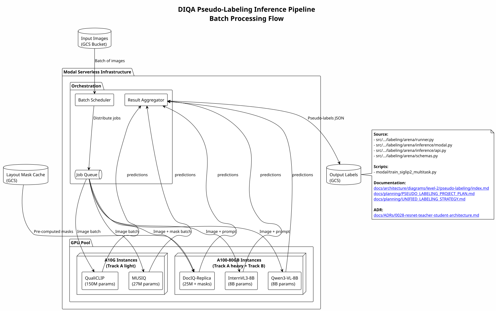
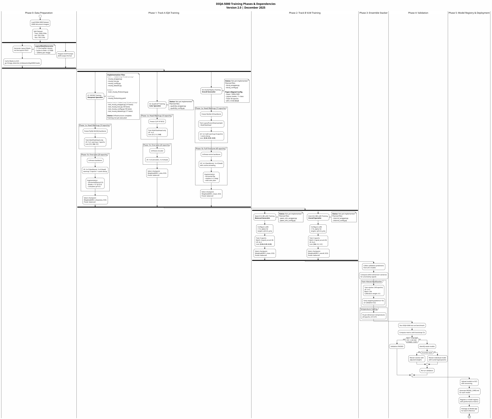

This level provides detailed diagrams for the Pseudo-Labeling workstream - generating high-quality labels using multi-model ensembles.

---

## DIQA Pseudo-Labeling Workflow

Complete workflow for generating pseudo-labels using the 5-model ensemble.


---

## DIQA Inference Pipeline

Infrastructure architecture for batch inference on Modal.


---

## Checkpoint Selection Algorithm

Weighted SRCC + ECE scoring for selecting optimal model checkpoints.



---

## Training Phases

Multi-phase training approach for the DIQA ensemble.



---

## Key Components

| Component | Description |
|-----------|-------------|
| Track A: IQA Models | MUSIQ (sharpness), QualiCLIP (color), DocIQ-Replica (overall) |
| Track B: VLM Models | Qwen3-VL-8B (generalist), InternVL3-8B (overall) |
| Hierarchical Stacker | Dimension-specific variance-weighted stacking |
| Temperature Scaler | Uncertainty calibration |

---

## Model Specialists

| Model | Specialty | Parameters |
|-------|-----------|------------|
| MUSIQ | Sharpness | 27M |
| QualiCLIP | Color | 150M |
| DocIQ-Replica | Overall | 25M + masks |
| Qwen3-VL-8B | Generalist | 8B |
| InternVL3-8B | Overall | 8B |

---

## Workstream Dependencies

### Upstream Dependencies

| Workstream | Consumed Artifacts | Purpose |
|------------|-------------------|---------|
| **WS3: Data Preparation** | `samples.parquet`, unlabeled images from base datasets | Images requiring quality labels for training |
| **WS5: Labeling & Benchmarking Models** | Fine-tuned MUSIQ, QualiCLIP, DocIQ, Qwen3-VL, InternVL3 models | 5-model ensemble for pseudo-labeling |

### Model Invocation Details

**Track A: IQA Specialist Models**

| Model | Source (WS5) | Specialty | Inference Backend |
|-------|--------------|-----------|-------------------|
| **MUSIQ** | `gs://.../labeling/musiq/v1.0.0_finetuned.onnx` | Sharpness/blur detection | Modal GPU (batch=32) |
| **QualiCLIP** | `gs://.../labeling/qualiclip/v1.0.0_finetuned.onnx` | Color fidelity | Modal GPU (batch=32) |
| **DocIQ-Replica** | `gs://.../labeling/dociq/v1.0.0_finetuned.pth` | Document-specific quality | Modal GPU (batch=16) |

**Track B: Vision-Language Models**

| Model | Source (WS5) | Specialty | Inference Backend |
|-------|--------------|-----------|-------------------|
| **Qwen3-VL-8B** | `gs://.../labeling/qwen3_vl/v1.0.0_adapter.safetensors` | Generalist quality reasoning | Modal GPU (batch=8) |
| **InternVL3-8B** | `gs://.../labeling/internvl3/v1.0.0_adapter.safetensors` | Overall quality assessment | Modal GPU (batch=8) |

### Ensemble Inference Workflow

**Batch Processing on Modal**:

```python
# Pseudo-labeling invokes all 5 models in parallel
from image_preprocessing_detector.labeling.ensemble import EnsembleLabeler

labeler = EnsembleLabeler(
    models={
        "musiq": load_model("gs://.../musiq/v1.0.0.onnx"),
        "qualiclip": load_model("gs://.../qualiclip/v1.0.0.onnx"),
        "dociq": load_model("gs://.../dociq/v1.0.0.pth"),
        "qwen3_vl": load_model("gs://.../qwen3_vl/v1.0.0_adapter.safetensors"),
        "internvl3": load_model("gs://.../internvl3/v1.0.0_adapter.safetensors")
    },
    stacker="hierarchical",  # Variance-weighted stacking
    device="modal_gpu"
)

# Generate pseudo-labels for unlabeled images
for batch in unlabeled_images:
    predictions = labeler.predict_batch(batch)
    # Only keep high-confidence labels
    high_conf = [p for p in predictions if p.ensemble_agreement > 0.8]
    save_pseudo_labels(high_conf)
```

### Checkpoint Selection (from WS6 Arena)

**Selection Criteria**:

- **Best SRCC + ECE** weighted score from Arena Phase 1 benchmarks
- **Weighted Score**: `0.7 × SRCC + 0.3 × (1 - ECE)`
- **Calibration Requirement**: ECE < 0.1 (well-calibrated predictions)

**Example**:

| Model | SRCC | ECE | Weighted Score | Selected |
|-------|------|-----|----------------|----------|
| QualiCLIP | 0.85 | 0.08 | 0.87 | ✅ |
| MUSIQ | 0.82 | 0.12 | 0.84 | ✅ |
| DocIQ | 0.78 | 0.09 | 0.82 | ✅ |

### Downstream Consumers

| Workstream | Provided Artifacts | Purpose |
|------------|-------------------|---------|
| **WS2: Production Model Training** | Pseudo-labeled images with ensemble predictions | Augment training dataset with high-confidence labels |

### Quality Gates

**Confidence Filtering**:

- **Ensemble Agreement Threshold**: > 0.8 (5 models must agree within ±0.1)
- **Minimum Confidence**: Per-model confidence > 0.7
- **Uncertainty Filtering**: High-variance predictions (std > 0.15) sent to manual review

**Output Statistics** (Typical):

- **Total Unlabeled Images**: 10,000
- **Pseudo-Labels Generated**: 7,500 (75%)
- **High Confidence (agreement > 0.8)**: 5,000 (50% of total)
- **Manual Review Required**: 2,500 (25%)
- **Rejected (low confidence)**: 2,500 (25%)

---

## Source File Traceability

This section maps pseudo-labeling pipeline stages to implementation files with LOC counts.

| Workflow Step | Source Files | LOC | Total | Percentage |
|---------------|--------------|-----|-------|------------|
| **Ensemble Inference (Modal)** | `modal/generate_pseudo_labels.py`, `modal/stage1_deqa_inference.py`, `modal/stage1_deqa_tarball_inference.py` | 1042, 492, 333 | 1,867 | 63.4% |
| **Teacher Inference** | `modal/teacher_inference.py` | 419 | 419 | 14.2% |
| **Inference Supporting Code** | Various inference utilities | ~661 | 661 | 22.4% |
| **Workstream Total** | **~5 primary files** | — | **2,947** | **100%** |

**Validation**: LOC count validated against `docs/architecture/workstream_loc_counts.json` (WS4: 2,947 lines).

**Key Components**:

1. **Modal Ensemble Inference** (1,867 lines, 63.4%):
   - `generate_pseudo_labels.py`: 5-model ensemble orchestration
   - `stage1_deqa_inference.py`: DIQA inference pipeline
   - `stage1_deqa_tarball_inference.py`: Batch processing for tarballs

2. **Teacher Model Inference** (419 lines, 14.2%):
   - `teacher_inference.py`: ResNet-50 teacher model inference
   - Used for selective high-capacity predictions

3. **Supporting Infrastructure** (~661 lines, 22.4%):
   - Hierarchical stacking logic
   - Temperature scaling for calibration
   - Confidence filtering and aggregation

**Ensemble Models** (from WS5 - Labeling & Benchmarking):

- **Track A (IQA Specialists)**: MUSIQ (sharpness), QualiCLIP (color), DocIQ-Replica (overall)
- **Track B (VLM Models)**: Qwen3-VL-8B (generalist), InternVL3-8B (overall)

**Quality Metrics**:

- Ensemble agreement threshold: >0.8
- Typical pseudo-labeling rate: 50-75% of unlabeled images
- High-confidence labels: ~50% of total dataset

**Note**: This workstream consumes fine-tuned models from WS5 (Labeling & Benchmarking) and produces pseudo-labels for WS2 (Model Training).

---

## Related Diagrams

| Level | Diagram | Description |
|-------|---------|-------------|
| **Level 1** | [Project A Architecture](../../level-1/index.md) | System architecture |
| **Level 2** | [Data Preparation](../data-preparation/index.md) | Dataset ingestion |
| **Level 2** | [Model Training](../model-training/index.md) | Training pipeline |
