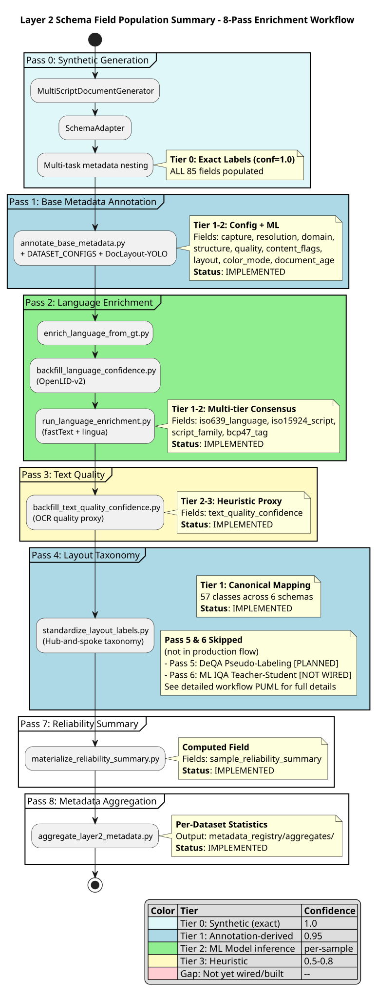

This level provides a complete process map for the Layer 2 enrichment schema v2.1.0 (~85 fields across 15 info objects), mapping every field to its population source(s) across the four-tier enrichment system.

---

## Schema Field Population Workflow

The Layer 2 enrichment schema v2.1.0 fields are populated through an 8-pass sequential workflow. Two diagram representations are available:

### Summary Diagram (Recommended for Quick Understanding)

**8-pass sequential flow** showing the production enrichment pipeline. This simplified activity diagram shows which passes are implemented versus planned.



**Key Insights**:

- **Passes 0-4**: IMPLEMENTED (synthetic generation, base metadata, language enrichment, text quality, layout taxonomy)
- **Passes 5-6**: PLANNED/NOT WIRED (DeQA pseudo-labeling, ML IQA teacher-student)
- **Passes 7-8**: IMPLEMENTED (reliability summary, metadata aggregation)

**Current Production Flow**: Pass 0 → Pass 1 → Pass 2 → Pass 3 → Pass 4 → Pass 7 → Pass 8

### Detailed Workflow (Full Component Diagram)

**Complete component-based workflow** with all enrichment passes, field population targets, LOC counts, and source file traceability. This diagram provides comprehensive technical detail but is too complex for SVG rendering.

**Detailed Source**: [schema-field-population-workflow.puml](schema-field-population-workflow.puml) (387 lines)

**What the detailed diagram includes**:

- 15 info object field mappings
- 4-tier enrichment system breakdown
- 25 source files with LOC counts
- Classical CV detectors (8 IQA + 6 layout-lite)
- ML models (planned vs. implemented)
- Wiring gap analysis (P0/P1/P2 categories)

**Recommended Usage**: Refer to the PUML source file directly for detailed component relationships and field-by-field population paths.

---

## Four-Tier Enrichment System

| Tier | Name | Confidence | Method | Primary Source |
|------|------|-----------|--------|---------------|
| **0** | Synthetic (exact) | 1.0 | By construction | `synthetic/generator.py` + `schema_adapter.py` |
| **1** | Annotation-derived | 0.95 | Dataset configs, COCO labels | `annotate_base_metadata.py` (DATASET_CONFIGS) |
| **2** | ML Model inference | per-sample | Neural network predictions | docling-layout, DeQA ensemble, SigLIP 2, OpenLID-v2 |
| **3** | Heuristic | 0.5-0.8 | Classical CV, rule-based | `iqa_classical.py` (8 detectors), `layout_lite/` (6 detectors) |

**Priority Rule**: Higher-tier data is NEVER overwritten by lower-tier data. Tier 0 > Tier 1 > Tier 2 > Tier 3.

---

## Field-by-Field Coverage Matrix

### CaptureMethodInfo (3 fields)

| Field | Tier 0 (Synthetic) | Tier 1 (Annotation) | Tier 2 (Model) | Tier 3 (Heuristic) | Status |
|-------|:---:|:---:|:---:|:---:|--------|
| `capture_method` | `schema_adapter.py` | `annotate_base_metadata.py` (DATASET_CONFIGS) | -- | -- | IMPLEMENTED |
| `capture_confidence` | 1.0 (by construction) | 0.95 (config-driven) | -- | -- | IMPLEMENTED |
| `capture_detection_method` | "synthetic_generator" | "dataset_config" | -- | -- | IMPLEMENTED |

### ResolutionInfo (6 fields, 3 new in v2.1.0)

| Field | Tier 0 (Synthetic) | Tier 1 (Annotation) | Tier 2 (Model) | Tier 3 (Heuristic) | Status |
|-------|:---:|:---:|:---:|:---:|--------|
| `resolution_dpi` | `schema_adapter.py` (config DPI) | `annotate_base_metadata.py` (EXIF/PyMuPDF) | -- | -- | IMPLEMENTED |
| `resolution_category` | derived from DPI | derived from DPI | -- | -- | IMPLEMENTED |
| `resolution_pixels` | generator output | file metadata | -- | -- | IMPLEMENTED |
| `character_height_px` | `generator.py` `_measure_char_height()` | -- | -- | -- | IMPLEMENTED (synthetic only) |
| `resolution_quality_score` | `generator.py` (char height mapping) | -- | MobileNetV4 Head 3 | -- | IMPLEMENTED (synthetic); PLANNED (ML) |
| `effective_dpi` | = config DPI | `annotate_base_metadata.py` | -- | -- | IMPLEMENTED |

**Gap**: `character_height_px` and `resolution_quality_score` only populated for synthetic data. Real dataset measurement requires porting `_measure_char_height()` from `synthetic/generator.py` to `annotate_base_metadata.py`.

### DomainInfo (4 fields)

| Field | Tier 0 (Synthetic) | Tier 1 (Annotation) | Tier 2 (Model) | Tier 3 (Heuristic) | Status |
|-------|:---:|:---:|:---:|:---:|--------|
| `domain_level1` | "UNK" | `annotate_base_metadata.py` (DATASET_CONFIGS) | `labeling/domain/classifier.py` (LLM) | -- | IMPLEMENTED (T0-1); PLANNED (T2) |
| `domain_level2` | None | config-driven | LLM classifier | -- | IMPLEMENTED (T0-1); PLANNED (T2) |
| `domain_level3` | None | config-driven | LLM classifier | -- | IMPLEMENTED (T0-1); PLANNED (T2) |
| `domain_confidence` | 1.0 | 0.95 | per-sample | -- | IMPLEMENTED |

### StructureInfo (3 fields)

| Field | Tier 0 (Synthetic) | Tier 1 (Annotation) | Tier 2 (Model) | Tier 3 (Heuristic) | Status |
|-------|:---:|:---:|:---:|:---:|--------|
| `text_density` | `schema_adapter.py` | `annotate_base_metadata.py` | -- | `layout_lite/analyzer.py` | IMPLEMENTED |
| `layout_type` | derived from blocks | `annotate_base_metadata.py` | -- | `layout_lite/column_detector.py` | IMPLEMENTED |
| `element_types` | from text blocks | from COCO annotations | docling-layout | -- | IMPLEMENTED |

### QualityInfo (2 fields)

| Field | Tier 0 (Synthetic) | Tier 1 (Annotation) | Tier 2 (Model) | Tier 3 (Heuristic) | Status |
|-------|:---:|:---:|:---:|:---:|--------|
| `quality_overall` | `schema_adapter.py` (IQA labels) | DIQA-5000 MOS | DeQA ensemble / SigLIP MOS | `iqa_classical.py` (composite) | IMPLEMENTED |
| `degradations` | from IQA_TO_DEGRADATION_MAPPING | -- | -- | from 8 classical detectors | IMPLEMENTED |

### LanguageInfo (7 fields: 3 legacy + 4 ISO-compliant)

| Field | Tier 0 (Synthetic) | Tier 1 (Annotation) | Tier 2 (Model) | Tier 3 (Heuristic) | Status |
|-------|:---:|:---:|:---:|:---:|--------|
| `primary_language` (legacy) | `schema_adapter.py` | `annotate_base_metadata.py` | `backfill_language_confidence.py` | `run_language_enrichment.py` | IMPLEMENTED |
| `language_confidence` (legacy) | 1.0 | 0.95-1.0 | per-sample | 0.7+ | IMPLEMENTED |
| `script_type` (legacy) | `schema_adapter.py` | `annotate_base_metadata.py` | -- | -- | IMPLEMENTED |
| `iso639_language` | `schema_adapter.py` (script config) | `enrich_language_from_gt.py` | `backfill_language_confidence.py` (OpenLID) | `run_language_enrichment.py` | IMPLEMENTED |
| `iso15924_script` | same | same | same | same | IMPLEMENTED |
| `script_family` | same | same | same | same | IMPLEMENTED |
| `bcp47_tag` | same | same | same | same | IMPLEMENTED |

### ContentFlags (7 fields + 2 provenance)

| Field | Tier 0 (Synthetic) | Tier 1 (Annotation) | Tier 2 (Model) | Tier 3 (Heuristic) | Status |
|-------|:---:|:---:|:---:|:---:|--------|
| `has_table` | False (synthetic) | `annotate_base_metadata.py` (COCO) | docling-layout | `layout_lite/table_detector.py` | IMPLEMENTED |
| `has_formula` | False | COCO annotations | docling-layout | -- | IMPLEMENTED |
| `has_handwriting` | False | config-driven | SigLIP 2 (Group 4) | -- | IMPLEMENTED (T0-1); PLANNED (T2) |
| `has_signature` | False | config-driven | -- | -- | IMPLEMENTED (T0-1) |
| `has_figure` | False | COCO annotations | docling-layout | `layout_lite/figure_detector.py` | IMPLEMENTED |
| `content_flags_tier` | "tier_0" | "tier_1" | "tier_2" | "tier_3" | IMPLEMENTED |
| `content_flags_source` | "synthetic_generator" | "dataset_config" / "coco" | "doclayout_yolo" | "layout_lite" | IMPLEMENTED |

### GeometricInfo (7 fields, all new in v2.1.0)

| Field | Tier 0 (Synthetic) | Tier 1 (Annotation) | Tier 2 (Model) | Tier 3 (Heuristic) | Status |
|-------|:---:|:---:|:---:|:---:|--------|
| `orientation_class` | `generator.py` `_apply_orientation_augmentation()` | -- | MobileNetV4 Head 1 / SigLIP Group 3 | `orientation_detector.py` (3-method) | IMPLEMENTED (T0, T3); PLANNED (T2) |
| `orientation_confidence` | 1.0 | -- | per-sample | ensemble confidence | IMPLEMENTED (T0, T3) |
| `orientation_corrected` | False | -- | post-correction flag | -- | STUBBED |
| `skew_angle_degrees` | `generator.py` `_apply_skew_augmentation()` | -- | MobileNetV4 Head 2 / SigLIP Group 3 | `iqa_classical.py` SkewDetector (Hough) | IMPLEMENTED (T0, T3); PLANNED (T2) |
| `skew_confidence` | 1.0 | -- | per-sample | detector confidence | IMPLEMENTED (T0, T3) |
| `orientation_detection_method` | "synthetic_exact" | -- | "mobilenetv4" / "siglip2" | "hough" / "ensemble" | IMPLEMENTED |
| `skew_detection_method` | "synthetic_exact" | -- | "ml_model" | "hough" / "line_based" | IMPLEMENTED |

**Gap**: Tier 2 ML models (MobileNetV4, SigLIP 2 Group 3) not yet trained. Datasets ready: 50K orientation, 40K skew (pending generation).

### PhysicalDegradationInfo (10 fields, all new in v2.1.0)

| Field | Tier 0 (Synthetic) | Tier 1 (Annotation) | Tier 2 (Model) | Tier 3 (Heuristic) | Status |
|-------|:---:|:---:|:---:|:---:|--------|
| `shadow_severity` | -- | -- | SigLIP Group 5 | -- | PLANNED |
| `shadow_type` | -- | -- | SigLIP Group 5 | -- | PLANNED |
| `shadow_confidence` | -- | -- | per-sample | -- | PLANNED |
| `warping_severity` | -- | -- | SigLIP Group 5 | -- | PLANNED |
| `warping_type` | -- | -- | SigLIP Group 5 | -- | PLANNED |
| `warping_confidence` | -- | -- | per-sample | -- | PLANNED |
| `watermark_severity` | -- | -- | -- | `layout_lite/watermark_detector.py` (FFT) | IMPLEMENTED (T3); NOT WIRED to Layer 2 |
| `watermark_type` | -- | -- | -- | -- | NOT STARTED |
| `watermark_confidence` | -- | -- | -- | detector confidence | NOT WIRED to Layer 2 |
| `fuzzy_scan_score` | -- | -- | -- | `layout_lite/fuzzy_scan_detector.py` | IMPLEMENTED (T3); NOT WIRED to Layer 2 |

**Wiring Gap**: `annotate_base_metadata.py` has production `PageLayoutSummary` fields (`shadow_score`, `warping_score`, `fuzzy_scan`, `has_watermarks`) but does NOT currently copy them to Layer 2 `PhysicalDegradationInfo`. This is a wiring gap, not a capability gap.

### MLImageQualityInfo (8 fields, all new in v2.1.0)

| Field | Tier 0 (Synthetic) | Tier 1 (Annotation) | Tier 2 (Model) | Tier 3 (Heuristic) | Status |
|-------|:---:|:---:|:---:|:---:|--------|
| `ml_iqa_blur` | `schema_adapter.py` (IQA labels) | -- | ResNet-18 student / SigLIP Group 1 | `iqa_classical.py` BlurDetector | IMPLEMENTED (T0, T3); NOT WIRED (T2) |
| `ml_iqa_noise` | same | -- | same | NoiseDetector | IMPLEMENTED (T0, T3); NOT WIRED (T2) |
| `ml_iqa_contrast` | same | -- | same | ContrastDetector | IMPLEMENTED (T0, T3); NOT WIRED (T2) |
| `ml_iqa_compression` | same | -- | same | JPEGBlockinessDetector | IMPLEMENTED (T0, T3); NOT WIRED (T2) |
| `ml_iqa_skew` | same | -- | same | SkewDetector | IMPLEMENTED (T0, T3); NOT WIRED (T2) |
| `ml_iqa_overall` | same | DIQA-5000 MOS (normalized) | DeQA ensemble | composite | IMPLEMENTED (T0, T1, T3); NOT WIRED (T2) |
| `ml_iqa_model_name` | "synthetic_ground_truth" | -- | "resnet18_student" / "siglip2_iqa" | -- | IMPLEMENTED (T0) |
| `ml_iqa_model_version` | generator version | -- | checkpoint version | -- | IMPLEMENTED (T0) |

**Wiring Gap**: `detection/iqa_ml.py` (ResNet teacher-student) produces all 6 score fields but `annotate_base_metadata.py` does NOT populate the Layer 2 `ml_iqa_*` fields from these scores. The production `ml_iqa` dict exists in the pipeline but is not mapped to the enrichment schema.

### ImagePropertiesInfo (2 fields, new in v2.1.0)

| Field | Tier 0 (Synthetic) | Tier 1 (Annotation) | Tier 2 (Model) | Tier 3 (Heuristic) | Status |
|-------|:---:|:---:|:---:|:---:|--------|
| `color_mode` | `schema_adapter.py` (generator color mode) | -- | -- | Pillow `image.mode` detection | IMPLEMENTED |
| `document_age` | `schema_adapter.py` (hybrid augmenter aging) | -- | -- | `annotate_base_metadata.py` (known historical datasets) | IMPLEMENTED (T0); PARTIAL (T3) |

### TextScopeInfo (5 fields, new in v2.1.0)

| Field | Tier 0 (Synthetic) | Tier 1 (Annotation) | Tier 2 (Model) | Tier 3 (Heuristic) | Status |
|-------|:---:|:---:|:---:|:---:|--------|
| `text_scope` | `schema_adapter.py` | `annotate_base_metadata.py` | -- | -- | IMPLEMENTED |
| `text_scope_content_type` | from generation config | config-driven | -- | -- | IMPLEMENTED |
| `text_scope_estimated_chars` | from rendered text | -- | -- | heuristic count | STUBBED |
| `text_scope_estimated_words` | from rendered text | -- | -- | heuristic count | STUBBED |
| `text_scope_detection_method` | "synthetic_generator" | "dataset_config" | -- | -- | IMPLEMENTED |

### PaperSizeInfo (5 fields, new in v2.1.0)

| Field | Tier 0 (Synthetic) | Tier 1 (Annotation) | Tier 2 (Model) | Tier 3 (Heuristic) | Status |
|-------|:---:|:---:|:---:|:---:|--------|
| `paper_size` | `schema_adapter.py` (from config) | -- | -- | derived from resolution_pixels | IMPLEMENTED (T0); PARTIAL (T3) |
| `paper_size_standard` | from config | -- | -- | best-match lookup | IMPLEMENTED (T0); PARTIAL (T3) |
| `paper_size_orientation` | from resolution_pixels | -- | -- | aspect ratio | IMPLEMENTED |
| `paper_size_confidence` | 1.0 | -- | -- | match quality | IMPLEMENTED (T0); PARTIAL (T3) |
| `paper_size_is_exact` | True (known config) | -- | -- | within tolerance | IMPLEMENTED (T0); PARTIAL (T3) |

### DatasetSourceInfo (1 field, new in v2.1.0)

| Field | Tier 0 (Synthetic) | Tier 1 (Annotation) | Tier 2 (Model) | Tier 3 (Heuristic) | Status |
|-------|:---:|:---:|:---:|:---:|--------|
| `dataset_short_code` | "synth-multiscript" | `annotate_base_metadata.py` (from dataset name) | -- | -- | IMPLEMENTED |

### LLMPerceptualScores (4 fields)

| Field | Tier 0 (Synthetic) | Tier 1 (Annotation) | Tier 2 (Model) | Tier 3 (Heuristic) | Status |
|-------|:---:|:---:|:---:|:---:|--------|
| `llm_predicted_mos` | -- | -- | SigLIP 2 / DeQA ensemble | -- | PLANNED (not yet wired) |
| `llm_predicted_normalized` | -- | -- | normalized from MOS | -- | PLANNED |
| `llm_prediction_confidence` | -- | -- | per-sample | -- | PLANNED |
| `llm_model_name` | -- | -- | model identifier | -- | PLANNED |

### CodeDetection (4 fields, new in v2.1.0)

| Field | Tier 0 (Synthetic) | Tier 1 (Annotation) | Tier 2 (Model) | Tier 3 (Heuristic) | Status |
|-------|:---:|:---:|:---:|:---:|--------|
| `has_code` | False (synthetic) | -- | -- | derived from layout_detections | STUBBED |
| `code_confidence` | 1.0 | -- | -- | -- | STUBBED |
| `code_language` | -- | -- | -- | -- | NOT STARTED |
| `code_rendering_style` | -- | -- | -- | -- | NOT STARTED |

### OCRImpactInfo (6 fields, new in v2.1.0)

| Field | Tier 0 | Tier 1 | Tier 2 | Tier 3 | Status |
|-------|:---:|:---:|:---:|:---:|--------|
| `ocr_engine` | -- | -- | -- | -- | NOT STARTED |
| `ocr_engine_version` | -- | -- | -- | -- | NOT STARTED |
| `ocr_char_error_rate` | -- | -- | -- | -- | NOT STARTED |
| `ocr_word_error_rate` | -- | -- | -- | -- | NOT STARTED |
| `ocr_quality_before_correction` | -- | -- | -- | -- | NOT STARTED |
| `ocr_quality_after_correction` | -- | -- | -- | -- | NOT STARTED |

**Note**: OCRImpactInfo is Project B scope (P2 future-proofing). Schema defined but no population path implemented. No action needed for Project A.

### Layout Detections (6 fields per detection + 4 taxonomy fields)

| Field | Tier 0 (Synthetic) | Tier 1 (Annotation) | Tier 2 (Model) | Tier 3 (Heuristic) | Status |
|-------|:---:|:---:|:---:|:---:|--------|
| `class_name` | `schema_adapter.py` | COCO annotation parsers | docling-layout | `layout_lite/analyzer.py` | IMPLEMENTED |
| `bbox` | from text blocks | from COCO | YOLO output | -- | IMPLEMENTED |
| `confidence` | 1.0 | 1.0 | per-detection | heuristic | IMPLEMENTED |
| `source` | "synthetic" | source dataset name | "doclayout_yolo" | "layout_lite" | IMPLEMENTED |
| `canonical_class` | -- | `standardize_layout_labels.py` | same | -- | IMPLEMENTED |
| `source_schema` | -- | source dataset schema | "doclaynet" | -- | IMPLEMENTED |
| `is_lossy` | -- | taxonomy mapping | same | -- | IMPLEMENTED |
| `conversion_confidence` | -- | taxonomy mapping | same | -- | IMPLEMENTED |

---

## Population Pass Execution Order

The enrichment pipeline runs as a series of sequential passes, each building on previous results:

```text
Pass 0: Synthetic Generation (Tier 0)
  Script: generator.py -> schema_adapter.py
  Populates: ALL fields at confidence 1.0 for synthetic data
  Runtime: Per-image generation time (~200ms)

Pass 1: Base Metadata Annotation (Tier 0-2)
  Script: annotate_base_metadata.py
  Populates: Layer 1 (immutable) + Layer 2 (enrichment base)
  Fields: capture_method, resolution, domain, structure, quality,
          content_flags, layout_detections, has_code, effective_dpi,
          color_mode, document_age (known datasets)
  Models: docling-layout (layout), config-driven heuristics
  Runtime: ~500ms/image (with GPU layout inference)

Pass 2: Language Enrichment (Tier 0-2)
  Scripts: backfill_language_confidence.py, enrich_language_from_gt.py
  Populates: iso639_language, iso15924_script, script_family,
             bcp47_tag, language_confidence
  Models: OpenLID-v2, fastText, lingua-py
  Runtime: ~50ms/image (OpenLID inference)

Pass 3: Text Quality Backfill (Tier 2-3)
  Script: backfill_text_quality_confidence.py
  Populates: text_quality_confidence (proxy from OCR output)
  Runtime: ~10ms/image (metadata lookup)

Pass 4: Layout Taxonomy Standardization (Tier 1)
  Script: standardize_layout_labels.py
  Populates: canonical_class, source_schema, is_lossy,
             conversion_confidence on all layout_detections
  Config: config/layout_taxonomy.yaml (57 canonical classes)
  Runtime: ~1ms/detection (pure lookup)

Pass 5: DeQA/MLLM Pseudo-Labeling (Tier 2) [PLANNED]
  Scripts: modal/stage1_deqa_inference.py,
           modal/generate_pseudo_labels.py
  Populates: quality.overall_score (soft labels),
             ml_image_quality.* (6 score fields)
  Models: 5-model ensemble (MUSIQ, QualiCLIP, DocIQ-Replica,
          Qwen3-VL-8B, InternVL3-8B)
  Runtime: ~2s/image (5-model parallel on A100)

Pass 6: ML IQA Teacher-Student (Tier 2) [NOT WIRED]
  Scripts: modal/teacher_inference.py, detection/iqa_ml.py
  Populates: ml_image_quality.* (5 heads + overall)
  Models: ResNet-50 teacher, ResNet-18 student
  Runtime: ~40ms/image (student CPU), ~10ms (student GPU)

Pass 7: Reliability Summary (computed)
  Script: materialize_reliability_summary.py
  Populates: sample_reliability_summary
             (min confidence across all fields)
  Runtime: ~5ms/sample (aggregation)

Pass 8: Metadata Aggregation (statistics)
  Script: aggregate_layer2_metadata.py
  Populates: metadata_registry/aggregates/
             (per-dataset statistics)
  Runtime: ~1min/dataset (full scan)
```

---

## Gap Analysis

### P0: Wiring Gaps (capability exists, just needs connection)

| Schema Object | Field(s) | Current State | Resolution |
|--------------|----------|---------------|------------|
| **PhysicalDegradationInfo** | `shadow_severity`, `shadow_type` | `PageLayoutSummary.shadow_score` exists in production | Wire to Layer 2 in `annotate_base_metadata.py` |
| **PhysicalDegradationInfo** | `warping_severity`, `warping_type` | `PageLayoutSummary.warping_score/type` exists | Wire to Layer 2 in `annotate_base_metadata.py` |
| **PhysicalDegradationInfo** | `watermark_severity`, `watermark_confidence` | `PageLayoutSummary.has_watermarks` + FFT detector | Wire to Layer 2 in `annotate_base_metadata.py` |
| **PhysicalDegradationInfo** | `fuzzy_scan_score` | `PageLayoutSummary.fuzzy_scan` exists | Wire to Layer 2 in `annotate_base_metadata.py` |
| **MLImageQualityInfo** | `ml_iqa_blur/noise/contrast/compression/skew/overall` + model metadata | `iqa_ml.py` produces scores, not stored in Layer 2 | Wire `iqa_ml.py` output to Layer 2 `ml_iqa_*` fields |
| **LLMPerceptualScores** | `llm_predicted_mos`, `llm_predicted_normalized`, `llm_prediction_confidence`, `llm_model_name` | SigLIP 2 / DeQA will produce these | Wire model output to enrichment fields |

### P1: Measurement Gaps (code needed but straightforward)

| Schema Object | Field(s) | Current State | Resolution |
|--------------|----------|---------------|------------|
| **ResolutionInfo** | `character_height_px` | Synthetic-only via `_measure_char_height()` | Port from `synthetic/generator.py` to `annotate_base_metadata.py` |
| **ResolutionInfo** | `resolution_quality_score` | Derived from char_height; no real dataset source | Implement after char_height measurement |

### P2: Model Gaps (training required)

| Schema Object | Field(s) | Current State | Resolution |
|--------------|----------|---------------|------------|
| **GeometricInfo** | `orientation_class` | Heuristic detector exists; ML model PLANNED | Train MobileNetV4 Head 1 on 50K orientation dataset |
| **GeometricInfo** | `skew_angle_degrees` | Classical Hough exists; ML model PLANNED | Train MobileNetV4 Head 2 on 40K skew dataset |
| **PhysicalDegradationInfo** | `shadow_severity/type` | No current detector | Train SigLIP 2 Group 5 (15K shadow dataset pending) |
| **PhysicalDegradationInfo** | `warping_severity/type` | No current detector | Train SigLIP 2 Group 5 (20K warping dataset pending) |
| **StructureInfo** | `code_language` | No detection module | Build code language classifier or heuristic |
| **StructureInfo** | `code_rendering_style` | No detection module | Build rendering style classifier |
| **ContentFlags** | `has_handwriting` (ML) | Config-driven only | Train SigLIP 2 Group 4 (60K handwriting dataset) |

### P3: Out of Scope (no action needed)

| Schema Object | Field(s) | Reason |
|--------------|----------|--------|
| **OCRImpactInfo** | All 15 fields | Project B scope (P2 future-proofing) |

---

## Implementation Status Summary

| Status | Count | Percentage |
|--------|-------|-----------|
| IMPLEMENTED | ~54 fields | ~63% |
| IMPLEMENTED (synthetic only) | ~3 fields | ~4% |
| PARTIAL (some tiers only) | ~5 fields | ~6% |
| STUBBED (fields exist, values None) | ~5 fields | ~6% |
| NOT WIRED (capability exists) | ~8 fields | ~9% |
| PLANNED (design complete) | ~4 fields | ~5% |
| NOT STARTED | ~6 fields | ~7% |
| **Total** | **~85 fields** | **100%** |

**Key Insight**: ~73% of fields have at least one working population path (IMPLEMENTED + synthetic-only + PARTIAL + STUBBED). The biggest opportunity is the ~9% "NOT WIRED" category -- these require only code changes to connect existing capabilities to the Layer 2 schema.

---

## Source File Traceability

This section maps population scripts to implementation files with LOC counts.

| Pass | Script(s) | LOC | Tier | Fields Populated |
|------|-----------|-----|------|-----------------|
| **Pass 0** | `synthetic/generator.py`, `synthetic/schema_adapter.py` | ~1,800 + ~400 | 0 | All fields (synthetic) |
| **Pass 1** | `scripts/annotate_base_metadata.py` | ~1,200 | 0-2 | capture, resolution, domain, structure, quality, content_flags, layout |
| **Pass 2** | `scripts/backfill_language_confidence.py`, `scripts/enrich_language_from_gt.py`, `scripts/run_language_enrichment.py` | ~400 + ~300 + ~200 | 0-2 | language (8 fields) |
| **Pass 3** | `scripts/backfill_text_quality_confidence.py` | ~200 | 2-3 | text_quality_confidence |
| **Pass 4** | `scripts/standardize_layout_labels.py` | ~350 | 1 | layout taxonomy (4 fields per detection) |
| **Pass 5** | `modal/stage1_deqa_inference.py`, `modal/generate_pseudo_labels.py` | ~490 + ~1,040 | 2 | quality, ml_image_quality |
| **Pass 6** | `modal/teacher_inference.py`, `detection/iqa_ml.py` | ~420 + ~600 | 2 | ml_image_quality (6 scores) |
| **Pass 7** | `scripts/materialize_reliability_summary.py` | ~250 | N/A | reliability_summary |
| **Pass 8** | `scripts/aggregate_layer2_metadata.py` | ~400 | N/A | aggregate statistics |
| **Classical** | `detection/iqa_classical.py` | ~800 | 3 | quality, geometric (8 detectors) |
| **Layout-Lite** | `detection/layout_lite/*.py` | ~600 | 3 | structure, content_flags, physical_degradation (6 detectors) |
| **Orientation** | `detection/orientation_detector.py` | ~300 | 3 | geometric.orientation_class |
| **Enrichment Providers** | `annotation/enrichment/providers/*.py` | ~500 | 0-2 | Runtime enrichment (DocLayout, SigLIP, OpenLID) |
| **Schema** | `annotation/schemas/enrichment.py`, `validators.py` | ~800 + ~400 | N/A | Schema definitions + validation |
| **Training** | `scripts/build_training_labels.py` | ~500 | Layer 3 | training_labels.parquet (45-dim IQA vector) |
| **Total** | **~25 files** | **~10,500** | -- | **~85 fields** |

---

## Key Components

| Component | Description |
|-----------|-------------|
| **annotate_base_metadata.py** | Primary enrichment script; populates ~40 fields across 8 info objects in a single pass |
| **synthetic/generator.py** | Procedural document generation; produces exact labels for all fields at Tier 0 |
| **synthetic/schema_adapter.py** | Maps generator output to Layer 2 EnrichmentData; multi_task metadata nesting |
| **detection/iqa_classical.py** | 8 classical CV detectors (< 25ms combined); Tier 3 fallback for quality/geometric fields |
| **detection/layout_lite/** | 6 lightweight detectors; Tier 3 fallback for structure/content/physical fields |
| **detection/iqa_ml.py** | ResNet teacher-student ML IQA; Tier 2 quality scores (NOT WIRED to Layer 2) |
| **annotation/enrichment/providers/** | Runtime enrichment providers (docling-layout, SigLIP 2, OpenLID-v2) |
| **standardize_layout_labels.py** | Hub-and-spoke taxonomy mapping (57 classes, 6 schemas) |
| **build_training_labels.py** | Layer 3 assembly: anchor score priority chain + 45-dim IQA vector |

---

## Related Diagrams

| Level | Diagram | Description |
|-------|---------|-------------|
| **Level 1** | [Project A Architecture](../../level-1/index.md) | System architecture |
| **Level 2** | [Data Preparation](../data-preparation/index.md) | Automated data labeling pipeline |
| **Level 2** | [Pseudo-Labeling](../pseudo-labeling/index.md) | DIQA 5-model ensemble |
| **Level 2** | [Model Training](../model-training/index.md) | Training pipeline |
