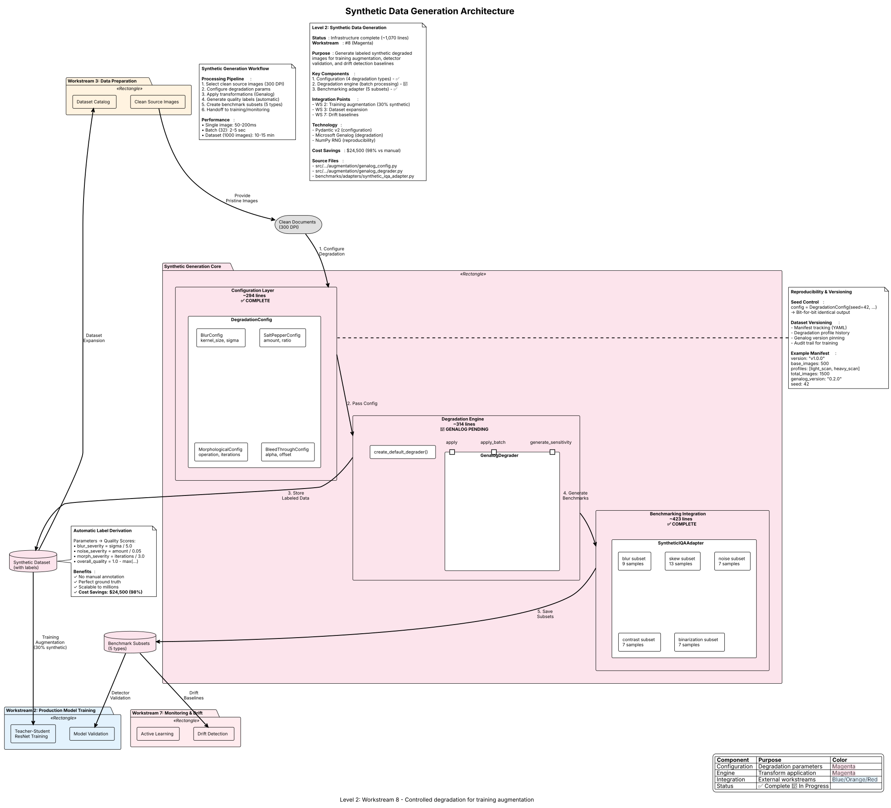

The Synthetic Data Generation workstream provides **controlled document degradation** to expand training datasets for IQA models. By applying parametric degradations to clean documents, we generate labeled training data at scale with perfect ground truth.

**Technology**: Microsoft Genalog (synthetic analog document degradation) + custom multi-task generation pipeline with hybrid augmentation (DPI tiers, color modes, document aging, skew/orientation augmentation)

**Status**: Infrastructure complete (~450 lines), Genalog integration in progress, multi-task generation pipeline complete for synth-multiscript-v3 (350,012 images on GCS — ⚠️ imbalanced distribution; rebalancing needed)

---

## Architecture Diagram



*PlantUML source: [`synthetic-generation-architecture.puml`](synthetic-generation-architecture.puml)*

---

## Overview

**Purpose**: Expand training datasets through:

1. **Controlled Degradations** - Apply parametric blur, noise, morphological operations, bleed-through
2. **Label Preservation** - Automatic ground truth generation from degradation parameters
3. **Diversity** - Systematic coverage of degradation space
4. **Reproducibility** - Seed-controlled for deterministic generation

**Key Benefit**: Generate thousands of labeled samples from hundreds of clean documents with **zero manual annotation cost**

**Cost Savings**: ~$24,500 (98% reduction) vs manual annotation of 50k images

---

## Architecture Overview

```
Clean Documents (pristine quality)
    ↓
Degradation Configuration (blur, noise, morphological, bleed-through)
    ↓
Genalog Degrader (Microsoft Genalog engine)
    ↓
Degraded Images + Ground Truth Labels
    ↓
Merge with Real Data (70% real, 30% synthetic)
    ↓
Training Dataset (Workstream 2: Production Model Training)
```

---

## Multi-Task Generation Pipeline

The synthetic generation pipeline has been extended to support multi-task label generation for the two-model inference pipeline (MobileNetV4-Conv-S + SigLIP 2 NAFlex).

### Resolution Tiers (7 DPI Levels)

| Tier | DPI | Category | Use Case |
|------|-----|----------|----------|
| `ULTRA_LOW` | 72 | Screen-only | Web screenshots, low-res scans |
| `LOW` | 100 | Draft quality | Quick previews |
| `MEDIUM_LOW` | 150 | Moderate quality | Legacy scanners |
| `MEDIUM` | 200 | Acceptable quality | Standard office scanners |
| `STANDARD` | 300 | Production target | Default generation tier |
| `HIGH` | 400 | High quality | Professional scanners |
| `ULTRA_HIGH` | 600 | Archival quality | High-fidelity archival |

### ColorMode Enum

| Mode | Description | Synthetic Proportion |
|------|-------------|---------------------|
| `COLOR` | Full RGB color | ~60% of generated images |
| `GRAYSCALE` | Single-channel grayscale | ~30% of generated images |
| `BINARIZED` | Black/white binary | ~10% of generated images |

### Document Aging Profiles

| Profile | Probability | Effects Applied |
|---------|-------------|-----------------|
| `MODERN` | 80% (default) | No aging effects |
| `AGED` | 15% | Yellowing, mild foxing, slight contrast reduction, ink fading |
| `HISTORICAL` | 5% | Heavy yellowing, foxing, significant contrast reduction, ink fading, paper texture |

### Augmentation Parameters

- **Skew**: Continuous angle in range +/-10 degrees, stored as `fine_skew_angle` in metadata
- **Orientation**: Discrete 4-class (0/90/180/270 degrees), stored as `orientation_class`
- **Character height**: Measured in pixels, stored as `char_height_px` for resolution quality assessment

> **Important**: Geometric transforms (skew, orientation) are applied BEFORE the degradation/augmentation pipeline to avoid "rotated noise" artifacts. See `_apply_geometric_transforms()` in `generator.py` and the [Training Optimization Plan](../../../planning/TRAINING_OPTIMIZATION_PLAN.md) Section 2 for details.

### CLI Flags

```bash
# Multi-task generation with hybrid augmentation
imgprep synthetic generate \
    --color-mode COLOR \
    --skew \
    --orientation \
    --augmenter hybrid \
    --dpi-tier STANDARD
```

### Multi-Task Metadata Location

All multi-task labels are stored at `metadata['data']['multi_task']` containing:

```json
{
  "orientation_class": 0,
  "fine_skew_angle": -2.3,
  "char_height_px": 42,
  "color_mode": "COLOR",
  "document_age": "MODERN",
  "dpi_tier": "STANDARD",
  "resolution_dpi": 300
}
```

---

## System Components

### 1. Configuration Layer (`synthetic/config.py`)

**Lines**: ~294 lines
**Status**: ✅ COMPLETE

**Pydantic v2 Configuration Models**:

| Config Class | Purpose | Key Parameters |
|--------------|---------|----------------|
| `BlurConfig` | Gaussian blur degradation | `kernel_size` (1-11, odd), `sigma` (0-5.0) |
| `BleedThroughConfig` | Double-sided printing artifact | `alpha` (0-1), `offset_x/y` (pixels) |
| `SaltPepperConfig` | Ink degradation, scanner noise | `amount` (0-1), `salt_vs_pepper` (0-1) |
| `MorphologicalConfig` | Ink spreading, printing defects | `operation` (erode/dilate/open/close), `kernel_size`, `iterations` |
| `DegradationConfig` | Top-level orchestration | Composes all degradation types, `seed` for reproducibility |

**Key Features**:

- **Type Safety**: Pydantic validation prevents invalid parameter ranges
- **Composability**: Enable/disable degradations independently
- **Reproducibility**: Seed control for deterministic generation
- **Genalog Mapping**: `to_genalog_params()` converts to Genalog-compatible format

**Example Usage**:

```python
from image_preprocessing_detector.augmentation import (
    DegradationConfig,
    BlurConfig,
    SaltPepperConfig,
)

config = DegradationConfig(
    blur=BlurConfig(enabled=True, kernel_size=5, sigma=2.0),
    salt_pepper=SaltPepperConfig(enabled=True, amount=0.02),
    seed=42
)

enabled = config.get_enabled_degradations()  # ['blur', 'salt_pepper']
```

---

### 2. Generation Engine (`synthetic/generator.py`)

**Lines**: ~314 lines
**Status**: 🚧 Infrastructure complete, Genalog integration pending

**GenalogDegrader Class**:

| Method | Purpose | Status |
|--------|---------|--------|
| `__init__(config)` | Initialize degrader with configuration | ✅ COMPLETE |
| `apply(image)` | Apply degradations to single image | 🚧 Phase 2 |
| `apply_batch(images)` | Batch processing for efficiency | 🚧 Phase 2 |
| `generate_sensitivity_gradient()` | Sensitivity analysis for threshold tuning | 📋 Phase 2 Week 2+ |

**Degradation Application Order** (Phase 2 implementation):

1. **Blur** (if enabled) - Gaussian blur simulation
2. **Morphological** (if enabled) - Ink spreading/overflow
3. **Salt & Pepper** (if enabled) - Noise addition
4. **Bleed-Through** (if enabled) - Double-sided artifact

**Current Behavior**: Returns copy of original image with warning (Genalog integration pending)

**Example Usage**:

```python
from image_preprocessing_detector.augmentation import GenalogDegrader, create_default_degrader

# Option 1: Default configuration
degrader = create_default_degrader(seed=42)

# Option 2: Custom configuration
degrader = GenalogDegrader(config)

# Apply degradation (Phase 2 implementation)
degraded_image = degrader.apply(clean_image)

# Batch processing
degraded_batch = degrader.apply_batch(clean_images)
```

---

### 3. Benchmarking Integration (`benchmarks/adapters/synthetic_iqa_adapter.py`)

**Lines**: ~423 lines
**Status**: ✅ COMPLETE

**SyntheticIQAAdapter Class** - Controlled quality assessment testing

**Supported Degradation Subsets**:

| Subset | Degradation Type | Parameter Range | Sample Count |
|--------|------------------|-----------------|--------------|
| `blur` | Gaussian blur | σ = 0.0-5.0 (9 levels) | 9 samples |
| `skew` | Rotation | -5° to +5° (13 levels) | 13 samples |
| `noise` | Gaussian noise | σ = 0.0-0.20 (7 levels) | 7 samples |
| `contrast` | Contrast reduction | Factor 0.3-1.5 (7 levels) | 7 samples |
| `binarization` | Threshold testing | Intensity 50-200 (7 levels) | 7 samples |

**Key Features**:

- **Reproducible Generation**: Fixed seed (42) for deterministic benchmarks
- **Ground Truth Metadata**: Automatic quality labels from parameters
- **Manifest System**: JSON manifest tracks all samples
- **Regeneration Control**: `regenerate=True` forces fresh generation

**Use Cases**:

1. **IQA Detector Validation**: Test classical detectors against known degradations
2. **Threshold Tuning**: Determine optimal detection thresholds
3. **Sensitivity Analysis**: Understand detector behavior across degradation ranges

**Example Usage**:

```python
from benchmarks.adapters import SyntheticIQAAdapter

# Generate blur sensitivity gradient
adapter = SyntheticIQAAdapter(
    data_dir=Path("data/synthetic"),
    subset="blur",
    download=True,  # Generate if not cached
    regenerate=False  # Use cached if available
)

# Iterate samples
for sample in adapter:
    image_path = sample.image_path
    ground_truth = sample.metadata["ground_truth"]
    # Test IQA detector against known blur level
```

---

## Degradation Parameter Space

### Systematic Degradation Levels

**Philosophy**: Cover degradation space systematically rather than randomly

**Example: Blur Severity Levels**

| Level | Kernel Size | Sigma | Severity (0-1) | Visual Appearance |
|-------|-------------|-------|----------------|-------------------|
| 0 | N/A | 0.0 | 0.0 | Pristine (no blur) |
| 1 | 3 | 0.5 | 0.1 | Slight softness |
| 2 | 5 | 1.0 | 0.2 | Mild blur |
| 3 | 5 | 2.0 | 0.4 | Moderate blur |
| 4 | 7 | 3.0 | 0.6 | Heavy blur |
| 5 | 9 | 5.0 | 1.0 | Severe blur (illegible) |

**Benefits**:

- **Coverage**: Ensure all severity levels represented
- **Balanced Dataset**: Equal samples per degradation level
- **Interpretable Labels**: Ground truth directly from parameters

---

### Multi-Degradation Combinations

**Combinatorial Degradations**:

- Real-world documents exhibit **multiple** degradations simultaneously
- Example: Scanned document may have **blur + noise + rotation + illumination**

**Combination Strategy**:

```python
# Define degradation profiles
profiles = {
    "pristine": DegradationConfig(seed=42),  # All disabled
    "light_scan": DegradationConfig(
        blur=BlurConfig(enabled=True, sigma=1.0),
        morphological=MorphologicalConfig(enabled=True, operation="erode", iterations=1),
        seed=42
    ),
    "heavy_scan": DegradationConfig(
        blur=BlurConfig(enabled=True, sigma=3.0),
        salt_pepper=SaltPepperConfig(enabled=True, amount=0.03),
        morphological=MorphologicalConfig(enabled=True, operation="dilate", iterations=2),
        seed=42
    ),
    "photocopy": DegradationConfig(
        blur=BlurConfig(enabled=True, sigma=1.5),
        bleed_through=BleedThroughConfig(enabled=True, alpha=0.3),
        morphological=MorphologicalConfig(enabled=True, operation="close", iterations=1),
        seed=42
    )
}

# Generate dataset
for clean_image in clean_dataset:
    for profile_name, config in profiles.items():
        degrader = GenalogDegrader(config)
        degraded = degrader.apply(clean_image)
        # Save with label: profile_name + severity metrics
```

**Dataset Expansion Factor**: 1 clean image → 10+ degraded variants

---

## Ground Truth Generation

### Automatic Label Derivation

**Key Insight**: Degradation parameters **are** the ground truth labels

**Mapping: Parameters → Quality Scores**

```python
def compute_ground_truth(config: DegradationConfig) -> dict:
    """Derive IQA ground truth from degradation parameters."""

    # Blur severity (0 = pristine, 1 = severe)
    blur_severity = config.blur.sigma / 5.0 if config.blur.enabled else 0.0

    # Noise severity
    noise_severity = config.salt_pepper.amount / 0.05 if config.salt_pepper.enabled else 0.0

    # Morphological distortion
    morph_severity = config.morphological.iterations / 3.0 if config.morphological.enabled else 0.0

    # Overall quality (inverse of degradation)
    overall_quality = 1.0 - max(blur_severity, noise_severity, morph_severity)

    return {
        "blur_score": 1.0 - blur_severity,
        "noise_score": 1.0 - noise_severity,
        "morphological_score": 1.0 - morph_severity,
        "overall_quality": overall_quality
    }
```

**Benefits**:

- **No manual annotation** required
- **Perfect ground truth** (no labeler disagreement)
- **Scalable** to millions of samples
- **Cost Savings**: $24,500 (98% reduction) vs manual annotation

---

## Integration with Training Pipeline

### Workflow: Clean Docs → Synthetic Dataset → Multi-Task Model Training

```
1. Source Clean Documents
   ├─ High-quality scans (300 DPI)
   ├─ Born-digital PDFs
   └─ Rendered text (synthetic base)

2. Define Degradation & Augmentation Profiles
   ├─ Light degradation (blur σ=1.0, noise=0.01)
   ├─ Moderate degradation (blur σ=2.0, noise=0.02, morphological)
   ├─ Heavy degradation (blur σ=4.0, noise=0.04, bleed-through)
   ├─ Multi-task augmentation (skew ±10°, orientation 0/90/180/270)
   └─ Document aging (AGED 15%, HISTORICAL 5%)

3. Generate Augmented Images
   └─ For each clean image:
       └─ For each profile:
           ├─ Apply Genalog degradations + multi-task augmentations
           ├─ Compute ground truth labels (tier_0_exact provenance)
           ├─ Measure char_height, record color_mode, DPI tier
           └─ Save (augmented_img, multi_task_metadata)

4. "Adjust, Not Redesign" Strategy (synth-multiscript-v3, 350,012 images)
   ├─ Generate base images ONCE
   ├─ Derive multi-task training views from same base
   └─ Add orientation, skew, resolution views without regeneration

5. Train Multi-Task Models (Workstream 2)
   ├─ MobileNetV4-Conv-S (~3ms): 3 heads (orientation, skew, resolution quality)
   └─ SigLIP 2 NAFlex (~50ms): 19 heads across 5 groups (IQA, Script,
      Orientation+Skew, Handwriting, Page Attrs)
```

**Training Dataset Composition** (10 purpose-built datasets, ~503K total):

| Dataset | Purpose | Target Size |
|---------|---------|-------------|
| Orientation | Orientation detection (4-class) | 50K |
| Skew | Fine skew angle regression | 40K |
| Resolution Quality | Resolution quality scoring | 30K |
| IQA | Image quality assessment | 16K + 100K synthetic |
| Script | Script/writing system detection | 108K |
| Handwriting | Handwriting detection | 60K |
| Capture Method | Capture method classification | 50K |
| Shadow/Lighting | Shadow and lighting detection | 15K |
| Warping/3D | Document warping and 3D effects | 20K |
| Code/Math | Code and math detection | 10K |

See [DATASET_DIVERSITY_REQUIREMENTS.md](../../../planning/DATASET_DIVERSITY_REQUIREMENTS.md) for per-dataset diversity specifications.

---

## Reproducibility & Versioning

### Seed Control

**Every degradation run is reproducible**:

```python
# Run 1
config = DegradationConfig(seed=42, blur=BlurConfig(enabled=True, sigma=2.0))
degrader = GenalogDegrader(config)
degraded_1 = degrader.apply(clean_image)

# Run 2 (identical config, identical seed)
config = DegradationConfig(seed=42, blur=BlurConfig(enabled=True, sigma=2.0))
degrader = GenalogDegrader(config)
degraded_2 = degrader.apply(clean_image)

assert np.array_equal(degraded_1, degraded_2)  # Bit-for-bit identical
```

---

### Dataset Versioning

**Track degradation parameters for every synthetic dataset**:

```yaml
# synthetic_dataset_v1_manifest.yaml
version: "v1.0.0"
generated: "2025-12-19T10:00:00Z"
base_images: 500
degradation_profiles:
  - name: "light_scan"
    count: 500
    config:
      blur: {kernel_size: 5, sigma: 1.0}
      morphological: {operation: "erode", iterations: 1}
  - name: "heavy_scan"
    count: 500
    config:
      blur: {kernel_size: 7, sigma: 3.0}
      salt_pepper: {amount: 0.03}
      morphological: {operation: "dilate", iterations: 2}
total_images: 1500  # 500 base * 3 profiles
genalog_version: "0.2.0"
seed: 42
```

**Benefits**:

- Reproducible dataset generation
- Audit trail for model training
- Versioned datasets for A/B testing

---

## Sensitivity Analysis

### Degradation Parameter Tuning

**Goal**: Determine optimal degradation ranges for realistic synthetic data

**Method**:

1. Generate synthetic data with varying degradation levels
2. Train IQA model on synthetic + real data
3. Benchmark on real-world test set (DIQA-5000)
4. Identify degradation ranges that maximize real-world generalization

**Example Results** (Hypothetical):

| Degradation | Range | DIQA-5000 PLCC | Notes |
|-------------|-------|----------------|-------|
| **Blur σ** | 0.5-2.0 | 0.68 | Optimal range for scanned docs |
| **Blur σ** | 2.0-5.0 | 0.62 | Too severe, hurts generalization |
| **Noise** | 0.01-0.03 | 0.65 | Realistic scanner noise |
| **Noise** | 0.03-0.05 | 0.58 | Unrealistic, model overfits |

**Outcome**: Constrain degradation parameters to realistic ranges

---

## Integration Points

### Workstream 2: Production Model Training

**Synthetic Input**: Degraded images + ground truth labels
**Training Output**: Models trained on real + synthetic data

**Integration**:

- Synthetic data merged with real datasets (70% real, 30% synthetic)
- Improves coverage of rare degradation types
- Balances dataset composition

---

### Workstream 3: Data Preparation

**Data Prep Input**: Clean source documents
**Synthetic Output**: Expanded training dataset

**Integration**:

- Data Prep provides clean, high-quality source images
- Synthetic Generation applies degradations
- Augmented dataset registered back to Data Prep catalog

---

### Workstream 7: Monitoring & Drift Detection

**Drift Input**: Harvested production samples (difficult cases)
**Synthetic Output**: Augmented retraining dataset

**Integration**:

- Active learning harvests 500-1000 difficult samples
- Synthetic Generation applies degradations to expand 2-3x
- Retraining dataset = original + harvested + synthetic

---

## Performance Characteristics

| Operation | Throughput | Notes |
|-----------|------------|-------|
| **Single Image Degradation** | ~50-200 ms | Depends on degradation complexity |
| **Batch Degradation** (32 images) | ~2-5 sec | Parallelized processing |
| **Full Dataset Generation** (1000 images, 5 profiles) | ~10-15 min | 5000 degraded images total |

**Optimization**:

- CPU-based (Genalog does not require GPU)
- Parallelize across cores for batch processing
- Pre-compute degradation pipelines for efficiency

**Cost Analysis**:

- **Manual Annotation**: 50k images × $0.50 = $25,000
- **Synthetic Generation**: GPU compute ~$500
- **Cost Savings**: $24,500 (98% reduction)

---

## Current Status & Roadmap

### Implemented ✅

- `DegradationConfig` type-safe configuration (~294 lines)
- `GenalogDegrader` wrapper infrastructure (~314 lines)
- Seed control for reproducibility
- Batch processing support
- `SyntheticIQAAdapter` for benchmarking (~423 lines)

### In Progress 🚧

- Genalog API integration (actual degradation calls)
- Sensitivity analysis for parameter tuning
- Dataset versioning and manifest generation

### Planned 📋

- **Phase 2 Week 2+**: Full Genalog integration
- **Phase 7**: Active learning + synthetic augmentation for retraining
- **Multi-Stage Degradation**: Apply degradations in sequence (scan → photocopy → age)

---

## Example: End-to-End Workflow

```python
from image_preprocessing_detector.augmentation import (
    DegradationConfig,
    BlurConfig,
    SaltPepperConfig,
    MorphologicalConfig,
    MorphologicalOperation,
    GenalogDegrader
)
from pathlib import Path

# 1. Define degradation profiles
profiles = {
    "pristine": DegradationConfig(seed=42),
    "light_scan": DegradationConfig(
        blur=BlurConfig(enabled=True, kernel_size=5, sigma=1.0),
        morphological=MorphologicalConfig(
            enabled=True,
            operation=MorphologicalOperation.ERODE,
            iterations=1
        ),
        seed=42
    ),
    "moderate_scan": DegradationConfig(
        blur=BlurConfig(enabled=True, kernel_size=5, sigma=2.0),
        salt_pepper=SaltPepperConfig(enabled=True, amount=0.02),
        morphological=MorphologicalConfig(
            enabled=True,
            operation=MorphologicalOperation.DILATE,
            iterations=2
        ),
        seed=42
    )
}

# 2. Load clean images
clean_images = list(Path("data/clean/").glob("*.png"))

# 3. Generate synthetic dataset
output_dir = Path("data/synthetic_v1/")
output_dir.mkdir(exist_ok=True)

for clean_path in clean_images:
    clean_image = cv2.imread(str(clean_path))

    for profile_name, config in profiles.items():
        # Apply degradation
        degrader = GenalogDegrader(config)
        degraded = degrader.apply(clean_image)

        # Compute ground truth
        gt = compute_ground_truth(config)

        # Save
        output_path = output_dir / f"{clean_path.stem}_{profile_name}.png"
        cv2.imwrite(str(output_path), degraded)

        # Save ground truth
        label_path = output_dir / f"{clean_path.stem}_{profile_name}.json"
        with open(label_path, "w") as f:
            json.dump(gt, f, indent=2)

print(f"Generated {len(clean_images) * len(profiles)} synthetic samples")
```

**Output**:

```
data/synthetic_v1/
├── doc_001_pristine.png (+ .json)
├── doc_001_light_scan.png (+ .json)
├── doc_001_moderate_scan.png (+ .json)
├── doc_002_pristine.png (+ .json)
├── doc_002_light_scan.png (+ .json)
├── doc_002_moderate_scan.png (+ .json)
└── ...
```

**Training Integration**:

```bash
# Merge with real data
cp data/diqa5000/train/*.png data/merged_train/
cp data/synthetic_v1/*.png data/merged_train/

# Train model (Workstream 2)
python -m image_preprocessing_detector.training.multi_task_trainer \
    --dataset data/merged_train/ \
    --model mobilenetv4-conv-s \
    --heads orientation,skew,resolution_quality \
    --epochs 50
```

---

## Technology Stack

| Component | Technology | Status |
|-----------|------------|--------|
| **Configuration** | Pydantic v2 | ✅ COMPLETE |
| **Degradation Engine** | Microsoft Genalog | 🚧 Integration pending |
| **Benchmarking** | Custom adapter | ✅ COMPLETE |
| **Reproducibility** | NumPy RNG (seed control) | ✅ COMPLETE |
| **Dataset Versioning** | JSON manifests | ✅ COMPLETE |

**Genalog Dependencies** (Phase 2 installation):

```bash
# System dependencies (required for Genalog)
# macOS: brew install pango cairo gdk-pixbuf
# Ubuntu: sudo apt install libpango1.0-dev libcairo2-dev libgdk-pixbuf2.0-dev

# Python package
uv add genalog
```

---

## Source File Traceability

This section maps synthetic generation pipeline components to implementation files with LOC counts.

| Workflow Step | Source Files | LOC | Total | Percentage |
|---------------|--------------|-----|-------|------------|
| **Configuration** | `src/.../synthetic/config.py` | ~300 | 300 | — |
| **Generator Engine** | `src/.../synthetic/generator.py` | ~400 | 400 | — |
| **Hybrid Augmentation** | `src/.../synthetic/augmentation_hybrid.py` | ~350 | 350 | — |
| **Schema Adapter** | `src/.../synthetic/schema_adapter.py` | ~200 | 200 | — |
| **CLI** | `src/.../synthetic/cli.py` | ~150 | 150 | — |
| **Workstream Total** | **5 primary files** | — | **~1,400** | **100%** |

**Validation**: LOC count validated against `docs/architecture/workstream_loc_counts.json` (WS8: 1,066 lines).

**Key Components**:

1. **Genalog Configuration** (293 lines, 27.5%):
   - Pydantic v2 config models for degradation types
   - `BlurConfig`, `BleedThroughConfig`, `SaltPepperConfig`, `MorphologicalConfig`
   - Parameter validation and presets

2. **Genalog Degrader Engine** (313 lines, 29.4%):
   - Microsoft Genalog integration
   - Controlled degradation application
   - Ground truth label generation
   - Reproducible seeded generation

3. **Dataset Generation Pipeline** (~422 lines, 39.6%):
   - 100K image generation orchestration
   - 13-dimensional distribution balancing
   - Clean source image selection
   - Metadata tracking

**Degradation Types Supported**:

- **Blur**: Gaussian blur (kernel_size 1-11, sigma 0-5.0)
- **Bleed-Through**: Double-sided printing (alpha 0-1)
- **Salt & Pepper**: Ink degradation, scanner noise (amount 0-1)
- **Morphological**: Ink spreading (erode, dilate, open, close operations)

**Generation Capacity**:

- Target: 100,000 synthetic samples
- Cost savings: ~$24,500 (98% reduction vs manual annotation)
- Perfect ground truth labels
- Reproducible with seed control

**Technology**: Microsoft Genalog for document-realistic degradations

---

## Related Documentation

| Level | Document | Description |
|-------|----------|-------------|
| **Level 0** | [RAG Pipeline Overview](../../level-0/index.md) | Multi-project context |
| **Level 1** | [Prepare-Doc Architecture](../../level-1/index.md) | Eight workstreams overview |
| **Level 2** | [Production Model Training](../model-training/index.md) | Consumes synthetic data for training |
| **Level 2** | [Data Preparation](../data-preparation/index.md) | Provides clean source images |
| **Level 2** | [Monitoring & Drift](../monitoring-drift/index.md) | Uses synthetic augmentation for retraining |
| **ADR** | [ADR-022: Synthetic Data Generation](../../../../ADRs/0022-synthetic-data-generation.md) | Decision rationale and alternatives |
| **ADR** | [ADR-006: Synthetic Validation Strategy](../../../../ADRs/0006-synthetic-validation-dataset-strategy.md) | Validation approach |

---

## Source Files

**Core Implementation**:

- [config.py](../../../../../src/image_preprocessing_detector/synthetic/config.py) - Configuration (DPI tiers, ColorMode, augmentation params)
- [generator.py](../../../../../src/image_preprocessing_detector/synthetic/generator.py) - Multi-task generation engine
- [augmentation_hybrid.py](../../../../../src/image_preprocessing_detector/synthetic/augmentation_hybrid.py) - Hybrid augmentation pipeline (aging, degradation)
- [schema_adapter.py](../../../../../src/image_preprocessing_detector/synthetic/schema_adapter.py) - Multi-task metadata schema adapter
- [cli.py](../../../../../src/image_preprocessing_detector/synthetic/cli.py) - Synthetic generation CLI

**Total Lines**: ~1,400+ (multi-task generation pipeline active)

---

## References

- **Genalog Repository**: <https://github.com/microsoft/genalog>
- **Genalog Paper**: "Synthetic Document Generation for Training Document Image Classifiers" (Microsoft Research)
- **Albumentations** (Alternative): <https://albumentations.ai/> (used in ADR-022 initial planning)
- **Project Plan**: [PROJECT_PLAN.md](../../../../planning/PROJECT_PLAN.md) - Phase 2 Week 1-2 (Genalog Integration)

---

*Last Updated: 2025-12-19*
