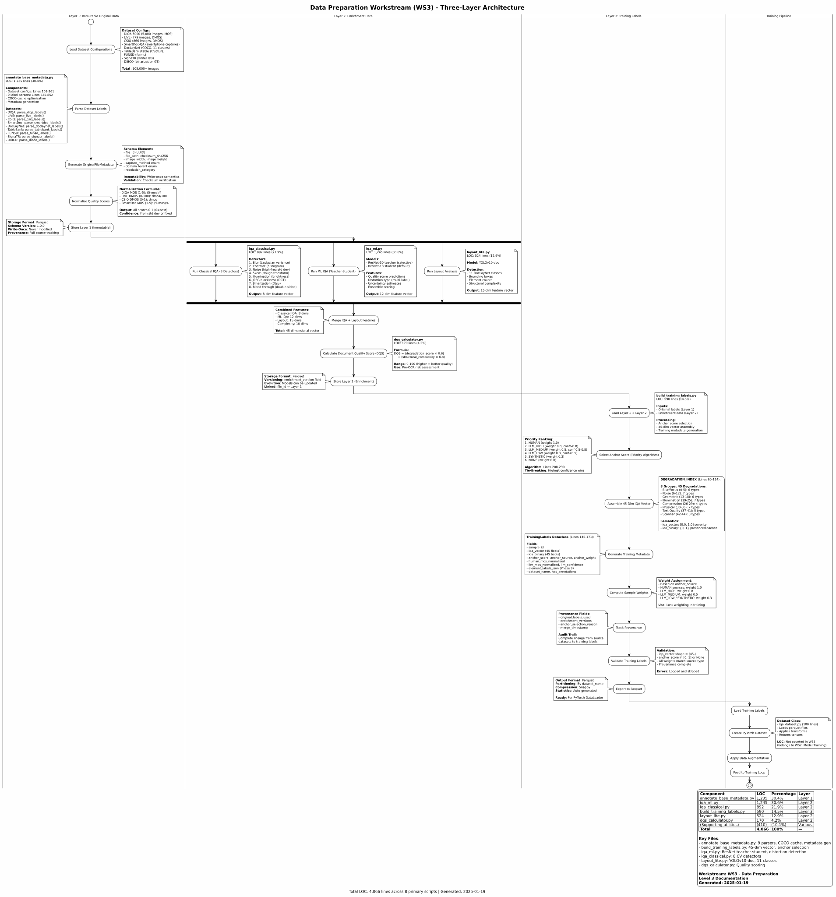

# Level 3: Data Preparation - Module Implementation

**Status**: Active
**Lines of Code**: 4,066+
**Purpose**: Detailed module-level documentation for the Data Preparation workstream (WS3), including metadata schema versioning, label parsing, and swimlane diagrams with LOC annotations.

## Related Diagrams

- **Level 0**: [RAG Pipeline Overview](../../level-0/index.md)
- **Level 1**: [Prepare-Doc Architecture](../../level-1/index.md)
- **Level 2**: [Data Preparation](../../level-2/data-preparation/index.md)

## Contents

### Swimlane Diagram

Complete data preparation swimlane with LOC annotations for each processing step.

- **Source**: [data-preparation-swimlane.puml](data-preparation-swimlane.puml)

### Metadata Schema & Versioning

Three-layer metadata architecture (Immutable, Enrichment, Training) with versioning strategy.

- **Document**: [metadata-schema-versioning.md](metadata-schema-versioning.md)
- **Layer 1**: OriginalFileMetadata, OriginalLabels (immutable ground truth)
- **Layer 2**: Enrichment data with SemVer versioning
- **Layer 3**: Training labels with anchor score selection

### Label Parsing & Generation

Heterogeneous dataset parsing and 45-dimensional training label generation system.

- **Document**: [label-parsing-generation.md](label-parsing-generation.md)
- **Parsers**: 9 dataset-specific parsers
- **Label Dimensions**: 45-dimensional degradation index (8 groups)
- **Anchor Score Priority**: human > LLM_high > LLM_medium > LLM_low > synthetic > none

## Key Source Files

| File | LOC | Purpose |
| ---- | --- | ------- |
| `scripts/annotate_base_metadata.py` | 1,235 | Layer 1 + Layer 2 metadata annotation |
| `scripts/build_training_labels.py` | 590 | Layer 3 training label generation |
| `src/.../annotation/` | ~19,600 | Modular annotation package |
| `src/.../schema_utils/layout_taxonomy.py` | ~400 | Layout label taxonomy |
