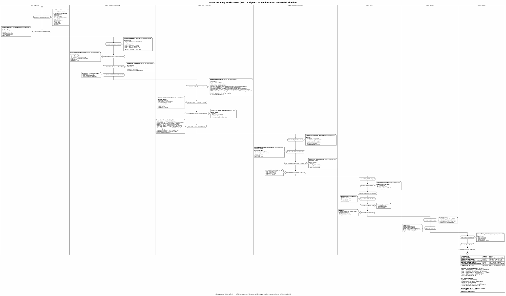

# Level 3: Model Training - Module Implementation

**Status**: Active
**Lines of Code**: 7,058+
**Purpose**: Detailed module-level documentation for the Production Model Training workstream (WS2), including training workflows and model architecture details.

## Related Diagrams

- **Level 0**: [RAG Pipeline Overview](../../level-0/index.md)
- **Level 1**: [Project A Architecture](../../level-1/index.md)
- **Level 2**: [Model Training](../../level-2/model-training/index.md)

## Contents

### Swimlane Diagram

Model training swimlane with LOC annotations for each training phase.

- **Source**: [model-training-swimlane.puml](model-training-swimlane.puml)

### Layout Fusion Downsampler (LEGACY)

> **SUPERSEDED**: This document describes the legacy ResNet-based layout fusion approach. The current architecture uses SigLIP 2 NAFlex with variable resolution via NAFlex packing (no downsampling required). See [SIGLIP2_MULTITASK_REQUIREMENTS.md](../../../../planning/SIGLIP2_MULTITASK_REQUIREMENTS.md).

- **Document**: [layout-fusion-downsampler.md](layout-fusion-downsampler.md)
- **Architecture**: Layout encoder + RGB encoder + fusion layer (1600x1600 to 400x400)
- **Performance**: SRCC improvement +8.5% overall vs naive downsampling

## Key Source Files

| File | LOC | Purpose |
| ---- | --- | ------- |
| `src/.../labeling/finetuning/layout_fusion.py` | 848 | Layout fusion downsampler (legacy) |
| `modal/train_phase2_iqa.py` | ~300 | ResNet teacher training (legacy) |
| `modal/train_student_distillation.py` | ~250 | Student distillation (legacy) |
