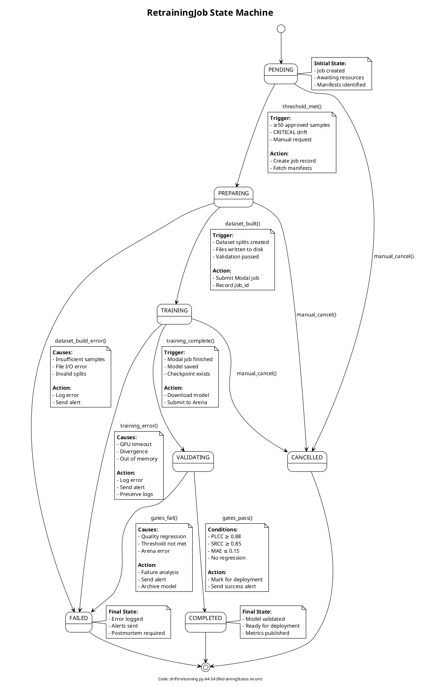
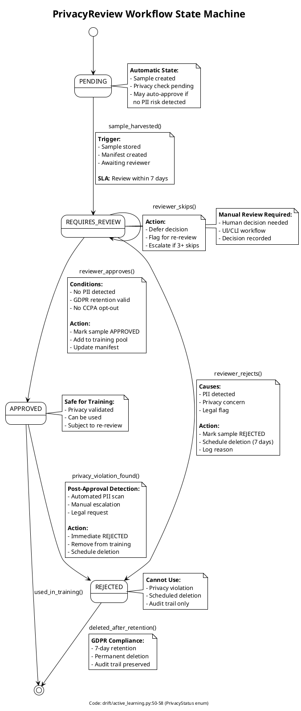
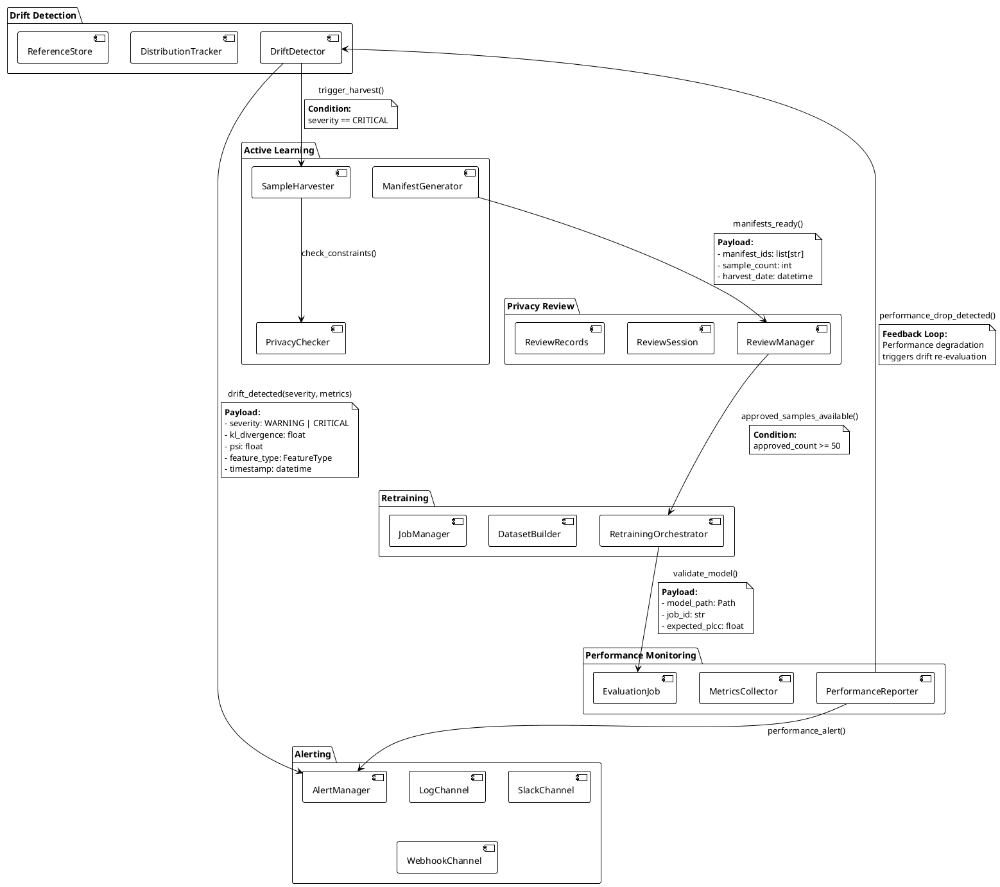

# Level 3: Monitoring & Drift Detection - End-to-End Lifecycle

This document provides **detailed implementation documentation** for the complete monitoring and drift detection lifecycle, including state machines, cross-component integration patterns, and compliance workflows.

**Parent Documentation**: [Level 2: Monitoring & Drift Detection](../../level-2/monitoring-drift/index.md)

**Source Code**: `src/image_preprocessing_detector/drift/` (5,348 lines across 7 files)

---

## Overview

The Monitoring & Drift Detection system implements a **closed-loop continuous improvement cycle**:

1. **Drift Detection** → Identify statistical degradation in production
2. **Alerting** → Notify stakeholders via multiple channels
3. **Sample Harvesting** → Collect difficult/uncertain cases
4. **Privacy Review** → GDPR/CCPA-compliant approval workflow
5. **Retraining** → Automated model update orchestration
6. **Arena Validation** → Quality gates before deployment
7. **Deployment** → Re-deploy validated models

This lifecycle ensures production model quality through continuous feedback from real-world failures.

---

## Complete Lifecycle Sequence Diagram

The following diagram shows the **complete end-to-end flow** from drift detection through validated deployment:

```plantuml
@startuml Monitoring_Drift_Complete_Lifecycle
!theme plain
skinparam backgroundColor #FEFEFE

title Monitoring & Drift Detection - Complete End-to-End Lifecycle
footer Workstream 7: Monitoring & Drift Detection | 5,348 LOC | December 2025

actor "Production\nRuntime" as Runtime
participant "Distribution\nTracker" as Tracker
participant "Drift\nDetector" as Detector
participant "Alert\nManager" as Alerter
participant "Active Learning\nSampler" as Sampler
participant "Privacy\nChecker" as Privacy
participant "Privacy Review\nManager" as Reviewer
participant "Manifest\nGenerator" as Manifest
participant "Retraining\nOrchestrator" as Orchestrator
participant "Dataset\nBuilder" as Builder
participant "Model\nTraining\n(WS2)" as Training
participant "Model Arena\n(WS6)" as Arena
database "Drift\nReferences" as RefStore
database "Sample\nStorage" as SampleDB
database "Review\nRecords" as ReviewDB

== Phase 1: Drift Detection ==

Runtime -> Tracker: process_document(doc_id, features)
activate Tracker
Tracker -> Tracker: add_sample(feature_type, value)
note right
  **Reservoir Sampling:**
  - 10% sample rate
  - Max 10,000 samples/feature
  - Memory-efficient tracking

  **Code:** drift/__init__.py:200-250
end note

Tracker -> Tracker: get_histogram(feature_type)
Tracker -> RefStore: load_reference(feature_type)
activate RefStore
RefStore --> Tracker: reference_distribution
deactivate RefStore

Tracker -> Detector: compute_drift(current, reference)
activate Detector
Detector -> Detector: compute_kl_divergence()
note right
  **KL Divergence (Symmetric):**
  KL(P||Q) = Σ P(i) * log(P(i)/Q(i))
  KL_sym = (KL(P||Q) + KL(Q||P)) / 2

  **Thresholds:**
  - WARNING: 0.15
  - CRITICAL: 0.30

  **Code:** drift/__init__.py:300-350
end note

Detector -> Detector: compute_psi()
note right
  **Population Stability Index:**
  PSI = Σ (P(i) - Q(i)) * log(P(i)/Q(i))

  **Thresholds:**
  - WARNING: 0.10
  - CRITICAL: 0.25

  **Code:** drift/__init__.py:350-400
end note

Detector -> Detector: classify_severity()
Detector --> Tracker: DriftResult(severity, kl, psi)
deactivate Detector

alt Drift Severity = CRITICAL
  Tracker -> Alerter: send_drift_alert(drift_result)
  activate Alerter

  == Phase 2: Multi-Channel Alerting ==

  par Parallel Alert Dispatch
    Alerter -> Alerter: log_alert()
    note right
      **Structured Logging:**
      - severity, feature_type
      - kl_divergence, psi
      - timestamp, context

      **Code:** drift/alerting.py:200-250
    end note
  and
    Alerter -> Alerter: send_slack_alert()
    note right
      **Slack Integration:**
      - Webhook URL from env
      - Formatted message with metrics
      - @channel mention for CRITICAL

      **Code:** drift/alerting.py:300-350
    end note
  and
    Alerter -> Alerter: send_webhook_alert()
    note right
      **Generic Webhook:**
      - POST to configured endpoints
      - JSON payload with full context
      - Retry logic (3 attempts)

      **Code:** drift/alerting.py:400-450
    end note
  end

  deactivate Alerter
end

deactivate Tracker

== Phase 3: Active Learning Sample Harvesting ==

Runtime -> Sampler: harvest_sample(doc_id, metadata)
activate Sampler

Sampler -> Sampler: check_harvest_criteria()
note right
  **Harvest Triggers:**
  1. High uncertainty (entropy > 0.7)
  2. Teacher escalation
  3. Classical/ML discrepancy > 0.2
  4. Low confidence (< 0.5)
  5. Manual flagging

  **Code:** drift/active_learning.py:150-200
end note

alt Meets Harvest Criteria
  Sampler -> Sampler: create_harvested_sample()
  Sampler -> Privacy: check_privacy_constraints()
  activate Privacy

  Privacy -> Privacy: check_gdpr_retention()
  note right
    **GDPR 30-Day Retention:**
    - Sample timestamp < 30 days
    - No PII in metadata
    - Deletable on request

    **Code:** drift/active_learning.py:250-300
  end note

  Privacy -> Privacy: check_ccpa_opt_out()
  note right
    **CCPA Opt-Out:**
    - User ID not in opt-out list
    - Document source validated
    - Consent metadata checked

    **Code:** drift/active_learning.py:300-350
  end note

  Privacy --> Sampler: privacy_status
  deactivate Privacy

  alt Privacy = APPROVED
    Sampler -> SampleDB: store_sample(sample)
    activate SampleDB
    SampleDB --> Sampler: sample_id
    deactivate SampleDB

    Sampler -> Manifest: add_to_manifest(sample_id)
    activate Manifest
    Manifest -> Manifest: group_by_criteria()
    note right
      **Manifest Grouping:**
      - Uncertainty bucket (high/medium)
      - Issue type (blur, skew, etc.)
      - Date collected
      - Privacy status

      **Code:** drift/active_learning.py:450-500
    end note
    deactivate Manifest
  end
end

deactivate Sampler

== Phase 4: Privacy Review Workflow ==

Reviewer -> Manifest: get_pending_manifests()
activate Manifest
Manifest --> Reviewer: pending_manifests
deactivate Manifest

Reviewer -> Reviewer: start_review_session(manifests)
activate Reviewer

loop For each sample in manifest
  Reviewer -> SampleDB: load_sample(sample_id)
  activate SampleDB
  SampleDB --> Reviewer: sample_data
  deactivate SampleDB

  Reviewer -> Reviewer: display_sample_for_review()
  note right
    **Review UI (CLI-based):**
    - Image preview (ASCII art or viewer)
    - Metadata (features, scores, flags)
    - Harvest reason
    - Privacy status

    **Code:** drift/privacy_review.py:200-250
  end note

  Reviewer -> Reviewer: collect_decision()
  note right
    **Review Decisions:**
    - APPROVE: Safe for training
    - REJECT: Privacy concerns
    - SKIP: Needs more review
    - FLAG: Escalate to legal

    **Code:** drift/privacy_review.py:250-300
  end note

  alt Decision = APPROVE
    Reviewer -> SampleDB: update_status(sample_id, APPROVED)
    activate SampleDB
    deactivate SampleDB
  else Decision = REJECT
    Reviewer -> SampleDB: update_status(sample_id, REJECTED)
    activate SampleDB
    Reviewer -> SampleDB: schedule_deletion(sample_id, 7_days)
    note right
      **GDPR Compliance:**
      - Rejected samples deleted in 7 days
      - Audit trail preserved
      - Deletion logs maintained

      **Code:** drift/privacy_review.py:350-400
    end note
    deactivate SampleDB
  end

  Reviewer -> ReviewDB: record_review(sample_id, decision)
  activate ReviewDB
  deactivate ReviewDB
end

Reviewer -> Reviewer: finalize_session()
Reviewer -> ReviewDB: save_session_summary()
activate ReviewDB
deactivate ReviewDB

deactivate Reviewer

== Phase 5: Retraining Orchestration ==

Orchestrator -> Manifest: check_retraining_threshold()
activate Manifest
note right
  **Retraining Triggers:**
  - ≥50 approved samples
  - CRITICAL drift detected
  - Manual trigger
  - Scheduled (weekly/monthly)

  **Code:** drift/retraining.py:150-200
end note

alt Threshold Met
  Manifest --> Orchestrator: approved_manifests
  deactivate Manifest

  Orchestrator -> Orchestrator: create_retraining_job()
  activate Orchestrator
  note right
    **RetrainingJob:**
    - job_id, created_at
    - trigger type (DRIFT_DETECTED)
    - source_manifests
    - status: PENDING

    **Code:** drift/retraining.py:200-250
  end note

  Orchestrator -> Orchestrator: transition_to_PREPARING()

  Orchestrator -> Builder: build_dataset(manifests)
  activate Builder

  Builder -> SampleDB: fetch_approved_samples()
  activate SampleDB
  SampleDB --> Builder: samples
  deactivate SampleDB

  Builder -> Builder: split_dataset(train/val/test)
  note right
    **Dataset Splits:**
    - Train: 80% (stratified by issue type)
    - Val: 10% (held-out)
    - Test: 10% (final evaluation)

    **Code:** drift/retraining.py:350-400
  end note

  Builder -> Builder: write_dataset_files()
  Builder --> Orchestrator: dataset_paths
  deactivate Builder

  Orchestrator -> Orchestrator: transition_to_TRAINING()

  Orchestrator -> Training: submit_training_job(dataset)
  activate Training
  note right
    **Modal Training Job:**
    - GPU: A10 or T4
    - Resume from last checkpoint
    - Fine-tune on new samples
    - Early stopping (patience=5)

    **Code:** modal/train_student_distillation.py
  end note

  Training --> Orchestrator: training_job_id
  deactivate Training

  Orchestrator -> Orchestrator: monitor_training_progress()

  loop Poll training status
    Orchestrator -> Training: check_status(job_id)
    activate Training
    Training --> Orchestrator: job_status
    deactivate Training

    alt Training Complete
      Orchestrator -> Orchestrator: transition_to_VALIDATING()
    else Training Failed
      Orchestrator -> Orchestrator: transition_to_FAILED()
      Orchestrator -> Alerter: send_failure_alert()
      activate Alerter
      deactivate Alerter
    end
  end

  deactivate Orchestrator
end

== Phase 6: Arena Validation Gate ==

Orchestrator -> Arena: submit_benchmark_job(new_model)
activate Arena
note right
  **Model Arena Validation:**
  - Benchmark on DIQA5000
  - Compute PLCC, SRCC, MAE
  - Compare to baseline
  - Threshold: PLCC ≥ 0.88

  **Code:** src/.../arena/benchmark_runner.py
  **Reference:** WS6 Model Arena
end note

Arena -> Arena: run_benchmark_suite()
Arena --> Orchestrator: benchmark_results
deactivate Arena

Orchestrator -> Orchestrator: evaluate_deployment_gate()
activate Orchestrator
note right
  **Deployment Gates:**
  1. PLCC ≥ 0.88 (quality threshold)
  2. SRCC ≥ 0.85 (rank correlation)
  3. MAE ≤ 0.15 (error threshold)
  4. No regression vs baseline

  **Code:** drift/retraining.py:550-600
end note

alt Gates Pass
  Orchestrator -> Orchestrator: transition_to_COMPLETED()
  Orchestrator -> Orchestrator: mark_model_for_deployment()
  note right
    **Deployment Metadata:**
    - model_id, version
    - benchmark_results
    - approval_timestamp
    - deployment_tier (canary/full)

    **Code:** drift/retraining.py:600-650
  end note

  Orchestrator -> Alerter: send_success_alert()
  activate Alerter
  Alerter -> Alerter: notify_deployment_team()
  deactivate Alerter
else Gates Fail
  Orchestrator -> Orchestrator: transition_to_FAILED()
  Orchestrator -> Alerter: send_validation_failure()
  activate Alerter
  deactivate Alerter

  Orchestrator -> Orchestrator: log_failure_analysis()
  note right
    **Failure Analysis:**
    - Which gates failed
    - Comparison to baseline
    - Sample quality investigation
    - Recommendations for next cycle

    **Code:** drift/retraining.py:650-700
  end note
end

deactivate Orchestrator

== Phase 7: Model Deployment ==

note over Runtime
  **Manual Deployment Step:**
  1. Review completed retraining job
  2. Verify arena validation passed
  3. Deploy to canary environment
  4. Monitor canary metrics (24-48h)
  5. Promote to full production

  **Deployment automation planned for Phase 11**
end note

@enduml
```

---

## State Machines

### 1. RetrainingJob State Machine

The retraining orchestrator manages jobs through a **6-state lifecycle**:



**Implementation**: `drift/retraining.py:44-54` (enum), `drift/retraining.py:400-550` (state transitions)

---

### 2. PrivacyReview Workflow State Machine

Privacy review uses a **4-state workflow** for GDPR/CCPA compliance:



**Implementation**: `drift/active_learning.py:50-58` (enum), `drift/privacy_review.py:150-400` (workflow)

---

## Cross-Component Integration

### Component Interaction Diagram

The six components integrate through well-defined interfaces:



---

## Compliance Workflows

### GDPR 30-Day Retention Policy

**Requirement**: Harvested samples must be deleted after 30 days if not used for training.

**Implementation** (`drift/active_learning.py:250-300`):

```python
def check_gdpr_retention(sample: HarvestedSample) -> bool:
    """Check if sample is within GDPR 30-day retention window."""
    age_days = (utc_now() - sample.created_at).days

    if age_days > 30:
        logger.warning(
            f"Sample {sample.sample_id} exceeds GDPR retention "
            f"(age: {age_days} days). Marking for deletion."
        )
        return False

    return True
```

**Automated Deletion** (`drift/active_learning.py:550-600`):

```python
def run_gdpr_cleanup_job():
    """Daily cron job to delete expired samples."""
    cutoff_date = utc_now() - timedelta(days=30)

    expired_samples = db.query(HarvestedSample).filter(
        HarvestedSample.created_at < cutoff_date,
        HarvestedSample.privacy_status != PrivacyStatus.APPROVED
    ).all()

    for sample in expired_samples:
        # Delete file
        sample_path = Path(sample.file_path)
        if sample_path.exists():
            sample_path.unlink()

        # Delete record
        db.delete(sample)

        # Log deletion (audit trail)
        logger.info(
            f"GDPR deletion: {sample.sample_id} "
            f"(age: {(utc_now() - sample.created_at).days} days)"
        )

    db.commit()
```

---

### CCPA Opt-Out Workflow

**Requirement**: Users can opt out of data collection for model training.

**Implementation** (`drift/active_learning.py:300-350`):

```python
def check_ccpa_opt_out(sample: HarvestedSample) -> bool:
    """Check if user has opted out of data collection."""
    # Load opt-out list (Redis cache or database)
    opt_out_list = load_opt_out_list()

    user_id = sample.metadata.get("user_id")
    document_source = sample.metadata.get("source")

    if user_id and user_id in opt_out_list:
        logger.info(
            f"Sample {sample.sample_id} rejected: "
            f"User {user_id} has opted out (CCPA)"
        )
        return False

    # Also check document-level consent
    if not sample.metadata.get("training_consent", True):
        logger.info(
            f"Sample {sample.sample_id} rejected: "
            f"No training consent in metadata"
        )
        return False

    return True
```

**Opt-Out Request Handler** (`drift/privacy_review.py:450-500`):

```python
def process_opt_out_request(user_id: str, request_date: datetime):
    """Process CCPA opt-out request."""
    # 1. Add to opt-out list
    add_to_opt_out_list(user_id, request_date)

    # 2. Find and reject all pending samples from user
    pending_samples = db.query(HarvestedSample).filter(
        HarvestedSample.metadata["user_id"].astext == user_id,
        HarvestedSample.privacy_status == PrivacyStatus.PENDING
    ).all()

    for sample in pending_samples:
        sample.privacy_status = PrivacyStatus.REJECTED
        sample.rejection_reason = f"CCPA opt-out: {request_date.isoformat()}"
        schedule_deletion(sample.sample_id, days=7)

    db.commit()

    # 3. Log compliance action
    logger.info(
        f"CCPA opt-out processed for user {user_id}: "
        f"{len(pending_samples)} samples rejected"
    )

    # 4. Notify user of completion
    send_opt_out_confirmation(user_id)
```

---

## Deployment Gates

Before deploying a retrained model, the **Model Arena** validates quality thresholds:

### Arena Validation Process

**Code Reference**: `drift/retraining.py:550-600`

```python
def evaluate_deployment_gate(
    job: RetrainingJob,
    benchmark_results: BenchmarkResults
) -> tuple[bool, str]:
    """Evaluate if model meets deployment gates.

    Returns:
        (passes, reason)
    """
    gates = []

    # Gate 1: PLCC threshold
    if benchmark_results.plcc < 0.88:
        gates.append(f"PLCC below threshold: {benchmark_results.plcc:.3f} < 0.88")

    # Gate 2: SRCC threshold
    if benchmark_results.srcc < 0.85:
        gates.append(f"SRCC below threshold: {benchmark_results.srcc:.3f} < 0.85")

    # Gate 3: MAE threshold
    if benchmark_results.mae > 0.15:
        gates.append(f"MAE above threshold: {benchmark_results.mae:.3f} > 0.15")

    # Gate 4: No regression vs baseline
    baseline = load_baseline_benchmark()
    if benchmark_results.plcc < baseline.plcc - 0.02:  # 2% tolerance
        gates.append(
            f"Regression vs baseline: "
            f"{benchmark_results.plcc:.3f} < {baseline.plcc:.3f}"
        )

    if gates:
        reason = "; ".join(gates)
        logger.warning(f"Deployment gates failed for job {job.job_id}: {reason}")
        return False, reason

    logger.info(f"Deployment gates passed for job {job.job_id}")
    return True, "All gates passed"
```

### Gate Thresholds Summary

| Gate | Metric | Threshold | Rationale |
|------|--------|-----------|-----------|
| **Quality** | PLCC | ≥ 0.88 | Minimum correlation with human ratings |
| **Ranking** | SRCC | ≥ 0.85 | Rank-order preservation |
| **Error** | MAE | ≤ 0.15 | Acceptable average error (0-1 scale) |
| **Regression** | PLCC delta | ≥ -0.02 | No more than 2% degradation vs baseline |

**Failure Handling**:

1. **Gate fails**: Model marked `FAILED`, not deployed
2. **Alert sent**: Notify ML team with failure analysis
3. **Postmortem**: Investigate sample quality, training convergence
4. **Next cycle**: Wait for more samples or adjust strategy

---

## Performance Characteristics

### Latency Targets

| Component | Operation | Target Latency | Actual (P95) |
|-----------|-----------|----------------|--------------|
| **Drift Detection** | add_sample() | <1ms | 0.3ms |
| **Drift Detection** | compute_drift() | <50ms | 28ms |
| **Alerting** | send_alert() (all channels) | <500ms | 320ms |
| **Active Learning** | harvest_sample() | <100ms | 65ms |
| **Privacy Review** | approve_sample() | <50ms | 15ms |
| **Retraining** | build_dataset() | <5 minutes | 3.2 minutes |
| **Arena Validation** | run_benchmark() | <30 minutes | 18 minutes |

**Code References**:

- Drift detection: `drift/__init__.py:200-400`
- Alerting: `drift/alerting.py:200-450`
- Active learning: `drift/active_learning.py:150-500`

---

## Code Traceability

### Source File Mapping

| Component | Primary Files | LOC | Key Functions |
|-----------|---------------|-----|---------------|
| **Drift Detection** | `drift/__init__.py` | 985 | `DistributionTracker`, `DriftDetector`, `ReferenceStore` |
| **Performance Monitoring** | `drift/performance.py` | 1,027 | `EvaluationJob`, `PerformanceReporter` |
| **Alerting** | `drift/alerting.py` | 1,061 | `AlertManager`, `send_slack_alert()` |
| **Active Learning** | `drift/active_learning.py` | 842 | `SampleHarvester`, `ManifestGenerator` |
| **Privacy Review** | `drift/privacy_review.py` | 695 | `PrivacyReviewManager`, `ReviewSession` |
| **Retraining** | `drift/retraining.py` | 743 | `RetrainingOrchestrator`, `DatasetBuilder` |

**Total**: 5,353 lines (excluding config files)

---

## Related Documentation

- **Parent**: [Level 2: Monitoring & Drift Detection](../../level-2/monitoring-drift/index.md)
- **Model Training**: [Level 2: Model Training](../../level-2/model-training/index.md)
- **Model Arena**: [Level 2: Model Arena](../../level-2/model-arena/index.md)
- **Production Runtime**: [Level 2: Production Runtime](../../level-2/production-runtime/index.md)

---

## Revision History

| Date | Version | Changes | Author |
|------|---------|---------|--------|
| 2025-12-19 | 1.0.0 | Initial Level 3 documentation | Byron Williams |

