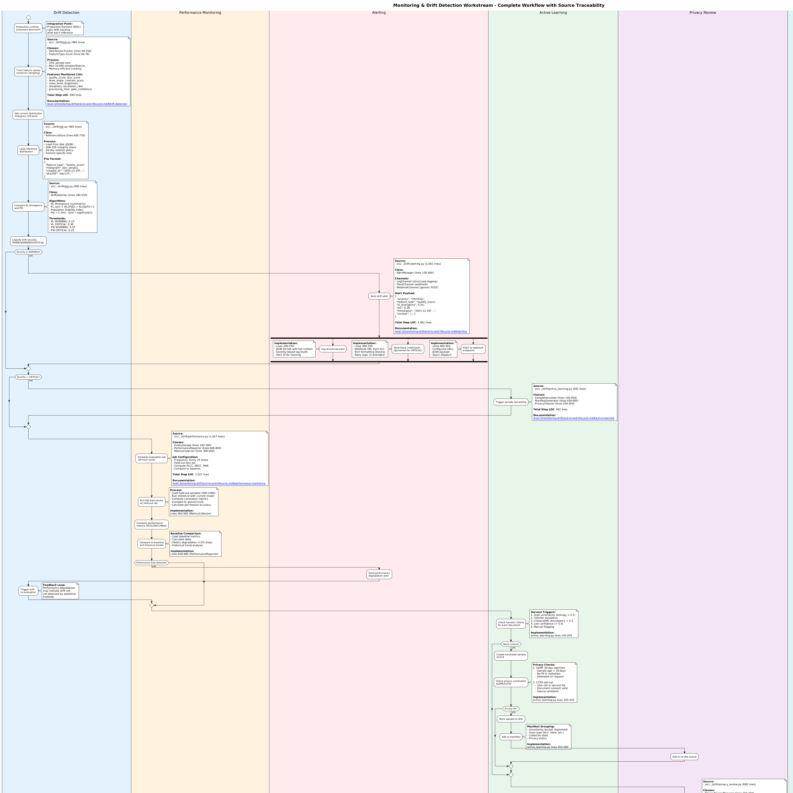

# Level 3: Monitoring & Drift Detection - Module Implementation

**Status**: Active (Phase 6 - 95% Complete)
**Lines of Code**: 5,353+ (implementation) + 5,400+ (tests)
**Purpose**: Detailed module-level documentation for the Monitoring & Drift Detection workstream (WS7), including the closed-loop lifecycle from drift detection through retraining.

## Related Diagrams

- **Level 0**: [RAG Pipeline Overview](../../level-0/index.md)
- **Level 1**: [Project A Architecture](../../level-1/index.md)
- **Level 2**: [Monitoring & Drift Detection](../../level-2/monitoring-drift/index.md)

## Contents

### Swimlane Diagram

Monitoring and drift detection swimlane with LOC annotations.

- **Source**: [monitoring-drift-swimlane.puml](monitoring-drift-swimlane.puml)

### End-to-End Lifecycle

Complete closed-loop lifecycle from drift detection through privacy review to model retraining.

- **Document**: [end-to-end-lifecycle.md](end-to-end-lifecycle.md)
- **7 Phases**: Drift Detection, Alerting, Active Learning, Privacy Review, Retraining, Arena Validation, Deployment
- **Compliance**: GDPR (30-day retention), CCPA (opt-out list checking)
- **Deployment Gates**: Per-head thresholds (IQA PLCC > 0.65, Orientation > 95%, Skew MAE < 0.5)

## Key Source Files

| File | LOC | Purpose |
| ---- | --- | ------- |
| `src/.../drift/__init__.py` | 985 | Core drift detection |
| `src/.../drift/performance.py` | 1,027 | Performance monitoring |
| `src/.../drift/alerting.py` | 1,061 | Multi-channel alerting |
| `src/.../drift/active_learning.py` | 842 | Sample harvesting |
| `src/.../drift/privacy_review.py` | 695 | GDPR/CCPA compliance |
| `src/.../drift/retraining.py` | 743 | Automated retraining |
