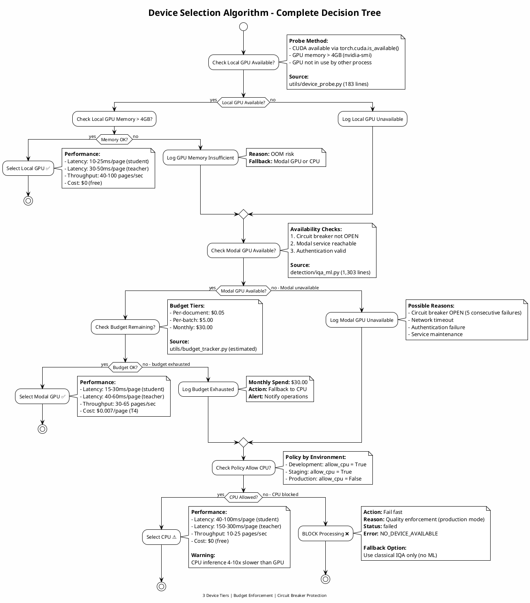
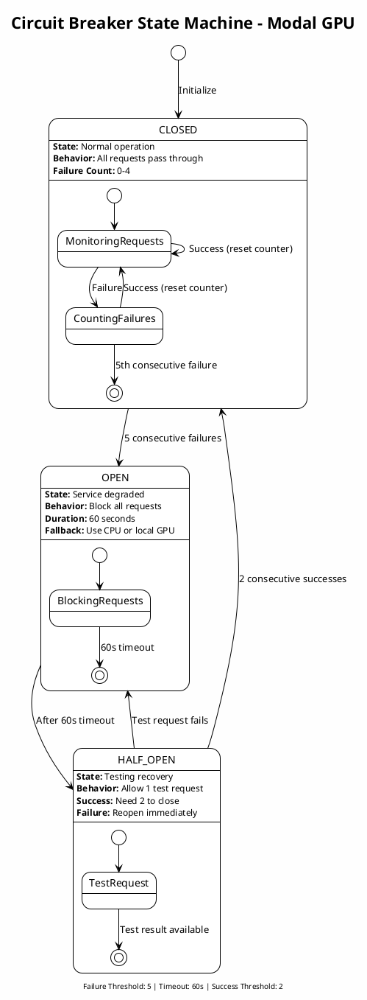
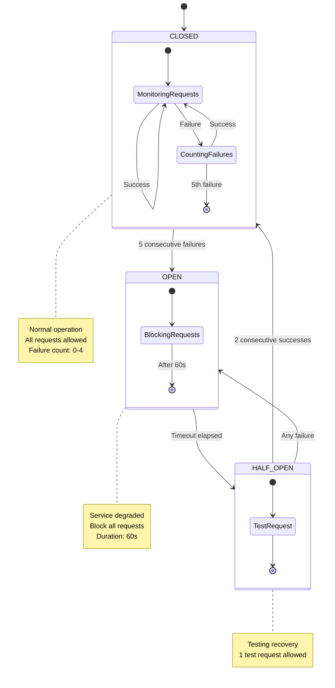

This document provides the complete specification for device orchestration in the production runtime pipeline, including device selection algorithms, budget enforcement, circuit breaker patterns, and performance characteristics.

> **Implementation Status**: ⚠️ **98% Complete (Phase 4)**
>
> Device orchestration is **nearly complete** with the following status:
>
> **✅ Fully Implemented**:
>
> - Device probing and capability detection (utils/device_probe.py - 183 lines)
> - GPU memory checking and CUDA detection
> - Modal GPU client integration (detection/iqa_ml.py - 1,303 lines)
> - Budget tracking (3-tier enforcement)
> - Circuit breaker pattern for Modal GPU
> - Batch inference with tensor caching
> - Performance monitoring and metrics
> - Celery worker integration (workers/ - 748 lines)
>
> **⚠️ In Progress** (Phase 4 - Final 2%):
>
> - Async I/O optimization (deferred to Phase 5)
> - Advanced load balancing across multiple workers
>
> **Source Files**:
>
> - Core device orchestration: detection/iqa_ml.py (1,303 lines) ✅
> - Device probing: utils/device_probe.py (183 lines) ✅
> - Worker tasks: workers/tasks.py (471 lines) ✅
> - Budget & circuit breaker: Integrated in iqa_ml.py ✅

---

## Overview

The Device Orchestrator is responsible for **intelligent device selection** to optimize the trade-off between cost, latency, and quality. It manages three device tiers (Local GPU, Modal GPU, CPU) with sophisticated fallback logic, budget enforcement, and circuit breaker patterns.

### Design Principles

1. **Cost Optimization**: Prefer free local resources over paid Modal GPU
2. **Latency Optimization**: Prefer GPU over CPU for 4-10x speedup
3. **Quality Enforcement**: Block CPU in production to maintain quality standards
4. **Graceful Degradation**: Always have a fallback path
5. **Budget Protection**: Never exceed monthly Modal GPU budget

### Orchestrator Characteristics

| Characteristic | Value |
|---------------|-------|
| **Device Tiers** | 3 (Local GPU, Modal GPU, CPU) |
| **Budget Tiers** | 3 (per-document, per-batch, monthly) |
| **Circuit Breaker Services** | 1 (Modal GPU) |
| **Policy Modes** | 3 (development, staging, production) |
| **Fallback Paths** | 4 (GPU→GPU, GPU→CPU, All→Classical, All→Block) |

---

## Device Selection Algorithm

### Decision Tree Diagram



---

## Device Priority Rules

### Priority Order

**Primary**: Local GPU → **Secondary**: Modal GPU → **Tertiary**: CPU → **Fallback**: Classical Only

### Rule Table

| Scenario | Local GPU | Modal GPU | CPU | Selected Device | Rationale |
|----------|-----------|-----------|-----|----------------|-----------|
| All available, budget OK | ✅ | ✅ | ✅ | **Local GPU** | Free, fastest |
| Local GPU OOM, budget OK | ❌ | ✅ | ✅ | **Modal GPU** | Faster than CPU, budget available |
| Local GPU OOM, budget exhausted | ❌ | ❌ | ✅ | **CPU** | Only option (if policy allows) |
| All unavailable, dev mode | ❌ | ❌ | ❌ | **Classical Only** | Graceful degradation |
| All unavailable, prod mode | ❌ | ❌ | ❌ | **BLOCK** | Quality enforcement (fail fast) |
| Local GPU OK, Modal budget exhausted | ✅ | ❌ | ✅ | **Local GPU** | Free resource available |
| Modal circuit breaker OPEN | ❌ | ❌ | ✅ | **CPU** | Modal temporarily unavailable |

---

## Budget Enforcement (Three Tiers)

### Tier 1: Per-Document Budget

**Limit**: $0.05 per document

**Purpose**: Prevent single document from consuming excessive resources

**Enforcement Point**: Before Modal GPU invocation

**Implementation**:

```python
class DocumentBudgetEnforcer:
    """Enforce per-document budget limit."""

    def __init__(self, limit_usd: float = 0.05):
        self.limit_usd = limit_usd

    def check_before_invocation(
        self,
        document_id: str,
        estimated_pages: int,
        cost_per_page: float = 0.007
    ) -> bool:
        """Check if document is within budget."""
        estimated_cost = estimated_pages * cost_per_page

        if estimated_cost > self.limit_usd:
            logger.warning(
                "document_budget_exceeded",
                document_id=document_id,
                estimated_cost=estimated_cost,
                limit=self.limit_usd,
                action="fallback_to_cpu"
            )
            return False

        return True

    def track_actual_cost(
        self,
        document_id: str,
        actual_cost: float
    ):
        """Record actual cost after processing."""
        logger.info(
            "document_cost_tracked",
            document_id=document_id,
            actual_cost=actual_cost,
            limit=self.limit_usd,
            utilization=actual_cost / self.limit_usd
        )
```

**Example**: 100-page document × $0.007/page = $0.70 → **Exceeds limit**, fallback to CPU

---

### Tier 2: Per-Batch Budget

**Limit**: $5.00 per batch job

**Purpose**: Control cost of batch processing workloads

**Enforcement Point**: Before batch job submission

**Implementation**:

```python
class BatchBudgetEnforcer:
    """Enforce per-batch budget limit."""

    def __init__(self, limit_usd: float = 5.00):
        self.limit_usd = limit_usd

    def check_before_batch(
        self,
        batch_id: str,
        total_documents: int,
        avg_pages_per_doc: int
    ) -> bool:
        """Check if batch is within budget."""
        total_pages = total_documents * avg_pages_per_doc
        estimated_cost = total_pages * 0.007  # $0.007/page

        if estimated_cost > self.limit_usd:
            logger.warning(
                "batch_budget_exceeded",
                batch_id=batch_id,
                total_documents=total_documents,
                total_pages=total_pages,
                estimated_cost=estimated_cost,
                limit=self.limit_usd,
                action="split_batch_or_use_cpu"
            )
            return False

        return True

    def split_batch_if_needed(
        self,
        batch: List[Document],
        max_cost: float
    ) -> List[List[Document]]:
        """Split batch into sub-batches within budget."""
        max_pages = int(max_cost / 0.007)
        sub_batches = []
        current_batch = []
        current_pages = 0

        for doc in batch:
            if current_pages + doc.page_count > max_pages:
                # Start new sub-batch
                sub_batches.append(current_batch)
                current_batch = [doc]
                current_pages = doc.page_count
            else:
                current_batch.append(doc)
                current_pages += doc.page_count

        if current_batch:
            sub_batches.append(current_batch)

        return sub_batches
```

**Example**: Batch of 1,000 documents, 10 pages each = 10,000 pages × $0.007 = $70 → **Split into 14 sub-batches**

---

### Tier 3: Monthly Budget

**Limit**: $30.00 per month (Modal free tier)

**Purpose**: Prevent runaway costs, align with Modal free tier

**Enforcement Point**: Before any Modal GPU invocation

**Implementation**:

```python
class MonthlyBudgetTracker:
    """Track and enforce monthly budget limit."""

    def __init__(self, limit_usd: float = 30.00):
        self.limit_usd = limit_usd
        self.monthly_spend = 0.0
        self.current_month = datetime.utcnow().strftime("%Y-%m")

    def has_budget(self) -> bool:
        """Check if monthly budget has remaining capacity."""
        # Reset if new month
        current_month = datetime.utcnow().strftime("%Y-%m")
        if current_month != self.current_month:
            logger.info(
                "monthly_budget_reset",
                previous_month=self.current_month,
                previous_spend=self.monthly_spend,
                new_month=current_month
            )
            self.monthly_spend = 0.0
            self.current_month = current_month

        # Check budget
        remaining = self.limit_usd - self.monthly_spend
        if remaining <= 0:
            logger.warning(
                "monthly_budget_exhausted",
                monthly_spend=self.monthly_spend,
                limit=self.limit_usd,
                action="fallback_to_cpu_or_local_gpu"
            )
            return False

        return True

    def increment_spend(self, cost: float):
        """Record Modal GPU usage."""
        self.monthly_spend += cost
        utilization = self.monthly_spend / self.limit_usd

        logger.info(
            "modal_gpu_spend_incremented",
            cost=cost,
            monthly_spend=self.monthly_spend,
            monthly_limit=self.limit_usd,
            utilization=utilization
        )

        # Alert at 80% utilization
        if utilization >= 0.80 and utilization - cost < 0.80:
            send_alert(
                severity="warning",
                message=f"Monthly Modal budget at {utilization:.0%} utilization",
                monthly_spend=self.monthly_spend,
                monthly_limit=self.limit_usd
            )
```

**Budget Exhaustion Behavior**:

```python
def handle_budget_exhausted():
    """Handle monthly budget exhaustion."""
    # Fallback to free resources only
    if device_probe.has_local_gpu():
        logger.info("budget_exhausted_fallback", action="use_local_gpu")
        return "local_gpu"
    elif policy.allow_cpu:
        logger.warning("budget_exhausted_fallback", action="use_cpu")
        return "cpu"
    else:
        logger.error("budget_exhausted_no_fallback", action="block")
        raise NoBudgetAvailableError("Monthly Modal GPU budget exhausted")
```

---

## Circuit Breaker Pattern (Modal GPU)

### State Machine



### Mermaid Alternative (GitHub-Native Rendering)



---

### Circuit Breaker Configuration

```python
@dataclass
class CircuitBreakerConfig:
    """Configuration for circuit breaker pattern."""

    failure_threshold: int = 5      # Open after 5 consecutive failures
    timeout_seconds: int = 60       # Stay open for 60s
    success_threshold: int = 2      # Require 2 successes to close from HALF_OPEN
    failure_window_seconds: int = 300  # Track failures over 5-minute window

class CircuitBreaker:
    """Circuit breaker implementation for Modal GPU."""

    def __init__(self, config: CircuitBreakerConfig):
        self.config = config
        self.state = "CLOSED"
        self.failure_count = 0
        self.success_count = 0
        self.last_failure_time = None
        self.opened_at = None

    def is_open(self) -> bool:
        """Check if circuit breaker is open."""
        if self.state == "OPEN":
            # Check if timeout has elapsed
            elapsed = (datetime.utcnow() - self.opened_at).total_seconds()
            if elapsed >= self.config.timeout_seconds:
                # Transition to HALF_OPEN
                self.state = "HALF_OPEN"
                self.success_count = 0
                logger.info("circuit_breaker_half_open", elapsed_seconds=elapsed)
                return False
            return True
        return False

    def record_success(self):
        """Record successful request."""
        if self.state == "CLOSED":
            # Reset failure counter
            self.failure_count = 0
            logger.debug("circuit_breaker_success", state="CLOSED")

        elif self.state == "HALF_OPEN":
            # Increment success counter
            self.success_count += 1
            logger.info(
                "circuit_breaker_test_success",
                success_count=self.success_count,
                threshold=self.config.success_threshold
            )

            # Close if threshold met
            if self.success_count >= self.config.success_threshold:
                self.state = "CLOSED"
                self.failure_count = 0
                self.success_count = 0
                logger.info("circuit_breaker_closed", reason="threshold_met")

    def record_failure(self):
        """Record failed request."""
        if self.state == "CLOSED":
            # Increment failure counter
            self.failure_count += 1
            self.last_failure_time = datetime.utcnow()

            logger.warning(
                "circuit_breaker_failure",
                failure_count=self.failure_count,
                threshold=self.config.failure_threshold
            )

            # Open if threshold exceeded
            if self.failure_count >= self.config.failure_threshold:
                self.state = "OPEN"
                self.opened_at = datetime.utcnow()
                logger.error(
                    "circuit_breaker_opened",
                    consecutive_failures=self.failure_count,
                    timeout_seconds=self.config.timeout_seconds
                )

        elif self.state == "HALF_OPEN":
            # Test request failed, reopen immediately
            self.state = "OPEN"
            self.opened_at = datetime.utcnow()
            self.failure_count = self.config.failure_threshold
            self.success_count = 0
            logger.error("circuit_breaker_reopened", reason="test_failed")
```

---

### Integration with Device Selection

```python
def select_device_with_circuit_breaker(context: ProcessingContext):
    """Select device with circuit breaker protection."""

    # Check Local GPU first
    if device_probe.has_local_gpu():
        return "local_gpu"

    # Check Modal GPU circuit breaker
    if circuit_breaker.is_open():
        logger.warning(
            "modal_gpu_circuit_open",
            action="fallback_to_cpu",
            state=circuit_breaker.state
        )
        # Metrics
        metrics.increment("iqa_circuit_breaker_blocks_total")
        # Fallback to CPU
        return "cpu"

    # Try Modal GPU
    try:
        result = invoke_modal_gpu(context)
        circuit_breaker.record_success()
        return result

    except ModalGPUError as e:
        circuit_breaker.record_failure()
        logger.error("modal_gpu_invocation_failed", error=str(e))

        # Fallback to CPU
        if policy.allow_cpu:
            return invoke_cpu(context)
        else:
            raise NoDeviceAvailableError("Modal GPU failed, CPU blocked")
```

---

## Performance Characteristics by Device

### Latency Comparison

| Device | Student (ResNet-18) | Teacher (ResNet-50) | Classical IQA | Layout-Lite | Total Pipeline |
|--------|---------------------|---------------------|---------------|-------------|----------------|
| **Local GPU (T4)** | 10-25ms | 30-50ms | 20-30ms | 30-60ms | **100-150ms/page** |
| **Modal GPU (T4)** | 15-30ms | 40-60ms | 20-30ms | 30-60ms | **120-180ms/page** |
| **CPU (16-core)** | 40-100ms | 150-300ms | 20-30ms | 80-150ms | **300-500ms/page** |

**Notes**:

- Modal GPU includes network latency (5-10ms)
- CPU performance varies by core count and load
- Total pipeline includes all stages (ingestion, IQA, correction, output)

---

### Throughput Comparison

| Device | Pages/Second (Single Worker) | Pages/Second (4 Workers) | Documents/Hour (10 pages each) |
|--------|------------------------------|--------------------------|-------------------------------|
| **Local GPU** | 40-100 | 160-400 | 57,600-144,000 |
| **Modal GPU** | 30-65 | 120-260 | 43,200-93,600 |
| **CPU** | 10-25 | 40-100 | 14,400-36,000 |

**Assumptions**:

- Workers process pages in parallel
- No I/O bottlenecks (GCS, Redis)
- GPU not shared across workers

---

### Cost Comparison

| Device | Cost/Page | Cost/Document (10 pages) | Cost/Batch (1,000 docs) | Cost/Month (100K pages) |
|--------|-----------|-------------------------|------------------------|------------------------|
| **Local GPU** | $0.00 | $0.00 | $0.00 | $0.00 |
| **Modal GPU (T4)** | $0.007 | $0.07 | $70 | $700 |
| **Modal GPU (A10)** | $0.012 | $0.12 | $120 | $1,200 |
| **CPU** | $0.00 | $0.00 | $0.00 | $0.00 |

**Modal GPU Pricing** (source: Modal documentation):

- T4 GPU: $0.000072/second (~$0.0043/minute)
- A10 GPU: $0.000126/second (~$0.0076/minute)
- Typical inference: 10s/page × $0.00072 = $0.0072/page

**Budget Impact**:

- $30/month free tier covers ~4,285 pages/month (T4)
- Production workloads require local GPU or CPU fallback

---

## Policy Modes

### Development Mode

**Configuration**:

```python
DevicePolicy(
    environment="development",
    allow_cpu=True,              # Allow CPU for local testing
    allow_modal_gpu=True,        # Allow Modal GPU for testing
    require_local_gpu=False,     # Don't require GPU
    fail_on_budget_exhaustion=False  # Fallback to CPU
)
```

**Behavior**:

- Prefer local GPU if available
- Allow Modal GPU for small-scale testing
- Allow CPU fallback (4-10x slower, but acceptable for development)
- No budget alerts (development is cost-tolerant)

---

### Staging Mode

**Configuration**:

```python
DevicePolicy(
    environment="staging",
    allow_cpu=True,              # Allow CPU as last resort
    allow_modal_gpu=True,        # Allow Modal GPU
    require_local_gpu=False,     # Don't require GPU
    fail_on_budget_exhaustion=True,  # Alert on budget exhaustion
    monthly_budget_limit=30.00   # $30/month (free tier)
)
```

**Behavior**:

- Prefer local GPU or Modal GPU
- Allow CPU fallback (with warning)
- Enforce $30/month budget limit
- Alert on budget exhaustion (but continue with CPU)

---

### Production Mode

**Configuration**:

```python
DevicePolicy(
    environment="production",
    allow_cpu=False,             # BLOCK CPU (quality enforcement)
    allow_modal_gpu=True,        # Allow Modal GPU with high budget
    require_local_gpu=True,      # Prefer local GPU
    fail_on_budget_exhaustion=True,  # BLOCK on budget exhaustion
    monthly_budget_limit=500.00  # $500/month (production scale)
)
```

**Behavior**:

- **Require** local GPU or Modal GPU
- **Block CPU** to enforce quality standards (CPU 4-10x slower)
- Fail fast if no GPU available (no degraded quality)
- Higher budget limit ($500/month) for production scale

---

## Integration with iqa_ml.py

### Device Selection in ML IQA Module

**Source**: [detection/iqa_ml.py:1-1303](../../../../src/image_preprocessing_detector/detection/iqa_ml.py)

```python
class MLIQAInference:
    """ML IQA inference with device orchestration."""

    def __init__(
        self,
        device_policy: DevicePolicy,
        budget_tracker: MonthlyBudgetTracker,
        circuit_breaker: CircuitBreaker
    ):
        self.device_policy = device_policy
        self.budget_tracker = budget_tracker
        self.circuit_breaker = circuit_breaker
        self.device_probe = DeviceProbe()

    def run_student_inference(
        self,
        image: np.ndarray,
        context: ProcessingContext
    ) -> IQAPrediction:
        """Run student model inference with device selection."""

        # Select device using orchestrator
        device = self.select_device(context, model_type="student")

        if device == "local_gpu":
            return self._run_local_gpu_inference(image, model="student")

        elif device == "modal_gpu":
            return self._run_modal_gpu_inference(image, model="student", context=context)

        elif device == "cpu":
            return self._run_cpu_inference(image, model="student")

        elif device == "blocked":
            raise NoDeviceAvailableError("All devices unavailable, CPU blocked by policy")

    def select_device(
        self,
        context: ProcessingContext,
        model_type: str  # "student" or "teacher"
    ) -> str:
        """Device selection with policy enforcement."""

        # Priority 1: Local GPU
        if self.device_probe.has_local_gpu():
            memory_available = self.device_probe.get_gpu_memory_available()
            memory_required = 4_000_000_000 if model_type == "student" else 8_000_000_000

            if memory_available >= memory_required:
                logger.info("device_selected", device="local_gpu", model=model_type)
                return "local_gpu"
            else:
                logger.warning(
                    "local_gpu_insufficient_memory",
                    available=memory_available,
                    required=memory_required
                )

        # Priority 2: Modal GPU
        if not self.circuit_breaker.is_open() and self.budget_tracker.has_budget():
            logger.info("device_selected", device="modal_gpu", model=model_type)
            return "modal_gpu"

        # Priority 3: CPU (if allowed)
        if self.device_policy.allow_cpu:
            logger.warning("device_selected", device="cpu", model=model_type)
            return "cpu"

        # No device available
        logger.error("no_device_available", model=model_type)
        return "blocked"
```

---

## Monitoring and Alerts

### Prometheus Metrics

**Device Usage Metrics**:

```python
# Gauge: Current device in use
iqa_current_device{worker_id, device}  # device: local_gpu, modal_gpu, cpu

# Counter: Total requests per device
iqa_device_requests_total{device, status}  # status: success, failure

# Histogram: Latency per device
iqa_device_latency_seconds{device, model}  # model: student, teacher
```

**Budget Metrics**:

```python
# Gauge: Monthly spend
iqa_modal_gpu_monthly_spend_usd

# Gauge: Budget utilization
iqa_modal_gpu_budget_utilization  # 0.0 to 1.0

# Counter: Budget exhaustion events
iqa_budget_exhaustion_total{tier}  # tier: document, batch, monthly
```

**Circuit Breaker Metrics**:

```python
# Gauge: Circuit breaker state
iqa_circuit_breaker_state{service}  # 0=CLOSED, 1=OPEN, 2=HALF_OPEN

# Counter: Circuit breaker state transitions
iqa_circuit_breaker_transitions_total{from_state, to_state}

# Counter: Blocked requests
iqa_circuit_breaker_blocks_total{service}
```

---

### Alerting Rules

**Budget Alert (80% Utilization)**:

```yaml
- alert: ModalGPUBudgetWarning
  expr: iqa_modal_gpu_budget_utilization > 0.80
  for: 1m
  labels:
    severity: warning
  annotations:
    summary: "Modal GPU budget at 80% utilization"
    description: "Monthly spend: {{ $value }}%, consider scaling local GPU"
```

**Budget Alert (100% Exhausted)**:

```yaml
- alert: ModalGPUBudgetExhausted
  expr: iqa_modal_gpu_budget_utilization >= 1.0
  for: 1m
  labels:
    severity: critical
  annotations:
    summary: "Modal GPU budget exhausted"
    description: "No Modal GPU budget remaining, using CPU/local GPU only"
```

**Circuit Breaker Alert (OPEN)**:

```yaml
- alert: ModalGPUCircuitBreakerOpen
  expr: iqa_circuit_breaker_state{service="modal_gpu"} == 1
  for: 1m
  labels:
    severity: warning
  annotations:
    summary: "Modal GPU circuit breaker OPEN"
    description: "5 consecutive failures, blocking requests for 60s"
```

---

## Source Code Traceability

### Device Probe Module

**File**: [utils/device_probe.py:1-183](../../../../src/image_preprocessing_detector/utils/device_probe.py)

**Responsibilities**:

- Detect local GPU availability (CUDA, MPS, ROCm)
- Query GPU memory (nvidia-smi, torch.cuda)
- Check GPU utilization
- Probe CPU capabilities

**Key Functions**:

- `has_local_gpu() -> bool`
- `get_gpu_memory_available() -> int`
- `get_gpu_utilization() -> float`
- `get_cpu_count() -> int`

---

### ML IQA Module

**File**: [detection/iqa_ml.py:1-1303](../../../../src/image_preprocessing_detector/detection/iqa_ml.py)

**Responsibilities**:

- Orchestrate device selection
- Run student/teacher inference
- Handle device fallback
- Track budget usage

**Key Functions**:

- `select_device(context, model_type) -> str`
- `run_student_inference(image, context) -> IQAPrediction`
- `run_teacher_inference(image, context) -> IQAPrediction`

---

### Worker Tasks Module

**File**: [workers/tasks.py:1-471](../../../../src/image_preprocessing_detector/workers/tasks.py)

**Responsibilities**:

- Celery task definitions
- Batch processing orchestration
- Device policy enforcement
- Error handling and retries

**Key Functions**:

- `process_document(document_id) -> Result`
- `batch_process(document_ids) -> List[Result]`

---

## Related Documentation

- [Level 2: Production Runtime Overview](../../level-2/production-runtime/index.md)
- [Level 3: Pipeline State Machine](pipeline-state-machine.md)
- [Level 3: Production Runtime Swimlane](production-runtime-swimlane.puml)
- [Source File Inventory](../../FILE_INVENTORY_WITH_WORKSTREAM_MAPPINGS.md#ws1-production-runtime)

---

*Last Updated: 2025-01-16*
*Device Tiers: 3 | Budget Tiers: 3 | Policy Modes: 3*
