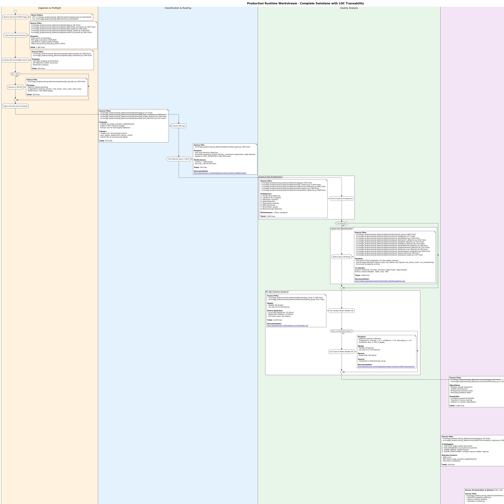

# Level 3: Production Runtime - Module Implementation

**Status**: Active
**Lines of Code**: 16,910+
**Purpose**: Detailed module-level documentation for the Production Runtime workstream (WS1), including state machines, device orchestration, and swimlane diagrams with LOC annotations.

## Related Diagrams

- **Level 0**: [RAG Pipeline Overview](../../level-0/index.md)
- **Level 1**: [Prepare-Doc Architecture](../../level-1/index.md)
- **Level 2**: [Production Runtime](../../level-2/production-runtime/index.md)

## Contents

### Swimlane Diagram

Complete production runtime swimlane with LOC annotations for each processing step.

- **Source**: [production-runtime-swimlane.puml](production-runtime-swimlane.puml)

### Pipeline State Machine

Complete 16-state pipeline specification with transitions, timeouts, and error recovery paths.

- **Document**: [pipeline-state-machine.md](pipeline-state-machine.md)
- **States**: INGESTION through SUCCESS/PARTIAL_SUCCESS/FAILED
- **Happy Path Latency**: 100-150ms/page (GPU)
- **Error Categories**: Transient (retry), Resource (fallback), Data (skip), Critical (abort)

### Device Orchestrator

Device selection algorithms, budget enforcement, and circuit breaker patterns.

- **Document**: [device-orchestrator.md](device-orchestrator.md)
- **Device Tiers**: Local GPU, Modal GPU, CPU
- **Budget Enforcement**: Per-document ($0.05), Per-batch ($5.00), Monthly ($30.00)
- **Circuit Breaker**: 5 failures OPEN, 60s timeout, 2 successes to close

## Key Source Files

| File | LOC | Purpose |
| ---- | --- | ------- |
| `src/.../detection/iqa_ml.py` | 1,303 | ML IQA inference (student/teacher) |
| `src/.../detection/iqa_classical.py` | 2,844 | Classical CV detectors (8 detectors) |
| `src/.../ingestion/document_processor.py` | 303 | Document processing orchestration |
| `src/.../utils/device_probe.py` | 183 | GPU/CPU device probing |
| `src/.../workers/tasks.py` | 471 | Celery worker tasks |
