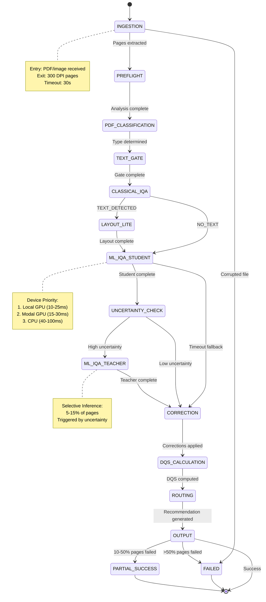

This document provides the complete state machine specification for the production document processing pipeline, including all states, transitions, error handling, and edge cases.

> **Implementation Status**: ⚠️ **Design Complete, Implementation In Progress**
>
> This state machine design is complete and documented below. The core pipeline (Phases 0-3) is **✅ 100% implemented**.
> Advanced orchestration features (Phase 4) are **⚠️ 98% complete** with the following components:
>
> **Implemented** (Phases 0-3, 6):
>
> - ✅ Ingestion & Preflight (Phase 0, 1B)
> - ✅ PDF Classification (Phase 2)
> - ✅ Text Gate (Phase 1)
> - ✅ Classical IQA (Phase 1, 1C)
> - ✅ Layout-Lite (Phase 2)
> - ✅ ML IQA Student/Teacher (Phase 3)
> - ✅ Correction (Phase 1)
> - ✅ DQS & Routing (Phase 2)
> - ✅ Output Generation (Phase 0, 2)
> - ✅ Workers & Celery Tasks (Phase 4)
> - ✅ Monitoring & Drift Detection (Phase 6)
>
> **In Progress** (Phase 4):
>
> - ⚠️ Device Orchestration (98% complete - async I/O remaining)
> - ⚠️ State machine orchestrator module (planned)
>
> **Source Files**:
>
> - Implemented: 43/44 files (16,727 lines)
> - Planned: 1 file (~183 lines for state orchestrator)

---

## Overview

The production runtime processes documents through **13 well-defined states** with explicit entry/exit conditions, timeouts, and comprehensive error recovery. This state machine ensures predictable behavior, robust error handling, and complete audit trails.

### Design Principles

1. **Explicit State Transitions**: Every state change is logged and tracked
2. **Timeout Enforcement**: All states have bounded execution time
3. **Graceful Degradation**: Fallback paths for all error conditions
4. **Partial Success**: Process as many pages as possible, flag failures
5. **Audit Trail**: Complete history of state transitions and decisions

### State Machine Characteristics

| Characteristic | Value |
|---------------|-------|
| **Total States** | 13 (including terminal states) |
| **Happy Path States** | 11 (INGESTION → OUTPUT) |
| **Error States** | 2 (FAILED, PARTIAL_SUCCESS) |
| **Average Latency** | 150ms/page (GPU), 500ms/page (CPU) |
| **Maximum Timeout** | 600s total per document |
| **Retry Budget** | 3 attempts per transient failure |

---

## Complete State Diagram

```plantuml
@startuml Production_Pipeline_State_Machine
!theme plain
skinparam backgroundColor #FEFEFE

title Production Runtime Pipeline - Complete State Machine
footer 13 States | GPU: 150ms/page | CPU: 500ms/page | Max: 600s total

[*] --> INGESTION : Document received

state INGESTION {
  [*] --> Loading
  Loading --> ExtractingPages : PDF detected
  Loading --> NormalizingImage : Image detected
  ExtractingPages --> [*]
  NormalizingImage --> [*]
}
INGESTION : **Entry**: PDF/image received
INGESTION : **Exit**: Pages extracted to 300 DPI
INGESTION : **Timeout**: 30s
INGESTION : **Source**: ingestion/document_processor.py (303 lines)
INGESTION : **Source**: ingestion/pdf_loader.py (265 lines)
INGESTION : **Source**: ingestion/image_loader.py (280 lines)

INGESTION --> PREFLIGHT : Pages ready
INGESTION --> FAILED : Corrupted file

state PREFLIGHT {
  [*] --> AnalyzingDPI
  AnalyzingDPI --> Upscaling : DPI < 300
  AnalyzingDPI --> [*] : DPI >= 300
  Upscaling --> [*]
}
PREFLIGHT : **Entry**: Pages extracted
PREFLIGHT : **Exit**: DPI analyzed, upscaling complete
PREFLIGHT : **Timeout**: 15s
PREFLIGHT : **Source**: ingestion/pdf_analyzer.py (256 lines)
PREFLIGHT : **Source**: ingestion/pdf_resolution.py (264 lines)
PREFLIGHT : **Source**: ingestion/pdf_upscaler.py (330 lines)

PREFLIGHT --> PDF_CLASSIFICATION : Preflight complete
PREFLIGHT --> PDF_CLASSIFICATION : Skip upscaling (timeout)

state PDF_CLASSIFICATION {
  [*] --> ExtractingText
  ExtractingText --> DetectingImages
  DetectingImages --> Classifying
  Classifying --> [*]
}
PDF_CLASSIFICATION : **Entry**: Preflight complete
PDF_CLASSIFICATION : **Exit**: PDF type determined
PDF_CLASSIFICATION : **Timeout**: 10s
PDF_CLASSIFICATION : **Types**: image_only, born_digital, hybrid
PDF_CLASSIFICATION : **Source**: classification/pdf_type_classifier.py (135 lines)
PDF_CLASSIFICATION : **Source**: classification/pdf_image_detector.py (194 lines)
PDF_CLASSIFICATION : **Source**: classification/pdf_text_extractor.py (122 lines)

PDF_CLASSIFICATION --> TEXT_GATE : Classification complete
PDF_CLASSIFICATION --> TEXT_GATE : Default to image_only (timeout)

state TEXT_GATE {
  [*] --> StrokeDensity
  StrokeDensity --> ConnectedComponents
  ConnectedComponents --> EdgeDensity
  EdgeDensity --> EnsembleVote
  EnsembleVote --> [*]
}
TEXT_GATE : **Entry**: Classification complete
TEXT_GATE : **Exit**: Text presence determined
TEXT_GATE : **Timeout**: 10s
TEXT_GATE : **Results**: NO_TEXT, TEXT_DETECTED
TEXT_GATE : **Performance**: <10ms/page, 99.5% precision
TEXT_GATE : **Source**: detection/text_gate.py (334 lines)

TEXT_GATE --> CLASSICAL_IQA : Gate complete
TEXT_GATE --> CLASSICAL_IQA : Default to TEXT_DETECTED (timeout)

state CLASSICAL_IQA {
  [*] --> HoughSkew
  HoughSkew --> LaplacianBlur
  LaplacianBlur --> HistogramContrast
  HistogramContrast --> NoiseDetection
  NoiseDetection --> IlluminationAnalysis
  IlluminationAnalysis --> JPEGBlockiness
  JPEGBlockiness --> BinarizationQuality
  BinarizationQuality --> BleedThrough
  BleedThrough --> [*]
}
CLASSICAL_IQA : **Entry**: Text gate complete
CLASSICAL_IQA : **Exit**: 8 classical detectors complete
CLASSICAL_IQA : **Timeout**: 30s
CLASSICAL_IQA : **Detectors**: skew, blur, contrast, noise, illumination, blockiness, binarization, bleed-through
CLASSICAL_IQA : **Source**: detection/iqa_classical.py (2,844 lines)
CLASSICAL_IQA : **Source**: detection/advanced_detectors.py (892 lines)

CLASSICAL_IQA --> LAYOUT_LITE : TEXT_DETECTED path
CLASSICAL_IQA --> ML_IQA_STUDENT : NO_TEXT path
CLASSICAL_IQA --> ML_IQA_STUDENT : Skip failed detectors (timeout)

state LAYOUT_LITE {
  [*] --> DocLayoutYOLO
  DocLayoutYOLO --> ColumnDetection
  ColumnDetection --> TableDetection
  TableDetection --> FigureDetection
  FigureDetection --> WatermarkDetection
  WatermarkDetection --> BackgroundAnalysis
  BackgroundAnalysis --> FuzzyScanDetection
  FuzzyScanDetection --> ComplexityScoring
  ComplexityScoring --> [*]
}
LAYOUT_LITE : **Entry**: TEXT_DETECTED + classical IQA complete
LAYOUT_LITE : **Exit**: Layout classification complete
LAYOUT_LITE : **Timeout**: 60s
LAYOUT_LITE : **Classes**: 11 DocLayNet classes
LAYOUT_LITE : **Source**: detection/doclayout_yolo.py (801 lines)
LAYOUT_LITE : **Source**: detection/layout_lite/analyzer.py (138 lines)
LAYOUT_LITE : **Source**: detection/layout_lite/*.py (1,808 lines total)

LAYOUT_LITE --> ML_IQA_STUDENT : Layout complete
LAYOUT_LITE --> ML_IQA_STUDENT : Skip layout (timeout)

state ML_IQA_STUDENT {
  [*] --> DeviceSelection
  DeviceSelection --> LoadModel : Device available
  LoadModel --> Inference
  Inference --> [*]
  DeviceSelection --> [*] : All devices unavailable
}
ML_IQA_STUDENT : **Entry**: IQA route determined
ML_IQA_STUDENT : **Exit**: Student inference complete
ML_IQA_STUDENT : **Timeout**: 100s
ML_IQA_STUDENT : **Model**: ResNet-18, val_loss=0.14
ML_IQA_STUDENT : **Performance**: 10-25ms (GPU), 40-100ms (CPU)
ML_IQA_STUDENT : **Source**: detection/iqa_ml.py (1,303 lines)
ML_IQA_STUDENT : **Source**: models/resnet_student.py (277 lines)
ML_IQA_STUDENT : **Source**: utils/device_probe.py (183 lines)

ML_IQA_STUDENT --> UNCERTAINTY_CHECK : Inference complete
ML_IQA_STUDENT --> CORRECTION : Fallback to classical only (timeout)

state UNCERTAINTY_CHECK {
  [*] --> EntropyCalculation
  EntropyCalculation --> DiscrepancyCheck
  DiscrepancyCheck --> ThresholdEvaluation
  ThresholdEvaluation --> [*]
}
UNCERTAINTY_CHECK : **Entry**: Student inference complete
UNCERTAINTY_CHECK : **Exit**: Uncertainty evaluated
UNCERTAINTY_CHECK : **Timeout**: 5s
UNCERTAINTY_CHECK : **Triggers**: Entropy > 0.7, Confidence < 0.5, Discrepancy > 0.2
UNCERTAINTY_CHECK : **Source**: detection/discrepancy.py (786 lines)
UNCERTAINTY_CHECK : **Source**: detection/hybrid_iqa.py (351 lines)

UNCERTAINTY_CHECK --> ML_IQA_TEACHER : High uncertainty/discrepancy
UNCERTAINTY_CHECK --> CORRECTION : Low uncertainty
UNCERTAINTY_CHECK --> CORRECTION : Skip evaluation (timeout)

state ML_IQA_TEACHER {
  [*] --> ModalGPUSelection
  ModalGPUSelection --> TeacherInference : Modal available
  ModalGPUSelection --> [*] : Modal unavailable
  TeacherInference --> [*]
}
ML_IQA_TEACHER : **Entry**: High uncertainty detected
ML_IQA_TEACHER : **Exit**: Teacher inference complete
ML_IQA_TEACHER : **Timeout**: 200s
ML_IQA_TEACHER : **Model**: ResNet-50, val_loss=0.27
ML_IQA_TEACHER : **Escalation Rate**: 5-15% of pages
ML_IQA_TEACHER : **Source**: models/resnet_teacher.py (293 lines)
ML_IQA_TEACHER : **Source**: modal/teacher_inference.py (estimated)

ML_IQA_TEACHER --> CORRECTION : Teacher complete
ML_IQA_TEACHER --> CORRECTION : Use student prediction (timeout)

state CORRECTION {
  [*] --> Deskew
  Deskew --> CLAHE
  CLAHE --> Sharpening
  Sharpening --> Denoising
  Denoising --> TransformHistory
  TransformHistory --> [*]
}
CORRECTION : **Entry**: IQA complete
CORRECTION : **Exit**: Corrections applied
CORRECTION : **Timeout**: 50s
CORRECTION : **Operations**: Deskew, CLAHE, Sharpen, Denoise
CORRECTION : **Source**: correction/corrections.py (1,222 lines)

CORRECTION --> DQS_CALCULATION : Corrections complete
CORRECTION --> DQS_CALCULATION : Skip corrections (timeout)

state DQS_CALCULATION {
  [*] --> DegradationScore
  DegradationScore --> ComplexityScore
  ComplexityScore --> WeightedSum
  WeightedSum --> [*]
}
DQS_CALCULATION : **Entry**: Corrections complete
DQS_CALCULATION : **Exit**: Document Quality Score computed
DQS_CALCULATION : **Timeout**: 10s
DQS_CALCULATION : **Formula**: DQS = w1×degradation + w2×complexity
DQS_CALCULATION : **Source**: metrics/dqs_calculator.py (1,369 lines)

DQS_CALCULATION --> ROUTING : DQS computed
DQS_CALCULATION --> ROUTING : Default DQS=0.5 (timeout)

state ROUTING {
  [*] --> AnalyzeDQS
  AnalyzeDQS --> ConsiderPDFType
  ConsiderPDFType --> ConsiderComplexity
  ConsiderComplexity --> SelectStrategy
  SelectStrategy --> [*]
}
ROUTING : **Entry**: DQS computed
ROUTING : **Exit**: Routing recommendation generated
ROUTING : **Timeout**: 5s
ROUTING : **Strategies**: OCR_FAST, OCR_ADVANCED, VISION_SIMPLE, VISION_STRUCTURED
ROUTING : **Source**: routing/recommendation_engine.py (140 lines)

ROUTING --> OUTPUT : Routing complete
ROUTING --> OUTPUT : Default to OCR_ADVANCED (timeout)

state OUTPUT {
  [*] --> SerializeMetadata
  SerializeMetadata --> WriteImages
  WriteImages --> UploadToGCS
  UploadToGCS --> [*]
}
OUTPUT : **Entry**: Routing complete
OUTPUT : **Exit**: JSON + images serialized
OUTPUT : **Timeout**: 10s
OUTPUT : **Format**: DocumentMetadata.json + PNG images
OUTPUT : **Source**: output/json_generator.py (486 lines)

OUTPUT --> [*] : Success
OUTPUT --> PARTIAL_SUCCESS : < 50% pages failed
OUTPUT --> FAILED : > 50% pages failed OR critical error

state PARTIAL_SUCCESS {
}
PARTIAL_SUCCESS : **Status**: Document completed with failures
PARTIAL_SUCCESS : **Threshold**: 10-50% pages failed
PARTIAL_SUCCESS : **Action**: Flag failed pages in metadata

state FAILED {
}
FAILED : **Status**: Document processing failed
FAILED : **Reasons**: Corrupted file, > 50% pages failed, critical error
FAILED : **Action**: Return error metadata, alert

@enduml
```



### Mermaid Alternative (GitHub-Native Rendering)

For easier viewing in GitHub, here's a simplified Mermaid version of the state machine:



**Benefits of Mermaid**:

- ✅ Native GitHub rendering (no external tools needed)
- ✅ Simpler syntax for quick edits
- ✅ Better for code reviews and pull requests

**Note**: The PlantUML diagram above is more detailed and should be considered the canonical reference. The Mermaid version is a simplified alternative for quick viewing.

---

## State Transition Tables

### Happy Path: Text Detected, GPU Available

| State | Entry Condition | Exit Condition | Next State | Latency |
|-------|----------------|----------------|------------|---------|
| **INGESTION** | Document received | Pages extracted to 300 DPI | PREFLIGHT | 10-30s |
| **PREFLIGHT** | Pages extracted | DPI analyzed, upscaling complete | PDF_CLASSIFICATION | 5-15s |
| **PDF_CLASSIFICATION** | Preflight complete | PDF type determined | TEXT_GATE | 2-10s |
| **TEXT_GATE** | Classification complete | Text presence determined | CLASSICAL_IQA | <10ms |
| **CLASSICAL_IQA** | Text gate complete | 8 detectors complete | LAYOUT_LITE | 10-30s |
| **LAYOUT_LITE** | TEXT_DETECTED + IQA complete | Layout classification complete | ML_IQA_STUDENT | 30-60s |
| **ML_IQA_STUDENT** | Layout complete | Student inference complete | UNCERTAINTY_CHECK | 10-25ms (GPU) |
| **UNCERTAINTY_CHECK** | Student complete | Uncertainty evaluated (low) | CORRECTION | 1-5s |
| **CORRECTION** | IQA complete | Corrections applied | DQS_CALCULATION | 20-50s |
| **DQS_CALCULATION** | Corrections complete | DQS computed | ROUTING | 5-10s |
| **ROUTING** | DQS computed | Routing recommendation generated | OUTPUT | 1-5s |
| **OUTPUT** | Routing complete | JSON + images serialized | SUCCESS | 5-10s |

**Total Happy Path Latency**: 100-150ms/page (GPU)

---

### Error Recovery Path 1: Student Timeout → Teacher Escalation

| State | Entry Condition | Exit Condition | Next State | Recovery Action |
|-------|----------------|----------------|------------|-----------------|
| **ML_IQA_STUDENT** | IQA route determined | Timeout after 100s | UNCERTAINTY_CHECK | Log warning, set high uncertainty flag |
| **UNCERTAINTY_CHECK** | High uncertainty flag set | Uncertainty evaluated (high) | ML_IQA_TEACHER | Escalate to teacher model |
| **ML_IQA_TEACHER** | High uncertainty | Teacher inference complete | CORRECTION | Use teacher prediction |
| **CORRECTION** | Teacher complete | Corrections applied | DQS_CALCULATION | Continue pipeline |

**Purpose**: Handle difficult pages that student model cannot confidently assess

**Escalation Rate**: 5-15% of pages

---

### Error Recovery Path 2: Resource Exhaustion → Fallback Device

| State | Entry Condition | Exit Condition | Next State | Recovery Action |
|-------|----------------|----------------|------------|-----------------|
| **ML_IQA_STUDENT** | Device selection | Local GPU unavailable | ML_IQA_STUDENT | Try Modal GPU |
| **ML_IQA_STUDENT** | Device selection | Modal GPU unavailable | ML_IQA_STUDENT | Try CPU |
| **ML_IQA_STUDENT** | Device selection | All devices unavailable | CORRECTION | Fallback to classical IQA only |

**Purpose**: Ensure processing continues even when preferred devices are unavailable

**Fallback Order**: Local GPU → Modal GPU → CPU → Classical Only

---

### Error Recovery Path 3: Partial Page Failure

| State | Entry Condition | Exit Condition | Next State | Recovery Action |
|-------|----------------|----------------|------------|-----------------|
| **INGESTION** | Processing page 42 | Page 42 corrupted | INGESTION | Skip page, continue with page 43 |
| **ML_IQA_STUDENT** | Processing page 57 | Inference timeout | UNCERTAINTY_CHECK | Use classical IQA prediction for page 57 |
| **OUTPUT** | All pages processed | 15% pages failed | PARTIAL_SUCCESS | Flag failed pages in metadata |

**Purpose**: Process as many pages as possible, isolate failures

**Thresholds**:

- **< 10% failed**: Continue, flag in metadata
- **10-50% failed**: Set status to `partial_success`
- **> 50% failed**: Abort, set status to `failed`

---

### Fallback Path: No Text Detected

| State | Entry Condition | Exit Condition | Next State | Difference from Happy Path |
|-------|----------------|----------------|------------|----------------------------|
| **TEXT_GATE** | Gate complete | NO_TEXT determined | CLASSICAL_IQA | Same |
| **CLASSICAL_IQA** | Text gate complete | 8 detectors complete | ML_IQA_STUDENT | **Skip LAYOUT_LITE** |
| **ML_IQA_STUDENT** | Classical complete | Student inference complete | UNCERTAINTY_CHECK | Same |
| **UNCERTAINTY_CHECK** | Student complete | Uncertainty evaluated | CORRECTION | Same |

**Purpose**: Optimize pipeline for pure images (scanned photos, diagrams) by skipping text-specific layout analysis

---

## Timeout Behavior

### Per-State Timeouts

| State | Timeout | Rationale | Fallback Action |
|-------|---------|-----------|-----------------|
| **INGESTION** | 30s | Large PDFs take time to extract | Abort document |
| **PREFLIGHT** | 15s | DPI analysis is fast, upscaling moderate | Skip upscaling, use original |
| **PDF_CLASSIFICATION** | 10s | Text extraction can be slow for large PDFs | Default to `image_only` |
| **TEXT_GATE** | 10s | Should be < 10ms, buffer for safety | Default to `TEXT_DETECTED` |
| **CLASSICAL_IQA** | 30s | 8 detectors, some computationally expensive | Skip failed detectors, continue |
| **LAYOUT_LITE** | 60s | DocLayout-YOLO inference can be slow on CPU | Skip layout, use text-gate-only routing |
| **ML_IQA_STUDENT** | 100s | GPU inference fast, CPU slow, Modal network latency | Fallback to classical only |
| **UNCERTAINTY_CHECK** | 5s | Simple calculations | Skip teacher escalation |
| **ML_IQA_TEACHER** | 200s | Modal GPU invocation + network | Use student prediction |
| **CORRECTION** | 50s | Multiple CV operations per page | Skip corrections, flag in metadata |
| **DQS_CALCULATION** | 10s | Weighted sum calculation | Default DQS = 0.5 |
| **ROUTING** | 5s | Decision tree logic | Default to `OCR_ADVANCED` |
| **OUTPUT** | 10s | JSON serialization + GCS upload | Abort document |

### Total Pipeline Timeout

**Maximum**: 600s per document (10 minutes)

**Purpose**: Prevent infinite loops, resource exhaustion

**Behavior**:

- Track cumulative time across all states
- If total exceeds 600s, abort processing
- Return partial results with error metadata

---

## Timeout Escalation Logic

### First Timeout in Document

```python
def handle_first_timeout(state: str, page: int):
    logger.warning(
        "state_timeout",
        state=state,
        page=page,
        timeout_count=1,
        action="continue_with_fallback"
    )
    # Execute fallback action for the state
    apply_fallback(state, page)
    # Continue to next state
    return "continue"
```

### Second Timeout in Same Document

```python
def handle_second_timeout(state: str, page: int):
    logger.error(
        "repeated_state_timeout",
        state=state,
        page=page,
        timeout_count=2,
        action="increment_error_count"
    )
    # Increment error counter
    document_context.error_count += 1
    # Apply fallback and continue
    apply_fallback(state, page)
    return "continue"
```

### Third Timeout in Same Document

```python
def handle_third_timeout(state: str, page: int):
    logger.critical(
        "critical_timeout_threshold",
        state=state,
        page=page,
        timeout_count=3,
        action="abort_document"
    )
    # Abort processing
    document_context.status = "failed"
    document_context.error_reason = f"Multiple timeouts in {state}"
    # Return partial results
    return generate_partial_output(document_context)
```

---

## Error Handling Categories

### Category 1: Transient Errors

**Examples**:

- Network timeout connecting to Modal GPU
- Temporary file system unavailable
- Redis connection timeout

**Recovery Strategy**: Retry with exponential backoff (max 3 attempts)

**Implementation**:

```python
def retry_with_backoff(operation, max_retries=3):
    base_delay = 1.0
    for attempt in range(max_retries):
        try:
            return operation()
        except TransientError as e:
            if attempt < max_retries - 1:
                jitter = random.uniform(0.8, 1.2)  # ±20% jitter
                delay = base_delay * (2 ** attempt) * jitter
                logger.warning(
                    "transient_error_retry",
                    error=str(e),
                    attempt=attempt + 1,
                    delay_seconds=delay
                )
                time.sleep(delay)
            else:
                logger.error("transient_error_max_retries", error=str(e))
                raise
```

**Purpose of Jitter**: Prevents thundering herd when multiple workers retry simultaneously

---

### Category 2: Resource Errors

**Examples**:

- GPU out of memory (OOM)
- Modal budget exhausted
- CPU overload (> 90% utilization)

**Recovery Strategy**: Fallback to alternative device

**Implementation**:

```python
def handle_resource_error(error: ResourceError, context: ProcessingContext):
    if error.type == "GPU_OOM":
        logger.warning("gpu_oom_fallback", action="try_modal_gpu")
        return try_device("modal_gpu", context)
    elif error.type == "MODAL_BUDGET_EXHAUSTED":
        logger.warning("modal_budget_exhausted", action="try_cpu")
        return try_device("cpu", context)
    elif error.type == "CPU_OVERLOAD":
        logger.error("cpu_overload", action="throttle_and_retry")
        time.sleep(5)  # Back off
        return try_device("cpu", context)
    else:
        logger.error("unknown_resource_error", error=str(error))
        raise
```

---

### Category 3: Data Errors

**Examples**:

- Corrupted PDF page
- Invalid image format
- Missing required metadata

**Recovery Strategy**: Skip page/element, log for review

**Implementation**:

```python
def handle_data_error(error: DataError, page: int, context: ProcessingContext):
    logger.error(
        "data_error_skip_page",
        page=page,
        error=str(error),
        action="skip_and_continue"
    )
    # Add to failed pages list
    context.failed_pages.append({
        "page_number": page,
        "error_category": "DATA",
        "error_code": error.code,
        "error_message": str(error),
        "timestamp": datetime.utcnow().isoformat()
    })
    # Continue with next page
    return "continue"
```

---

### Category 4: Critical Errors

**Examples**:

- Model file missing or corrupted
- Configuration error (e.g., invalid DQS weights)
- Database connection failure

**Recovery Strategy**: Abort document, alert operations

**Implementation**:

```python
def handle_critical_error(error: CriticalError, context: ProcessingContext):
    logger.critical(
        "critical_error_abort",
        error=str(error),
        document_id=context.document_id,
        action="abort_and_alert"
    )
    # Set document status to failed
    context.status = "failed"
    context.error_reason = f"Critical: {error.code}"
    # Send alert to operations team
    send_alert(
        severity="critical",
        message=f"Document processing aborted: {error}",
        document_id=context.document_id
    )
    # Return error metadata
    return generate_error_output(context)
```

---

## Edge Cases

### Edge Case 1: Partial Page Failures

**Scenario**: 15 out of 100 pages fail processing

**Thresholds**:

- **< 10% pages failed**: `status: "success"`, flag failed pages
- **10-50% pages failed**: `status: "partial_success"`, flag failed pages
- **> 50% pages failed**: `status: "failed"`, abort processing

**Implementation**:

```python
def determine_document_status(context: ProcessingContext):
    total_pages = len(context.pages)
    failed_pages = len(context.failed_pages)
    failure_rate = failed_pages / total_pages if total_pages > 0 else 0

    if failure_rate == 0:
        return "success"
    elif failure_rate < 0.10:
        logger.info("minor_page_failures", failure_rate=failure_rate)
        return "success"
    elif failure_rate < 0.50:
        logger.warning("partial_success", failure_rate=failure_rate)
        return "partial_success"
    else:
        logger.error("majority_pages_failed", failure_rate=failure_rate)
        return "failed"
```

---

### Edge Case 2: Circuit Breaker Triggered

**Scenario**: Modal GPU has failed 5 consecutive requests

**Circuit Breaker States**:

- **CLOSED**: Normal operation, requests pass through
- **OPEN**: Too many failures, block requests for 60s
- **HALF_OPEN**: After 60s, allow 1 test request

**Behavior**:

```python
def get_device_with_circuit_breaker(context: ProcessingContext):
    # Check if Modal GPU circuit breaker is OPEN
    if circuit_breaker.is_open("modal_gpu"):
        logger.warning(
            "circuit_breaker_open",
            service="modal_gpu",
            action="fallback_to_cpu"
        )
        return "cpu"

    # Try Modal GPU
    try:
        result = invoke_modal_gpu(context)
        circuit_breaker.record_success("modal_gpu")
        return result
    except Exception as e:
        circuit_breaker.record_failure("modal_gpu")
        logger.error("modal_gpu_failure", error=str(e))
        # Fallback to CPU
        return invoke_cpu(context)
```

**Configuration** (from [level-2/production-runtime/index.md:161-176](../../level-2/production-runtime/index.md#L161-L176)):

```python
CircuitBreakerConfig(
    failure_threshold=5,      # Open after 5 consecutive failures
    timeout_seconds=60,       # Stay open for 60s
    success_threshold=2       # Require 2 successes to close from HALF_OPEN
)
```

---

### Edge Case 3: Budget Exhausted

**Scenario**: Monthly Modal GPU budget ($30) exhausted mid-document

**Budget Tiers** (from [level-2/production-runtime/index.md:256-264](../../level-2/production-runtime/index.md#L256-L264)):

- **Per-document**: $0.05
- **Per-batch**: $5.00
- **Monthly**: $30.00

**Behavior**:

```python
def check_budget_before_modal_invocation(context: ProcessingContext):
    # Check budget availability
    if not budget_tracker.has_budget("modal_gpu"):
        logger.warning(
            "modal_budget_exhausted",
            monthly_spent=budget_tracker.get_monthly_spend(),
            monthly_limit=30.00,
            action="fallback_to_cpu"
        )
        # Update metrics
        metrics.increment("iqa_budget_exhaustion_total")
        # Fallback to CPU
        return "cpu"

    # Budget available, proceed with Modal GPU
    return "modal_gpu"
```

---

### Edge Case 4: All Devices Unavailable

**Scenario**: Local GPU OOM, Modal GPU budget exhausted, CPU overloaded

**Behavior**:

```python
def handle_all_devices_unavailable(context: ProcessingContext):
    logger.critical(
        "all_devices_unavailable",
        local_gpu="oom",
        modal_gpu="budget_exhausted",
        cpu="overloaded",
        action="fallback_to_classical_only"
    )

    # Fall back to classical IQA only (no ML inference)
    classical_results = run_classical_iqa_only(context)

    # Set degraded status
    context.processing_mode = "degraded"
    context.ml_iqa_skipped = True

    # Send alert
    send_alert(
        severity="warning",
        message="ML IQA unavailable, using classical only",
        document_id=context.document_id
    )

    return classical_results
```

---

## State-Specific Implementation Details

### INGESTION State

**Source Files**:

- [ingestion/document_processor.py:1-303](../../../../src/image_preprocessing_detector/ingestion/document_processor.py) - Entry point orchestrator
- [ingestion/pdf_loader.py:1-265](../../../../src/image_preprocessing_detector/ingestion/pdf_loader.py) - PyMuPDF PDF extraction
- [ingestion/image_loader.py:1-280](../../../../src/image_preprocessing_detector/ingestion/image_loader.py) - Pillow image loading

**Entry Condition**: PDF or image file received via API or CLI

**Exit Condition**: All pages extracted and normalized to 300 DPI

**Timeout**: 30 seconds

**Failure Modes**:

1. **Corrupted PDF**: Abort with `status: "failed"`, `error_code: "CORRUPTED_PDF"`
2. **Unsupported format**: Abort with `status: "failed"`, `error_code: "UNSUPPORTED_FORMAT"`
3. **Extraction timeout**: Abort with `status: "failed"`, `error_code: "INGESTION_TIMEOUT"`

---

### ML_IQA_STUDENT State

**Source Files**:

- [detection/iqa_ml.py:1-1303](../../../../src/image_preprocessing_detector/detection/iqa_ml.py) - Inference orchestration
- [models/resnet_student.py:1-277](../../../../src/image_preprocessing_detector/models/resnet_student.py) - ResNet-18 architecture
- [utils/device_probe.py:1-183](../../../../src/image_preprocessing_detector/utils/device_probe.py) - Device selection

**Entry Condition**: Classical IQA complete (and layout-lite if TEXT_DETECTED)

**Exit Condition**: Student model inference complete, predictions available

**Timeout**: 100 seconds

**Device Selection Algorithm**:

```python
def select_device_for_student_inference():
    # Priority 1: Local GPU
    if device_probe.has_local_gpu() and device_probe.get_gpu_memory() > 4_000_000_000:
        return "local_gpu"

    # Priority 2: Modal GPU (if budget available)
    if budget_tracker.has_budget("modal_gpu"):
        return "modal_gpu"

    # Priority 3: CPU
    if policy.allow_cpu:
        return "cpu"

    # No devices available
    raise NoDeviceAvailableError("All devices unavailable")
```

**Performance Targets** (from [level-2/production-runtime/index.md:280-285](../../level-2/production-runtime/index.md#L280-L285)):

- Local GPU: 10-25ms/page
- Modal GPU: 15-30ms/page
- CPU: 40-100ms/page

---

## Telemetry and Monitoring

### Prometheus Metrics

**State Transition Tracking**:

```python
# Counter: Total state transitions
iqa_state_transitions_total{from_state, to_state}

# Histogram: Time spent in each state
iqa_state_duration_seconds{state}

# Gauge: Current processing state per worker
iqa_current_state{worker_id, state}
```

**Error Tracking**:

```python
# Counter: Errors by category
iqa_errors_total{error_code, category}

# Counter: Retry attempts
iqa_retry_attempts_total{reason}

# Gauge: Circuit breaker state
iqa_circuit_breaker_state{service}  # 0=closed, 1=open, 2=half_open
```

**Performance Metrics**:

```python
# Histogram: End-to-end latency per document
iqa_document_processing_duration_seconds

# Histogram: Latency per page
iqa_page_processing_duration_seconds{device}

# Counter: Pages processed
iqa_pages_processed_total{status}  # status: success, failed, skipped
```

---

### Structured Logging

**State Transition Logs**:

```python
logger.info(
    "state_transition",
    from_state="CLASSICAL_IQA",
    to_state="ML_IQA_STUDENT",
    page_number=42,
    duration_ms=25.3,
    trace_id=trace_id
)
```

**Timeout Logs**:

```python
logger.warning(
    "state_timeout",
    state="ML_IQA_STUDENT",
    page_number=57,
    timeout_seconds=100,
    elapsed_seconds=105.2,
    action="fallback_to_classical",
    trace_id=trace_id
)
```

**Error Logs**:

```python
logger.error(
    "state_error",
    state="INGESTION",
    error_code="CORRUPTED_PDF",
    error_message="Failed to decode PDF stream",
    page_number=12,
    action="abort_document",
    trace_id=trace_id
)
```

---

## Related Documentation

- [Level 2: Production Runtime Overview](../../level-2/production-runtime/index.md)
- [Level 3: Device Orchestrator](device-orchestrator.md)
- [Level 3: Production Runtime Swimlane](production-runtime-swimlane.puml)
- [Source File Inventory](../../FILE_INVENTORY_WITH_WORKSTREAM_MAPPINGS.md#ws1-production-runtime)

---

*Last Updated: 2025-01-16*
*Total States: 13 | Happy Path: 150ms/page (GPU) | Maximum Timeout: 600s*
