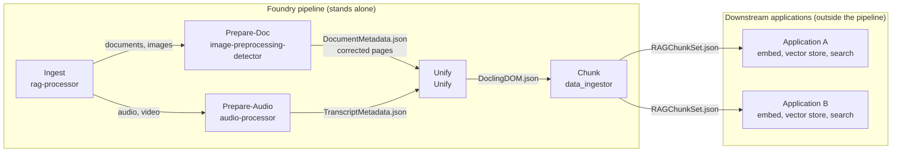

# Foundry Pipeline: Level 0 Architecture

> **This repository**: **Prepare-Doc** (`image-preprocessing-detector`)
>
> This page is identical in all five pipeline repositories. If you change it, change it in every copy. Detailed
> contracts live in `docs/development/RAG Pipeline/` in
> [image-preprocessing-detector](https://github.com/williaby/image-preprocessing-detector).

The Foundry pipeline turns raw documents and recordings into structured **chunks**. It ends there. Embedding, vector
storage, search, and answering questions are the job of the **application** that consumes the chunks. The pipeline
repositories stand alone: none of them depends on a particular application, and applications depend on the pipeline
only through the chunk contract.

## Diagram



Arrows follow the direction data moves. Both tracks meet at Unify so that Chunk always receives the same input shape,
whether the source was a scanned PDF or a recording.

## Stages

| Stage | Repository | Role | Reads | Writes |
| --- | --- | --- | --- | --- |
| Ingest | `rag-processor` | Upload, file-type check, routing, job status. The only user-facing service | User upload | `00-source/` |
| Prepare-Doc | `image-preprocessing-detector` | Document type routing, image quality assessment, corrections, routing metadata | `00-source/` | `01-preprocessed/` |
| Prepare-Audio | `audio-processor` | Transcription and speaker diarization | `00-source/` | `02-transcribed/` |
| Unify | `Unify` | Document track: OCR through docling-serve, assembled into one DOM. Audio track: normalize the transcript to the same DOM, with no OCR | `01-preprocessed/`, `02-transcribed/` | `03-docling-dom/` |
| Chunk | `data_ingestor` | Chunking, trust scoring, source citations (page, section, timestamp) | `03-docling-dom/` | `04-chunks/` |

Unify starts with a single docling-serve engine. Specialist OCR engines and fusion are later phases. Until Unify
exists, Chunk may call docling-serve directly, behind a converter interface, so Unify can replace that call without
changing Chunk's output.

## Artifacts and storage

Each stage writes to a numbered prefix under one key per processing run (`{trace_id}`). The prefix layout is the
contract between stages. The store is S3-compatible object storage; some older code and documents still say Google
Cloud Storage, and the layout is the same.

```text
{trace_id}/
  00-source/           original upload
  01-preprocessed/     DocumentMetadata.json, corrected page images
  02-transcribed/      TranscriptMetadata.json (audio track only)
  03-docling-dom/      DoclingDOM.json
  04-chunks/           RAGChunkSet.json
```

There is no `05-embeddings/` stage in the pipeline. An application that embeds chunks keeps its own vectors and any
manifest in its own storage.

## The boundary with applications

Embedding is not a pipeline service and there is no shared embedding repository. An application reads
`RAGChunkSet.json`, then chooses its own embedding model, vector database, similarity metric, filters, and search
interface. It must keep the fields the chunk contract requires (`chunk_id`, `document_id`, `trace_id`, `trust_score`,
`ocr_engine_provenance`, `page_range`, `section_hierarchy`, `hallucination_risk`) so quality and provenance survive
into retrieval, and it must not recompute `trust_score`. See
[chunk-embed-contract.md](https://github.com/williaby/image-preprocessing-detector/blob/main/docs/development/RAG%20Pipeline/chunk-embed-contract.md).

Things that belong to an application, not to the pipeline: embedding endpoints and models, vector stores, search APIs,
access control over retrieved text, chat or question answering, and domain knowledge bases.

## Contracts between stages

All live in `docs/development/RAG Pipeline/` in image-preprocessing-detector.

| Boundary | Document |
| --- | --- |
| Ingest to Prepare-Doc | `ingest-prepare-doc-contract.md` |
| Ingest to Prepare-Audio | `ingest-prepare-audio-contract.md` |
| Prepare-Doc to Unify | `prepare-doc-unify-contract.md` (schema: `document_metadata.schema.json`) |
| Prepare-Audio to Unify | `prepare-audio-unify-contract.md` |
| Chunk to applications | `chunk-embed-contract.md` |

The Unify to Chunk boundary (`DoclingDOM.json`) is specified in the Unify design spec,
`docs/superpowers/specs/2026-05-05-foundry-unify-design.md` in image-preprocessing-detector.

## Names

Use the stage names above in prose and the repository names in code and links. Retired names that still appear in
older documents:

| Retired | Use instead |
| --- | --- |
| Project A, B, C, D, E, F | Prepare-Doc, Unify, Chunk, (application embedding), Prepare-Audio, Ingest |
| `OCRDocument.json` | `DoclingDOM.json` |
| `ChunkSet.json` | `RAGChunkSet.json` |
| Unify as "multi-engine OCR and fusion" | Unify as docling-serve orchestration first; fusion is a later phase |
| `image_detection` (local folder name) | `image-preprocessing-detector` |

## Where this page stands

This page fixes the stage names, ownership, and boundaries. It does not track build status, so check each repository's
README for what is built. The most complete stage-level architecture is Prepare-Doc's Level 1 to 4 documentation in
image-preprocessing-detector (`docs/architecture/diagrams/`).
