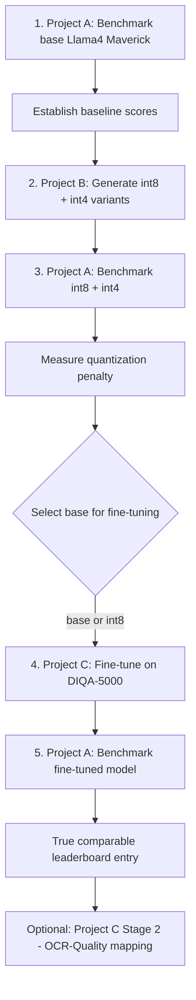

# Labeling Workstreams: Benchmarking, Quantization & Fine-Tuning

> **Status**: Planning Phase
> **Created**: 2025-12-17
> **Owner**: Core Team

---

## Executive Summary

This document outlines three interconnected workstreams for building a comprehensive LLM-based document quality assessment pipeline:

| Workstream | Mission | Key Deliverables |
|------------|---------|------------------|
| **Project A: Benchmarking Arena** | Repeatable, auditable leaderboard for model variants | Arena CLI, Results schema, Leaderboard generator |
| **Project B: Unsloth Quantization** | Standardized 8-bit/4-bit model quantization | Quantization pipeline, Artifact packaging |
| **Project C: Fine-Tuning** | Train models to replicate DIQA-5000 human scores | Training pipeline, Model cards, Trained checkpoints |

**Primary Dataset**: DIQA-5000 (Document Image Quality Assessment)
**First Model Target**: Llama4 Maverick
**Shared Infrastructure**: Unified ModelSpec for plug-and-play model swapping

---

## Cross-Project Architecture

### Shared ModelSpec Schema

All three projects use a unified `ModelSpec` for consistent model handling:

```python
from dataclasses import dataclass
from enum import Enum
from typing import Optional, Dict, Any

class ModelSource(str, Enum):
    """Source location for model artifacts."""
    HUGGINGFACE = "huggingface"
    LOCAL = "local"
    API = "api"

class ModelVariant(str, Enum):
    """Model variant type."""
    BASE = "base"
    INT8 = "int8"
    INT4 = "int4"
    FINETUNED = "finetuned"

class RuntimeBackend(str, Enum):
    """Inference runtime backend."""
    TRANSFORMERS = "transformers"
    VLLM = "vllm"
    ONNXRUNTIME = "onnxruntime"
    API = "api"
    UNSLOTH = "unsloth"

@dataclass
class ModelSpec:
    """Unified model specification for all workstreams.

    This schema enables plug-and-play model swapping across:
    - Project A (Benchmarking Arena)
    - Project B (Unsloth Quantization)
    - Project C (Fine-Tuning)
    """
    source: ModelSource
    id: str  # HF repo, local path, or API model name
    revision: str  # Commit hash, tag, or build ID
    variant: ModelVariant = ModelVariant.BASE
    runtime: RuntimeBackend = RuntimeBackend.TRANSFORMERS

    # Provenance tracking (mandatory)
    checksum: Optional[str] = None  # SHA256 of model weights
    config_hash: Optional[str] = None  # Hash of model config
    tokenizer_hash: Optional[str] = None  # Hash of tokenizer

    # API-specific fields
    api_version: Optional[str] = None
    api_params: Optional[Dict[str, Any]] = None

    # Quantization metadata
    quant_method: Optional[str] = None  # e.g., "unsloth", "bitsandbytes"
    quant_params: Optional[Dict[str, Any]] = None  # e.g., {"bits": 4, "group_size": 128}

    # Fine-tuning metadata
    lora_adapter_path: Optional[str] = None
    base_model_ref: Optional[str] = None  # Reference to base model spec

    # Additional notes
    notes: Optional[str] = None

    def to_dict(self) -> Dict[str, Any]:
        """Serialize to dictionary for JSON/YAML storage."""
        return {
            "source": self.source.value,
            "id": self.id,
            "revision": self.revision,
            "variant": self.variant.value,
            "runtime": self.runtime.value,
            "checksum": self.checksum,
            "config_hash": self.config_hash,
            "tokenizer_hash": self.tokenizer_hash,
            "api_version": self.api_version,
            "api_params": self.api_params,
            "quant_method": self.quant_method,
            "quant_params": self.quant_params,
            "lora_adapter_path": self.lora_adapter_path,
            "base_model_ref": self.base_model_ref,
            "notes": self.notes,
        }

    @classmethod
    def from_dict(cls, data: Dict[str, Any]) -> "ModelSpec":
        """Deserialize from dictionary."""
        return cls(
            source=ModelSource(data["source"]),
            id=data["id"],
            revision=data["revision"],
            variant=ModelVariant(data.get("variant", "base")),
            runtime=RuntimeBackend(data.get("runtime", "transformers")),
            checksum=data.get("checksum"),
            config_hash=data.get("config_hash"),
            tokenizer_hash=data.get("tokenizer_hash"),
            api_version=data.get("api_version"),
            api_params=data.get("api_params"),
            quant_method=data.get("quant_method"),
            quant_params=data.get("quant_params"),
            lora_adapter_path=data.get("lora_adapter_path"),
            base_model_ref=data.get("base_model_ref"),
            notes=data.get("notes"),
        )
```

### Example ModelSpecs

```yaml
# examples/model_specs.yaml

# Base Llama4 Maverick from Hugging Face
llama4_maverick_base:
  source: huggingface
  id: meta-llama/Llama-4-Maverick
  revision: main
  variant: base
  runtime: transformers
  checksum: sha256:abc123...
  notes: "Base model for DIQA-5000 experiments"

# 8-bit quantized variant (from Project B)
llama4_maverick_int8:
  source: huggingface
  id: our-org/llama4-maverick-int8
  revision: v1.0.0
  variant: int8
  runtime: unsloth
  quant_method: unsloth
  quant_params:
    bits: 8
    group_size: 128
  base_model_ref: llama4_maverick_base
  notes: "8-bit quantized via Unsloth"

# Fine-tuned variant (from Project C)
llama4_maverick_diqa_finetuned:
  source: huggingface
  id: our-org/llama4-maverick-diqa-v1
  revision: v1.0.0
  variant: finetuned
  runtime: transformers
  lora_adapter_path: our-org/llama4-maverick-diqa-lora
  base_model_ref: llama4_maverick_base
  notes: "Fine-tuned on DIQA-5000 train split"

# API model (e.g., GPT-4o for comparison)
gpt4o_baseline:
  source: api
  id: gpt-4o
  revision: "2024-08-06"
  variant: base
  runtime: api
  api_version: "2024-08-06"
  api_params:
    temperature: 0.0
    max_tokens: 1024
  notes: "OpenAI API baseline for comparison"
```

---

## Project A: Benchmarking Arena

### Mission

Provide a repeatable, auditable leaderboard for any model variant (base, quantized, fine-tuned), evaluated against DIQA-5000.

### Scope

| In Scope | Out of Scope |
|----------|--------------|
| Standard inference harness for DIQA-5000 | Quantization steps |
| PLCC, SRCC, MAE, RMSE metrics | Fine-tuning |
| Optional ECE calibration metrics | Label generation |
| Arena reporting (tables + plots) | |
| Model provenance tracking | |
| Reproducibility manifests | |

### Metrics

```python
# Standard IQA correlation metrics
class ArenaMetrics:
    """Metrics for DIQA-5000 evaluation."""

    # Primary metrics
    plcc: float  # Pearson Linear Correlation Coefficient
    srcc: float  # Spearman Rank Correlation Coefficient
    mae: float   # Mean Absolute Error
    rmse: float  # Root Mean Square Error

    # Optional calibration
    ece: Optional[float] = None  # Expected Calibration Error

    # Per-dimension metrics (if applicable)
    plcc_overall: Optional[float] = None
    plcc_sharpness: Optional[float] = None
    plcc_color: Optional[float] = None
    srcc_overall: Optional[float] = None
    srcc_sharpness: Optional[float] = None
    srcc_color: Optional[float] = None
```

### Key Deliverables

1. **Arena Runner CLI**

   ```bash
   arena run --model <model_spec> --dataset diqa5000 --split test
   arena run --model llama4_maverick_base --dataset diqa5000 --split test --output results/
   arena run --model-spec ./my_model.yaml --dataset diqa5000
   ```

2. **Results Schema** (JSON/Parquet)

   ```json
   {
     "run_id": "arena_20251217_143022_abc123",
     "model_spec": { /* ModelSpec serialized */ },
     "dataset": "diqa5000",
     "split": "test",
     "timestamp": "2025-12-17T14:30:22Z",
     "metrics": {
       "plcc": 0.89,
       "srcc": 0.87,
       "mae": 0.12,
       "rmse": 0.15,
       "per_dimension": {
         "overall": {"plcc": 0.91, "srcc": 0.89},
         "sharpness": {"plcc": 0.86, "srcc": 0.84},
         "color": {"plcc": 0.88, "srcc": 0.85}
       }
     },
     "provenance": {
       "model_checksum": "sha256:...",
       "dataset_version": "v1.0",
       "code_version": "git:abc123",
       "hardware": "NVIDIA A100 40GB",
       "duration_seconds": 3600
     },
     "reproducibility_manifest": "./manifests/arena_20251217_143022_abc123.yaml"
   }
   ```

3. **Leaderboard Generator**
   - HTML interactive dashboard
   - Markdown for GitHub README
   - PDF for reports

4. **Reproducibility Manifest**

   ```yaml
   # manifests/arena_20251217_143022_abc123.yaml
   run_id: arena_20251217_143022_abc123
   model:
     spec_file: ./model_specs/llama4_maverick_base.yaml
     weights_checksum: sha256:abc123...
     config_checksum: sha256:def456...
   dataset:
     name: diqa5000
     version: v1.0
     split: test
     num_samples: 1000
     checksum: sha256:ghi789...
   environment:
     python_version: "3.11.6"
     cuda_version: "12.1"
     dependencies_lock: ./requirements.lock
   hardware:
     gpu: "NVIDIA A100 40GB"
     gpu_memory_gb: 40
     cpu_cores: 32
     ram_gb: 256
   seeds:
     random: 42
     numpy: 42
     torch: 42
   ```

### Handoff Contracts

- **Inputs**: Model artifacts from Project B and Project C
- **Outputs**: Benchmark reports that gate "go/no-go" for downstream work

---

## Project B: Unsloth Quantization

### Mission

Standardize quantization of candidate models into 8-bit and 4-bit variants with consistent packaging and metadata.

### Scope

| In Scope | Out of Scope |
|----------|--------------|
| Quantization recipes per model family | Full DIQA-5000 benchmarking |
| 8-bit and 4-bit outputs | Fine-tuning |
| Optional mixed precision | OCR preprocessing logic |
| Validation checks (load, smoke inference) | |
| Performance footprint capture | |
| Artifact packaging with manifests | |

### Supported Model Families

| Priority | Model Family | Status |
|----------|--------------|--------|
| 1 | Llama4 Maverick | Primary target |
| 2 | Qwen 2.5 | Next priority |
| 3 | DeepSeek-V3 | Future |
| 4 | Mistral | Future |

### Key Deliverables

1. **Quantization Pipeline CLI**

   ```bash
   quantize run --model <hf_id> --bits 8 --out <artifact_path>
   quantize run --model meta-llama/Llama-4-Maverick --bits 4 --out ./artifacts/
   quantize run --model-spec ./model.yaml --bits 8 --mixed-precision
   ```

2. **Quantization Manifest**

   ```yaml
   # artifacts/llama4_maverick_int8/manifest.yaml
   artifact_id: llama4_maverick_int8_v1.0.0
   base_model:
     source: huggingface
     id: meta-llama/Llama-4-Maverick
     revision: abc123
     checksum: sha256:...
   quantization:
     method: unsloth
     bits: 8
     group_size: 128
     symmetric: true
     exclude_modules: ["lm_head"]
   performance:
     vram_fp16_gb: 28.5
     vram_int8_gb: 14.2
     vram_int4_gb: 7.1
     inference_latency_ms:
       batch_1: 45
       batch_8: 120
     throughput_tokens_per_sec: 85
   validation:
     loads_successfully: true
     smoke_inference_passed: true
     sample_output: "The document quality score is..."
   compatibility:
     transformers_version: ">=4.36.0"
     unsloth_version: ">=0.3.0"
     cuda_version: ">=11.8"
   published:
     huggingface_repo: our-org/llama4-maverick-int8
     timestamp: "2025-12-17T10:00:00Z"
   ```

3. **Published Artifacts**
   - HuggingFace private repo or internal artifact store
   - Immutable IDs with semantic versioning
   - Complete metadata for reproducibility

### Handoff Contracts

- **Outputs consumed by**:
  - Project A (benchmarking quantized models)
  - Project C (fine-tuning from quantized baseline if chosen)

---

## Project C: Fine-Tuning

### Mission

Train a model to replicate DIQA-5000 human scores (continuous, multi-dimensional), starting with Llama4 Maverick.

### Scope

| In Scope | Out of Scope |
|----------|--------------|
| DIQA-5000 data pipeline (train/val/test) | Quantizing base models (Project B) |
| Supervised regression (overall/sharpness/color) | Arena leaderboard mechanics (Project A) |
| PEFT/LoRA fine-tuning | |
| Checkpointing and versioning | |
| Optional: OCR-Quality score mapping | |
| Optional: SmartDoc-QA condition analysis | |

### Data Pipeline

```
DIQA-5000 Dataset
├── train/     # Training only (fitting)
├── val/       # Early stopping, hyperparameter selection
└── test/      # Final reporting (via Project A ideally)
```

### Training Approach

```python
# Training configuration
@dataclass
class DIQATrainingConfig:
    """Configuration for DIQA-5000 fine-tuning."""

    # Model
    base_model: str = "meta-llama/Llama-4-Maverick"
    use_quantized_base: bool = False
    quantized_base_ref: Optional[str] = None

    # PEFT Configuration
    peft_method: str = "lora"  # lora, qlora, prefix_tuning
    lora_r: int = 16
    lora_alpha: int = 32
    lora_dropout: float = 0.05
    target_modules: List[str] = field(default_factory=lambda: [
        "q_proj", "k_proj", "v_proj", "o_proj",
        "gate_proj", "up_proj", "down_proj"
    ])

    # Output format
    output_dimensions: List[str] = field(default_factory=lambda: [
        "overall", "sharpness", "color"
    ])
    use_multi_head: bool = True  # Separate heads per dimension

    # Training
    learning_rate: float = 2e-4
    batch_size: int = 4
    gradient_accumulation_steps: int = 8
    num_epochs: int = 3
    warmup_ratio: float = 0.1
    weight_decay: float = 0.01

    # Early stopping
    early_stopping_patience: int = 3
    metric_for_best_model: str = "val_plcc_overall"

    # Hardware
    use_modal_gpu: bool = True
    modal_gpu_type: str = "A100-40GB"
```

### Key Deliverables

1. **Training Pipeline CLI**

   ```bash
   train diqa --model llama4-maverick --peft lora --out <checkpoint>
   train diqa --config ./training_config.yaml --output ./checkpoints/
   train diqa --resume ./checkpoints/epoch_2/
   ```

2. **Model Card / Training Report**

   ```markdown
   # DIQA-5000 Fine-tuned Model: llama4-maverick-diqa-v1

   ## Overview
   - **Base Model**: meta-llama/Llama-4-Maverick
   - **Fine-tuning Method**: LoRA (r=16, alpha=32)
   - **Dataset**: DIQA-5000 (train: 3500, val: 750, test: 750)

   ## Performance
   | Dimension | PLCC | SRCC | MAE | RMSE |
   |-----------|------|------|-----|------|
   | Overall | 0.91 | 0.89 | 0.09 | 0.12 |
   | Sharpness | 0.87 | 0.85 | 0.11 | 0.14 |
   | Color | 0.89 | 0.86 | 0.10 | 0.13 |

   ## Training Details
   - **Duration**: 4.5 hours on A100-40GB
   - **Final Loss**: 0.0234
   - **Best Epoch**: 2 (early stopped at 3)

   ## Training Curves
   [training_loss.png]
   [validation_metrics.png]
   ```

3. **Trained Artifacts**
   - Same packaging standard as Project B outputs
   - LoRA adapter weights + base model reference
   - Full reproducibility manifest

### Optional Stages

**Stage 2: OCR-Quality Mapping**

```python
# Run fine-tuned model on OCR-Quality dataset
# Produce continuous predicted scores
# Fit mapping to OCR-Quality's 4-tier labels
```

**Stage 3: SmartDoc-QA Condition Analysis**

```python
# Apply condition labeling analysis
# Correlate predicted DIQA scores with capture conditions
```

### Handoff Contracts

- **Inputs**:
  - Base model from HuggingFace
  - Optionally quantized baseline from Project B
- **Outputs**:
  - Fine-tuned checkpoint for Project A to evaluate and rank

---

## Updated "First Model" Flow (Llama4 Maverick)



### Step-by-Step

1. **Project A**: Benchmark base Llama4 Maverick on DIQA-5000 → establish floor
2. **Project B**: Generate int8 + int4 variants
3. **Project A**: Benchmark int8 + int4 → measure quantization penalty
4. **Project C**: Fine-tune (likely from base or int8 depending on step 3 results)
5. **Project A**: Benchmark fine-tuned model → true comparable leaderboard entry
6. **Project C Stage 2**: Run OCR-Quality mapping (optional, but useful)

---

## Directory Structure

```
src/image_preprocessing_detector/
├── labeling/                    # NEW: Labeling workstreams
│   ├── __init__.py
│   ├── model_spec.py           # Shared ModelSpec schema
│   ├── arena/                  # Project A: Benchmarking Arena
│   │   ├── __init__.py
│   │   ├── cli.py              # Arena CLI
│   │   ├── runner.py           # Inference harness
│   │   ├── metrics.py          # PLCC, SRCC, MAE, RMSE
│   │   ├── leaderboard.py      # Report generation
│   │   └── manifest.py         # Reproducibility manifests
│   ├── quantization/           # Project B: Unsloth Quantization
│   │   ├── __init__.py
│   │   ├── cli.py              # Quantization CLI
│   │   ├── recipes/            # Per-model-family recipes
│   │   │   ├── llama4.py
│   │   │   ├── qwen.py
│   │   │   └── deepseek.py
│   │   ├── validator.py        # Load + smoke test validation
│   │   └── packager.py         # Artifact packaging
│   └── finetuning/             # Project C: Fine-Tuning
│       ├── __init__.py
│       ├── cli.py              # Training CLI
│       ├── data_pipeline.py    # DIQA-5000 data loading
│       ├── trainer.py          # PEFT/LoRA training loop
│       ├── model_card.py       # Model card generation
│       └── stages/             # Optional stages
│           ├── ocr_quality_mapping.py
│           └── smartdoc_qa_analysis.py
├── ...
```

---

## Timeline & Dependencies

```
Week 1-2: Foundation
├── ModelSpec schema implementation
├── Directory structure setup
└── DIQA-5000 dataset integration

Week 3-4: Project A (Benchmarking Arena)
├── Arena runner CLI
├── Metrics implementation (PLCC, SRCC, MAE, RMSE)
├── Results schema
└── Basic leaderboard (Markdown)

Week 5-6: Project B (Unsloth Quantization)
├── Llama4 Maverick recipe
├── Validation pipeline
├── Artifact packaging
└── HF publishing workflow

Week 7-9: Project C (Fine-Tuning)
├── DIQA-5000 data pipeline
├── LoRA training implementation
├── Model card generation
└── Integration with Project A

Week 10+: Integration & Polish
├── End-to-end flow testing
├── HTML leaderboard
├── Documentation
└── CI/CD integration
```

---

## Open Questions

1. **DIQA-5000 Access**: Is the dataset publicly available, or do we need to contact authors?
2. **Model Access**: Do we have access to Llama4 Maverick weights?
3. **GPU Budget**: What's the Modal/cloud GPU budget for training?
4. **HuggingFace Organization**: Which org/repo for publishing quantized/fine-tuned models?
5. **Baseline Models**: Which other models should be in the initial leaderboard (GPT-4o, Claude, etc.)?

---

## References

- [DIQA-5000 Paper](https://arxiv.org/abs/2509.17012) (pending release)
- [Unsloth Documentation](https://github.com/unslothai/unsloth)
- [PEFT Library](https://github.com/huggingface/peft)
- [Existing Benchmarking Framework](../benchmarks/README.md)
- [ADR-031: Benchmarking Framework](../docs/ADRs/0031-comprehensive-benchmarking-framework.md)

---

*Last Updated: 2025-12-17*
