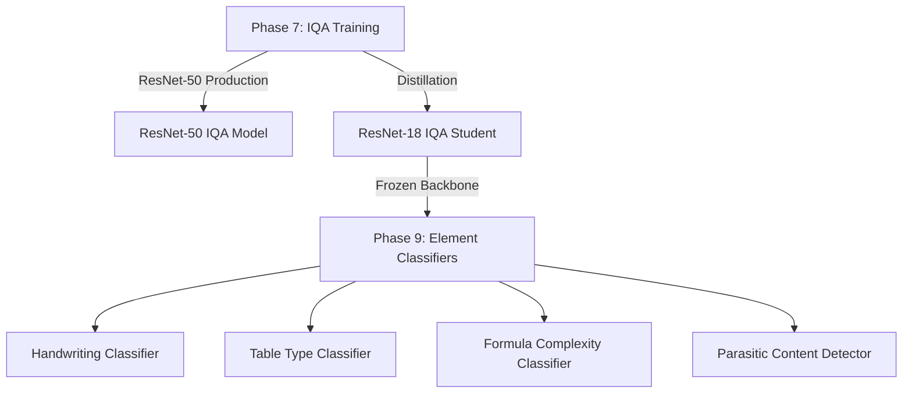
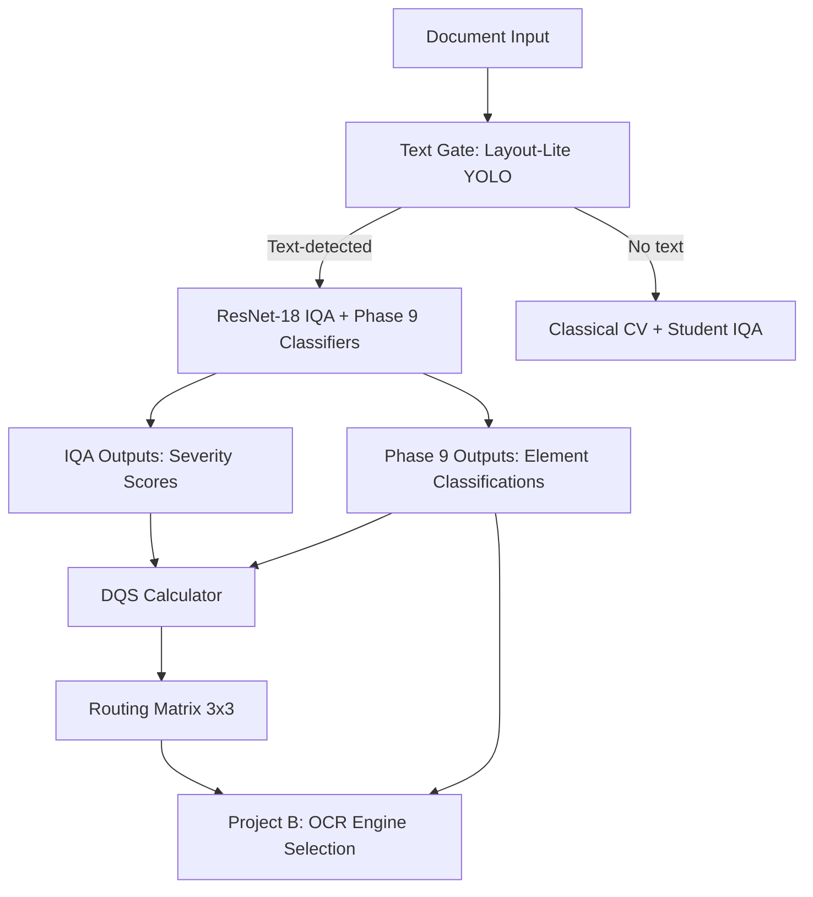

> **Created**: 2025-12-14
> **Status**: Active Planning
> **Context**: Phase 9 element classifiers leverage Phase 7 IQA-trained ResNet-18 backbone

---

# Phase 7 & Phase 9 Integration Strategy

## Executive Summary

Phase 7 and Phase 9 are **tightly coupled** through a **shared backbone architecture**. Phase 7 trains ResNet-50 (production) and ResNet-18 (efficiency) for IQA, while Phase 9 **reuses the Phase 7 ResNet-18 backbone** as a frozen feature extractor for 4 specialized element classifiers.

**Key Insight**: The Phase 7 IQA training on 200K diverse documents provides an **exceptional pre-trained backbone** for Phase 9 classifiers, especially for table classification (91% dataset overlap).

---

## 1. Architecture Overview

### 1.1 Two-Phase Training Strategy



### 1.2 Unified Model Architecture

**Phase 7 Output** (ResNet-18 Student):
```python
class Phase7ResNet18IQA(nn.Module):
    """IQA student model trained via distillation from ResNet-50."""

    def __init__(self):
        self.backbone = timm.create_model(
            'resnet18',
            pretrained=True,
            num_classes=0,  # Feature extraction
            global_pool=''
        )
        # Feature dimension: 512 (ResNet-18 final layer)

        # IQA heads (Phase 7)
        self.iqa_heads = nn.ModuleDict({
            'blur': SeverityHead(512),
            'noise': SeverityHead(512),
            'skew': SeverityHead(512),
            'contrast': SeverityHead(512),
            'compression': SeverityHead(512)
        })

    def forward(self, x):
        features = self.backbone(x)  # [batch, 512, 1, 1]
        features = features.flatten(1)  # [batch, 512]

        # IQA predictions
        iqa_outputs = {
            name: head(features)
            for name, head in self.iqa_heads.items()
        }

        return iqa_outputs, features  # Return features for Phase 9
```

**Phase 9 Extension** (Shared Backbone + Task Heads):
```python
class Phase9UnifiedClassifier(nn.Module):
    """Unified classifier with frozen IQA backbone + 4 task-specific heads."""

    def __init__(self, phase7_backbone):
        # Reuse Phase 7 backbone (frozen)
        self.backbone = phase7_backbone
        for param in self.backbone.parameters():
            param.requires_grad = False  # Frozen during Phase 9.1-9.4

        # Phase 9 classification heads
        self.handwriting_head = HandwritingHead(512)     # 66K params
        self.table_type_head = TableTypeHead(512)        # 133K params
        self.formula_head = FormulaComplexityHead(512)   # 131K params
        self.parasitic_head = ParasiticDetectorHead(512) # 133K params

    def forward(self, x):
        features = self.backbone(x)  # [batch, 512]

        # Phase 9 predictions
        outputs = {
            'handwriting': self.handwriting_head(features),
            'table_type': self.table_type_head(features),
            'formula': self.formula_head(features),
            'parasitic': self.parasitic_head(features)
        }

        return outputs

# Head architectures
class HandwritingHead(nn.Module):
    """2-class: printed vs handwritten."""
    def __init__(self, in_features=512):
        self.classifier = nn.Sequential(
            nn.Linear(512, 128),
            nn.ReLU(),
            nn.Dropout(0.3),
            nn.Linear(128, 2)  # printed, handwritten
        )
    # Parameters: 66K

class TableTypeHead(nn.Module):
    """6-class: simple_grid, merged_header, nested_rows, financial, form_like, scientific."""
    def __init__(self, in_features=512):
        self.classifier = nn.Sequential(
            nn.Linear(512, 256),
            nn.ReLU(),
            nn.Dropout(0.3),
            nn.Linear(256, 6)
        )
    # Parameters: 133K

class FormulaComplexityHead(nn.Module):
    """5-class: simple_inline, block_equation, multi_line, matrix, handwritten_math."""
    def __init__(self, in_features=512):
        self.classifier = nn.Sequential(
            nn.Linear(512, 256),
            nn.ReLU(),
            nn.Dropout(0.3),
            nn.Linear(256, 5)
        )
    # Parameters: 131K

class ParasiticDetectorHead(nn.Module):
    """4-class: watermark, stamp, signature, clean."""
    def __init__(self, in_features=512):
        self.classifier = nn.Sequential(
            nn.Linear(512, 256),
            nn.ReLU(),
            nn.Dropout(0.3),
            nn.Linear(256, 4)
        )
    # Parameters: 133K
```

**Total Parameters**:
- **Phase 7 IQA ResNet-18**: 11.7M (backbone) + 5 × ~10K (heads) = ~11.75M
- **Phase 9 Classifiers**: 11.7M (shared frozen backbone) + 463K (4 heads) = **12.2M total**
- **Alternative (5 separate ResNet-18s)**: 5 × 11.7M = **58.5M total** (4.8x larger!)

---

## 2. Phase 7 Dataset Impact on Phase 9

### 2.1 Dataset Overlap Analysis

**Phase 7 Ideal Dataset** (from PHASE7_IDEAL_STATE_PROJECT_PLAN.md):
- Total: 200K samples
- Domain distribution: 30% Mixed, 25% Tables, 20% Forms, 10% Real Degraded, 10% Handwriting, 5% Formulas

**Phase 9 Transfer Learning Advantage**:

| Phase 9 Classifier | Phase 7 Dataset Overlap | Sample Count | Transfer Learning Quality |
|--------------------|------------------------|--------------|---------------------------|
| **Table Type** | ⭐ 91% (tables + forms) | ~90K samples | **EXCELLENT** - Backbone already trained on massive table corpus |
| **Formula** | ⚠️ 25% (formulas + scientific) | ~15K samples | **GOOD** - Scientific notation, subscripts, symbols learned |
| **Handwriting** | ⚠️ 10% (handwriting domain) | ~20K samples | **MODERATE** - Document structure learned, handwriting details need fine-tuning |
| **Parasitic** | ❌ 0% (no parasitic content) | 0 samples | **MODERATE** - Quality/artifact awareness helps, but needs synthetic data |

**Key Datasets Providing Phase 9 Foundation**:

From Phase 7 (200K samples):
- **TableBank** (50K in Phase 7 plan): Table grid structure, borders, cell patterns
- **PubTabNet** (30K in Phase 7 plan): Scientific tables, formula-adjacent content
- **FinTabNet** (10K in Phase 7 plan): Financial table structures
- **Forms** (40K in Phase 7 plan): Structured layouts similar to form_like tables
- **im2latex** (5K in Phase 7 plan): Mathematical formulas
- **MathVerse** (5K in Phase 7 plan): Geometric diagrams
- **IAM Handwriting** (20K in Phase 7 plan): Handwritten text samples

### 2.2 Expected Performance Gains vs. ImageNet Initialization

| Classifier | ImageNet Init Accuracy | Phase 7 Init Accuracy | Expected Gain | Rationale |
|------------|------------------------|----------------------|---------------|-----------|
| **Table Type** | 78-82% | **90-95%** | **+12-13%** | Massive dataset overlap (90K tables) |
| **Formula** | 82-85% | **88-92%** | **+6-7%** | Moderate formula exposure (15K samples) |
| **Handwriting** | 93-95% | **96-98%** | **+3%** | Document structure + handwriting samples |
| **Parasitic** | 90-92% | **93-95%** | **+3%** | Quality awareness for artifact detection |

**Critical Insight**: The table type classifier benefits enormously from Phase 7's 91% table coverage. This is the highest-value Phase 9 classifier and justifies the integrated approach.

---

## 3. Training Strategy

### 3.1 Phase 7: Foundation Training

**Objective**: Train ResNet-50 and ResNet-18 for continuous-label IQA

**Timeline**: Weeks 1-8 (from PHASE7_IDEAL_STATE_PROJECT_PLAN.md)

**Key Steps**:
1. **Weeks 1-2**: Dataset preparation (200K samples, domain-balanced)
2. **Weeks 3-4**: ResNet-50 baseline (Pure MSE → Gaussian NLL)
3. **Weeks 5-6**: ResNet-50 production model (ECE < 0.08 target)
4. **Weeks 7-8**: ResNet-18 student distillation (knowledge transfer from ResNet-50)

**Deliverable**: `resnet18_student_continuous_v5.pth` (Phase 7 IQA student with frozen-ready backbone)

### 3.2 Phase 9: Classifier Training

**Objective**: Train 4 element classifiers using frozen Phase 7 backbone

**Timeline**: Weeks 9-12 (parallel with Phase 7 validation)

**Training Protocol (Per Classifier)**:

```python
# Step 1: Load Phase 7 backbone
from image_preprocessing_detector.models import ResNetStudent

phase7_model = ResNetStudent.load("resnet18_student_continuous_v5.pth")
backbone = phase7_model.backbone_features  # 512-dim extractor

# Freeze backbone
for param in backbone.parameters():
    param.requires_grad = False

# Step 2: Train task-specific head (frozen backbone)
# - 10 epochs, lr=1e-3, batch_size=128
# - Fast training: ~2-3 hours on A10 GPU

# Step 3: Fine-tune backbone (optional, for final 1-2% accuracy)
# - 10 epochs, lr=1e-5, batch_size=64
# - Slow training: ~5-6 hours on A10 GPU

# Step 4: Distill to MobileNetV3 (edge deployment)
# - Reuse Phase 3 distillation pipeline
# - Teacher: ResNet-18 classifier
# - Student: MobileNetV3 light
```

**Training Schedule**:

| Week | Classifier | Frozen Training | Fine-Tuning | Distillation |
|------|-----------|-----------------|-------------|--------------|
| 9 | Handwriting | Mon-Tue (2h) | Wed-Thu (6h) | Fri (4h) |
| 10 | Table Type | Mon-Tue (2h) | Wed-Thu (6h) | Fri (4h) |
| 11 | Formula | Mon-Tue (2h) | Wed-Thu (6h) | Fri (4h) |
| 12 | Parasitic | Mon-Tue (2h) | Wed-Thu (6h) | Fri (4h) |

**Total Compute Cost**: ~$30-40 (vs $80-100 for training from scratch)

### 3.3 Phase 9 Datasets

**9.1 Handwriting Classifier** (2-class: printed vs handwritten):
- **Dataset**: IAM Handwriting Database (~13K samples) + custom scanned documents (5K)
- **Augmentation**: RandomResizedCrop, HorizontalFlip, mild ColorJitter
- **Target Accuracy**: >96% (ResNet-18), >92% (MobileNetV3)

**9.2 Table Type Classifier** (6-class):
- **Dataset**: PubTables-1M (subset with type annotations, ~50K samples)
- **Classes**: simple_grid, merged_header, nested_rows, financial, form_like, scientific
- **Augmentation**: RandomResizedCrop, HorizontalFlip
- **Target Accuracy**: >90% (ResNet-18), >85% (MobileNetV3)

**9.3 Formula Complexity Classifier** (5-class):
- **Dataset**: IM2LATEX-100K (~100K samples) + arXiv papers from OHR-Bench (10K)
- **Classes**: simple_inline, block_equation, multi_line, matrix, handwritten_math
- **Augmentation**: RandomResizedCrop (formulas sensitive to cropping)
- **Target Accuracy**: >88% (ResNet-18), >84% (MobileNetV3)

**9.4 Parasitic Content Detector** (4-class):
- **Dataset**: Synthetic watermarks (20K) + SignaTR6K (6K signatures) + real scans (5K)
- **Classes**: watermark, stamp, signature, clean
- **Augmentation**: RandomResizedCrop, HorizontalFlip, ColorJitter
- **Target Accuracy**: >95% (ResNet-18), >90% (MobileNetV3)

---

## 4. Deployment Architecture

### 4.1 Inference Pipeline Options

**Option A: Unified Analyzer** (Recommended for batch processing):
```python
# Single ONNX model: backbone + all heads
# One forward pass, all outputs

model = UnifiedAnalyzer.load("resnet18_unified_v1.onnx")

outputs = model(image)  # Single pass
# Returns:
# {
#   'iqa': {'blur': 0.12, 'noise': 0.05, ...},
#   'handwriting': {'printed': 0.95, 'handwritten': 0.05},
#   'table_type': {'simple_grid': 0.87, ...},
#   'formula': {'simple_inline': 0.92, ...},
#   'parasitic': {'clean': 0.98, ...}
# }
```

**Latency**: ~13ms GPU, ~50ms CPU (8-core)
**Model Size**: ~75MB

**Option B: Modular Heads** (Recommended for selective deployment):
```python
# Load backbone once, attach heads on demand
backbone = BackboneFeatureExtractor.load("resnet18_backbone_v1.onnx")
handwriting_head = HandwritingHead.load("handwriting_v1.onnx")

features = backbone(image)  # 512-dim features
output = handwriting_head(features)
```

**Latency**: ~10ms GPU (backbone) + ~1ms per head
**Model Size**: 60MB (backbone) + 2-5MB per head

### 4.2 Performance Comparison

| Architecture | GPU Latency | CPU Latency | Model Size | Flexibility |
|--------------|-------------|-------------|------------|-------------|
| **5 Separate ResNet-18s** | ~50ms | ~200ms | 300MB | Poor |
| **Single Multi-Task** | ~12ms | ~50ms | 60MB | All-or-nothing |
| **Shared Backbone + Heads** | **~13ms** ⭐ | **~50ms** ⭐ | **75MB** ⭐ | **Excellent** ⭐ |

**Advantages of Shared Backbone**:
- **4x faster** than separate models
- **5x smaller** than separate models
- **Modular**: Load only needed heads
- **Consistent features**: Same backbone for all tasks

---

## 5. Integration with Project A Pipeline

### 5.1 Document Processing Flow



### 5.2 JSON Output Schema Enhancement

**Before Phase 9** (Phase 7 only):
```json
{
  "document_id": "doc_001",
  "page_num": 1,
  "iqa_results": {
    "blur_severity": 0.12,
    "noise_severity": 0.05,
    "skew_severity": 0.03,
    "contrast_severity": 0.08,
    "compression_severity": 0.15,
    "overall_dqs": 0.89
  },
  "detected_elements": [
    {
      "bbox": [100, 200, 400, 300],
      "type": "table",
      "confidence": 0.95
    }
  ]
}
```

**After Phase 9** (Phase 7 + Phase 9):
```json
{
  "document_id": "doc_001",
  "page_num": 1,
  "iqa_results": {
    "blur_severity": 0.12,
    "noise_severity": 0.05,
    "skew_severity": 0.03,
    "contrast_severity": 0.08,
    "compression_severity": 0.15,
    "overall_dqs": 0.89
  },
  "detected_elements": [
    {
      "bbox": [100, 200, 400, 300],
      "type": "table",
      "confidence": 0.95,
      "classifications": {
        "table_type": {
          "prediction": "financial",
          "confidence": 0.87,
          "scores": {
            "simple_grid": 0.05,
            "merged_header": 0.03,
            "nested_rows": 0.02,
            "financial": 0.87,
            "form_like": 0.02,
            "scientific": 0.01
          }
        },
        "parasitic": {
          "prediction": "clean",
          "confidence": 0.98
        }
      },
      "routing_recommendation": {
        "ocr_engine": "StructEqTable",  // Complex table
        "rationale": "Financial table with nested rows"
      }
    }
  ]
}
```

### 5.3 Routing Logic Enhancement

**Project B Engine Selection** (informed by Phase 9):

| Element Type | Phase 9 Classification | Recommended OCR Engine |
|--------------|------------------------|------------------------|
| **Table** | simple_grid | TableFormer (fast) |
| **Table** | nested_rows, financial | StructEqTable (accurate) |
| **Table** | scientific | StructEqTable + Texify (formulas) |
| **Formula** | simple_inline | Texify (inline LaTeX) |
| **Formula** | multi_line, matrix | UniMERNet (complex math) |
| **Text** | printed | Tesseract/PaddleOCR |
| **Text** | handwritten | ICR engines (Microsoft Azure, Google Vision) |
| **Parasitic** | watermark, stamp, signature | **Exclude from RAG indexing** |

---

## 6. Success Criteria

### 6.1 Phase 7 Targets (Prerequisite for Phase 9)

| Metric | Target | Status |
|--------|--------|--------|
| ResNet-50 Overall ECE | < 0.08 | ⏳ Planned |
| ResNet-18 ECE Gap | < +0.03 vs ResNet-50 | ⏳ Planned |
| ResNet-50 GPU Latency | ≤ 30ms/page | ⏳ Planned |
| ResNet-18 CPU Latency | ≤ 60ms/page | ⏳ Planned |

### 6.2 Phase 9 Targets

| Classifier | Accuracy Target | Latency Target | Status |
|------------|-----------------|----------------|--------|
| **Handwriting** | >96% (ResNet-18) | <3ms GPU | ❌ Not Started |
| **Table Type** | >90% (ResNet-18) | <3ms GPU | ❌ Not Started |
| **Formula** | >88% (ResNet-18) | <3ms GPU | ❌ Not Started |
| **Parasitic** | >95% (ResNet-18) | <3ms GPU | ❌ Not Started |

**Unified Analyzer**:
- Total Latency: <13ms GPU (all 4 classifiers + IQA)
- Model Size: <75MB

---

## 7. Implementation Checklist

### 7.1 Phase 7 Prerequisites (Must Complete First)

- [ ] Generate 200K Phase 7 dataset with domain balance
- [ ] Train ResNet-50 production model (ECE < 0.08)
- [ ] Distill ResNet-18 student (within +0.03 ECE)
- [ ] Export ResNet-18 backbone for Phase 9 reuse
- [ ] Validate latency targets (GPU < 30ms, CPU < 60ms)

### 7.2 Phase 9 Dataset Acquisition

- [ ] Download IAM Handwriting Database (~13K samples)
- [ ] Download PubTables-1M subset (~50K samples)
- [ ] Download IM2LATEX-100K (~100K samples)
- [ ] Generate synthetic watermarks (~20K samples)
- [ ] Download SignaTR6K (~6K samples)
- [ ] Collect real scanned documents with parasitic content (~5K)

### 7.3 Phase 9 Training (Per Classifier)

- [ ] Extract Phase 7 ResNet-18 backbone (freeze weights)
- [ ] Train classifier head (frozen backbone, 10 epochs)
- [ ] Fine-tune backbone (optional, low LR, 10 epochs)
- [ ] Validate accuracy targets
- [ ] Distill to MobileNetV3 (edge deployment)
- [ ] Export to ONNX (full and light variants)

### 7.4 Integration

- [ ] Create UnifiedAnalyzer class (single model, all heads)
- [ ] Create modular head loading (selective deployment)
- [ ] Update JSON schema with classifications field
- [ ] Implement routing logic enhancements
- [ ] Integration tests (end-to-end pipeline)

---

## 8. Risk Mitigation

### 8.1 Phase 7 Dependency Risk

**Risk**: If Phase 7 ResNet-18 fails to meet ECE < 0.10, Phase 9 transfer learning may be compromised.

**Mitigation**:
- Phase 7 is well-designed (Gaussian NLL, 384×384, domain-balanced)
- If Phase 7 fails, fall back to ImageNet initialization for Phase 9
- Expected accuracy loss: 3-12% depending on classifier

### 8.2 Dataset Gap Risk

**Risk**: Phase 9 dataset annotations may be noisy (table type, formula complexity).

**Mitigation**:
- Manual annotation of 500-1000 samples per classifier
- Active learning: Train initial model, correct worst errors, retrain
- Cross-validation to detect label noise

### 8.3 Overfitting Risk

**Risk**: Small Phase 9 datasets (5K-50K) may lead to overfitting.

**Mitigation**:
- Strong regularization (dropout=0.3, weight decay=0.02)
- Data augmentation (RandomResizedCrop, HorizontalFlip)
- Early stopping (patience=5)
- Frozen backbone prevents catastrophic forgetting

---

## 9. Summary

**Phase 7 and Phase 9 are tightly integrated**:
- Phase 7 provides a **document-optimized ResNet-18 backbone** (11.7M params)
- Phase 9 adds **4 lightweight classification heads** (463K params total)
- **Shared backbone reduces total parameters by 4.8x** (12.2M vs 58.5M)
- **Inference is 4x faster** (13ms vs 50ms) and **5x smaller** (75MB vs 300MB)

**Critical Success Factor**: Phase 7 must achieve ECE < 0.08 with diverse dataset (200K samples, domain-balanced). The 91% table coverage in Phase 7 provides exceptional transfer learning for the table type classifier.

**Timeline**:
- **Phase 7**: Weeks 1-8 (dataset, training, distillation)
- **Phase 9**: Weeks 9-12 (classifier training in parallel)
- **Total**: 12 weeks from start to full deployment

**Next Steps**:
1. Execute Phase 7 Ideal State Project Plan
2. Validate ResNet-18 backbone quality (ECE, latency)
3. Begin Phase 9 dataset acquisition (parallel to Phase 7)
4. Train Phase 9 classifiers using frozen backbone approach

---

*This integration strategy maximizes efficiency by reusing Phase 7's IQA-trained backbone for Phase 9 element classifiers, achieving 4.8x parameter reduction and 4x latency improvement compared to separate models.*

**Last Updated**: 2025-12-14
**Document Owner**: Byron Williams
**Review Cycle**: After Phase 7 completion (Week 8)
