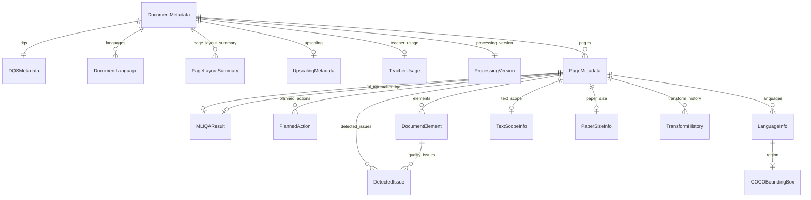
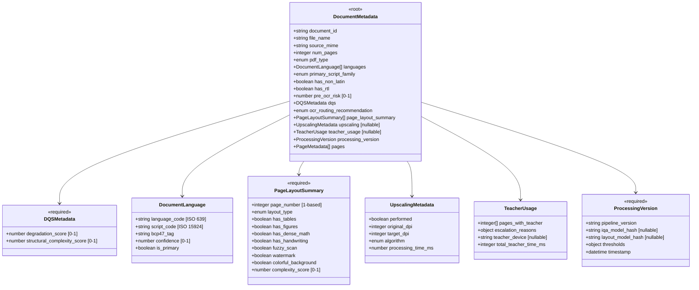
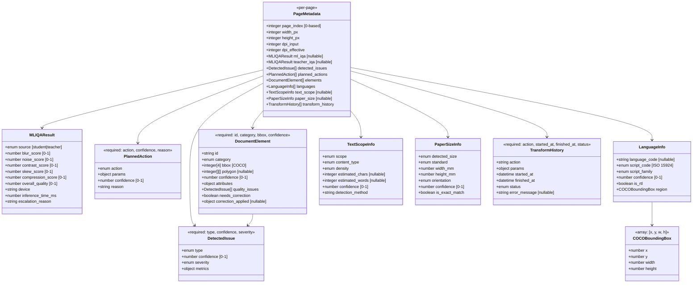
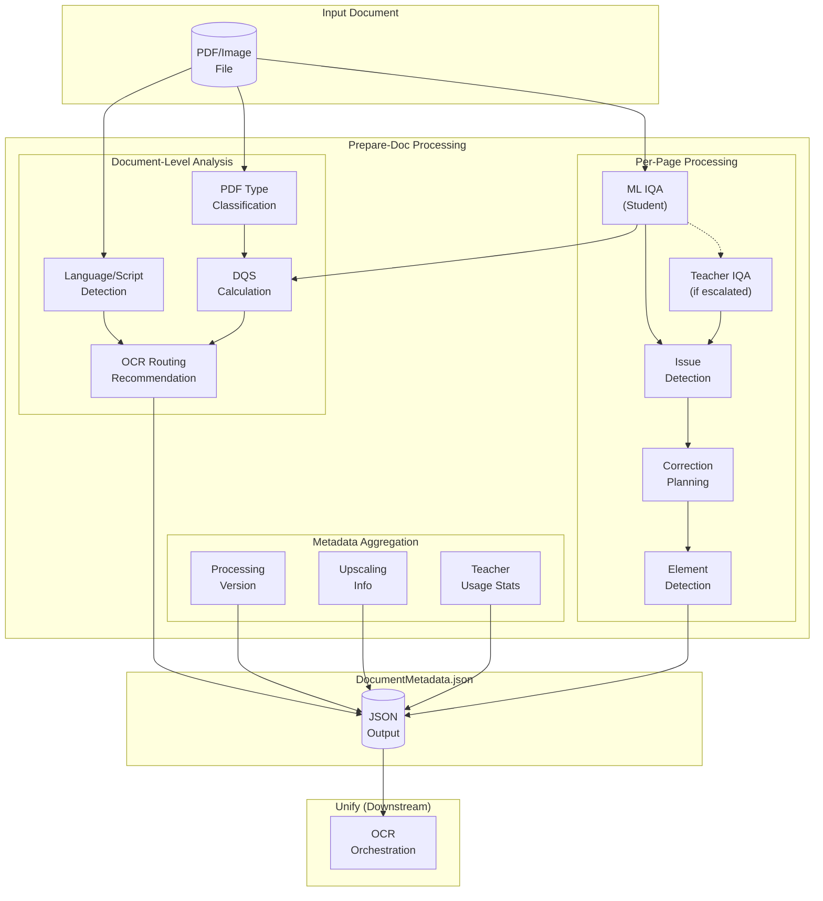
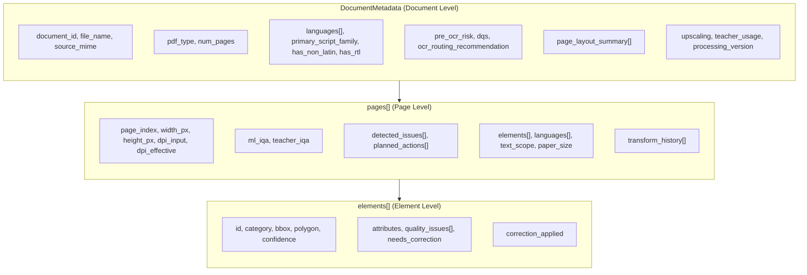

> **Schema**: `document_metadata.schema.json`
> **Purpose**: Prepare-Doc output schema for Unify handoff - Preprocessing, IQA & Coarse Layout Gateway

## Entity Relationship Diagram

## Class Diagram - Document Level

## Class Diagram - Page Level

## Enumeration Values

```mermaid
classDiagram
    class PdfTypeEnum {
        <<enumeration>>
        image_only
        born_digital
        hybrid
    }

    class OcrRoutingEnum {
        <<enumeration>>
        ocr_fast
        ocr_advanced
        vision_simple
        vision_structured
    }

    class LayoutTypeEnum {
        <<enumeration>>
        single_column
        multi_column
        three_column
        complex
        unknown
    }

    class UpscaleAlgorithmEnum {
        <<enumeration>>
        lanczos
        bicubic
        inter_linear
        inter_cubic
        inter_area
    }

    class IssueTypeEnum {
        <<enumeration>>
        noise
        blur
        skew
        perspective
        low_contrast
        orientation
        low_dpi
    }

    class SeverityEnum {
        <<enumeration>>
        low
        medium
        high
        critical
    }

    class CorrectionActionEnum {
        <<enumeration>>
        deskew
        perspective_correction
        sharpen
        denoise
        clahe
        background_normalization
        upsample
        rotate
    }

    class ElementCategoryEnum {
        <<enumeration>>
        table
        image
        handwriting
        formula
        text_block
        figure
    }

    class ScriptFamilyEnum {
        <<enumeration>>
        latin
        cjk
        arabic
        indic
        cyrillic
        other
    }

    class TransformStatusEnum {
        <<enumeration>>
        success
        failed
        skipped
    }
```

## Data Flow - Prepare-Doc to Unify Handoff

## Hierarchical Structure

## Key Constraints

| Field | Constraint | Description |
|-------|------------|-------------|
| `document_id` | string, minLength: 1 | Unique identifier |
| `pdf_type` | enum (3 values) | Classification for routing |
| `pre_ocr_risk` | 0.0 - 1.0 | Combined OCR difficulty score |
| `dqs.degradation_score` | 0.0 - 1.0 | Image quality (0=pristine) |
| `dqs.structural_complexity_score` | 0.0 - 1.0 | Layout complexity (0=simple) |
| `page_index` | integer ≥ 0 | Zero-based index |
| `page_number` | integer ≥ 1 | One-based (layout summary) |
| `bbox` | [x, y, w, h] | COCO format, top-left origin |
| `processing_version.timestamp` | ISO 8601 | Processing datetime |

## Cross-Reference: Layer 2 Enrichment → Document Metadata

Several structures are shared or derived between schemas:

| Layer 2 Enrichment | Document Metadata | Relationship |
|-------------------|-------------------|--------------|
| `LanguageInfo` | `DocumentLanguage`, `LanguageInfo` | Nearly identical, different contexts |
| `TextScopeInfo` | `TextScopeInfo` | Identical structure |
| `PaperSizeInfo` | `PaperSizeInfo` | Identical structure |
| `COCOBoundingBox` | `COCOBoundingBox` | Identical format |
| `QualityInfo.degradations` | `DetectedIssue` | Similar but different severity enums |
| `LayoutDetection` | `DocumentElement` | Different class taxonomies |
| `ContentFlags` | `PageLayoutSummary` | Flags expanded to boolean fields |
