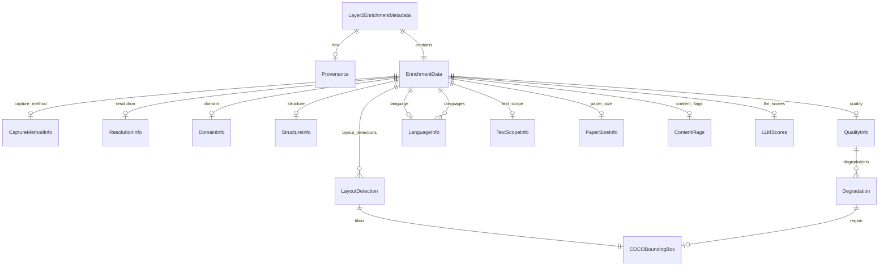
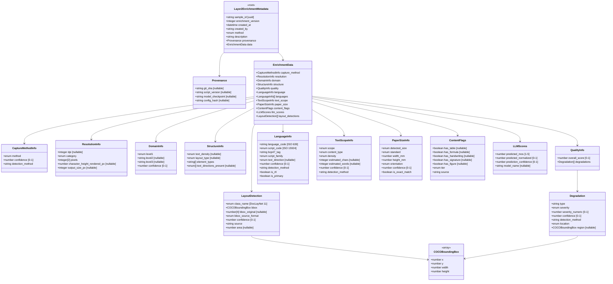
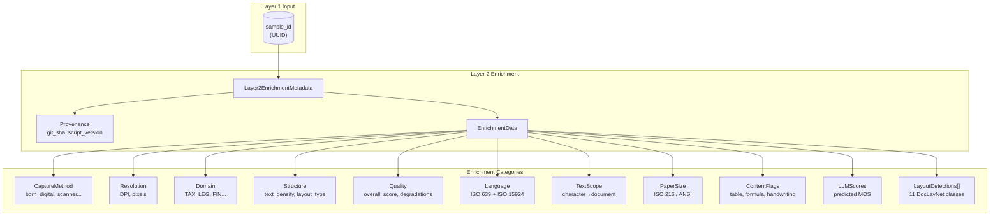

> **Schema**: `layer2_enrichment.schema.json`
> **Purpose**: Prepare-Doc Layer 2 Enrichment - Derived annotations with full provenance tracking

## Entity Relationship Diagram

## Class Diagram

## Enumeration Values

```mermaid
classDiagram
    class MethodEnum {
        <<enumeration>>
        tier_0_exact
        tier_1_annotation
        tier_2_model
        tier_3_heuristic
    }

    class CaptureMethodEnum {
        <<enumeration>>
        born_digital
        scanner_flatbed
        scanner_adf
        camera_professional
        camera_smartphone
        fax
        synthetic
        unknown
    }

    class ResolutionCategoryEnum {
        <<enumeration>>
        low_150
        medium_150_299
        standard_300
        high_300
    }

    class DomainLevel1Enum {
        <<enumeration>>
        TAX
        LEG
        FIN
        TEC
        SCI
        ADM
        MED
        EDU
        PER
        UNK
    }

    class TextDensityEnum {
        <<enumeration>>
        sparse
        moderate
        dense
    }

    class LayoutTypeEnum {
        <<enumeration>>
        single_column
        multi_column
        three_column
        complex
        form_based
        tabular
        unknown
    }

    class SeverityEnum {
        <<enumeration>>
        none
        mild
        moderate
        severe
    }

    class ScriptCodeEnum {
        <<enumeration>>
        Latn ~Latin~
        Hans ~Simplified Chinese~
        Hant ~Traditional Chinese~
        Jpan ~Japanese~
        Kore ~Korean~
        Deva ~Devanagari~
        Arab ~Arabic~
        Cyrl ~Cyrillic~
        ... ~+25 more~
    }

    class ScriptFamilyEnum {
        <<enumeration>>
        latin
        cjk
        arabic
        indic
        cyrillic
        other
    }

    class TextScopeEnum {
        <<enumeration>>
        character
        word
        phrase
        sentence
        line
        paragraph
        page
        document
        mixed
        unknown
    }

    class ContentTypeEnum {
        <<enumeration>>
        printed
        handwritten
        mixed
        scene_text
        synthetic
        unknown
    }

    class PaperSizeEnum {
        <<enumeration>>
        A0..A6
        B4..B5
        Letter
        Legal
        Tabloid
        Custom
        Unknown
    }

    class DocLayNetClassEnum {
        <<enumeration>>
        Caption
        Footnote
        Formula
        List_Item
        Page_Footer
        Page_Header
        Picture
        Section_Header
        Table
        Text
        Title
    }
```

## Data Flow Overview

## Key Constraints

| Field | Constraint | Description |
|-------|------------|-------------|
| `sample_id` | UUID format | Links to Layer 1 immutable record |
| `enrichment_version` | integer ≥ 1 | Version tracking for updates |
| `method` | enum (4 tiers) | Provenance tier classification |
| `confidence` fields | 0.0 - 1.0 | Normalized confidence scores |
| `bbox` | [x, y, w, h] | COCO format, top-left origin |
| `script_code` | ISO 15924 | 4-letter, Title case (e.g., "Latn") |
| `language_code` | ISO 639-1/3 | 2-3 letter lowercase (e.g., "en") |
